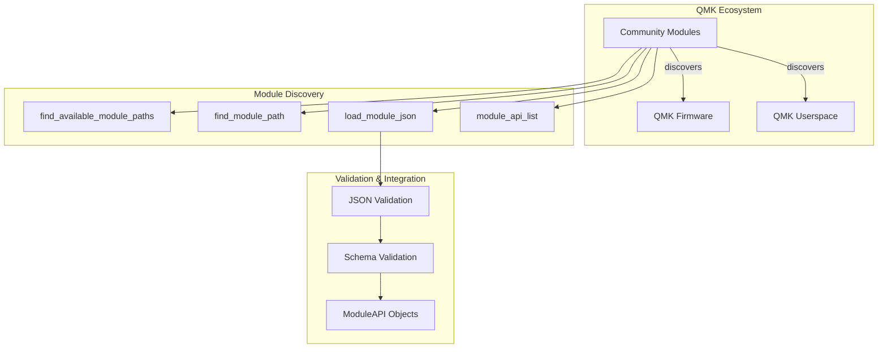
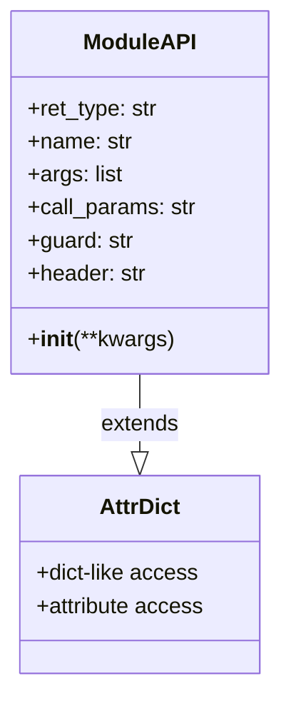
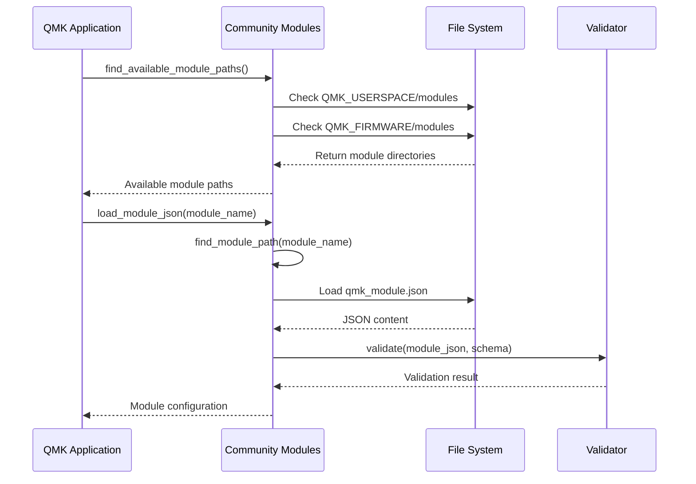
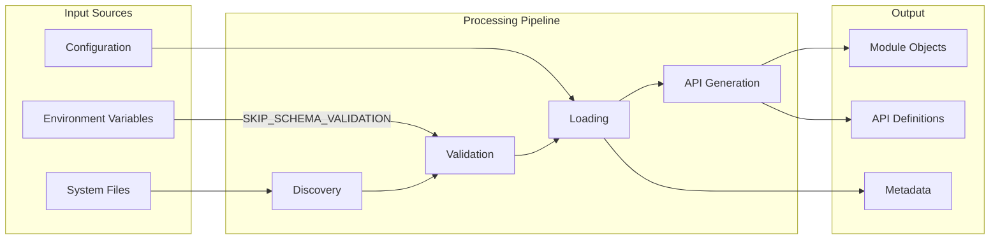
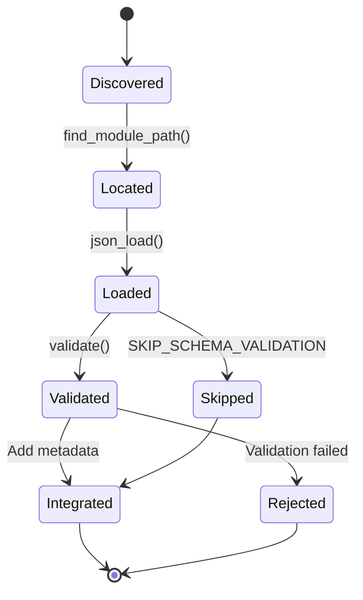
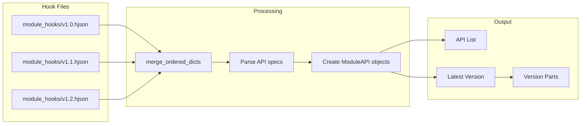
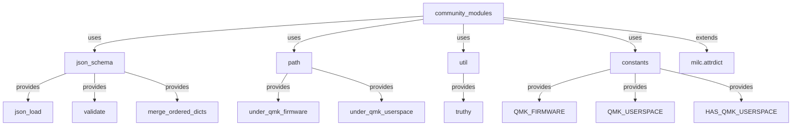
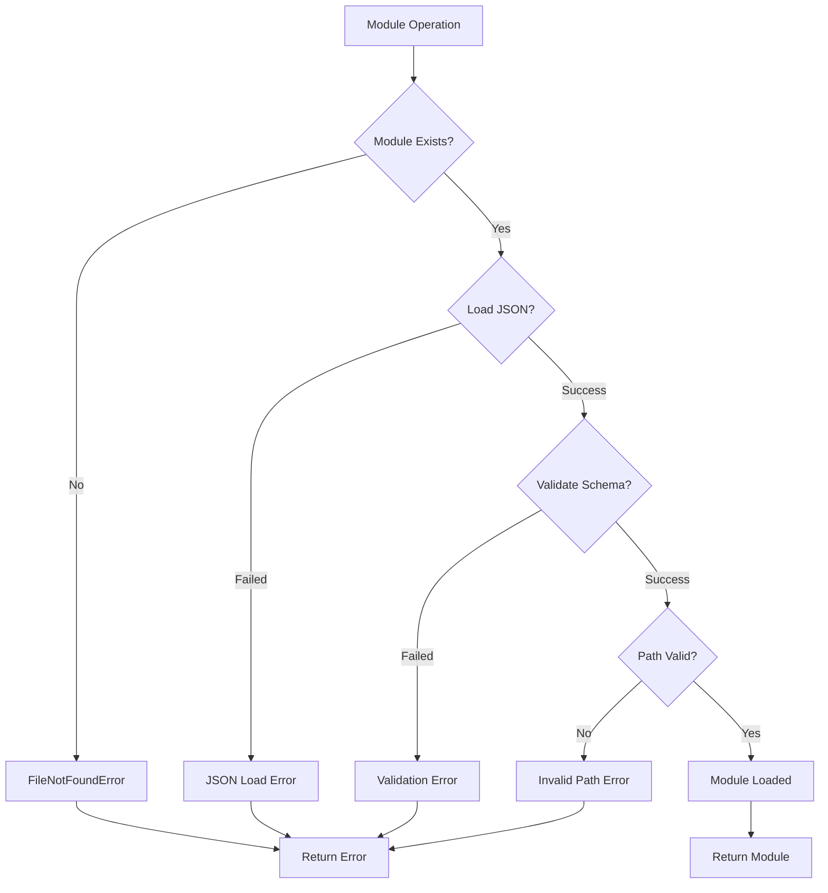

# Community Modules Module Documentation

## Introduction

The `community_modules` module is a core component of the QMK (Quantum Mechanical Keyboard) firmware ecosystem that provides a framework for managing and loading community-contributed modules. This module serves as the central hub for discovering, validating, and integrating third-party extensions into the QMK build system, enabling a modular and extensible architecture for keyboard firmware customization.

## Architecture Overview

The community_modules module implements a plugin-based architecture that allows community developers to extend QMK functionality without modifying the core firmware. It provides standardized APIs, validation mechanisms, and discovery processes for community modules.



## Core Components

### ModuleAPI Class

The `ModuleAPI` class is the fundamental data structure that represents a community module's interface definition. It extends `AttrDict` to provide flexible attribute-based access to module metadata.



**Key Features:**
- **Dynamic Attribute Assignment**: Allows flexible configuration of module API properties
- **Type Safety**: Enforces structured access to module metadata
- **Serialization Ready**: Compatible with JSON serialization for configuration files

### Module Discovery System

The module discovery system implements a hierarchical search strategy to locate community modules in both firmware and userspace directories.



## Data Flow Architecture



## Module Integration Process

### 1. Module Discovery Phase

The system searches for modules in prioritized locations:

```python
search_dirs = []
if HAS_QMK_USERSPACE:
    search_dirs.append(QMK_USERSPACE / 'modules')
search_dirs.append(QMK_FIRMWARE / 'modules')
```

**Search Strategy:**
- **Userspace Priority**: User modules take precedence over firmware modules
- **Recursive Search**: Scans all subdirectories for `qmk_module.json` files
- **Path Validation**: Ensures modules are within authorized QMK directories

### 2. Module Loading Phase

Each discovered module undergoes a structured loading process:



### 3. API Definition Phase

The system loads API definitions from hook files to establish the interface contract:



## Dependencies and Integration

### Internal Dependencies

The community_modules module integrates with several QMK subsystems:



### External Dependencies

- **pathlib**: Modern path manipulation
- **functools.lru_cache**: Performance optimization for API list caching
- **os**: Environment variable access

## Configuration and Validation

### Module JSON Schema

Each community module must provide a `qmk_module.json` file that conforms to the `qmk.community_module.v1` schema. The validation process ensures:

- **Structural Compliance**: Required fields are present
- **Type Safety**: Field values match expected types
- **Dependency Resolution**: Module dependencies are valid
- **API Compatibility**: Module APIs match system expectations

### Environment Control

The system behavior can be controlled through environment variables:

- **`SKIP_SCHEMA_VALIDATION`**: Bypasses JSON schema validation for development purposes
- **`QMK_USERSPACE`**: Defines the userspace directory location
- **`QMK_FIRMWARE`**: Defines the firmware directory location

## Error Handling

The module implements comprehensive error handling for various failure scenarios:



## Performance Considerations

### Caching Strategy

The `module_api_list()` function uses `@lru_cache(maxsize=1)` to cache API definitions, providing:

- **Reduced I/O**: Hook files are read only once
- **Faster Access**: Subsequent calls return cached results
- **Memory Efficiency**: Limited cache size prevents memory bloat

### Search Optimization

- **Sorted Discovery**: Module paths are sorted for consistent ordering
- **Early Termination**: Path validation fails fast on invalid locations
- **Recursive Efficiency**: Uses `rglob()` for efficient directory traversal

## Security Considerations

### Path Validation

The system implements strict path validation to prevent directory traversal attacks:

- **Under_QMK_Check**: Ensures modules are within authorized QMK directories
- **Relative Path Validation**: Compares normalized relative paths
- **Posix Path Conversion**: Consistent path format for comparison

### Schema Validation

JSON schema validation provides an additional security layer:

- **Type Constraints**: Prevents injection of unexpected data types
- **Structure Validation**: Ensures only expected fields are present
- **Dependency Validation**: Verifies module dependencies are safe

## Extension Points

The community_modules module provides several extension points for future enhancements:

### API Versioning

The system supports multiple API versions through the hook file mechanism:

```python
latest_module_version = module_definition_files[-1].stem
latest_module_version_parts = latest_module_version.split('.')
```

### Custom Validators

The validation system can be extended with custom validators:

```python
if not truthy(os.environ.get('SKIP_SCHEMA_VALIDATION'), False):
    validate(module_json, 'qmk.community_module.v1')
```

### Module Metadata

Additional metadata can be added to the ModuleAPI class without breaking existing functionality.

## Usage Examples

### Basic Module Discovery

```python
from qmk.community_modules import find_available_module_paths

# Discover all available modules
available_modules = find_available_module_paths()
for module_path in available_modules:
    print(f"Found module: {module_path}")
```

### Loading Module Configuration

```python
from qmk.community_modules import load_module_json

# Load a specific module's configuration
module_config = load_module_json('my_custom_module')
print(f"Module version: {module_config.get('version')}")
```

### Accessing API Definitions

```python
from qmk.community_modules import module_api_list

# Get available API definitions
api_list, version, major, minor, patch = module_api_list()
for api in api_list:
    print(f"API: {api.name} -> {api.ret_type}")
```

## Related Documentation

- [json_encoders](json_encoders.md) - JSON serialization support for community modules
- [path](path.md) - Path utilities used for module discovery
- [constants](constants.md) - System constants including QMK paths

## Conclusion

The community_modules module provides a robust foundation for the QMK community to extend and customize keyboard firmware functionality. Through its comprehensive discovery, validation, and integration mechanisms, it enables safe and efficient module management while maintaining system security and performance. The modular architecture ensures that community contributions can be easily integrated and managed within the larger QMK ecosystem.