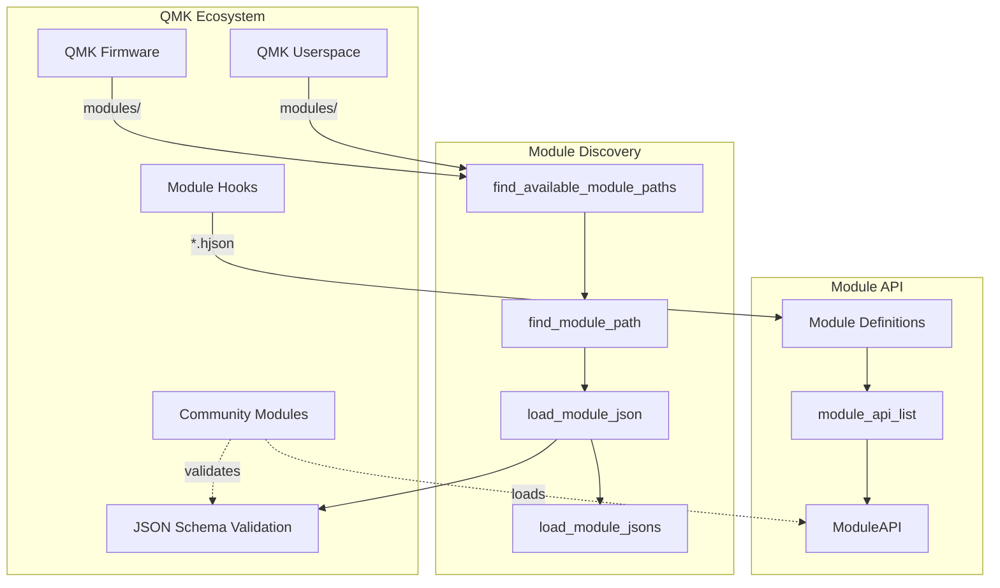
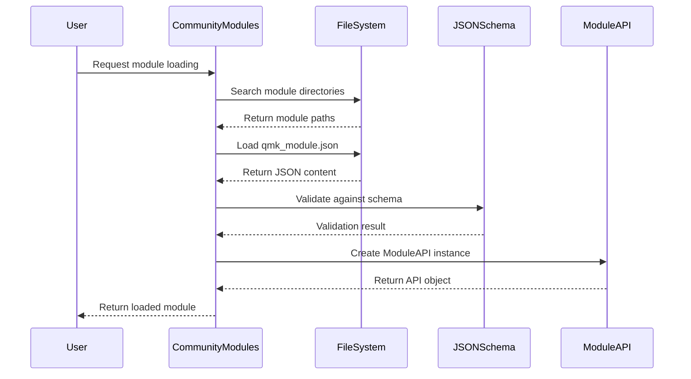
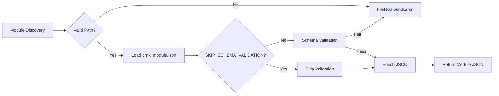

# Community Modules Module Documentation

## Introduction

The `community_modules` module is a core component of the QMK (Quantum Mechanical Keyboard) ecosystem that provides a framework for managing and loading community-contributed modules. These modules extend QMK's functionality by allowing third-party developers to create custom features, integrations, and enhancements that can be dynamically loaded into the QMK build system.

The module serves as the central hub for discovering, validating, and loading community modules from both the main QMK firmware repository and user-specific modules directories. It provides a standardized API for module interaction and ensures that all community modules adhere to QMK's schema and quality standards.

## Architecture Overview


```mermaid
graph TB
    subgraph "QMK Ecosystem"
        CM[Community Modules]
        QF[QMK Firmware]
        QU[QMK Userspace]
        JS[JSON Schema Validation]
        MH[Module Hooks]
    end
    
    subgraph "Module Discovery"
        FAMP[find_available_module_paths]
        FMP[find_module_path]
        LMJ[load_module_json]
        LMJS[load_module_jsons]
    end
    
    subgraph "Module API"
        MAPI[ModuleAPI]
        MAL[module_api_list]
        MD[Module Definitions]
    end
    
    QF -->|modules/| FAMP
    QU -->|modules/| FAMP
    FAMP --> FMP
    FMP --> LMJ
    LMJ --> JS
    LMJ --> LMJS
    
    MH -->|*.hjson| MD
    MD --> MAL
    MAL --> MAPI
    
    CM -.->|validates| JS
    CM -.->|loads| MAPI
```

## Core Components

### ModuleAPI Class

The `ModuleAPI` class is a specialized `AttrDict` that represents the interface definition for community modules. It encapsulates the API specifications that modules must implement, including return types, function names, arguments, and optional guards and headers.

**Key Features:**
- Inherits from `milc.attrdict.AttrDict` for flexible attribute access
- Dynamically populated with module API specifications
- Provides type-safe access to module interface definitions

### Module Discovery Functions

#### `find_available_module_paths()`
Discovers all available community modules by searching through predefined directories in both QMK firmware and userspace locations. Returns a list of paths containing valid `qmk_module.json` files.

**Search Order:**
1. `QMK_USERSPACE/modules/` (if userspace is configured)
2. `QMK_FIRMWARE/modules/`

#### `find_module_path(module)`
Locates a specific module by name within the discovered module paths. Performs path normalization and validation to ensure the module exists within the QMK ecosystem boundaries.

#### `load_module_json(module)`
Loads and validates a module's JSON configuration file. Performs schema validation against the `qmk.community_module.v1` schema unless validation is explicitly skipped via environment variable.

#### `load_module_jsons(modules)`
Batch loads multiple module JSON files while preserving the specified order, useful for loading dependencies or module collections.

### Module API Management

#### `module_api_list()`
Caches and returns the complete list of available module APIs, version information, and module definitions. Reads from HJSON definition files in the `data/constants/module_hooks/` directory and merges them into a unified API specification.

**Returns:**
- `api_list`: List of ModuleAPI objects
- `latest_module_version`: Full version string
- Major, minor, and patch version components

## Data Flow


```mermaid
sequenceDiagram
    participant User
    participant CM as CommunityModules
    participant FS as FileSystem
    participant JS as JSONSchema
    participant API as ModuleAPI
    
    User->>CM: Request module loading
    CM->>FS: Search module directories
    FS-->>CM: Return module paths
    CM->>FS: Load qmk_module.json
    FS-->>CM: Return JSON content
    CM->>JS: Validate against schema
    JS-->>CM: Validation result
    CM->>API: Create ModuleAPI instance
    API-->>CM: Return API object
    CM-->>User: Return loaded module
```

## Dependencies

### Internal Dependencies

The community_modules module relies on several QMK core modules:

- **[json_encoders](json_encoders.md)**: Provides JSON encoding capabilities for module serialization
- **[path](path.md)**: Offers path normalization and QMK ecosystem boundary validation functions (`under_qmk_firmware`, `under_qmk_userspace`)
- **[userspace](userspace.md)**: Supplies userspace detection and validation utilities

### External Dependencies

- **milc.attrdict**: Provides the AttrDict base class for flexible attribute access
- **pathlib**: Modern path handling and file system operations
- **functools.lru_cache**: Caching mechanism for performance optimization

## Module Validation Process


```mermaid
graph LR
    Start[Module Discovery] --> CheckPath{Valid Path?}
    CheckPath -->|Yes| LoadJSON[Load qmk_module.json]
    CheckPath -->|No| Error[FileNotFoundError]
    
    LoadJSON --> CheckValidation{SKIP_SCHEMA_VALIDATION?}
    CheckValidation -->|No| Validate[Schema Validation]
    CheckValidation -->|Yes| Skip[Skip Validation]
    
    Validate -->|Pass| Enrich[Enrich JSON]
    Validate -->|Fail| Error
    Skip --> Enrich
    
    Enrich --> Return[Return Module JSON]
```

## Integration with QMK Ecosystem

The community_modules module integrates seamlessly with the broader QMK ecosystem:

1. **Module Discovery**: Automatically discovers modules in both firmware and userspace directories
2. **Schema Validation**: Ensures all modules comply with QMK's community module specification
3. **API Standardization**: Provides a consistent interface for module interaction
4. **Version Management**: Tracks module API versions for compatibility
5. **Path Resolution**: Validates module locations within QMK boundaries

## Usage Examples

### Basic Module Loading
```python
from qmk.community_modules import load_module_json

# Load a specific module
module_config = load_module_json('my_custom_module')
print(f"Module: {module_config['module']}")
print(f"Path: {module_config['module_path']}")
```

### Discovering Available Modules
```python
from qmk.community_modules import find_available_module_paths

# Get all available module paths
module_paths = find_available_module_paths()
for path in module_paths:
    print(f"Found module at: {path}")
```

### Accessing Module APIs
```python
from qmk.community_modules import module_api_list

# Get available APIs and version info
api_list, version, major, minor, patch = module_api_list()
print(f"Module API Version: {version}")
for api in api_list:
    print(f"API: {api.name} -> {api.ret_type}")
```

## Error Handling

The module implements comprehensive error handling:

- **FileNotFoundError**: Raised when a requested module cannot be found
- **ValidationError**: Propagated from JSON schema validation failures
- **Path Validation**: Ensures modules are located within QMK ecosystem boundaries

## Performance Considerations

- **Caching**: The `module_api_list()` function uses `@lru_cache` to avoid repeated file system operations
- **Lazy Loading**: Modules are loaded on-demand rather than preloading all available modules
- **Schema Validation**: Can be bypassed via `SKIP_SCHEMA_VALIDATION` environment variable for development workflows

## Security Considerations

- **Path Traversal Protection**: Uses `under_qmk_firmware()` and `under_qmk_userspace()` to prevent directory traversal attacks
- **Schema Validation**: Ensures all module configurations meet security standards
- **Boundary Enforcement**: Modules must reside within designated QMK directories

## Future Enhancements

Potential areas for future development:

1. **Module Dependency Resolution**: Automatic handling of inter-module dependencies
2. **Version Compatibility**: Enhanced version checking and compatibility matrices
3. **Module Signing**: Cryptographic verification of module authenticity
4. **Dynamic Loading**: Runtime module loading and unloading capabilities
5. **Module Marketplace**: Integration with external module repositories

## Related Documentation

- [JSON Encoders](json_encoders.md) - JSON serialization support
- [Path Utilities](path.md) - Path normalization and validation
- [Userspace Management](userspace.md) - Userspace detection and configuration
- [Keyboard Management](keyboard.md) - Keyboard-specific module integration