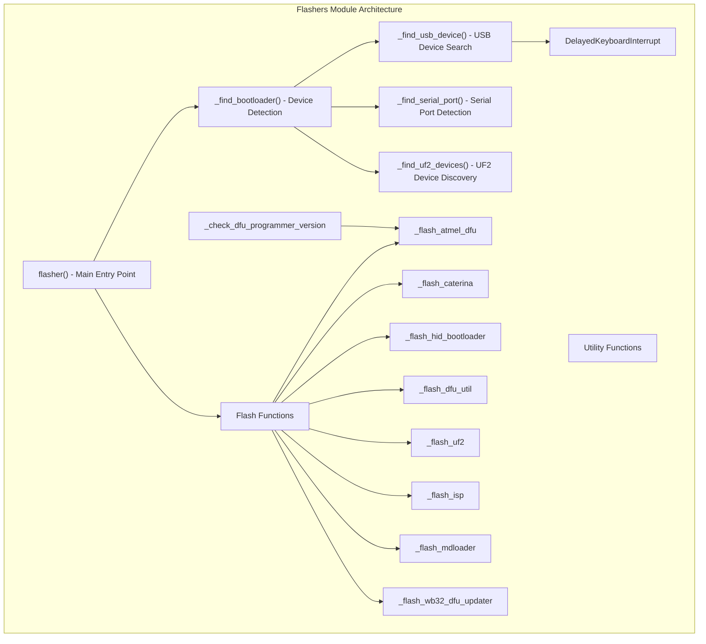
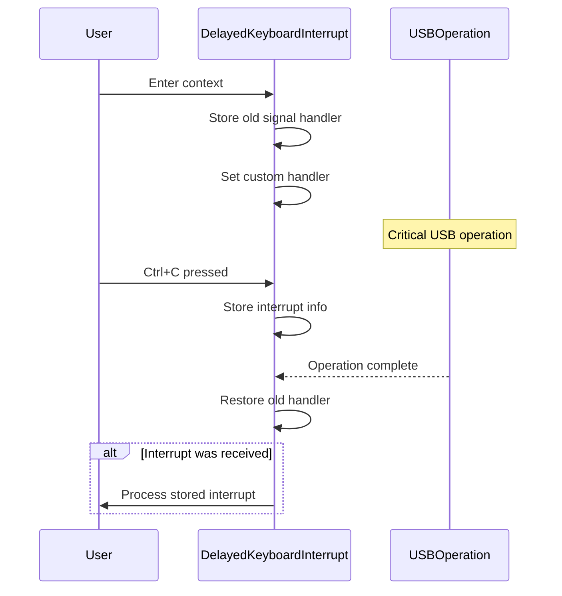
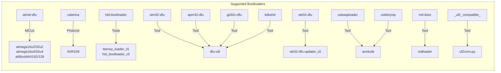
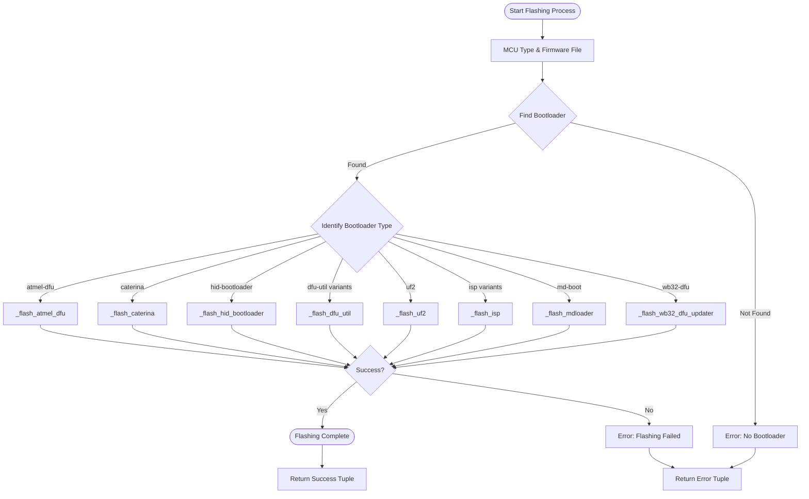

# Flashers Module Documentation

## Introduction

The flashers module is a critical component of the QMK (Quantum Mechanical Keyboard) firmware ecosystem, responsible for handling the firmware flashing process to various keyboard microcontrollers and bootloaders. This module provides a unified interface for detecting connected bootloader devices and flashing firmware files using appropriate tools and protocols.

## Module Purpose

The primary purpose of the flashers module is to:
- Detect and identify connected keyboard bootloaders automatically
- Provide a standardized interface for flashing firmware to different microcontroller types
- Handle various bootloader protocols (DFU, Caterina, HID, UF2, etc.)
- Manage platform-specific differences (Windows, Linux, macOS, WSL)
- Ensure safe flashing operations with proper error handling

## Architecture Overview



## Core Components

### DelayedKeyboardInterrupt

A context manager that provides safe handling of keyboard interrupts during critical operations, particularly USB device detection which can be sensitive to interruptions.

**Purpose**: Prevents corruption or incomplete operations when users press Ctrl+C during flashing
**Usage**: Automatically applied during USB device detection operations



## Bootloader Support Matrix

The module supports multiple bootloader types, each with specific characteristics:



## Data Flow Architecture



## Platform-Specific Handling

The module includes special handling for different operating systems:

### Windows Subsystem for Linux (WSL)
- Uses PowerShell commands for USB device detection
- Falls back to Windows-specific serial port enumeration
- Handles path conversion for Windows compatibility

### Windows
- Uses Windows-specific serial port tools
- Implements special timing for port accessibility checks

### POSIX Systems (Linux/macOS)
- Standard USB and serial port detection
- File permission checks for serial port access

## Error Handling and Recovery

The module implements comprehensive error handling:

1. **Bootloader Detection Timeout**: 10-minute maximum search time
2. **Serial Port Detection Timeout**: 8-second timeout for Caterina
3. **Tool Availability Checks**: Verifies required flashing tools are installed
4. **Graceful Degradation**: Provides meaningful error messages for troubleshooting

## Integration with QMK Ecosystem

The flashers module integrates with other QMK components:

- **Constants Module**: Uses `BOOTLOADER_VIDS_PIDS` for device identification
- **CLI Module**: Leverages `milc.cli` for command execution and output handling
- **UF2 Conversion**: Delegates to [uf2conv module](uf2conv.md) for UF2 device handling

## Usage Patterns

### Basic Flashing Flow
```python
from qmk.flashers import flasher

# Flash firmware to detected bootloader
error, message = flasher(mcu_type, firmware_file)
if error:
    print(f"Flashing failed: {message}")
else:
    print("Flashing successful!")
```

### Device Detection
The module automatically handles the device detection process:
1. Iterates through known VID:PID pairs
2. Checks for UF2 devices separately
3. Identifies bootloader type and capabilities
4. Returns appropriate flashing function

## Security and Safety Considerations

1. **Interrupt Safety**: Uses `DelayedKeyboardInterrupt` to prevent corruption
2. **Tool Verification**: Checks tool availability before attempting flashing
3. **Timeout Protection**: Prevents infinite loops in device detection
4. **File Path Handling**: Converts paths to POSIX format for cross-platform compatibility

## Dependencies

### External Dependencies
- **pyusb**: USB device detection and communication
- **serial**: Serial port enumeration and communication
- **milc**: CLI framework for command execution

### Internal Dependencies
- **qmk.constants**: Bootloader VID:PID definitions
- **util.uf2conv**: UF2 file format handling

## Future Enhancements

The module is designed for extensibility:
- New bootloader types can be added by implementing corresponding flash functions
- Platform-specific handling can be extended for new operating systems
- Additional safety checks and validation can be incorporated

## Troubleshooting

Common issues and their solutions:

1. **"No bootloader found"**: Ensure device is in bootloader mode
2. **"Tool not available"**: Install required flashing tools (dfu-programmer, avrdude, etc.)
3. **"Port not writable"**: Check permissions or try running with elevated privileges
4. **"UF2 format required"**: Convert firmware to UF2 format before flashing

The module provides detailed error messages that guide users toward resolution, often referencing the `qmk doctor` command for system diagnostics.