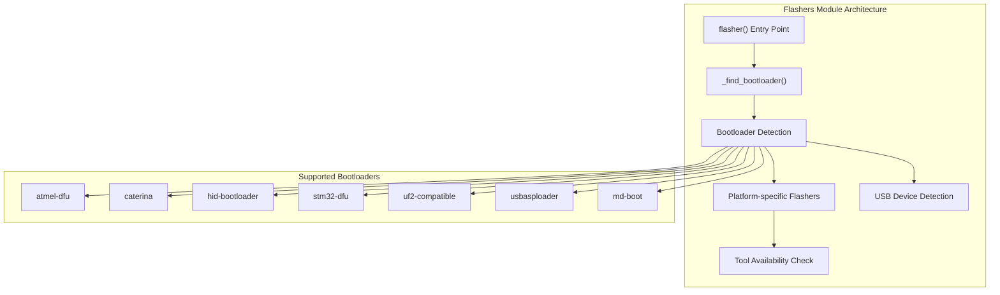
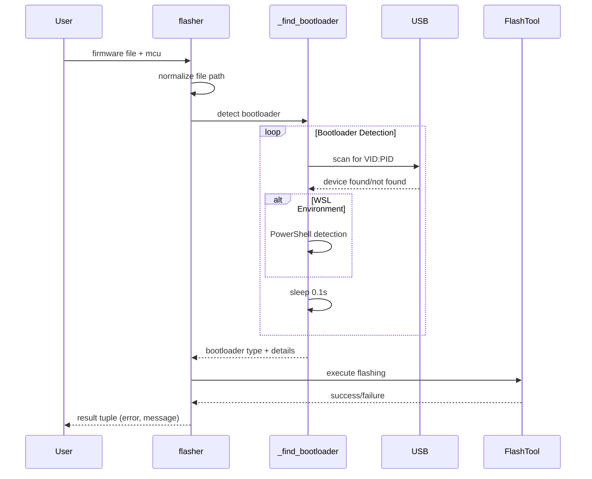
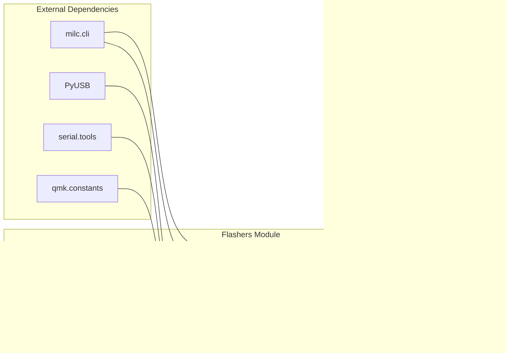

# Flashers Module Documentation

## Introduction

The flashers module is a critical component of the QMK (Quantum Mechanical Keyboard) firmware ecosystem, responsible for handling the firmware flashing process to various keyboard microcontrollers. This module provides a unified interface for detecting bootloaders and flashing firmware files to keyboards across different hardware platforms and bootloader types.

The module abstracts the complexity of working with multiple bootloader protocols, USB device detection, and platform-specific flashing tools, making it easier for users to update their keyboard firmware regardless of their hardware configuration.

## Architecture Overview

The flashers module implements a bootloader detection and firmware flashing system with the following architectural components:


```mermaid
graph TB
    subgraph "Flashers Module Architecture"
        A["flasher() Entry Point"]
        B["_find_bootloader()"]
        C["Bootloader Detection"]
        D["Platform-specific Flashers"]
        E["USB Device Detection"]
        F["Tool Availability Check"]
        
        A --> B
        B --> C
        C --> D
        C --> E
        D --> F
    end
    
    subgraph "Supported Bootloaders"
        G["atmel-dfu"]
        H["caterina"]
        I["hid-bootloader"]
        J["stm32-dfu"]
        K["uf2-compatible"]
        L["usbasploader"]
        M["md-boot"]
    end
    
    C --> G
    C --> H
    C --> I
    C --> J
    C --> K
    C --> L
    C --> M
```

## Core Components

### 1. DelayedKeyboardInterrupt

A context manager that provides safe handling of keyboard interrupts (Ctrl-C) during critical operations, particularly USB device detection. This prevents corruption or incomplete operations when users attempt to interrupt the flashing process.

**Purpose**: Ensures atomic operations during USB communication
**Usage**: Wrapped around PyUSB operations to prevent interruption

### 2. _find_bootloader()

The core bootloader detection function that continuously scans for known bootloader signatures via USB VID:PID pairs. It implements a timeout mechanism (10 minutes) to prevent infinite loops and supports multiple bootloader types.

**Key Features**:
- USB device enumeration using PyUSB
- WSL compatibility through PowerShell integration
- Support for UF2 bootloader detection via external utility
- Timeout protection (600 seconds)

### 3. flasher()

The main entry point for firmware flashing operations. This function orchestrates the entire flashing process by:
1. Converting file paths to POSIX format for cross-platform compatibility
2. Detecting the active bootloader
3. Selecting and executing the appropriate flashing method
4. Handling errors and providing user feedback

## Data Flow


```mermaid
sequenceDiagram
    participant User
    participant flasher
    participant _find_bootloader
    participant USB
    participant FlashTool
    
    User->>flasher: firmware file + mcu
    flasher->>flasher: normalize file path
    flasher->>_find_bootloader: detect bootloader
    loop Bootloader Detection
        _find_bootloader->>USB: scan for VID:PID
        USB-->>_find_bootloader: device found/not found
        alt WSL Environment
            _find_bootloader->>_find_bootloader: PowerShell detection
        end
        _find_bootloader->>_find_bootloader: sleep 0.1s
    end
    _find_bootloader-->>flasher: bootloader type + details
    flasher->>FlashTool: execute flashing
    FlashTool-->>flasher: success/failure
    flasher-->>User: result tuple (error, message)
```

## Bootloader Support Matrix

The module supports multiple bootloader types, each with specific characteristics:

| Bootloader | MCU Detection | Flashing Tool | Platform Support |
|------------|---------------|---------------|------------------|
| atmel-dfu | PID-based MCU ID | dfu-programmer | Cross-platform |
| caterina | Serial port detection | avrdude + avr109 | Cross-platform |
| hid-bootloader | VID:PID detection | teensy_loader_cli/hid_bootloader_cli | Cross-platform |
| stm32-dfu | VID:PID detection | dfu-util | Cross-platform |
| uf2-compatible | UF2 signature | uf2conv.py | Cross-platform |
| usbasploader | ISP protocol | avrdude + usbasp/usbtiny | Cross-platform |
| md-boot | Mass storage | mdloader | Cross-platform |

## Component Dependencies


```mermaid
graph LR
    subgraph "External Dependencies"
        A["PyUSB"]
        B["serial.tools"]
        C["milc.cli"]
        D["qmk.constants"]
    end
    
    subgraph "Flashers Module"
        E["DelayedKeyboardInterrupt"]
        F["_find_bootloader"]
        G["flasher"]
        H["Platform-specific flashers"]
    end
    
    A --> F
    B --> F
    C --> G
    C --> H
    D --> F
    
    E --> F
    F --> G
    G --> H
```

## Platform-Specific Implementations

### Windows Support
- PowerShell integration for WSL environments
- Windows-specific serial port handling
- COM port enumeration using `serial.tools.list_ports_windows`

### POSIX Support
- Native USB device access
- Serial port permission handling
- POSIX-compliant serial port enumeration

## Error Handling and Recovery

The module implements comprehensive error handling:

1. **Bootloader Detection Timeout**: 10-minute maximum search time
2. **Serial Port Availability**: 8-second timeout for Caterina bootloaders
3. **Tool Availability**: Graceful degradation when flashing tools are missing
4. **Interrupt Handling**: Safe Ctrl-C handling during USB operations
5. **File Format Validation**: UF2 file format verification

## Integration with QMK Ecosystem

The flashers module integrates with other QMK modules:

- **[keyboard.md](keyboard.md)**: Uses keyboard detection and layout information
- **[path.md](path.md)**: File path normalization and validation
- **[constants](constants.md)**: Bootloader VID:PID definitions

## Usage Examples

### Basic Firmware Flashing
```python
from qmk.flashers import flasher

# Flash firmware to detected bootloader
error, message = flasher(mcu='atmega32u4', file=Path('firmware.hex'))
if error:
    print(f"Flashing failed: {message}")
```

### Bootloader Detection
```python
from qmk.flashers import _find_bootloader

# Detect connected bootloader
bootloader_type, details = _find_bootloader()
print(f"Detected: {bootloader_type}")
```

## Security Considerations

1. **USB Device Access**: Requires appropriate system permissions
2. **File Path Handling**: POSIX conversion prevents path injection
3. **Tool Execution**: External tool calls with proper argument validation
4. **Interrupt Safety**: Prevents corruption during critical operations

## Performance Characteristics

- **Bootloader Detection**: Polling interval of 100ms
- **Timeout Values**: Configurable per bootloader type
- **USB Scanning**: Efficient VID:PID matching
- **Memory Usage**: Minimal memory footprint during detection

## Future Enhancements

Potential areas for improvement:

1. **Async Detection**: Non-blocking bootloader detection
2. **Progress Callbacks**: Real-time flashing progress reporting
3. **Multi-device Support**: Simultaneous flashing of multiple keyboards
4. **Enhanced Logging**: Detailed operation logging for debugging
5. **Protocol Abstraction**: Generic bootloader protocol interface

## Troubleshooting

Common issues and solutions:

1. **"Bootloader not found"**: Ensure keyboard is in bootloader mode
2. **"Tool not available"**: Install required flashing tools (dfu-programmer, avrdude, etc.)
3. **"Permission denied"**: Check USB device permissions and user groups
4. **"Timeout exceeded"**: Reset keyboard and try again
5. **WSL issues**: Ensure USB/IP forwarding is properly configured

This documentation provides a comprehensive overview of the flashers module, its architecture, and its role within the QMK ecosystem. The module serves as a critical bridge between firmware files and physical keyboards, abstracting the complexity of various bootloader protocols and platform-specific requirements.