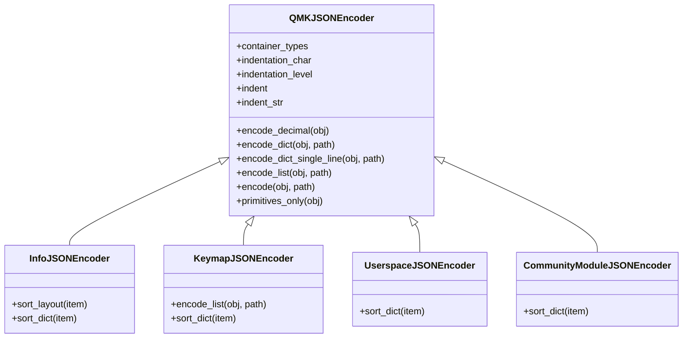
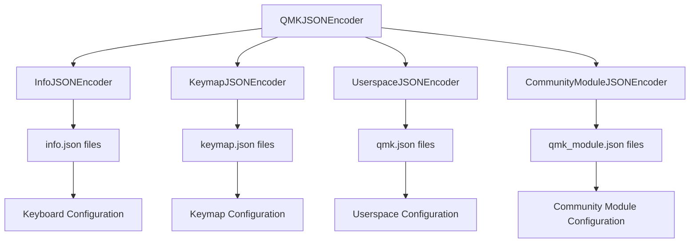
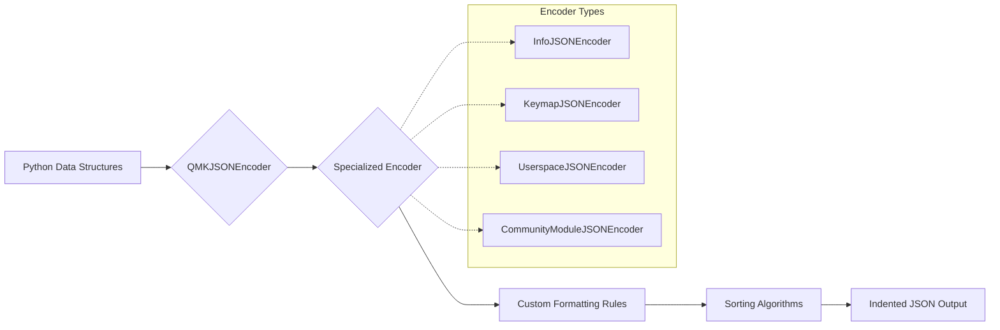
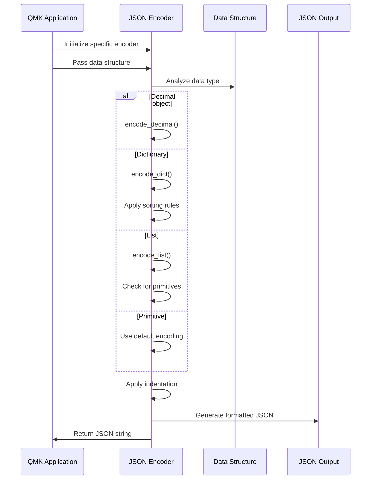

# JSON Encoders Module Documentation

## Introduction

The `json_encoders` module provides specialized JSON encoding functionality for the QMK (Quantum Mechanical Keyboard) firmware build system. It extends Python's standard `json.JSONEncoder` to create human-readable, well-formatted JSON output for various QMK configuration files, including keyboard info files, keymaps, userspace configurations, and community modules.

## Architecture Overview

The module implements a hierarchical encoder architecture with a base `QMKJSONEncoder` class and specialized subclasses for different QMK configuration types. Each encoder is optimized for its specific use case, providing custom formatting rules, sorting algorithms, and data structure handling.

## Component Relationships

## Data Flow Architecture

## Core Components

### QMKJSONEncoder
The base encoder class that provides core functionality for all QMK JSON encoders. It handles:

- **Decimal Encoding**: Converts `Decimal` objects to integers or floats as appropriate
- **Dictionary Formatting**: Provides both multi-line and single-line dictionary encoding
- **List Formatting**: Handles complex nested structures with proper indentation
- **Primitive Detection**: Identifies when data structures contain only primitive types
- **Custom Indentation**: Manages indentation levels for readable output

### InfoJSONEncoder
Specialized encoder for keyboard `info.json` files with custom sorting logic:

- **Top-level Sorting**: Prioritizes manufacturer, keyboard_name, and maintainer fields
- **Layout Field Sorting**: Organizes layout properties in a specific order (label, matrix, x, y, w, h, flags)
- **Section Grouping**: Groups related fields together for better readability

### KeymapJSONEncoder
Custom encoder for `keymap.json` files with keycode-specific formatting:

- **Layer Formatting**: Formats keyboard layers with proper keycode alignment
- **Macro Support**: Handles macro definitions within keycodes
- **Newline Handling**: Processes `JSON_NEWLINE` placeholders for visual key grouping
- **Keycode Arrays**: Formats arrays of keycodes in a grid-like structure

### UserspaceJSONEncoder
Encoder for userspace `qmk.json` configuration files:

- **Version Priority**: Places userspace_version at the beginning
- **Build Targets**: Prioritizes build_targets configuration
- **Minimal Sorting**: Provides basic sorting for userspace-specific fields

### CommunityModuleJSONEncoder
Specialized encoder for community module `qmk_module.json` files:

- **Module Metadata**: Prioritizes module_name, maintainer, and license information
- **Feature Organization**: Groups features and keycodes separately
- **Keycode Details**: Provides specific sorting for keycode definitions

## Process Flow

## Key Features

### Intelligent Formatting
- **Layout Arrays**: Special single-line formatting for layout and rotary configurations
- **Keycode Grids**: Visual alignment of keycodes in keymap layers
- **Decimal Handling**: Automatic conversion of Decimal objects to appropriate numeric types

### Custom Sorting
Each encoder implements domain-specific sorting to ensure consistent and logical field ordering:
- **Info JSON**: Prioritizes keyboard metadata and groups layout information
- **Keymap JSON**: Organizes version, author, and layer information
- **Userspace JSON**: Emphasizes version and build configuration
- **Community Module JSON**: Structures module metadata and feature definitions

### Extensibility
The base `QMKJSONEncoder` class provides a foundation for creating new specialized encoders, allowing the system to adapt to new configuration file formats while maintaining consistent formatting behavior.

## Usage Patterns

The encoders are typically used when:
1. Generating configuration files from Python data structures
2. Pretty-printing existing JSON data for human readability
3. Ensuring consistent formatting across different QMK tools
4. Creating configuration files that need to be manually edited by users

## Integration with QMK Ecosystem

The json_encoders module integrates with other QMK modules to provide formatted output for:
- [keyboard.md](keyboard.md) module for keyboard configuration files
- [build_targets.md](build_targets.md) module for build configuration
- [userspace.md](userspace.md) module for userspace settings
- [community_modules.md](community_modules.md) module for community module definitions

This integration ensures that all JSON output across the QMK ecosystem follows consistent formatting standards, making configuration files more maintainable and user-friendly.