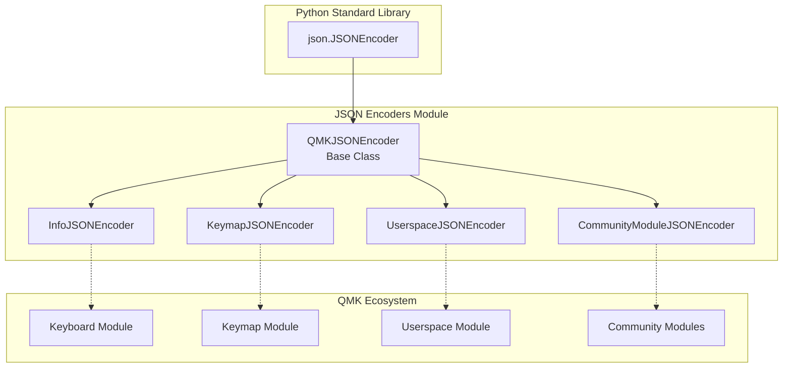
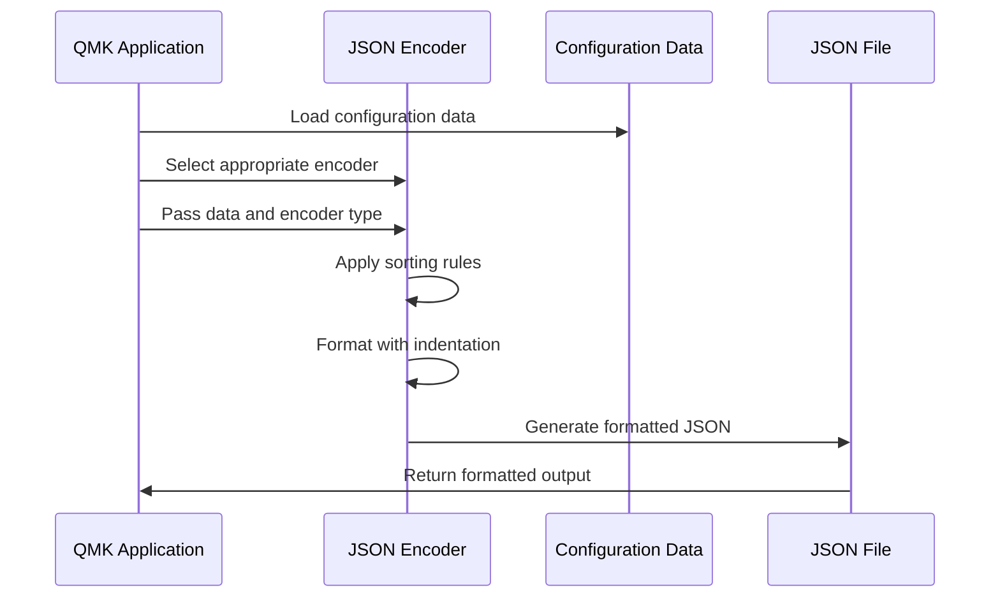

# JSON Encoders Module

The `json_encoders` module provides specialized JSON encoding functionality for the QMK firmware ecosystem. It contains custom JSON encoders that format and structure JSON output specifically for different types of QMK configuration files, ensuring consistent formatting and human-readable output across the entire QMK project.

## Overview

This module serves as the formatting engine for QMK's JSON-based configuration files, providing specialized encoders for:
- Keyboard information files (`info.json`)
- Keymap definitions (`keymap.json`)
- Userspace configurations (`qmk.json`)
- Community module definitions (`qmk_module.json`)

## Architecture


```mermaid
graph TB
    subgraph "JSON Encoders Module"
        QMKJE[QMKJSONEncoder<br/>Base Class]
        IJE[InfoJSONEncoder]
        KJE[KeymapJSONEncoder]
        UJE[UserspaceJSONEncoder]
        CMJE[CommunityModuleJSONEncoder]
    end
    
    subgraph "Python Standard Library"
        JSON[json.JSONEncoder]
    end
    
    subgraph "QMK Ecosystem"
        KB[Keyboard Module]
        KM[Keymap Module]
        US[Userspace Module]
        CM[Community Modules]
    end
    
    JSON --> QMKJE
    QMKJE --> IJE
    QMKJE --> KJE
    QMKJE --> UJE
    QMKJE --> CMJE
    
    IJE -.-> KB
    KJE -.-> KM
    UJE -.-> US
    CMJE -.-> CM
```

## Component Details

### QMKJSONEncoder (Base Class)

The foundation class that extends Python's standard `json.JSONEncoder` with QMK-specific formatting capabilities.

**Key Features:**
- Custom indentation handling
- Decimal number formatting
- Container type detection
- Path-aware encoding
- Pretty-printing for complex structures

**Core Methods:**
- `encode_decimal()`: Converts Decimal objects to integers or floats
- `encode_dict()`: Formats dictionary objects with proper indentation
- `encode_list()`: Handles list formatting with special cases for layouts
- `primitives_only()`: Determines if an object contains only primitive types

### InfoJSONEncoder

Specialized encoder for keyboard information files, extending `QMKJSONEncoder` with keyboard-specific formatting rules.

**Key Features:**
- Custom sorting for keyboard metadata fields
- Special handling for layout definitions
- Manufacturer and keyboard name prioritization
- Layout aliases and community layouts organization

**Sorting Priority (Top Level):**
1. `manufacturer` (10)
2. `keyboard_name` (11)
3. `maintainer` (12)
4. Regular fields (50)
5. `community_layouts` (97)
6. `layout_aliases` (98)
7. `layouts` (99)

**Layout Field Sorting:**
1. `label` (00)
2. `matrix` (01)
3. `x` (02)
4. `y` (03)
5. `w` (04)
6. `h` (05)
7. `flags` (06)

### KeymapJSONEncoder

Dedicated encoder for keymap configuration files, providing specialized formatting for keycode arrays and macro definitions.

**Key Features:**
- Layer-based keycode formatting
- Special handling for `JSON_NEWLINE` tokens
- Macro support for complex key sequences
- Multi-line keycode arrays for readability

**Keycode Formatting:**
- Groups keycodes into rows based on `JSON_NEWLINE` tokens
- Formats each layer as a separate block
- Handles both simple keycodes and complex macro objects

**Sorting Priority:**
1. `version` (00)
2. `author` (01)
3. `notes` (02)
4. Regular fields (50)
5. `layers` (98)
6. `documentation` (99)

### UserspaceJSONEncoder

Encoder for userspace configuration files, focusing on build target organization and version management.

**Key Features:**
- Userspace version prioritization
- Build targets organization
- Minimal but effective field sorting

**Sorting Priority:**
1. `userspace_version` (00)
2. `build_targets` (01)

### CommunityModuleJSONEncoder

Specialized encoder for community module definition files, handling module metadata and keycode definitions.

**Key Features:**
- Module metadata organization
- Keycode definition formatting
- Multi-level sorting for nested structures

**Top Level Sorting:**
1. `module_name` (00)
2. `maintainer` (01)
3. `license` (02)
4. `url` (03)
5. `features` (04)
6. `keycodes` (05)

**Keycode Level Sorting:**
1. `key` (00)
2. `aliases` (01)

## Data Flow


```mermaid
sequenceDiagram
    participant App as QMK Application
    participant Encoder as JSON Encoder
    participant Data as Configuration Data
    participant File as JSON File
    
    App->>Data: Load configuration data
    App->>Encoder: Select appropriate encoder
    App->>Encoder: Pass data and encoder type
    Encoder->>Encoder: Apply sorting rules
    Encoder->>Encoder: Format with indentation
    Encoder->>File: Generate formatted JSON
    File->>App: Return formatted output
```

## Usage Patterns

### Basic Usage
```python
from qmk.json_encoders import InfoJSONEncoder
import json

# Format keyboard info data
keyboard_data = {
    'keyboard_name': 'MyKeyboard',
    'manufacturer': 'MyCompany',
    'layouts': {
        'LAYOUT': {
            'layout': [
                {'label': 'Esc', 'x': 0, 'y': 0},
                {'label': '1', 'x': 1, 'y': 0}
            ]
        }
    }
}

formatted_json = json.dumps(keyboard_data, cls=InfoJSONEncoder, indent=4, sort_keys=True)
```

### Keymap Formatting
```python
from qmk.json_encoders import KeymapJSONEncoder

keymap_data = {
    'version': 1,
    'author': 'qmk',
    'layers': [
        ['KC_ESC', 'KC_1', 'JSON_NEWLINE', 'KC_A', 'KC_B'],
        ['KC_TRNS', 'KC_TRNS', 'JSON_NEWLINE', 'KC_TRNS', 'KC_TRNS']
    ]
}

formatted_keymap = json.dumps(keymap_data, cls=KeymapJSONEncoder, indent=4, sort_keys=True)
```

## Integration with QMK Ecosystem

The JSON encoders module integrates with various parts of the QMK ecosystem:

- **[Keyboard Module](keyboard.md)**: Uses `InfoJSONEncoder` for formatting keyboard information files
- **[Userspace Module](userspace.md)**: Utilizes `UserspaceJSONEncoder` for userspace configurations
- **[Community Modules](community_modules.md)**: Employs `CommunityModuleJSONEncoder` for module definitions

## Key Design Principles

1. **Consistency**: All encoders follow the same base formatting rules while allowing for specialization
2. **Readability**: Output is optimized for human consumption with logical field ordering
3. **Extensibility**: Base class design allows easy addition of new encoder types
4. **Path Awareness**: Encoding decisions can be made based on the data's location in the structure
5. **Sorting Control**: Customizable field ordering ensures important information appears first

## Error Handling

The module relies on Python's built-in JSON encoding error handling:
- `TypeError` for unsupported data types
- `ValueError` for invalid JSON structures
- Standard exception propagation for debugging

## Performance Considerations

- **Memory Usage**: Processes data incrementally to handle large configurations
- **Sorting Overhead**: Custom sorting adds minimal overhead for improved readability
- **String Building**: Efficient string concatenation for large JSON outputs

## Future Enhancements

Potential areas for improvement:
- Validation integration with QMK's configuration schemas
- Support for JSON5 features (comments, trailing commas)
- Performance optimizations for very large keyboard definitions
- Integration with streaming JSON parsers for memory efficiency