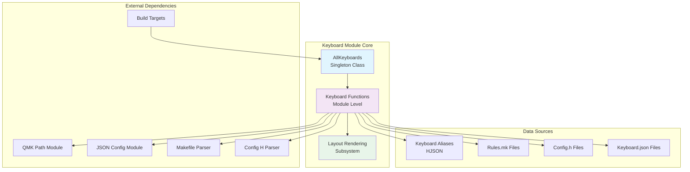
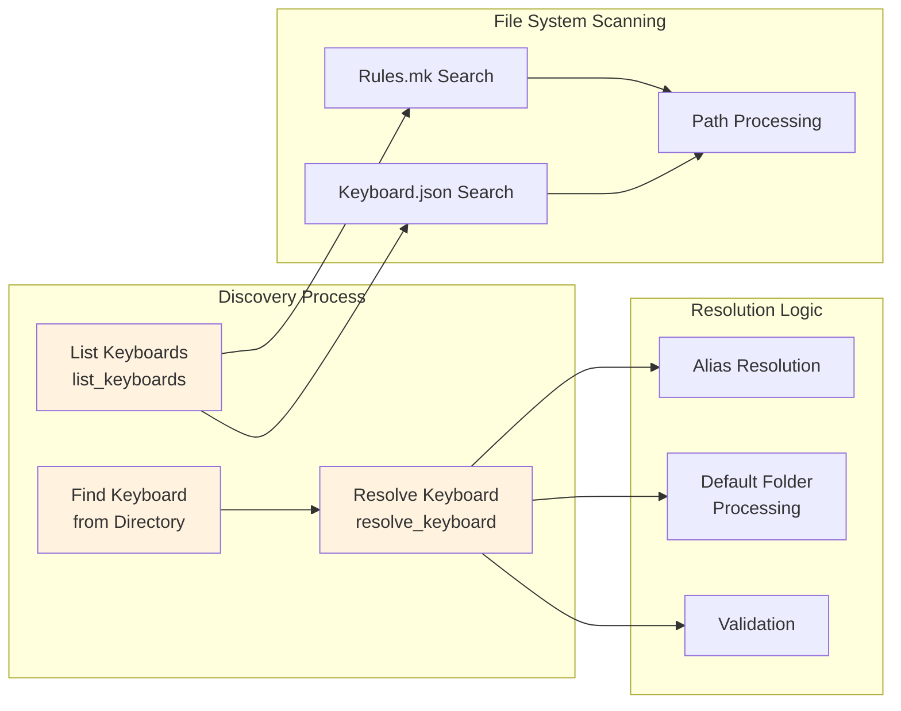
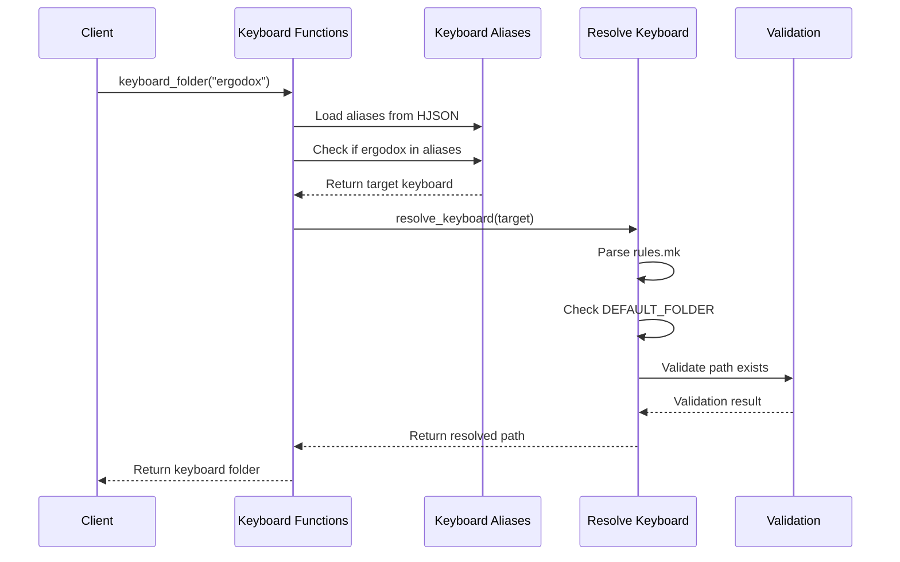
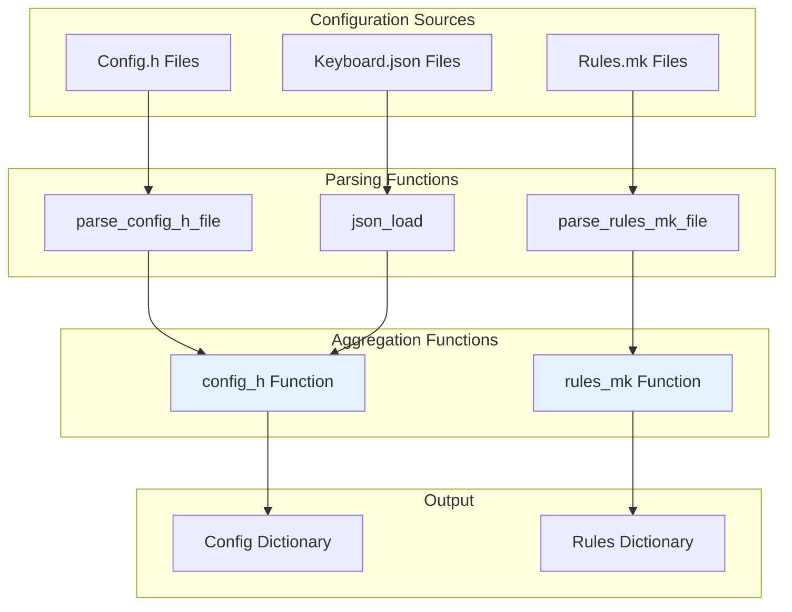
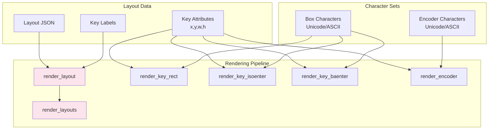
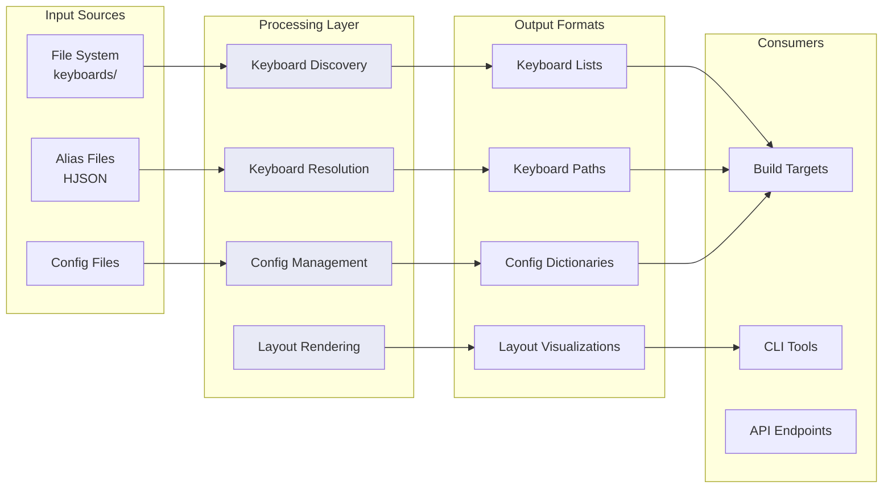
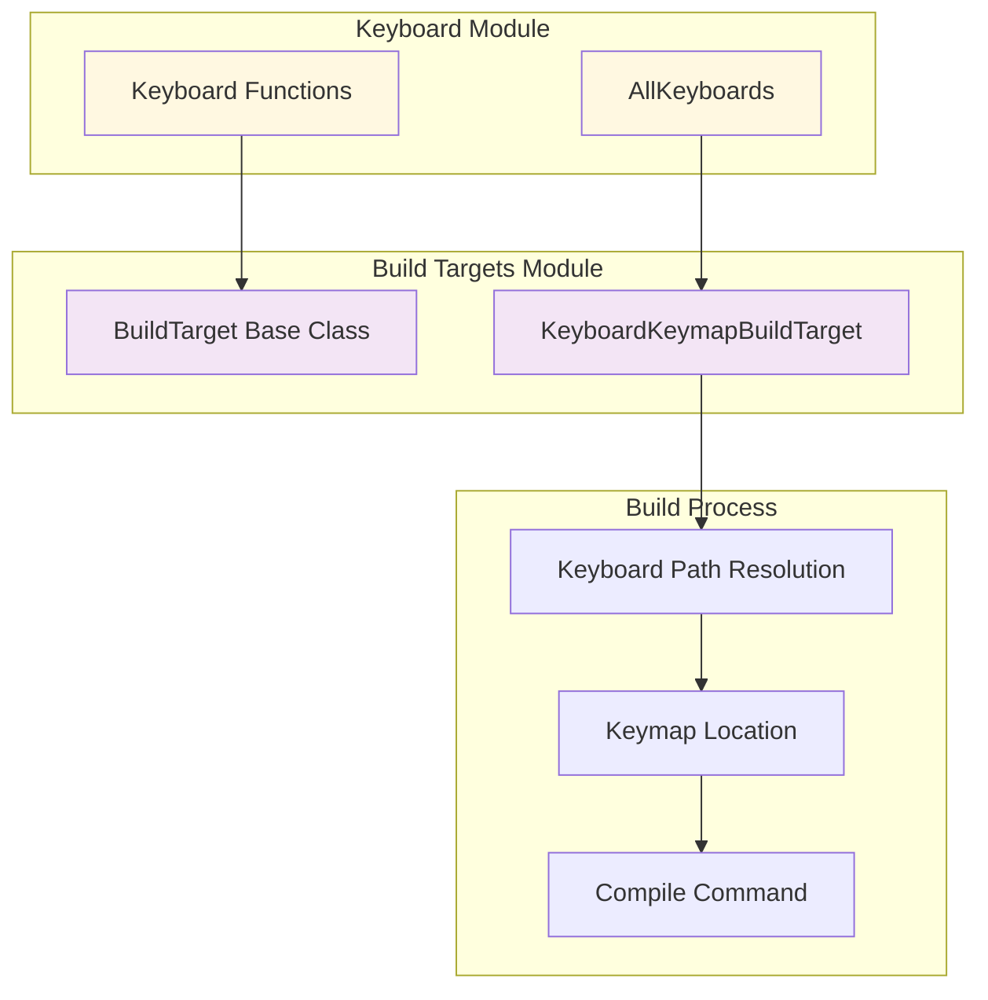
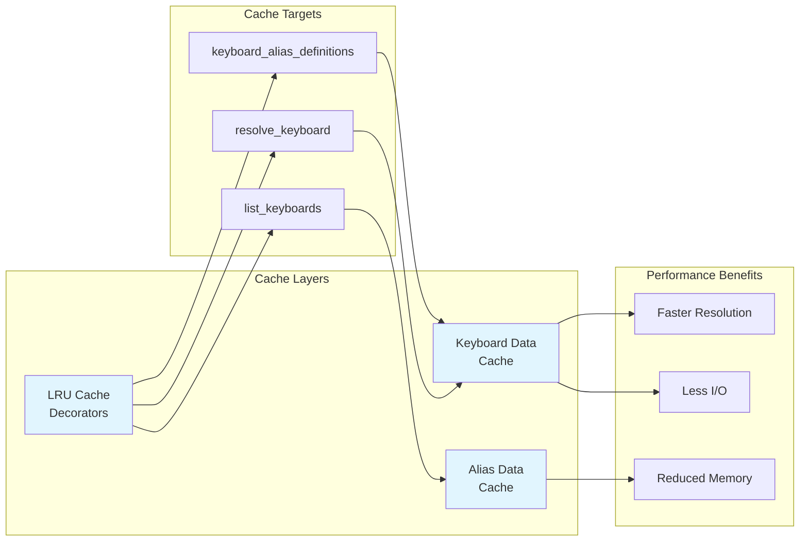
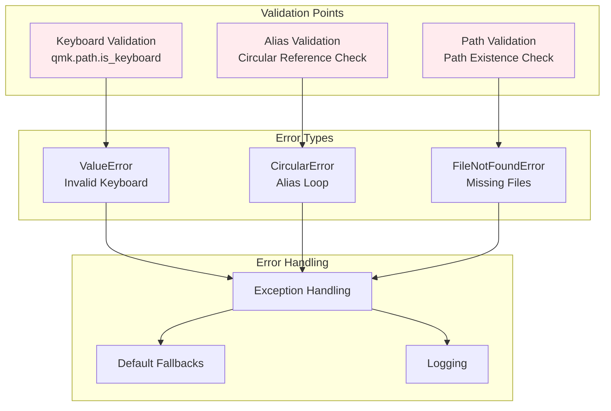

# Keyboard Module Documentation

## Introduction

The keyboard module is a core component of the QMK (Quantum Mechanical Keyboard) firmware build system. It provides essential functionality for discovering, managing, and working with keyboard definitions within the QMK ecosystem. This module serves as the central hub for keyboard-related operations, from basic keyboard discovery to complex layout rendering and configuration management.

The module handles the intricate relationships between physical keyboards, their configurations, aliases, and build targets, making it an indispensable part of the QMK build pipeline. It provides both programmatic access to keyboard information and utility functions for rendering keyboard layouts in various formats.

## Architecture Overview



## Core Components

### AllKeyboards Class

The `AllKeyboards` class is a singleton-like representation that encapsulates the concept of "all keyboards" within the QMK system. This class provides a unified interface for operations that need to target or reference all available keyboards.

**Key Characteristics:**
- Immutable representation of the universal keyboard set
- Provides consistent string representation ("all")
- Enables polymorphic behavior in build systems
- Supports equality comparisons

**Usage Pattern:**
```python
# Used in build targets and CLI operations
all_kb = AllKeyboards()
if is_all_keyboards(all_kb):
    # Process all keyboards
    pass
```

### Keyboard Discovery System

The keyboard discovery system forms the backbone of the module, providing comprehensive functionality for finding and enumerating keyboards within the QMK firmware structure.



**Discovery Algorithm:**
1. **File System Scanning**: Searches for `rules.mk` and `keyboard.json` files in the keyboards directory
2. **Path Extraction**: Extracts keyboard names from file paths using `_find_name()`
3. **Alias Resolution**: Resolves keyboard aliases from the aliases mapping file
4. **Default Folder Processing**: Handles `DEFAULT_FOLDER` directives in rules.mk files
5. **Validation**: Ensures resolved keyboards are valid QMK keyboards

### Keyboard Resolution and Aliasing

The module implements a sophisticated keyboard resolution system that handles historical aliases, default folders, and path resolution.



**Alias Resolution Features:**
- **Hierarchical Resolution**: Supports chained aliases (A -> B -> C)
- **Circular Reference Protection**: Prevents infinite loops in alias chains
- **Target Validation**: Ensures final resolved keyboard exists
- **Historical Compatibility**: Maintains backward compatibility with legacy keyboard names

### Configuration Management

The module provides comprehensive configuration management through integration with QMK's configuration parsing systems.



**Configuration Hierarchy:**
1. **Base Configuration**: Root-level config.h and rules.mk files
2. **Keyboard-Specific**: Keyboard directory configurations
3. **Sub-Keyboard**: Sub-folder specific configurations
4. **Final Aggregation**: Merged configuration dictionaries

### Layout Rendering System

The layout rendering system provides sophisticated ASCII and Unicode visualization of keyboard layouts, supporting various key types and special cases.



**Rendering Features:**
- **Multi-Style Support**: Both Unicode and ASCII rendering modes
- **Key Type Handling**: Standard keys, ISO Enter, Big Ass Enter, Encoders
- **Dynamic Labeling**: Support for custom key labels
- **Proportional Scaling**: Accurate key size representation
- **Text Buffer Management**: Efficient character array manipulation

## Data Flow Architecture



## Integration with Build System

The keyboard module integrates closely with the [build_targets](build_targets.md) module to provide keyboard-specific build functionality.



**Integration Points:**
- **Keyboard Resolution**: `keyboard_folder()` function used in `BuildTarget.__init__()`
- **Path Validation**: Integration with QMK path utilities for validation
- **Alias Support**: Build targets respect keyboard aliases for compatibility
- **Userspace Integration**: Support for keymaps in userspace directories

## Performance Optimizations

The module implements several performance optimizations to handle the large number of keyboards in the QMK ecosystem efficiently.

### Caching Strategy



**Optimization Techniques:**
- **LRU Caching**: `@lru_cache` decorators on expensive functions
- **File System Minimization**: Efficient glob patterns to reduce file system access
- **Path String Operations**: Optimized string manipulation for path processing
- **Lazy Loading**: Configuration files loaded only when needed

## Error Handling and Validation

The module implements comprehensive error handling to ensure robust operation across various edge cases and invalid inputs.



## Module Dependencies

The keyboard module has several key dependencies that provide supporting functionality:

### Internal Dependencies
- **[qmk.path](path.md)**: Path resolution and validation utilities
- **[qmk.c_parse](c_parse.md)**: C header file parsing for configuration
- **[qmk.json_schema](json_schema.md)**: JSON schema validation and loading
- **[qmk.makefile](makefile.md)**: Makefile parsing for build rules

### External Dependencies
- **pathlib**: Modern path manipulation
- **glob**: File system pattern matching
- **array**: Efficient character array operations for rendering

## Usage Examples

### Basic Keyboard Discovery
```python
from qmk.keyboard import list_keyboards, keyboard_folder

# Get all available keyboards
keyboards = list_keyboards()
print(f"Found {len(keyboards)} keyboards")

# Resolve a keyboard with aliases
resolved = keyboard_folder("planck")
print(f"Planck resolves to: {resolved}")
```

### Configuration Access
```python
from qmk.keyboard import config_h, rules_mk

# Get merged configuration for a keyboard
config = config_h("clueboard/66/rev4")
rules = rules_mk("clueboard/66/rev4")

print(f"MCU: {config.get('MCU')}")
print(f"Bootloader: {rules.get('BOOTLOADER')}")
```

### Layout Rendering
```python
from qmk.keyboard import render_layout

# Render a layout with Unicode characters
layout_data = [
    {"x": 0, "y": 0, "w": 1, "h": 1, "label": "Q"},
    {"x": 1, "y": 0, "w": 1, "h": 1, "label": "W"},
    # ... more keys
]

rendered = render_layout(layout_data, render_ascii=False)
print(rendered)
```

## Future Considerations

The keyboard module is designed with extensibility in mind, supporting future enhancements such as:

- **Dynamic Keyboard Registration**: Runtime keyboard discovery
- **Enhanced Layout Support**: Additional key types and layouts
- **Performance Improvements**: Further caching and optimization
- **Extended Validation**: More comprehensive keyboard validation
- **Plugin Architecture**: Extensible keyboard processing plugins

This module serves as the foundation for all keyboard-related operations in QMK, providing a robust and efficient interface for keyboard discovery, management, and visualization.