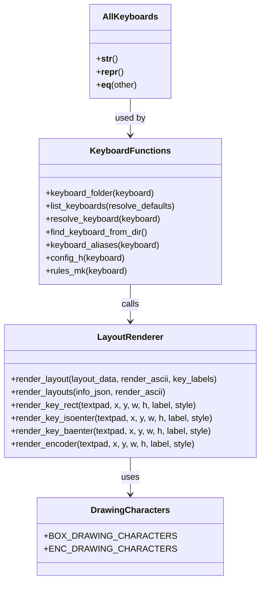
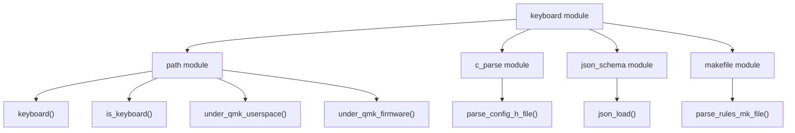
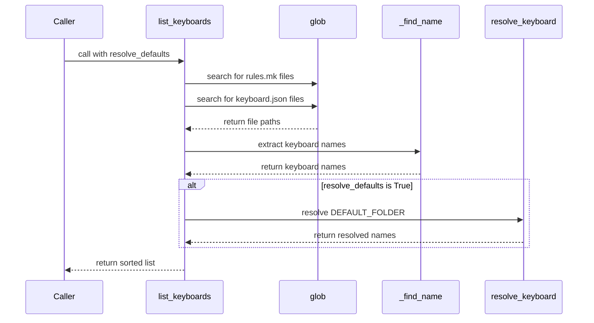
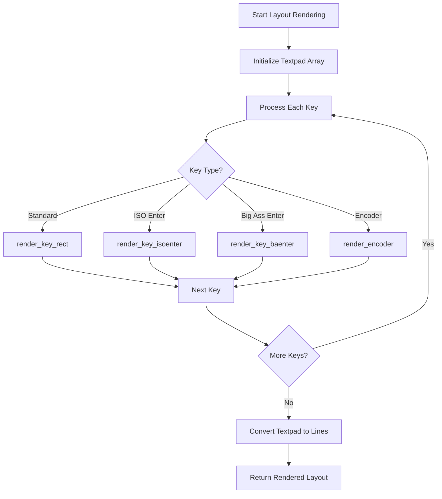
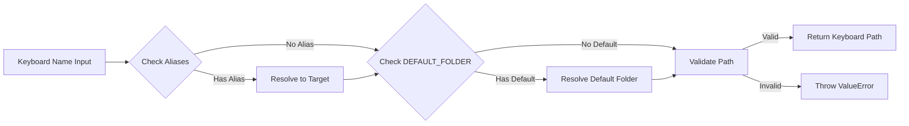
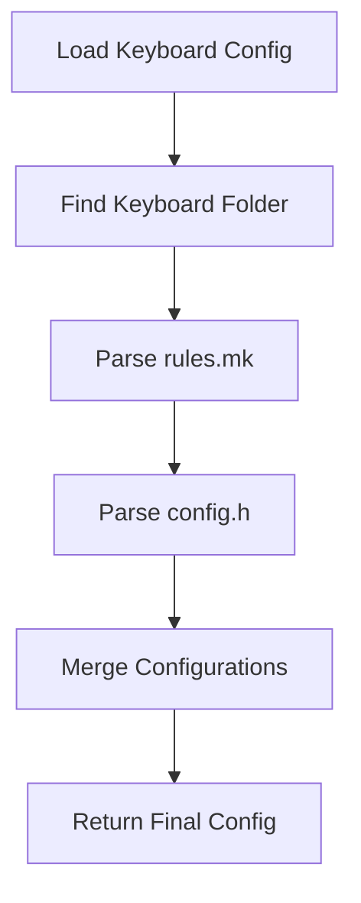

# Keyboard Module Documentation

## Introduction

The keyboard module is a core component of the QMK (Quantum Mechanical Keyboard) firmware build system. It provides essential functionality for discovering, managing, and visualizing keyboard configurations within the QMK ecosystem. This module serves as the primary interface for keyboard-related operations, including keyboard discovery, alias resolution, configuration parsing, and layout rendering.

## Overview

The keyboard module handles the complex task of managing keyboard definitions, which can be distributed across multiple files and directories within the QMK firmware structure. It provides functions to discover available keyboards, resolve keyboard aliases, parse configuration files, and render keyboard layouts in both ASCII and Unicode formats for visualization purposes.

## Architecture

### Core Components


```mermaid
classDiagram
    class AllKeyboards {
        +__str__()
        +__repr__()
        +__eq__(other)
    }
    
    class KeyboardFunctions {
        +keyboard_folder(keyboard)
        +list_keyboards(resolve_defaults)
        +resolve_keyboard(keyboard)
        +find_keyboard_from_dir()
        +keyboard_aliases(keyboard)
        +config_h(keyboard)
        +rules_mk(keyboard)
    }
    
    class LayoutRenderer {
        +render_layout(layout_data, render_ascii, key_labels)
        +render_layouts(info_json, render_ascii)
        +render_key_rect(textpad, x, y, w, h, label, style)
        +render_key_isoenter(textpad, x, y, w, h, label, style)
        +render_key_baenter(textpad, x, y, w, h, label, style)
        +render_encoder(textpad, x, y, w, h, label, style)
    }
    
    class DrawingCharacters {
        +BOX_DRAWING_CHARACTERS
        +ENC_DRAWING_CHARACTERS
    }
    
    AllKeyboards --> KeyboardFunctions : used by
    LayoutRenderer --> DrawingCharacters : uses
    KeyboardFunctions --> LayoutRenderer : calls
```

### Module Dependencies


```mermaid
graph TD
    KeyboardModule["keyboard module"] --> PathModule["path module"]
    KeyboardModule --> CParseModule["c_parse module"]
    KeyboardModule --> JSONSchemaModule["json_schema module"]
    KeyboardModule --> MakefileModule["makefile module"]
    
    PathModule --> keyboard["keyboard()"]
    PathModule --> is_keyboard["is_keyboard()"]
    PathModule --> under_qmk_userspace["under_qmk_userspace()"]
    PathModule --> under_qmk_firmware["under_qmk_firmware()"]
    
    CParseModule --> parse_config_h_file["parse_config_h_file()"]
    JSONSchemaModule --> json_load["json_load()"]
    MakefileModule --> parse_rules_mk_file["parse_rules_mk_file()"]
```

## Component Details

### AllKeyboards Class

The `AllKeyboards` class is a special singleton-like class that represents all keyboards in the system. It's used when operations need to be applied to all available keyboards rather than a specific one.

**Key Methods:**
- `__str__()`: Returns 'all' string representation
- `__repr__()`: Returns 'all' for debugging
- `__eq__()`: Equality comparison with other AllKeyboards instances

### Keyboard Discovery Functions

#### `list_keyboards(resolve_defaults=True)`
Discovers all available keyboards by searching for `rules.mk` or `keyboard.json` files in the keyboards directory. Uses caching for performance optimization.

**Process Flow:**

```mermaid
sequenceDiagram
    participant Caller
    participant list_keyboards
    participant glob
    participant _find_name
    participant resolve_keyboard
    
    Caller->>list_keyboards: call with resolve_defaults
    list_keyboards->>glob: search for rules.mk files
    list_keyboards->>glob: search for keyboard.json files
    glob-->>list_keyboards: return file paths
    list_keyboards->>_find_name: extract keyboard names
    _find_name-->>list_keyboards: return keyboard names
    alt resolve_defaults is True
        list_keyboards->>resolve_keyboard: resolve DEFAULT_FOLDER
        resolve_keyboard-->>list_keyboards: return resolved names
    end
    list_keyboards-->>Caller: return sorted list
```

#### `keyboard_folder(keyboard)`
Resolves the actual keyboard folder path by checking aliases and DEFAULT_FOLDER configurations. Handles keyboard alias resolution and validation.

#### `find_keyboard_from_dir()`
Attempts to determine the keyboard name based on the user's current working directory, useful for context-aware operations.

### Configuration Parsing

#### `config_h(keyboard)`
Parses all config.h files for a keyboard, merging configurations from parent directories down to the specific keyboard directory.

#### `rules_mk(keyboard)`
Parses rules.mk files for build configuration, following the same hierarchical approach as config.h parsing.

### Layout Rendering System

The module provides sophisticated layout rendering capabilities for visualizing keyboard layouts in terminal environments.

#### `render_layout(layout_data, render_ascii, key_labels)`
Renders a single keyboard layout with support for different key types and styles.

**Key Types Supported:**
- Standard rectangular keys
- ISO Enter keys (1.25u x 2u)
- Big Ass Enter keys (1.5u x 2u)
- Rotary encoders

**Rendering Process:**

```mermaid
flowchart TD
    Start[Start Layout Rendering] --> Initialize[Initialize Textpad Array]
    Initialize --> ProcessKeys[Process Each Key]
    
    ProcessKeys --> KeyType{Key Type?}
    KeyType -->|Standard| RenderRect[render_key_rect]
    KeyType -->|ISO Enter| RenderISO[render_key_isoenter]
    KeyType -->|Big Ass Enter| RenderBA[render_key_baenter]
    KeyType -->|Encoder| RenderEnc[render_encoder]
    
    RenderRect --> NextKey[Next Key]
    RenderISO --> NextKey
    RenderBA --> NextKey
    RenderEnc --> NextKey
    
    NextKey --> MoreKeys{More Keys?}
    MoreKeys -->|Yes| ProcessKeys
    MoreKeys -->|No| ConvertLines[Convert Textpad to Lines]
    ConvertLines --> ReturnResult[Return Rendered Layout]
```

#### Character Sets

The module supports two drawing styles:
- **Unicode**: Modern terminal support with box-drawing characters
- **ASCII**: Legacy terminal compatibility with basic characters

## Data Flow

### Keyboard Resolution Flow


```mermaid
flowchart LR
    Input[Keyboard Name Input] --> AliasCheck{Check Aliases}
    AliasCheck -->|Has Alias| ResolveAlias[Resolve to Target]
    AliasCheck -->|No Alias| CheckDefault{Check DEFAULT_FOLDER}
    ResolveAlias --> CheckDefault
    CheckDefault -->|Has Default| ResolveDefault[Resolve Default Folder]
    CheckDefault -->|No Default| Validate[Validate Path]
    ResolveDefault --> Validate
    Validate -->|Valid| ReturnPath[Return Keyboard Path]
    Validate -->|Invalid| Error[Throw ValueError]
```

### Configuration Loading Flow


```mermaid
flowchart TD
    Start[Load Keyboard Config] --> FindKeyboard[Find Keyboard Folder]
    FindKeyboard --> ParseRules[Parse rules.mk]
    ParseRules --> ParseConfig[Parse config.h]
    ParseConfig --> MergeConfig[Merge Configurations]
    MergeConfig --> ReturnConfig[Return Final Config]
```

## Integration with Other Modules

### Path Module Integration
The keyboard module heavily relies on the [path module](path.md) for:
- Keyboard path validation (`is_keyboard()`)
- Path resolution (`keyboard()`)
- QMK environment detection (`under_qmk_userspace()`, `under_qmk_firmware()`)

### JSON Schema Integration
Uses [json_schema module](json_schema.md) for loading JSON configuration files, particularly keyboard alias definitions.

### C Parse Integration
Leverages [c_parse module](c_parse.md) for parsing C header files (config.h) to extract keyboard configuration.

### Makefile Integration
Utilizes [makefile module](makefile.md) for parsing rules.mk files that contain build rules and keyboard-specific settings.

## Usage Examples

### Discovering Keyboards
```python
from qmk.keyboard import list_keyboards

# Get all keyboards
keyboards = list_keyboards()

# Get keyboards without resolving DEFAULT_FOLDER
keyboards = list_keyboards(resolve_defaults=False)
```

### Resolving Keyboard Paths
```python
from qmk.keyboard import keyboard_folder

# Resolve keyboard with alias resolution
keyboard_path = keyboard_folder('clueboard/66/rev3')
```

### Rendering Layouts
```python
from qmk.keyboard import render_layout

# Render layout with Unicode characters
layout_text = render_layout(layout_data, render_ascii=False)

# Render layout with ASCII characters
layout_text = render_layout(layout_data, render_ascii=True)
```

## Performance Considerations

The module implements several performance optimizations:

1. **LRU Caching**: Both `keyboard_alias_definitions()` and `resolve_keyboard()` use `@lru_cache` decorators to cache results
2. **Efficient File Discovery**: Uses glob patterns to quickly find keyboard definition files
3. **Lazy Loading**: Configuration files are only parsed when needed

## Error Handling

The module implements comprehensive error handling:
- **Invalid Keyboards**: `keyboard_folder()` raises `ValueError` for invalid keyboard names
- **Missing Files**: Gracefully handles missing configuration files
- **Path Validation**: Uses the path module for safe path operations

## Future Enhancements

Potential areas for improvement:
- Support for additional key types in layout rendering
- Enhanced keyboard discovery with metadata caching
- Support for keyboard templates and inheritance
- Integration with external keyboard databases