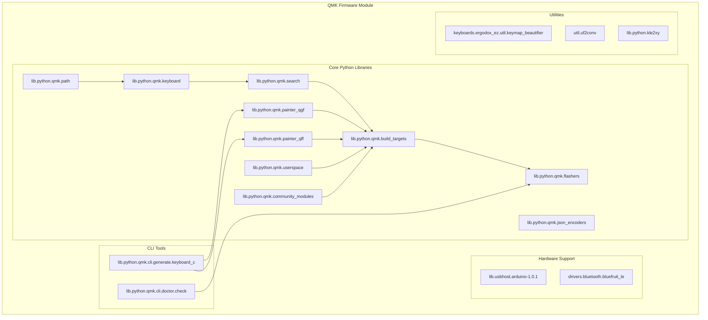

# QMK Firmware Module Documentation

## Overview

The QMK (Quantum Mechanical Keyboard) Firmware module is a comprehensive keyboard firmware ecosystem that provides tools, libraries, and utilities for building, configuring, and managing mechanical keyboard firmware. This module encompasses the entire QMK firmware build system, including Python utilities, hardware abstraction layers, and various supporting components.

## Architecture



## Core Functionality

### 1. Graphics and Display Support

The module provides comprehensive graphics support through two main subsystems:

#### Quantum Graphics File (QGF) Format
- **Purpose**: Custom image format for keyboard displays
- **Components**: 
  - `QGFImageFile`: Main image file handler
  - `QGFGraphicsDescriptor`: File metadata and properties
  - `QGFFrameDescriptorV1`: Individual frame information
  - `QGFFramePaletteDescriptorV1`: Color palette management
  - `QGFFrameDataDescriptorV1`: Image data storage
- **Features**: RLE compression, delta frames, animation support
- **File**: [painter_qgf.md](painter_qgf.md)

#### Quantum Font File (QFF) Format
- **Purpose**: Custom font format for keyboard displays
- **Components**:
  - `QFFFont`: Main font handler and generator
  - `QFFFontDescriptor`: Font metadata
  - `QFFAsciiGlyphTableV1`: ASCII character support
  - `QFFUnicodeGlyphTableV1`: Unicode character support
- **Features**: TTF conversion, glyph extraction, RLE compression
- **File**: [painter_qff.md](painter_qff.md)

### 2. Build System and Targets

#### Build Target Management
- **Purpose**: Unified interface for keyboard compilation
- **Components**:
  - `BuildTarget`: Base class for all build targets
  - `KeyboardKeymapBuildTarget`: Traditional keyboard/keymap builds
  - `JsonKeymapBuildTarget`: Configurator JSON-based builds
- **Features**: Parallel builds, compilation databases, clean builds
- **File**: [build_targets.md](build_targets.md)

#### Search and Filtering
- **Purpose**: Find keyboards and keymaps matching criteria
- **Components**:
  - `KeyboardKeymapDesc`: Keyboard/keymap descriptor
  - `FilterFunction`: Base class for search filters
  - `Exists`, `Absent`, `Length`, `Contains`: Specific filter implementations
- **Features**: Complex queries, parallel processing, wildcard support
- **File**: [search.md](search.md)

#### Build Target Management
- **Purpose**: Unified interface for keyboard compilation
- **Components**:
  - `BuildTarget`: Base class for all build targets
  - `KeyboardKeymapBuildTarget`: Traditional keyboard/keymap builds
  - `JsonKeymapBuildTarget`: Configurator JSON-based builds
- **Features**: Parallel builds, compilation databases, clean builds
- **File**: [build_targets.md](build_targets.md)

#### Keyboard Management
- **Purpose**: Handle keyboard discovery and metadata
- **Components**:
  - `AllKeyboards`: Special object representing all keyboards
- **Features**: Keyboard enumeration, alias resolution, path handling
- **File**: [keyboard.md](keyboard.md)

### 3. Hardware Abstraction

#### USB Communication
- **Purpose**: Arduino-compatible USB stack
- **Components**:
  - `ring_buffer`: Circular buffer implementation
  - `CDC.cpp`: USB CDC (Communications Device Class)
  - `USBCore.cpp`: Core USB functionality
- **Features**: Serial communication, bootloader support

#### Bluetooth Support
- **Purpose**: Bluefruit LE Bluetooth module integration
- **Components**:
  - `sdep_msg`: SDEP (Simple Data Exchange Protocol) message structure
  - `queue_item`: Queued data for transmission
- **Features**: Wireless connectivity, HID over BLE
- **File**: [bluefruit_le.md](bluefruit_le.md)

### 4. Development Tools

#### Code Generation
- **Purpose**: Generate C code from JSON configurations
- **Components**:
  - `Layout` and `LayoutKey`: Keyboard layout geometry
  - LED configuration generation
  - Matrix mask generation
- **Features**: Automatic code generation from info.json

#### Keymap Beautification
- **Purpose**: Format and beautify keymap source code
- **Components**:
  - `KeymapBeautifier`: C code formatting and layout
- **Features**: ErgoDox-specific layouts, pretty printing
- **File**: [keymap_beautifier.md](keymap_beautifier.md)

### 5. File Format Support

#### UF2 Conversion
- **Purpose**: Convert between firmware formats
- **Components**:
  - `Block`: UF2 block structure
- **Features**: UF2, HEX, BIN conversion, direct flashing
- **File**: [uf2conv.md](uf2conv.md)

#### KLE Layout Support
- **Purpose**: Parse Keyboard Layout Editor files
- **Components**:
  - `KLE2xy`: KLE layout parser
- **Features**: Layout extraction, coordinate calculation
- **File**: [kle2xy.md](kle2xy.md)

### 6. System Utilities

#### Path Management
- **Purpose**: Cross-platform path handling
- **Components**:
  - `FileType`: Enhanced file type handling
- **Features**: Windows/Unix path conversion, QMK-specific paths
- **File**: [path.md](path.md)

#### JSON Encoding
- **Purpose**: Custom JSON serialization
- **Components**:
  - `QMKJSONEncoder`: Base JSON encoder
  - `InfoJSONEncoder`, `KeymapJSONEncoder`, `UserspaceJSONEncoder`: Specific encoders
- **Features**: Pretty printing, schema compliance
- **File**: [json_encoders.md](json_encoders.md)

#### Userspace Management
- **Purpose**: Manage user-specific QMK configurations
- **Components**:
  - `UserspaceDefs`: Userspace configuration handler
- **Features**: Build target management, validation
- **File**: [userspace.md](userspace.md)

#### Community Modules
- **Purpose**: Support for third-party QMK modules
- **Components**:
  - `ModuleAPI`: Module interface definition
- **Features**: Module discovery, loading, validation
- **File**: [community_modules.md](community_modules.md)

## Integration Points

The QMK Firmware module integrates with various external systems:

1. **Hardware Platforms**: Arduino, ARM Cortex-M, AVR microcontrollers
2. **Build Systems**: Make, CMake, platform-specific toolchains
3. **Development Tools**: GDB, OpenOCD, various programmers
4. **Configuration Tools**: QMK Configurator, VIA, VIAL
5. **Version Control**: Git submodules for dependency management

## Dependencies

The module has several key dependencies:

- **Python Libraries**: PIL (Python Imaging Library), milc, dotty-dict
- **System Tools**: avr-gcc, arm-none-eabi-gcc, dfu-util, avrdude
- **Hardware Tools**: Various flashing utilities and debuggers
- **External Libraries**: Arduino core libraries, USB stack

## Usage Patterns

### Typical Workflow

1. **Configuration**: Define keyboard layout in info.json
2. **Code Generation**: Generate C files from JSON configuration
3. **Build**: Compile firmware using build targets
4. **Flash**: Program microcontroller using appropriate flasher
5. **Test**: Verify functionality and iterate

### Advanced Features

- **Custom Graphics**: Create custom fonts and images for displays
- **Wireless Support**: Enable Bluetooth connectivity
- **Community Modules**: Extend functionality with third-party modules
- **Userspace Builds**: Maintain user-specific configurations

## File Structure

```
qmk--qmk_firmware/
├── lib/python/qmk/          # Python utilities and libraries
│   ├── painter_qgf.py       # QGF image format support
│   ├── painter_qff.py       # QFF font format support
│   ├── search.py            # Search and filtering utilities
│   ├── build_targets.py     # Build system interfaces
│   ├── flashers.py          # Firmware flashing utilities
│   ├── userspace.py         # Userspace configuration
│   ├── json_encoders.py     # JSON serialization
│   ├── keyboard.py          # Keyboard management
│   ├── path.py              # Path utilities
│   └── community_modules.py # Community module support
├── lib/python/qmk/cli/      # Command-line interfaces
│   ├── generate/            # Code generation tools
│   └── doctor/              # System checking tools
├── lib/usbhost/             # USB host support
├── drivers/                 # Hardware drivers
├── keyboards/               # Keyboard definitions
└── util/                    # Utility programs
```

This documentation provides a comprehensive overview of the QMK Firmware module. For detailed information about specific sub-modules, please refer to their individual documentation files linked throughout this document.

## Generated Documentation Files

The following detailed documentation files have been generated for individual sub-modules:

- **[painter_qgf.md](painter_qgf.md)** - Quantum Graphics File format documentation
- **[painter_qff.md](painter_qff.md)** - Quantum Font File format documentation  
- **[search.md](search.md)** - Search and filtering utilities documentation
- **[build_targets.md](build_targets.md)** - Build system and target management documentation
- **[keyboard.md](keyboard.md)** - Keyboard management and discovery documentation
- **[flashers.md](flashers.md)** - Firmware flashing utilities documentation
- **[userspace.md](userspace.md)** - Userspace configuration management documentation
- **[json_encoders.md](json_encoders.md)** - JSON serialization utilities documentation
- **[path.md](path.md)** - Path handling utilities documentation
- **[community_modules.md](community_modules.md)** - Community module support documentation
- **[bluefruit_le.md](bluefruit_le.md)** - Bluetooth LE support documentation
- **[keymap_beautifier.md](keymap_beautifier.md)** - Keymap code formatting documentation
- **[uf2conv.md](uf2conv.md)** - UF2 firmware format conversion documentation
- **[kle2xy.md](kle2xy.md)** - KLE layout parser documentation