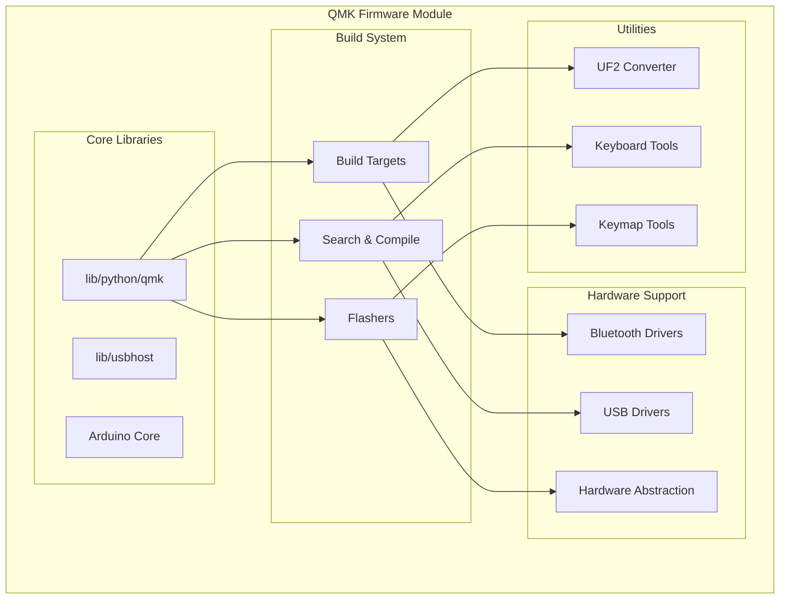
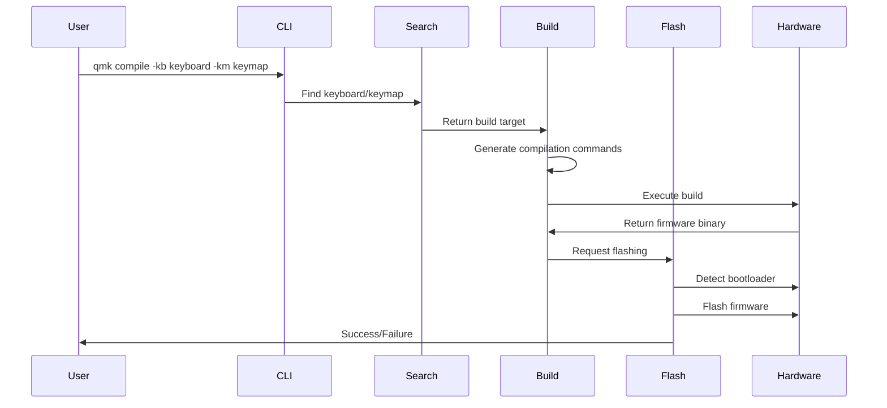

# QMK Firmware Module Documentation

## Overview

The QMK (Quantum Mechanical Keyboard) Firmware module is a comprehensive keyboard firmware ecosystem that provides tools, libraries, and utilities for building, configuring, and flashing custom keyboard firmware. This module encompasses the entire QMK firmware build system, from low-level hardware abstraction to high-level configuration tools.

## Architecture

```mermaid
graph TB
    subgraph "QMK Firmware Module"
        subgraph "Core Libraries"
            CL[lib/python/qmk]
            USB[lib/usbhost]
            ARD[Arduino Core]
        end
        
        subgraph "Build System"
            BT[Build Targets]
            SC[Search & Compile]
            FL[Flashers]
        end
        
        subgraph "Hardware Support"
            BT_DRV[Bluetooth Drivers]
            USB_DRV[USB Drivers]
            HW[Hardware Abstraction]
        end
        
        subgraph "Utilities"
            UF2[UF2 Converter]
            KB[Keyboard Tools]
            KM[Keymap Tools]
        end
    end
    
    CL --> BT
    CL --> SC
    CL --> FL
    BT --> BT_DRV
    SC --> USB_DRV
    FL --> HW
    BT --> UF2
    SC --> KB
    FL --> KM
```

## Core Functionality

### 1. Build System (`lib/python/qmk/build_targets.py`)
The build system provides a unified interface for compiling keyboard firmware:
- **BuildTarget**: Base class for all build operations
- **KeyboardKeymapBuildTarget**: Handles keyboard+keymap compilation
- **JsonKeymapBuildTarget**: Processes JSON-based keymap configurations
- Supports parallel compilation, cleaning, and compilation database generation

### 2. Search and Discovery (`lib/python/qmk/search.py`)
Advanced search capabilities for keyboards and keymaps:
- **KeyboardKeymapDesc**: Represents keyboard/keymap combinations
- **FilterFunction**: Base class for filtering search results
- **Exists/Absent/Contains/Length**: Various filter implementations
- Parallel processing for performance

### 3. Hardware Abstraction
Multiple hardware abstraction layers:
- **USB Host Library** (`lib/usbhost/`): Arduino-compatible USB host implementation
- **Bluetooth Drivers** (`drivers/bluetooth/`): Bluefruit LE support
- **Hardware Serial**: Multi-UART support for various microcontroller platforms

### 4. Graphics and Display Support
Advanced graphics capabilities for keyboards with displays:
- **QGF Format** (`lib/python/qmk/painter_qgf.py`): Quantum Graphics File format
- **QFF Format** (`lib/python/qmk/painter_qff.py`): Quantum Font File format
- Image compression, delta frames, and palette support

### 5. Flashing and Programming
Comprehensive flashing support for various bootloaders:
- **DFU**: Device Firmware Update protocol
- **Caterina**: Arduino bootloader
- **UF2**: Microsoft UF2 format
- **ISP**: In-System Programming
- **HID Bootloader**: Human Interface Device bootloader

## Key Components

### Python Libraries (`lib/python/qmk/`)

#### [keyboard.py](keyboard.md)
Keyboard discovery, validation, and layout rendering functionality. Provides the `AllKeyboards` class for handling keyboard collections, keyboard folder resolution, and visual layout rendering with support for both Unicode and ASCII art representations.

#### [flashers.py](flashers.md)
Multi-protocol firmware flashing system with bootloader detection. Implements `DelayedKeyboardInterrupt` for safe USB operations and supports multiple bootloader types including DFU, Caterina, UF2, and ISP protocols.

#### [json_encoders.py](json_encoders.md)
Specialized JSON encoders for QMK configuration files. Provides custom encoders for different QMK file types including `InfoJSONEncoder`, `KeymapJSONEncoder`, `UserspaceJSONEncoder`, and `CommunityModuleJSONEncoder` with proper formatting and sorting.

#### [path.py](path.md)
File system utilities and path normalization for cross-platform compatibility. Includes `FileType` argument parser, keyboard and keymap path resolution, and Windows-to-Unix path conversion utilities.

#### [userspace.py](userspace.md)
QMK userspace management and validation system. Provides `UserspaceDefs` class for managing build targets, validation against multiple schema versions, and automatic userspace detection across different directory structures.

#### [community_modules.py](community_modules.md)
Community module system for extending QMK functionality. Implements `ModuleAPI` for module definitions, discovery of available modules, and JSON validation for community-contributed extensions.

### Hardware Drivers

#### USB Host (`lib/usbhost/arduino-1.0.1/`)
Arduino-compatible USB host implementation providing:
- USB core functionality (`USBCore.cpp`)
- CDC (Communications Device Class) support (`CDC.cpp`)
- Hardware serial communication (`HardwareSerial.cpp`)

#### Bluetooth Support (`drivers/bluetooth/bluefruit_le.cpp`)
Adafruit Bluefruit LE module support with:
- SDEP (Simple Data Exchange Protocol) implementation
- Keyboard HID over Bluetooth
- Connection management and power control

### Utilities

#### UF2 Converter (`util/uf2conv.py`)
Universal UF2 format converter supporting:
- Hex to UF2 conversion
- Binary to UF2 conversion
- Direct flashing to UF2-compatible devices
- Multiple microcontroller families

#### Keymap Beautifier (`keyboards/ergodox_ez/util/keymap_beautifier/KeymapBeautifier.py`)
ErgoDox EZ keymap formatting tool for improved readability.

## Data Flow

```mermaid
sequenceDiagram
    participant User
    participant CLI
    participant Search
    participant Build
    participant Flash
    participant Hardware
    
    User->>CLI: qmk compile -kb keyboard -km keymap
    CLI->>Search: Find keyboard/keymap
    Search->>Build: Return build target
    Build->>Build: Generate compilation commands
    Build->>Hardware: Execute build
    Hardware->>Build: Return firmware binary
    Build->>Flash: Request flashing
    Flash->>Hardware: Detect bootloader
    Flash->>Hardware: Flash firmware
    Flash->>User: Success/Failure
```

## Configuration Files

The module supports various configuration formats:
- **info.json**: Keyboard hardware description
- **keymap.json**: Keymap configuration
- **rules.mk**: Build rules and features
- **config.h**: Hardware configuration
- **qmk.json**: Userspace configuration

## Integration Points

### With Other Modules
- **QMK CLI**: Primary interface for all operations
- **Quantum**: Core firmware framework
- **Drivers**: Hardware-specific implementations
- **Tests**: Automated testing framework

### External Dependencies
- Python 3.6+ for build tools
- GCC/Clang for compilation
- Various flashing tools (dfu-programmer, avrdude, etc.)
- PIL/Pillow for graphics processing

## Development Workflow

1. **Keyboard Definition**: Create `info.json` and hardware configuration
2. **Keymap Creation**: Define key layouts and functions
3. **Build Configuration**: Set up `rules.mk` and compile options
4. **Compilation**: Use build system to generate firmware
5. **Flashing**: Program firmware to target device
6. **Testing**: Validate functionality and iterate

## Error Handling

The module implements comprehensive error handling:
- Validation of keyboard/keymap combinations
- Bootloader detection and compatibility checking
- Build failure analysis and reporting
- Hardware communication error recovery

## Performance Considerations

- Parallel processing for multi-keyboard operations
- Caching of keyboard information and build artifacts
- Incremental builds to minimize compilation time
- Efficient memory usage for large keymap datasets

This documentation provides a comprehensive overview of the QMK Firmware module's architecture and capabilities. For detailed information on specific sub-modules, refer to the linked documentation files.