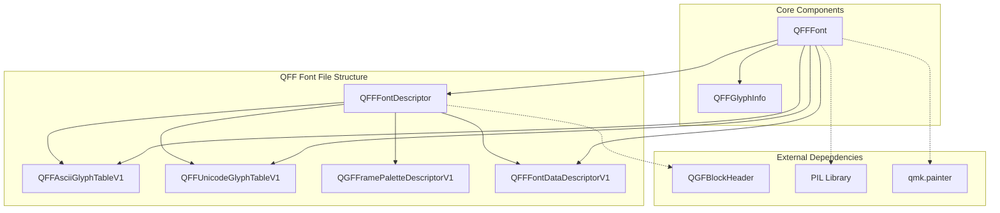
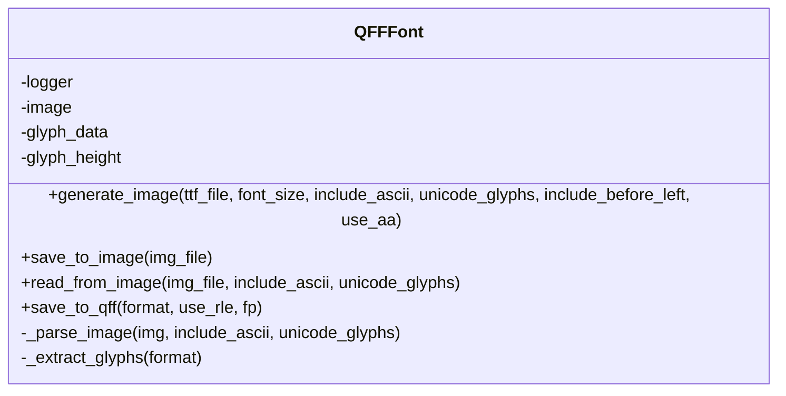
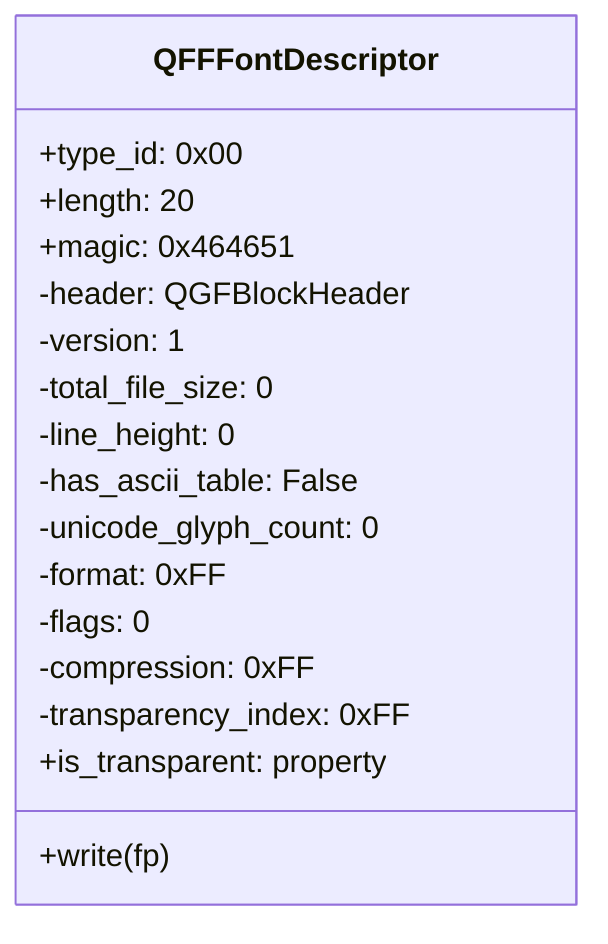
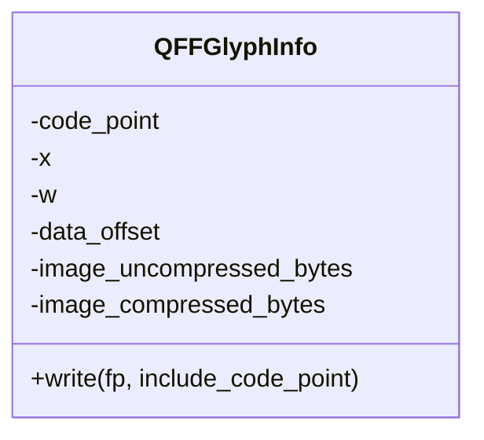
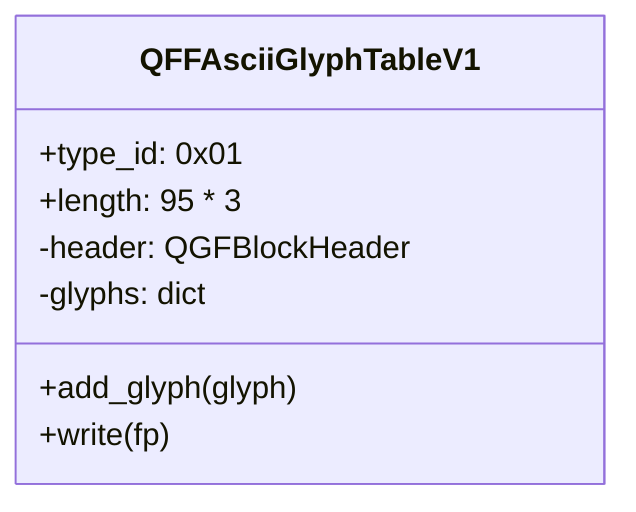
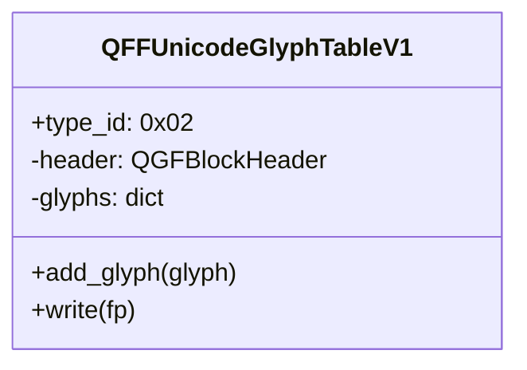
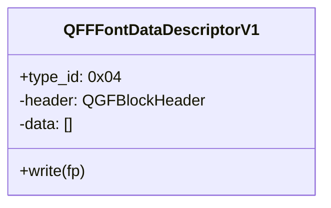
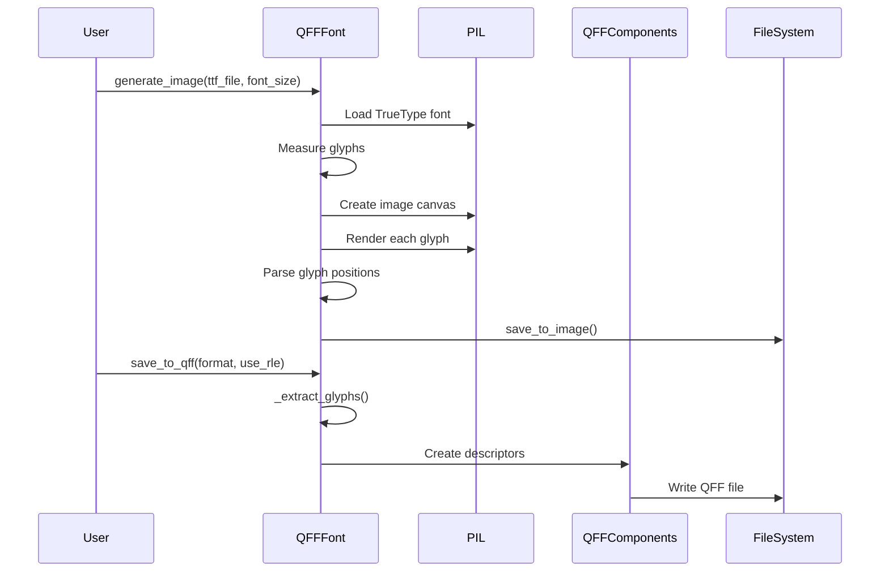
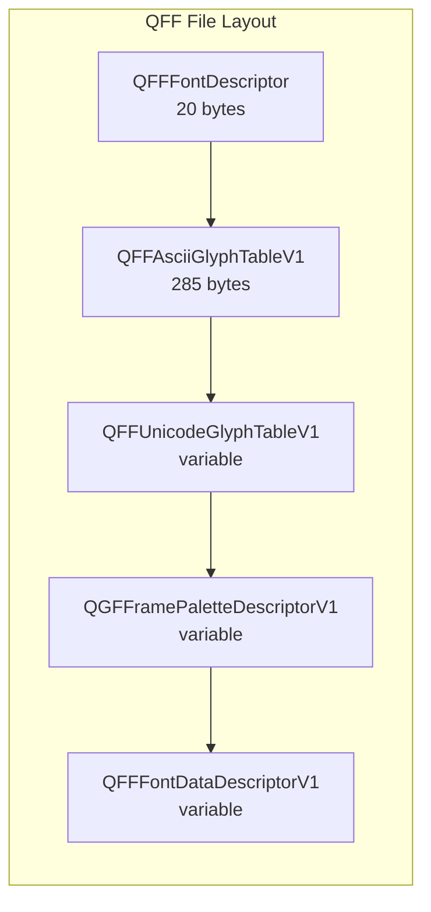
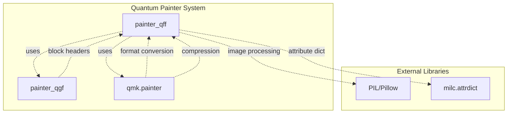

# Quantum Font File (QFF) Module Documentation

## Introduction

The `painter_qff` module implements the Quantum Font File (QFF) format for QMK Firmware's Quantum Painter system. This module provides functionality to create, parse, and manage font files specifically designed for embedded systems and mechanical keyboards. The QFF format enables efficient storage and rendering of fonts with support for both ASCII and Unicode character sets, compression, and various pixel formats.

## Architecture Overview

The QFF module is built around a structured font file format that organizes font data into discrete blocks, each serving a specific purpose in the font rendering pipeline.



## Core Components

### QFFFont - Main Font Processing Engine

The `QFFFont` class serves as the primary interface for font processing and file generation. It orchestrates the entire font creation pipeline from TrueType fonts to QFF format.



**Key Responsibilities:**
- Font image generation from TrueType fonts
- Glyph extraction and measurement
- QFF file format serialization
- Compression optimization (RLE)
- Multi-format support

### QFFFontDescriptor - Font Metadata Container

The `QFFFontDescriptor` class encapsulates essential font metadata and file header information.



**Key Attributes:**
- **Magic Number**: 0x464651 ("QFF" in ASCII)
- **Version**: Format version (currently 1)
- **Line Height**: Maximum glyph height
- **Format**: Pixel format identifier
- **Compression**: Compression method (0x01 for RLE, 0x00 for raw)
- **Transparency**: Support for transparent rendering

### Glyph Information Classes

#### QFFGlyphInfo - Individual Glyph Metadata



#### QFFAsciiGlyphTableV1 - ASCII Character Mapping

Manages the standard ASCII character set (0x20-0x7E, 95 characters) with fixed-size glyph descriptors.



#### QFFUnicodeGlyphTableV1 - Extended Unicode Support

Provides support for additional Unicode characters beyond the ASCII range.



### QFFFontDataDescriptorV1 - Image Data Storage

Encapsulates the actual glyph image data, supporting both compressed and uncompressed formats.



## Data Flow Architecture

### Font Generation Pipeline



### File Format Structure



## Integration with Quantum Painter System

The QFF module integrates with the broader Quantum Painter ecosystem through shared components and utilities.



## Key Features

### 1. Multi-Format Support
- Configurable pixel formats for different display types
- Automatic format conversion and optimization
- Palette generation for indexed color modes

### 2. Compression Optimization
- Run-Length Encoding (RLE) compression
- Automatic compression ratio evaluation
- Per-glyph compression decision making

### 3. Character Set Flexibility
- Standard ASCII character set (0x20-0x7E)
- Extended Unicode character support
- Custom glyph selection

### 4. Font Rendering Options
- Anti-aliasing control
- Baseline adjustment
- Glyph spacing configuration
- Transparency support

## Usage Patterns

### Font Generation from TrueType
```python
font = QFFFont(logger)
font.generate_image(
    ttf_file=Path("font.ttf"),
    font_size=12,
    include_ascii_glyphs=True,
    unicode_glyphs="→←↑↓",
    use_aa=True
)
font.save_to_qff(format, use_rle=True, fp)
```

### Font Processing from Image
```python
font = QFFFont(logger)
font.read_from_image(
    img_file=Path("font_image.png"),
    include_ascii_glyphs=True,
    unicode_glyphs=""
)
font.save_to_qff(format, use_rle=True, fp)
```

## File Format Specifications

### QFFFontDescriptor Format
- **Magic Number**: 3 bytes (0x464651)
- **Version**: 1 byte
- **Total File Size**: 4 bytes
- **Negated File Size**: 4 bytes (checksum)
- **Line Height**: 1 byte
- **ASCII Table Flag**: 1 byte
- **Unicode Glyph Count**: 2 bytes
- **Format**: 1 byte
- **Flags**: 1 byte
- **Compression**: 1 byte
- **Transparency Index**: 1 byte

### Glyph Data Encoding
- **ASCII Glyphs**: 3 bytes per glyph (no code point)
- **Unicode Glyphs**: 6 bytes per glyph (includes code point)
- **Data Offset**: 18 bits
- **Width**: 6 bits

## Performance Considerations

### Memory Efficiency
- Streaming file writes to minimize memory usage
- Optional RLE compression reduces file size
- Palette-based color modes for displays with limited color depth

### Processing Optimization
- Parallel glyph measurement during font generation
- Efficient image cropping and bounding box calculation
- Smart compression decision based on actual size reduction

## Error Handling

### Validation Checks
- Glyph count verification against input image markers
- File format validation through magic numbers
- Compression ratio evaluation before application

### Error Reporting
- Comprehensive logging throughout the font generation process
- Detailed error messages for common issues (missing glyphs, format mismatches)
- Validation of input parameters and file integrity

## Dependencies

### Internal Dependencies
- [painter_qgf.md](painter_qgf.md) - Block header format and palette descriptors
- [qmk.painter](qmk.painter) - Image conversion and compression utilities

### External Dependencies
- **PIL/Pillow**: Image processing and font rendering
- **pathlib**: File system operations
- **colorsys**: Color space conversions
- **milc.attrdict**: Attribute dictionary implementation

## Future Enhancements

### Potential Improvements
- Support for additional compression algorithms
- Variable-width font optimization
- Kerning table support
- Multi-language font subsetting
- Advanced anti-aliasing modes

### Format Extensions
- Version 2 format with extended features
- Additional metadata blocks
- Custom glyph shaping rules
- Color font support (COLR/CPAL tables)

## References

- [Quantum Painter QGF Format](painter_qgf.md) - Related image format documentation
- [QMK Firmware Documentation](https://docs.qmk.fm/) - Official QMK documentation
- [Quantum Painter QFF Specification](https://docs.qmk.fm/#/quantum_painter_qff) - Detailed format specification