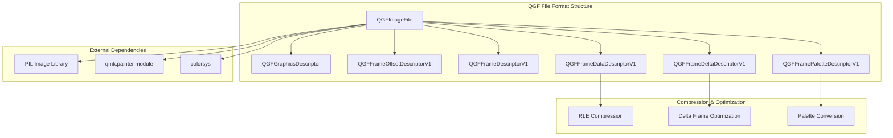
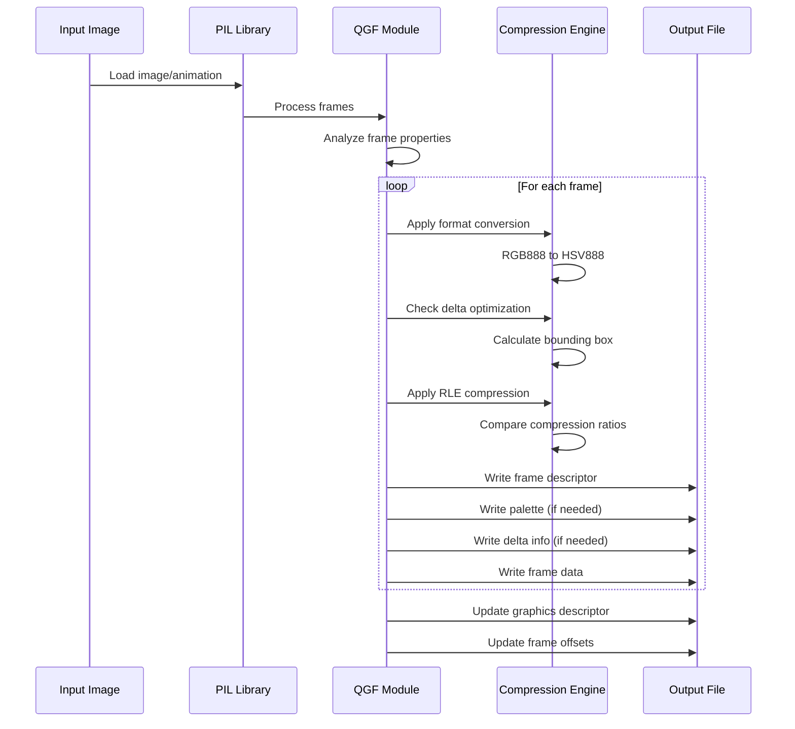
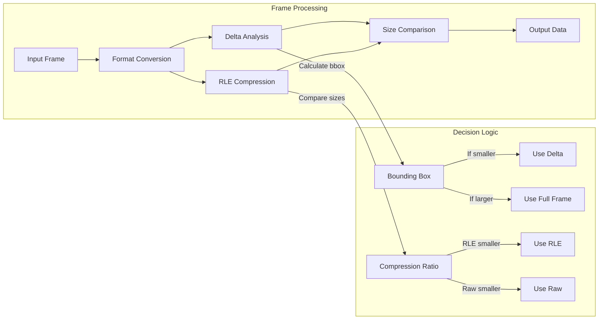
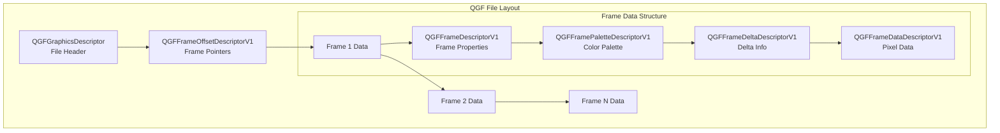

# Quantum Graphics File (QGF) Module Documentation

## Introduction

The `painter_qgf` module implements the Quantum Graphics File (QGF) format, a specialized image file format designed for embedded systems within the QMK (Quantum Mechanical Keyboard) ecosystem. This module provides functionality to convert and compress images into a format optimized for display on microcontroller-based devices, particularly mechanical keyboards with OLED or LCD displays.

The QGF format supports both static images and animations, with features like palette-based color reduction, Run-Length Encoding (RLE) compression, and delta frame optimization to minimize memory usage on resource-constrained devices.

## Architecture Overview

## Core Components

### QGFImageFile
The main image file handler that integrates with PIL (Python Imaging Library) to provide QGF format support. This class registers the QGF format with PIL's image processing pipeline.

**Key Features:**
- PIL integration for seamless image format handling
- Format registration for reading/writing QGF files
- Currently write-only (reading not implemented)

### QGFGraphicsDescriptor
The file header descriptor containing global image metadata and file structure information.

**Attributes:**
- `magic`: Magic number (0x464751) identifying QGF files
- `version`: Format version (currently 1)
- `total_file_size`: Complete file size in bytes
- `image_width/height`: Dimensions of the image/animation
- `frame_count`: Number of frames (1 for static images)

### QGFFrameDescriptorV1
Describes individual frame properties including format, compression, and display characteristics.

**Key Properties:**
- `format`: Image format identifier
- `compression`: Compression type (raw or RLE)
- `is_transparent`: Transparency support flag
- `is_delta`: Delta frame optimization flag
- `delay`: Frame display duration (for animations)

### QGFFramePaletteDescriptorV1
Manages color palette information for palette-based image formats.

**Features:**
- RGB888 to HSV888 color space conversion
- QMK-specific color format adaptation
- Palette entry management for indexed color modes

### QGFFrameDeltaDescriptorV1
Defines bounding box information for delta frame optimization.

**Purpose:**
- Stores rectangular region coordinates (left, top, right, bottom)
- Enables partial frame updates for animations
- Reduces memory usage by only storing changed regions

### QGFFrameDataDescriptorV1
Contains the actual pixel data for each frame.

**Capabilities:**
- Raw pixel data storage
- RLE-compressed data support
- Flexible data format handling

### QGFFrameOffsetDescriptorV1
Maintains file offset pointers to each frame's location within the QGF file.

**Function:**
- Random access to individual frames
- Efficient animation playback
- File navigation support

## Data Flow Architecture

## Compression and Optimization Pipeline

## File Format Structure

## Integration with QMK Ecosystem

The painter_qgf module integrates with the broader QMK ecosystem through several key interfaces:

### qmk.painter Module Integration
- **Format Conversion**: Uses `qmk.painter.convert_requested_format()` for image format adaptation
- **Byte Conversion**: Leverages `qmk.painter.convert_image_bytes()` for pixel data processing
- **RLE Compression**: Utilizes `qmk.painter.compress_bytes_qmk_rle()` for data compression

### Color Space Conversion
The module implements QMK-specific color space conversion:
- RGB888 to HSV888 conversion using standard `colorsys` library
- QMK dialect adaptation for embedded system compatibility
- Palette-based color management for memory efficiency

## Usage Patterns

### Image Conversion Workflow
1. **Input Processing**: Load source images using PIL
2. **Frame Analysis**: Extract individual frames from animations
3. **Format Selection**: Determine optimal image format based on target display
4. **Compression**: Apply RLE compression and delta optimization
5. **File Generation**: Write structured QGF file with all descriptors

### Optimization Strategies
- **Delta Frames**: Only store changed regions between consecutive frames
- **RLE Compression**: Reduce data size for images with repeated colors
- **Palette Optimization**: Minimize color depth for memory-constrained devices
- **Format Selection**: Choose optimal pixel format for target hardware

## Dependencies

### External Dependencies
- **PIL (Pillow)**: Image processing and format handling
- **colorsys**: Color space conversion utilities

### Internal Dependencies
- **qmk.painter**: Core painting and format conversion utilities
- **qmk.painter_qff**: Related font format handling (see [painter_qff.md](painter_qff.md))

## Performance Considerations

### Memory Efficiency
- Delta frame optimization reduces storage for animations
- RLE compression minimizes memory footprint
- Palette-based formats reduce color data requirements

### Processing Optimization
- Streaming file generation to handle large animations
- Compression ratio analysis for optimal format selection
- Bounding box calculation for efficient delta frame generation

## Limitations and Future Enhancements

### Current Limitations
- **Read Support**: QGF file reading is not yet implemented
- **Format Support**: Limited to specific QMK-optimized formats
- **Transparency**: Full transparency support is incomplete

### Potential Enhancements
- Implement QGF file reading capabilities
- Expand format support for additional display types
- Enhance transparency and alpha channel handling
- Add support for additional compression algorithms

## Related Documentation

For additional context on the QMK graphics system, refer to:
- [painter_qff.md](painter_qff.md) - Quantum Font Format documentation
- [painter.md](painter.md) - Core painting utilities (if available)
- [QMK Documentation](https://docs.qmk.fm/#/quantum_painter_qgf) - Official QGF format specification

## Technical Specifications

### File Format Version
- **Current Version**: 1
- **Magic Number**: 0x464751 ("QGF" in ASCII)
- **Endianness**: Little-endian

### Supported Features
- Static images and animations
- Palette-based and direct color modes
- RLE compression
- Delta frame optimization
- Multiple frame formats
- Configurable compression settings

This module provides the foundation for efficient image display on QMK-powered devices, balancing image quality with the memory and processing constraints typical of microcontroller-based keyboard systems.