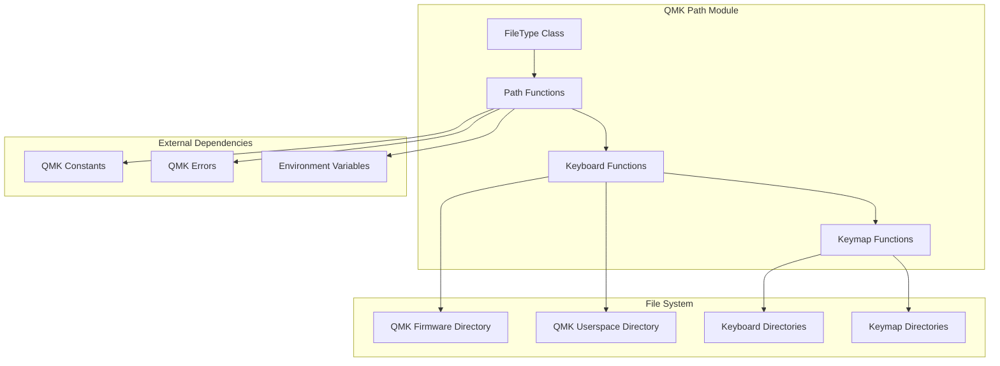
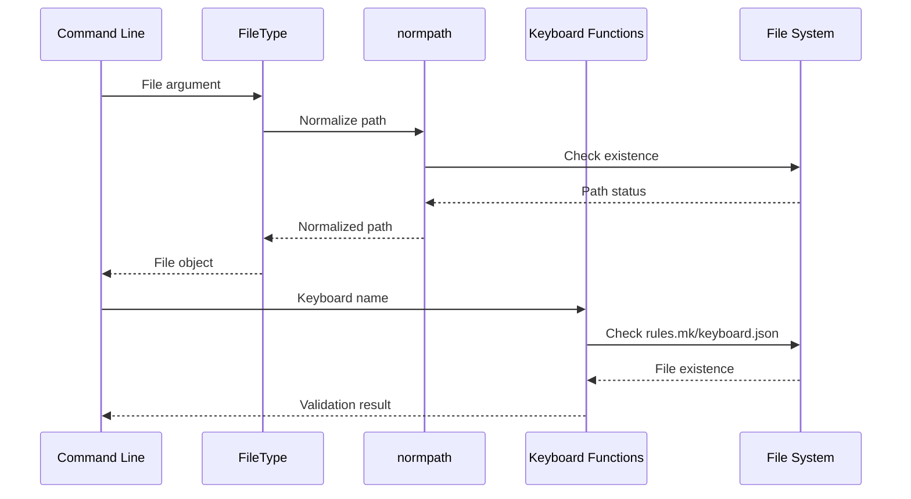
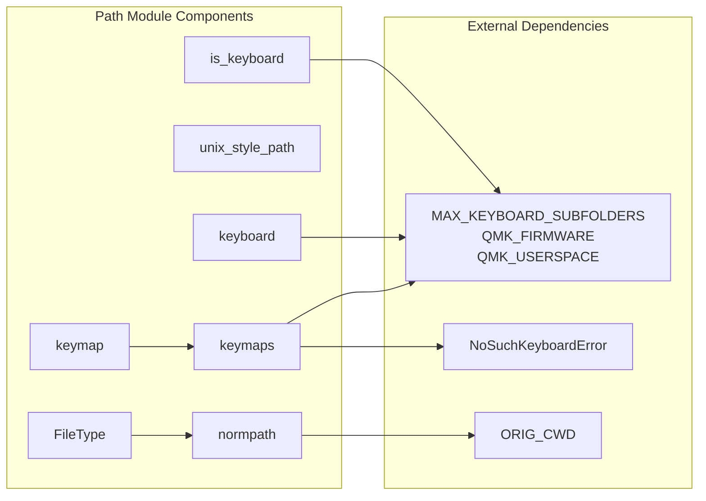
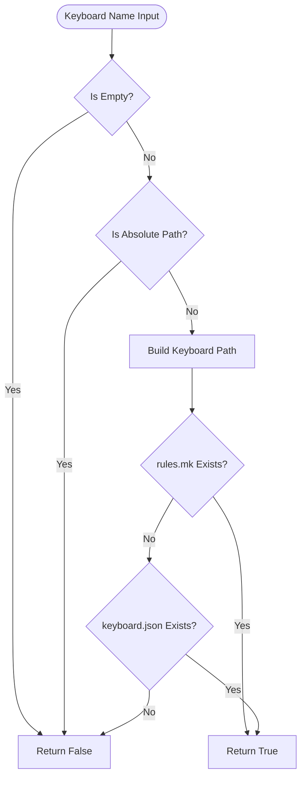
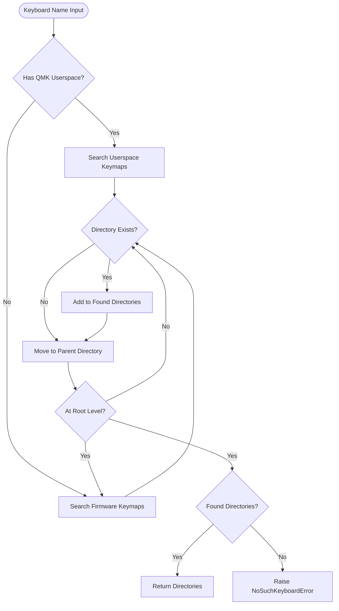

# QMK Path Module Documentation

## Introduction

The QMK Path module provides essential file system utilities and path management functions for the QMK firmware build system. It serves as a foundational component that handles path normalization, keyboard directory resolution, and file type validation across different operating systems. This module ensures consistent path handling between QMK firmware and userspace environments while providing utilities for locating keyboard configurations, keymaps, and build artifacts.

## Architecture Overview

The path module is designed as a utility layer that abstracts file system operations specific to QMK's directory structure. It provides functions for path resolution, keyboard validation, and cross-platform path compatibility.



## Core Components

### FileType Class

The `FileType` class extends `argparse.FileType` to provide UTF-8 encoding by default and path normalization for command-line arguments.

**Key Features:**
- Automatic UTF-8 encoding for file operations
- Path normalization using the `normpath` function
- Existence checking before file operations
- Support for stdin handling with '-' magic string

### Path Resolution Functions

#### Keyboard Validation
- `is_keyboard(keyboard_name)`: Validates if a keyboard name corresponds to an actual keyboard configuration
- Checks for absolute path injection attempts
- Verifies existence of `rules.mk` or `keyboard.json` files

#### Path Location Functions
- `under_qmk_firmware(path)`: Returns relative path under QMK firmware directory
- `under_qmk_userspace(path)`: Returns relative path under QMK userspace directory
- `is_under_qmk_firmware(path)`: Boolean check for QMK firmware subdirectory
- `is_under_qmk_userspace(path)`: Boolean check for QMK userspace subdirectory

#### Directory Resolution
- `keyboard(keyboard_name)`: Returns path to keyboard directory relative to QMK root
- `keymaps(keyboard_name)`: Locates all keymap directories for a keyboard
- `keymap(keyboard_name, keymap_name)`: Finds specific keymap directory

### Cross-Platform Utilities

#### Path Normalization
- `normpath(path)`: Normalizes paths relative to the script's execution directory
- Handles both absolute and relative paths
- Uses `ORIG_CWD` environment variable for consistent resolution

#### Unix Path Conversion
- `unix_style_path(path)`: Converts Windows paths to Unix format
- Handles drive letter conversion (e.g., `C:/` to `/c`)
- Essential for Makefile compatibility

## Data Flow



## Component Interactions



## Process Flows

### Keyboard Validation Process


### Keymap Directory Resolution


## Dependencies

### Internal Dependencies
- **QMK Constants**: Uses `MAX_KEYBOARD_SUBFOLDERS`, `QMK_FIRMWARE`, `QMK_USERSPACE`, and `HAS_QMK_USERSPACE` constants for path resolution
- **QMK Errors**: Raises `NoSuchKeyboardError` when keymap directories cannot be found

### External Dependencies
- **Python Standard Library**:
  - `pathlib.Path`, `PureWindowsPath`, `PurePosixPath` for path operations
  - `os` for environment variable access
  - `argparse.FileType` for file type handling
  - `logging` for error reporting

## Integration with Other Modules

The path module serves as a foundational utility that other QMK modules depend on:

- **[keyboard.md](keyboard.md)**: Uses path functions for keyboard validation and directory resolution
- **[build_targets.md](build_targets.md)**: Relies on path resolution for locating build artifacts
- **[userspace.md](userspace.md)**: Integrates with userspace path detection functions

## Usage Examples

### Basic Path Operations
```python
from qmk.path import normpath, is_keyboard, keyboard

# Normalize a command-line path
config_file = normpath('configs/my_config.json')

# Validate keyboard name
if is_keyboard('clueboard/66/rev3'):
    kb_path = keyboard('clueboard/66/rev3')
```

### Keymap Resolution
```python
from qmk.path import keymaps, keymap

# Get all keymap directories for a keyboard
all_keymaps = keymaps('clueboard/66/rev3')

# Find specific keymap
default_keymap = keymap('clueboard/66/rev3', 'default')
```

### Cross-Platform Path Handling
```python
from qmk.path import unix_style_path

# Convert Windows path for Makefile compatibility
unix_path = unix_style_path('C:/qmk_firmware/keyboards')
# Result: '/c/qmk_firmware/keyboards'
```

## Error Handling

The module implements several error handling mechanisms:

- **Path Validation**: Prevents absolute path injection in keyboard names
- **Existence Checking**: Verifies file and directory existence before operations
- **Exception Handling**: Uses try-catch blocks for path operations that may fail
- **Logging**: Provides error messages for debugging path resolution issues

## Security Considerations

- **Path Injection Prevention**: The `is_keyboard` function explicitly checks for and rejects absolute paths
- **Environment Variable Usage**: Relies on `ORIG_CWD` for consistent path resolution
- **File System Traversal**: Implements proper bounds checking when traversing directory structures

## Performance Considerations

- **Caching Potential**: Path resolution results could be cached for frequently accessed keyboards
- **File System Operations**: Minimizes file system calls by checking multiple conditions in sequence
- **String Operations**: Uses efficient path operations from pathlib rather than string manipulation

This module provides the essential foundation for reliable file system operations within the QMK ecosystem, ensuring consistent behavior across different platforms and configurations.