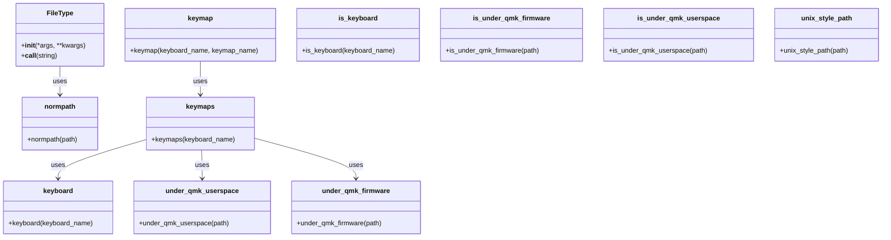
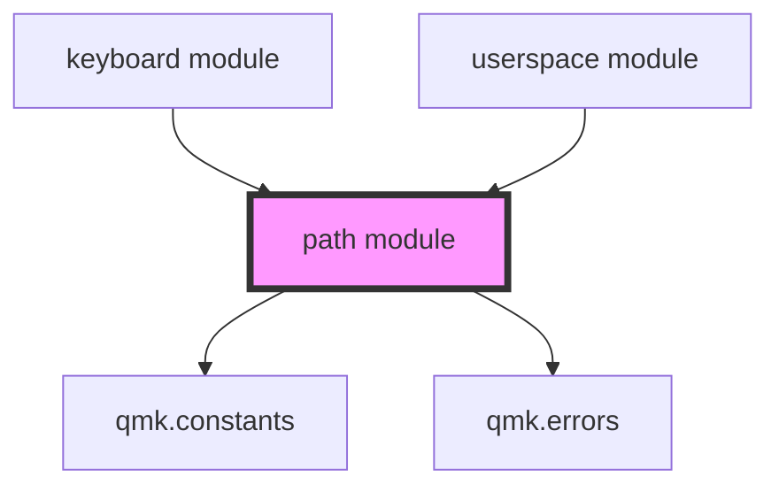
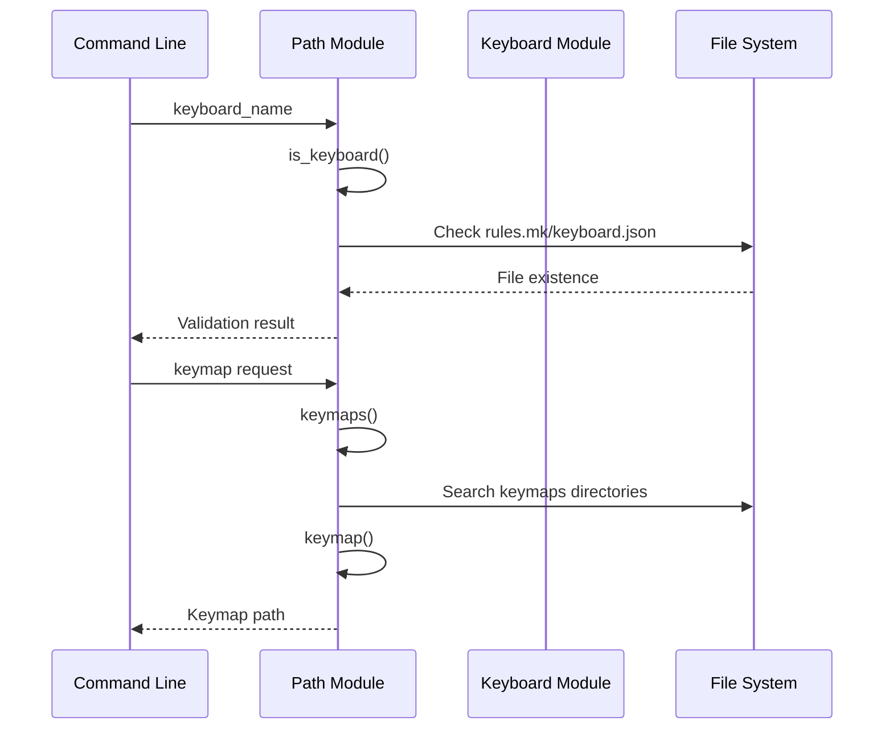
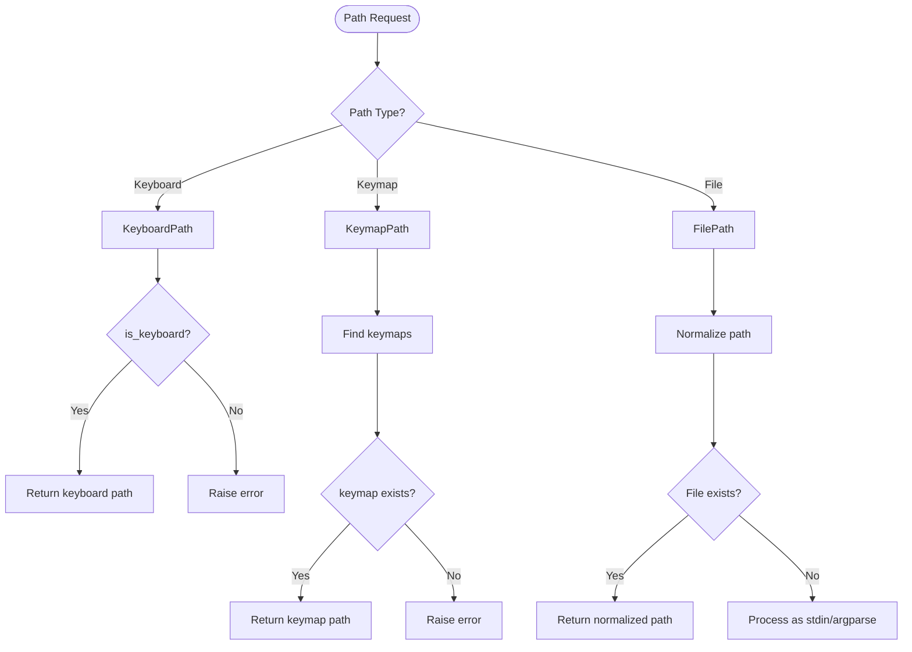

# QMK Path Module Documentation

## Introduction

The QMK Path module provides essential file system utilities and path management functions for the QMK (Quantum Mechanical Keyboard) firmware build system. This module serves as the foundation for navigating and validating file paths within the QMK firmware and userspace directories, ensuring consistent path handling across different operating systems and build environments.

## Overview

The path module is responsible for:
- Validating and resolving keyboard and keymap paths
- Managing paths within QMK firmware and userspace directories
- Providing cross-platform path normalization utilities
- Handling file type validation for command-line arguments

## Architecture

### Core Components


```mermaid
classDiagram
    class FileType {
        +__init__(*args, **kwargs)
        +__call__(string)
    }
    class keyboard {
        +keyboard(keyboard_name)
    }
    class keymap {
        +keymap(keyboard_name, keymap_name)
    }
    class normpath {
        +normpath(path)
    }
    class keymaps {
        +keymaps(keyboard_name)
    }
    class is_keyboard {
        +is_keyboard(keyboard_name)
    }
    class under_qmk_firmware {
        +under_qmk_firmware(path)
    }
    class under_qmk_userspace {
        +under_qmk_userspace(path)
    }
    class is_under_qmk_firmware {
        +is_under_qmk_firmware(path)
    }
    class is_under_qmk_userspace {
        +is_under_qmk_userspace(path)
    }
    class unix_style_path {
        +unix_style_path(path)
    }

    FileType --> normpath : uses
    keymap --> keymaps : uses
    keymaps --> keyboard : uses
    keymaps --> under_qmk_userspace : uses
    keymaps --> under_qmk_firmware : uses
```

### Module Dependencies


```mermaid
graph TD
    path[path module]
    constants[qmk.constants]
    errors[qmk.errors]
    keyboard[keyboard module]
    userspace[userspace module]
    
    path --> constants
    path --> errors
    keyboard --> path
    userspace --> path
    
    style path fill:#f9f,stroke:#333,stroke-width:4px
```

## Component Details

### FileType Class

The `FileType` class extends `argparse.FileType` to provide UTF-8 encoded file handling with path normalization. It automatically normalizes file paths and checks for file existence before processing.

**Key Features:**
- Default UTF-8 encoding for stdin
- Path normalization using `normpath()`
- File existence validation
- Seamless integration with argparse

### Path Resolution Functions

#### `keyboard(keyboard_name)`
Returns the relative path to a keyboard's directory within the QMK firmware structure.

**Usage:**
```python
keyboard_path = keyboard("clueboard/66/rev3")
# Returns: Path('keyboards/clueboard/66/rev3')
```

#### `keymap(keyboard_name, keymap_name)`
Locates the directory of a specific keymap for a given keyboard, searching through both firmware and userspace directories.

#### `keymaps(keyboard_name)`
Returns all `keymaps/` directories for a given keyboard, including both firmware and userspace locations. This function handles the hierarchical nature of keyboard definitions and searches parent directories up to the root level.

### Path Validation Functions

#### `is_keyboard(keyboard_name)`
Validates whether a given keyboard name corresponds to an actual keyboard that can be compiled. Checks for the existence of either `rules.mk` or `keyboard.json` files.

#### `under_qmk_firmware(path)` and `under_qmk_userspace(path)`
Return relative paths when the given path is within QMK firmware or userspace directories, respectively.

#### `is_under_qmk_firmware(path)` and `is_under_qmk_userspace(path)`
Boolean functions that determine if a path is contained within the respective QMK directory structures.

### Utility Functions

#### `normpath(path)`
Normalizes paths relative to the script's execution directory, handling both absolute and relative paths appropriately.

#### `unix_style_path(path)`
Converts Windows-style paths with drive letters to Unix-style paths, essential for Makefile compatibility.

## Data Flow


```mermaid
sequenceDiagram
    participant CLI as Command Line
    participant Path as Path Module
    participant Keyboard as Keyboard Module
    participant FileSystem as File System
    
    CLI->>Path: keyboard_name
    Path->>Path: is_keyboard()
    Path->>FileSystem: Check rules.mk/keyboard.json
    FileSystem-->>Path: File existence
    Path-->>CLI: Validation result
    
    CLI->>Path: keymap request
    Path->>Path: keymaps()
    Path->>FileSystem: Search keymaps directories
    Path->>Path: keymap()
    Path-->>CLI: Keymap path
```

## Integration with Other Modules

### Keyboard Module Integration
The path module provides the foundation for the [keyboard module](keyboard.md) by offering path validation and resolution functions. The keyboard module uses `is_keyboard()` to validate keyboard names and `keyboard()` to construct keyboard paths.

### Userspace Module Integration
The path module works closely with the [userspace module](userspace.md) to handle paths within the QMK userspace directory. Functions like `under_qmk_userspace()` and `is_under_qmk_userspace()` are essential for userspace validation and path resolution.

### Community Modules Integration
The [community modules](community_modules.md) may utilize path functions to locate and validate module paths within the QMK ecosystem.

## Process Flow


```mermaid
flowchart TD
    Start([Path Request])
    
    Start --> CheckType{Path Type?}
    
    CheckType -->|Keyboard| KeyboardPath
    CheckType -->|Keymap| KeymapPath
    CheckType -->|File| FilePath
    
    KeyboardPath --> ValidateKeyboard{is_keyboard?}
    ValidateKeyboard -->|Yes| ReturnKeyboard[Return keyboard path]
    ValidateKeyboard -->|No| ErrorKeyboard[Raise error]
    
    KeymapPath --> FindKeymaps[Find keymaps]
    FindKeymaps --> SearchKeymap{keymap exists?}
    SearchKeymap -->|Yes| ReturnKeymap[Return keymap path]
    SearchKeymap -->|No| ErrorKeymap[Raise error]
    
    FilePath --> Normalize[Normalize path]
    Normalize --> CheckExists{File exists?}
    CheckExists -->|Yes| ReturnFile[Return normalized path]
    CheckExists -->|No| ProcessFile[Process as stdin/argparse]
```

## Error Handling

The path module implements several error handling mechanisms:

- **NoSuchKeyboardError**: Raised when keymap directories cannot be found for a given keyboard
- **ValueError**: Caught and handled when paths are not within expected directory structures
- **FileNotFoundError**: Implicitly handled through file existence checks

## Cross-Platform Compatibility

The module provides robust cross-platform support through:
- `pathlib.Path` for modern path handling
- `unix_style_path()` for Windows-to-Unix path conversion
- Environment variable usage (`ORIG_CWD`) for consistent relative path resolution
- Support for both Windows and POSIX path formats

## Usage Examples

### Basic Path Resolution
```python
from qmk.path import keyboard, keymap

# Get keyboard path
kb_path = keyboard("planck/rev6")

# Find keymap
km_path = keymap("planck/rev6", "default")
```

### Path Validation
```python
from qmk.path import is_keyboard, is_under_qmk_firmware

# Validate keyboard
if is_keyboard("planck/rev6"):
    print("Valid keyboard")

# Check path location
if is_under_qmk_firmware(Path("keyboards/planck")):
    print("Path is within QMK firmware")
```

### File Type Handling
```python
import argparse
from qmk.path import FileType

parser = argparse.ArgumentParser()
parser.add_argument('file', type=FileType('r'))
args = parser.parse_args()
```

## Best Practices

1. **Always use path functions** for keyboard and keymap resolution instead of manual path construction
2. **Validate paths** using `is_keyboard()` before performing operations
3. **Use `normpath()`** for command-line provided paths to ensure consistency
4. **Handle both firmware and userspace** paths when working with keymaps
5. **Consider cross-platform compatibility** when working with paths in Makefiles or build scripts

## Related Documentation

- [Keyboard Module](keyboard.md) - For keyboard-specific operations and validation
- [Userspace Module](userspace.md) - For userspace path management and validation
- [Community Modules](community_modules.md) - For module path handling