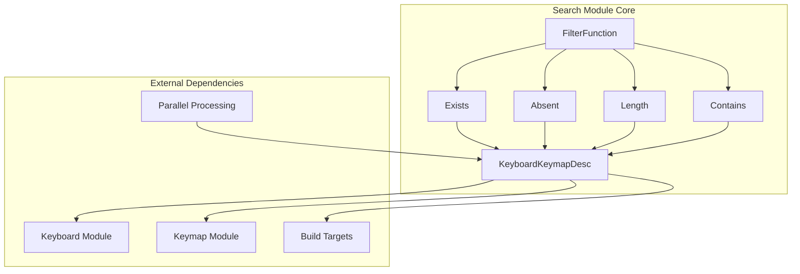
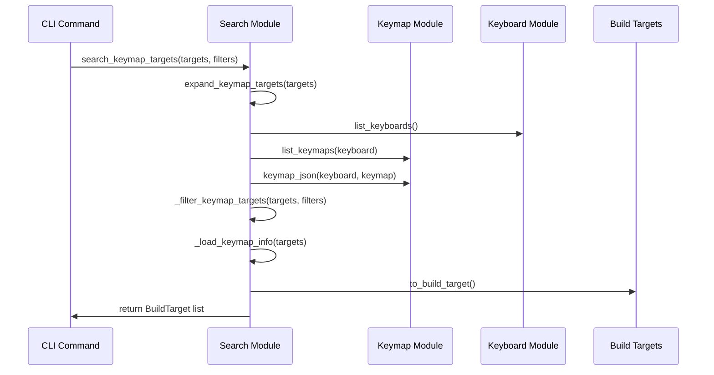
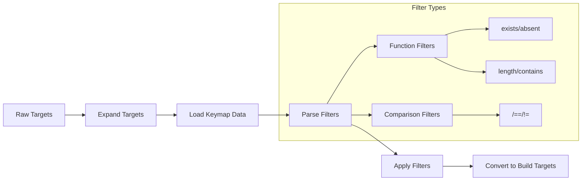

# Search Module Documentation

## Introduction

The search module provides a comprehensive search and filtering system for QMK keyboards and keymaps. It enables users to discover, filter, and select keyboard-keymap combinations based on various criteria, supporting both simple queries and complex filtering operations. The module serves as a critical component in the QMK build system, facilitating target selection for compilation and analysis tasks.

## Architecture Overview

The search module implements a sophisticated filtering system built around the `KeyboardKeymapDesc` data class, which represents keyboard-keymap combinations. The architecture follows a plugin-based approach for filters, allowing extensible filtering capabilities through a class hierarchy.



## Core Components

### KeyboardKeymapDesc

The `KeyboardKeymapDesc` class is the central data structure representing a keyboard-keymap combination. It encapsulates keyboard identification, keymap name, associated data, and extra arguments for build configuration.

**Key Features:**
- Immutable data class with hash and comparison support
- Lazy loading of keymap data through `load_data()` method
- Conversion to build targets via `to_build_target()`
- Dotty dictionary integration for nested data access

**Dependencies:**
- [keyboard.md](keyboard.md) - for keyboard listing and folder resolution
- [keymap.md](keymap.md) - for keymap listing and location services
- [build_targets.md](build_targets.md) - for build target creation

### FilterFunction Hierarchy

The module implements a plugin-based filtering system with a base `FilterFunction` class and specialized implementations:

#### Base FilterFunction
Abstract base class providing:
- Key and value capture through `__init__`
- Function name specification for CLI integration
- Abstract `apply` method for filter logic

#### Concrete Filter Implementations

**Exists Filter**
- Checks for the presence of a key in keymap data
- Usage: `exists(key)`

**Absent Filter**
- Verifies the absence of a key in keymap data
- Usage: `absent(key)`

**Length Filter**
- Validates array/string length against specified value
- Usage: `length(key, value)`

**Contains Filter**
- Checks if a value exists within a key's content
- Usage: `contains(key, value)`

## Data Flow Architecture



## Search and Filtering Process

### Target Expansion Process

The module supports flexible target specification through the expansion mechanism:

1. **Single Target**: `keyboard:keymap` → specific keyboard-keymap combination
2. **All Keyboards**: `all:keymap` → all keyboards with specified keymap
3. **All Keymaps**: `keyboard:all` → all keymaps for specified keyboard
4. **All Combinations**: `all:all` → every keyboard-keymap combination

### Filtering Pipeline



### Filter Expression Parsing

The module supports two types of filter expressions:

**Function Filters**
- Syntax: `function(key, value)`
- Examples: `exists(features.rgb_matrix)`, `contains(layouts.LAYOUT, "60")`

**Comparison Filters**
- Syntax: `key operator value`
- Examples: `features.rgb_matrix == true`, `matrix_size > 60`

## Integration Points

### Keyboard Module Integration
- Utilizes `list_keyboards()` for keyboard enumeration
- Employs `keyboard_folder()` for keyboard path resolution
- References [keyboard.md](keyboard.md) for detailed keyboard operations

### Keymap Module Integration
- Leverages `list_keymaps()` for keymap discovery
- Uses `locate_keymap()` for keymap validation
- Employs `keymap_json()` for keymap data loading
- References [keymap.md](keymap.md) for keymap-specific functionality

### Build Targets Integration
- Converts search results to `KeyboardKeymapBuildTarget` objects
- Supports extra arguments for build configuration
- References [build_targets.md](build_targets.md) for build target details

## Performance Optimization

### Parallel Processing
The module extensively uses `parallel_map` for:
- Keyboard-keymap combination expansion
- Keymap data loading
- Filter application
- Build target conversion

### Logging Optimization
Implements `ignore_logging()` context manager to suppress logging during bulk operations, improving performance for large-scale searches.

## Error Handling

### Target Validation
- Validates target format (keyboard:keymap syntax)
- Handles invalid keyboard/keymap combinations gracefully
- Provides informative error messages for malformed targets

### Filter Validation
- Validates filter expression syntax
- Warns about unrecognized filter expressions
- Continues processing with valid filters when invalid ones are encountered

## Usage Examples

### Basic Search
```python
# Find all default keymaps
targets = search_keymap_targets([('all', 'default')])

# Find specific keyboard-keymap
targets = search_keymap_targets([('planck', 'default')])
```

### Filtered Search
```python
# Find keyboards with RGB matrix support
targets = search_keymap_targets([('all', 'default')], ['exists(features.rgb_matrix)'])

# Find 60% keyboards
targets = search_keymap_targets([('all', 'default')], ['contains(layouts.LAYOUT, "60")'])
```

### Complex Filtering
```python
# Multiple filters
targets = search_keymap_targets(
    [('all', 'default')], 
    ['exists(features.rgb_matrix)', 'matrix_size > 60']
)
```

## Extension Points

### Custom Filters
New filter types can be added by:
1. Subclassing `FilterFunction`
2. Implementing `func_name` and `apply` method
3. Registering through the class hierarchy

### Data Integration
The module can be extended to support:
- Additional keymap data sources
- Custom target types
- Specialized filtering criteria

## Related Documentation

- [keyboard.md](keyboard.md) - Keyboard enumeration and management
- [keymap.md](keymap.md) - Keymap operations and data access
- [build_targets.md](build_targets.md) - Build target system integration
- [painter_qgf.md](painter_qgf.md) - Graphics file format (if related to visual keymaps)
- [painter_qff.md](painter_qff.md) - Font file format (if related to keymap display)