# UF2 Converter Module Documentation

## Introduction

The `uf2conv` module is a utility for converting firmware files between different formats and flashing them to microcontrollers. It provides functionality to convert between UF2 (USB Flashing Format), Intel HEX, and binary formats, as well as direct flashing capabilities to UF2-compatible devices.

UF2 is a file format designed by Microsoft that allows microcontrollers to be programmed by simply copying files to a virtual USB drive. This module serves as a critical tool in the QMK firmware build and deployment pipeline, enabling developers to convert compiled firmware into formats suitable for different flashing methods.

## Architecture Overview

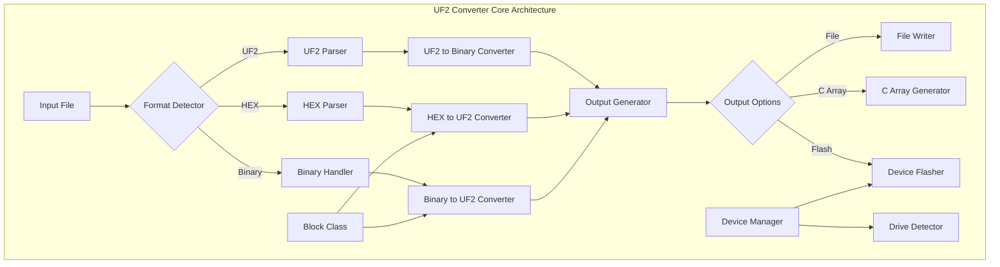

## Core Components

### Block Class

The `Block` class is the fundamental data structure for handling UF2 blocks:

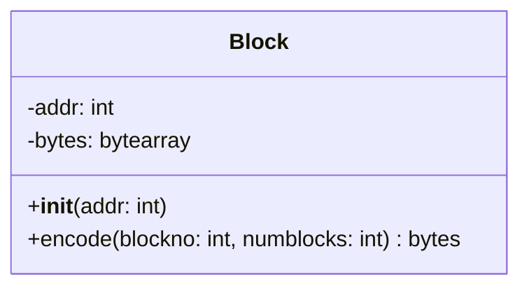

**Purpose**: Represents a single 256-byte data block in the UF2 format
**Key Features**:
- Manages memory address and data payload
- Handles UF2 block encoding with proper headers and footers
- Supports family ID and device type extensions

### Format Detection and Conversion Pipeline

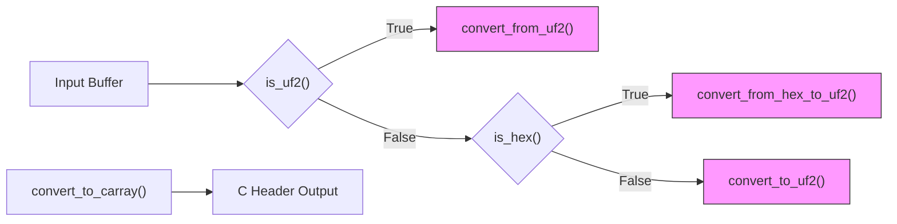

## Data Flow Architecture

### UF2 Format Structure

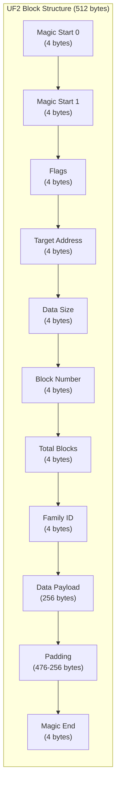

### Conversion Process Flow

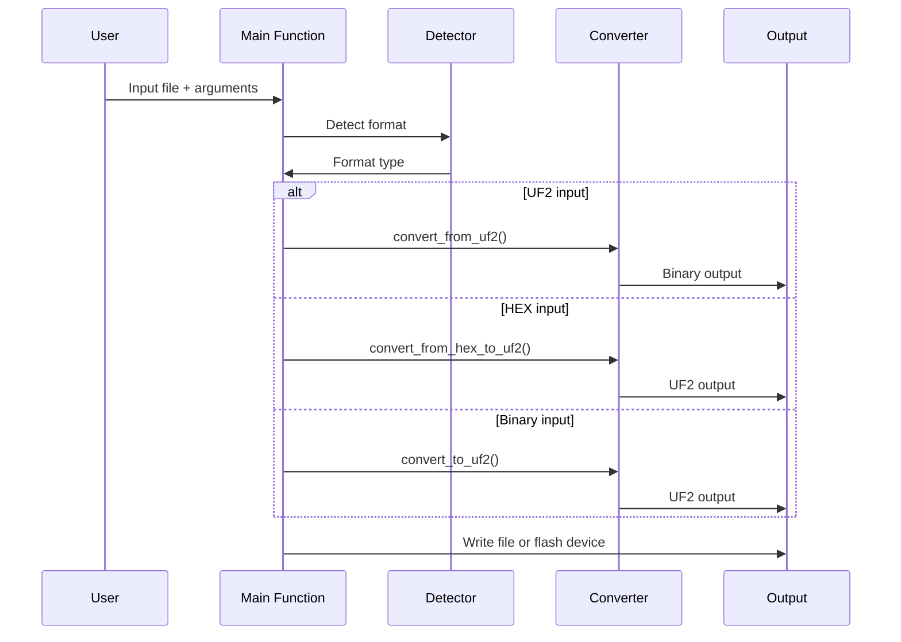

## Device Management and Flashing

### Drive Detection System

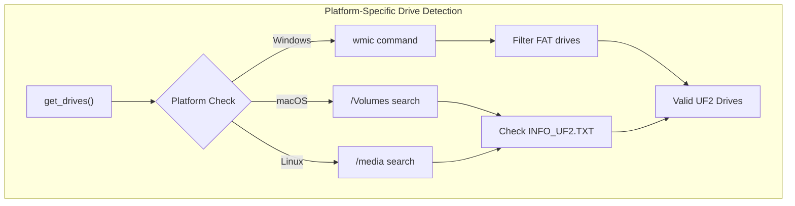

### Flashing Process

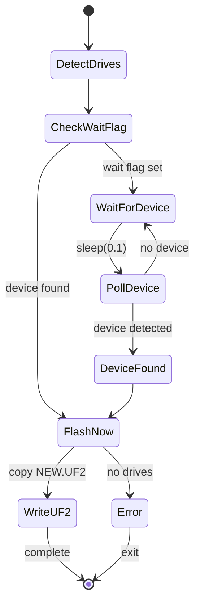

## Key Functions and Algorithms

### UF2 Validation Algorithm

```python
def is_uf2(buf):
    w = struct.unpack("<II", buf[0:8])
    return w[0] == UF2_MAGIC_START0 and w[1] == UF2_MAGIC_START1
```

**Purpose**: Validates UF2 file format by checking magic numbers
**Input**: Byte buffer
**Output**: Boolean validation result

### Intel HEX to UF2 Conversion

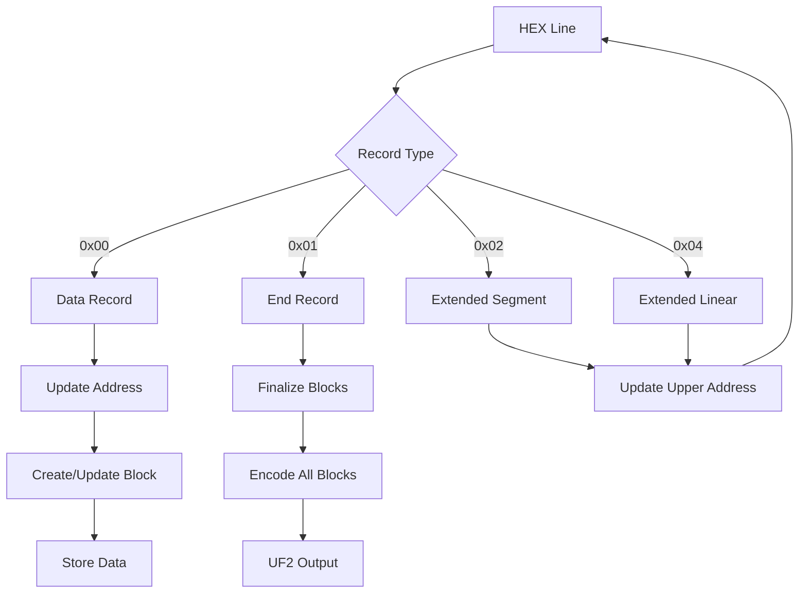

## Configuration and Families

### Family ID System

The module supports a family ID system for targeting specific microcontroller families:

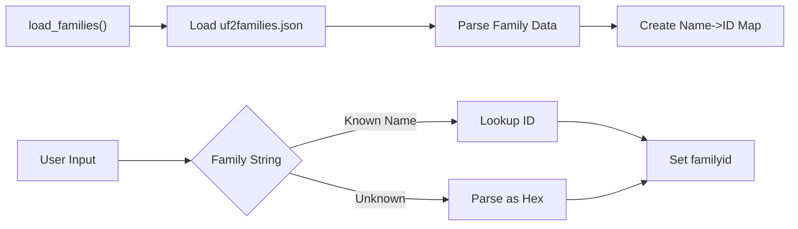

## Command Line Interface

### Argument Processing

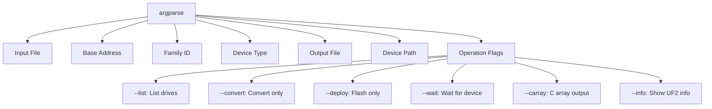

## Integration with QMK Build System

The uf2conv module integrates with the broader QMK ecosystem:

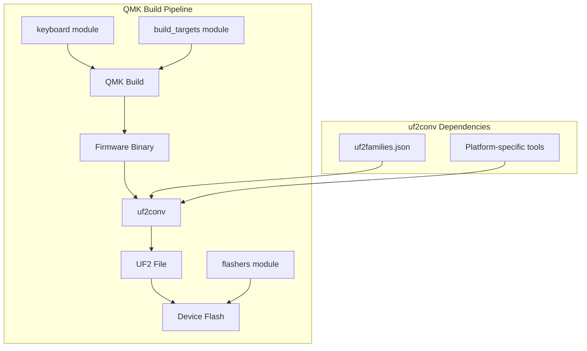

## Error Handling and Validation

### Input Validation

- **Format Detection**: Validates file formats before processing
- **Address Bounds**: Ensures memory addresses are within valid ranges
- **Block Consistency**: Verifies UF2 block sequence and integrity
- **Platform Compatibility**: Handles platform-specific drive detection

### Error Recovery

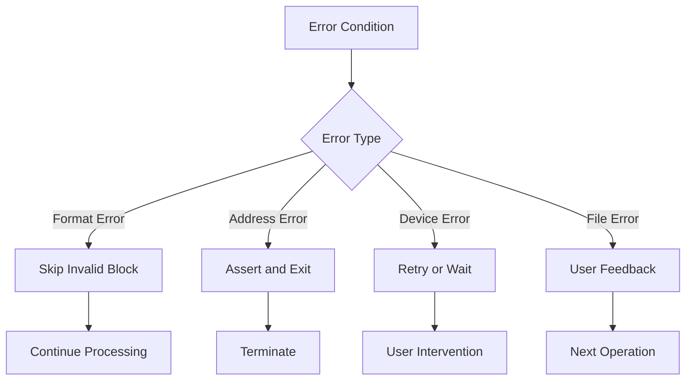

## Performance Considerations

### Memory Management

- **Streaming Processing**: Processes files in 512-byte blocks
- **Buffer Reuse**: Reuses Block objects during conversion
- **Lazy Loading**: Loads family data only when needed

### Platform Optimizations

- **Windows**: Uses WMIC for efficient drive enumeration
- **Unix**: Leverages standard mount points for drive detection
- **Cross-platform**: Consistent interface across operating systems

## Security Considerations

### Input Sanitization

- **Buffer Bounds**: Validates all buffer accesses
- **Path Traversal**: Sanitizes file paths before operations
- **Command Injection**: Uses safe subprocess calls

### Device Access

- **Permission Checks**: Verifies write permissions before flashing
- **Drive Validation**: Confirms UF2 compatibility before operations
- **User Confirmation**: Provides clear feedback before destructive operations

## Usage Examples

### Basic Conversion

```bash
# Convert binary to UF2
python uf2conv.py firmware.bin -o firmware.uf2

# Convert HEX to UF2
python uf2conv.py firmware.hex -o firmware.uf2

# Convert UF2 to binary
python uf2conv.py firmware.uf2 -o firmware.bin
```

### Advanced Usage

```bash
# Flash with specific family ID
python uf2conv.py firmware.bin -f SAMD21 -d /media/UF2BOOT

# Generate C array
python uf2conv.py firmware.bin -c -o firmware.h

# List available devices
python uf2conv.py -l
```

## Module Dependencies

The uf2conv module operates independently but integrates with:

- **[flashers module](flashers.md)**: Provides delayed interrupt handling for flashing operations
- **[build_targets module](build_targets.md)**: Supplies target information for firmware builds
- **[keyboard module](keyboard.md)**: Manages keyboard-specific configurations

## References

- [UF2 File Format Specification](https://github.com/microsoft/uf2)
- [QMK Firmware Documentation](https://docs.qmk.fm/)
- [Microsoft UF2 Implementation](https://github.com/microsoft/uf2-samdx1)