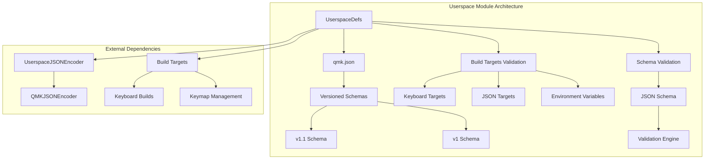
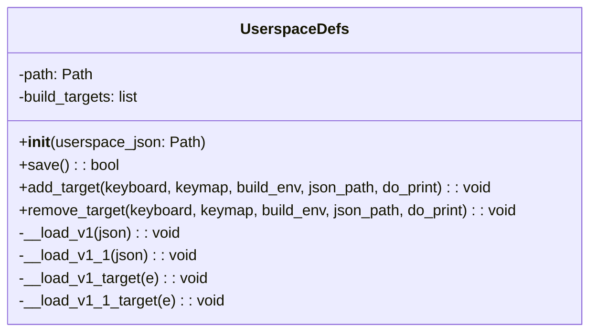
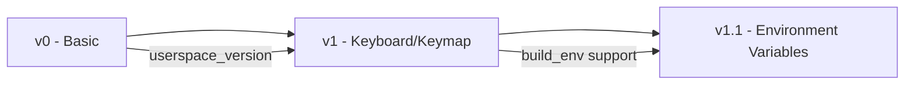
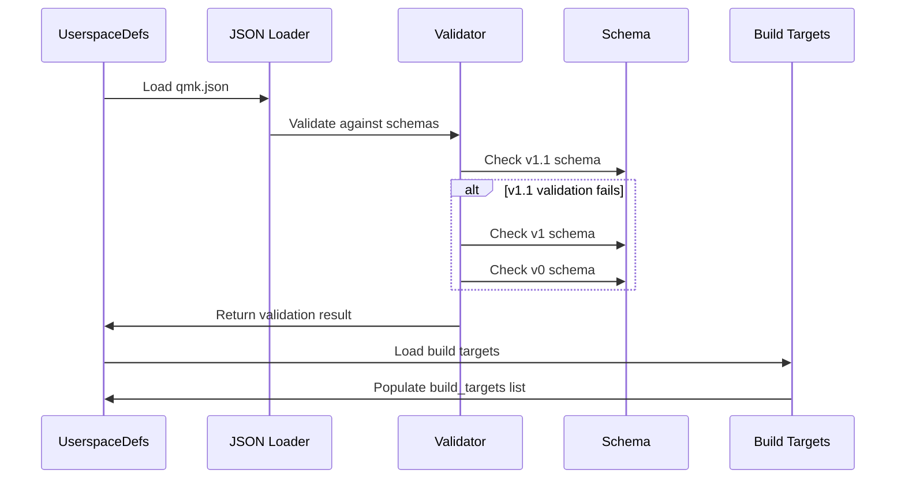
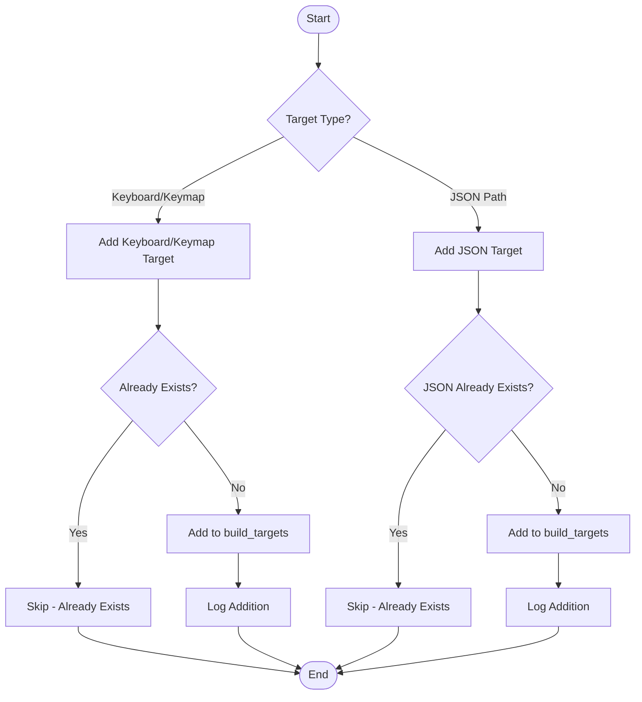
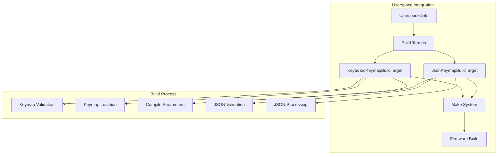
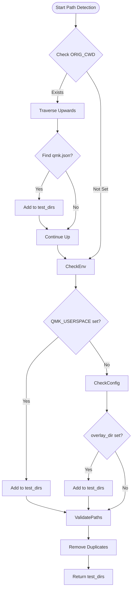

# Userspace Module Documentation

## Introduction

The userspace module is a core component of the QMK (Quantum Mechanical Keyboard) ecosystem that manages user-specific keyboard configurations, build targets, and custom keymaps outside of the main QMK firmware repository. It provides a structured way for users to maintain their personal keyboard configurations, layouts, and build preferences in a separate directory while still leveraging the QMK build system.

This module enables users to create personalized keyboard firmware configurations without modifying the core QMK firmware repository, promoting better organization and easier maintenance of custom keyboard setups.

## Architecture Overview

The userspace module follows a schema-driven architecture with versioned configuration support and comprehensive validation mechanisms. It acts as a bridge between user configurations and the QMK build system.



## Core Components

### UserspaceDefs Class

The `UserspaceDefs` class is the central component that manages userspace configurations. It handles loading, validation, and manipulation of user-specific build targets and settings.



#### Key Features:
- **Schema Validation**: Validates configurations against versioned JSON schemas
- **Build Target Management**: Supports both keyboard/keymap pairs and JSON file references
- **Environment Variable Support**: Handles build environment configurations
- **Version Migration**: Supports multiple schema versions with backward compatibility

### UserspaceValidationError Class

A custom exception class that aggregates multiple validation errors, providing comprehensive feedback when configuration validation fails.

## Configuration Schema

The userspace module supports versioned configuration schemas, with the current latest version being 1.1.

### Schema Evolution



### Configuration Structure

#### Version 1.1 (Current)
```json
{
    "userspace_version": "1.1",
    "build_targets": [
        ["keyboard_name", "keymap_name", {"ENV_VAR": "value"}],
        "path/to/keymap.json"
    ]
}
```

#### Version 1.0
```json
{
    "userspace_version": "1",
    "build_targets": [
        ["keyboard_name", "keymap_name"],
        "path/to/keymap.json"
    ]
}
```

## Data Flow

### Configuration Loading Process



### Build Target Management



## Integration with Build System

The userspace module integrates with the QMK build system through the `BuildTarget` classes, enabling compilation of user-specific keymaps and configurations.



## Path Detection and Discovery

The module implements a sophisticated path detection mechanism to locate userspace directories:

1. **Current Working Directory**: Checks if the current directory contains a `qmk.json` file and keyboard/layouts directories
2. **Environment Variable**: Uses `QMK_USERSPACE` environment variable if set
3. **Configuration**: Uses `cli.config.user.overlay_dir` if configured
4. **Parent Directory Traversal**: Walks up the directory tree looking for valid userspace configurations



## Error Handling and Validation

The module implements comprehensive error handling with detailed validation feedback:

- **Schema Validation**: Multiple schema version attempts with detailed error reporting
- **File System Validation**: Checks for file existence and accessibility
- **Build Target Validation**: Ensures build targets are valid and accessible
- **JSON Schema Validation**: Leverages jsonschema for robust validation

## Dependencies

The userspace module has several key dependencies:

- **[json_encoders](json_encoders.md)**: Custom JSON encoding for userspace configurations
- **[build_targets](build_targets.md)**: Build target management and compilation
- **milc**: Command-line interface framework
- **jsonschema**: JSON schema validation
- **pathlib**: File system path manipulation

## Usage Examples

### Creating a Userspace Configuration

```python
from pathlib import Path
from qmk.userspace import UserspaceDefs

# Create a new userspace configuration
userspace = UserspaceDefs(Path('/path/to/qmk.json'))

# Add keyboard/keymap targets
userspace.add_target(keyboard='planck/rev6', keymap='my_custom_keymap')
userspace.add_target(keyboard='ergodox_ez', keymap='my_ergodox_keymap', build_env={'RGBLIGHT_ENABLE': 'yes'})

# Add JSON keymap files
userspace.add_target(json_path=Path('keymaps/my_keymap.json'))

# Save the configuration
userspace.save()
```

### Detecting Userspace

```python
from qmk.userspace import detect_qmk_userspace

# Automatically detect userspace directory
userspace_path = detect_qmk_userspace()
if userspace_path:
    print(f"Found userspace at: {userspace_path}")
else:
    print("No valid userspace found")
```

## Best Practices

1. **Version Management**: Always use the latest schema version for new configurations
2. **Path Management**: Use relative paths for JSON keymap files within the userspace directory
3. **Environment Variables**: Use build environment variables sparingly and document their purpose
4. **Validation**: Always validate configurations before saving to prevent corruption
5. **Backup**: Maintain backups of your `qmk.json` file as it contains all your build targets

## Troubleshooting

### Common Issues

1. **Validation Errors**: Check the schema version and ensure all required fields are present
2. **Path Resolution**: Verify that the userspace directory contains a valid `qmk.json` file
3. **Build Target Issues**: Ensure keyboard names and keymap names are valid and exist
4. **Environment Variables**: Check that build environment variables are properly formatted

### Debug Information

The module provides detailed logging through the milc CLI framework. Enable verbose mode to see detailed information about:
- Path detection process
- Schema validation attempts
- Build target addition/removal
- Configuration saving process

## Future Enhancements

The userspace module is designed to be extensible, with potential future enhancements including:

- Additional schema versions with new features
- Integration with external keymap editors
- Support for additional build target types
- Enhanced validation and error reporting
- Migration tools for schema upgrades