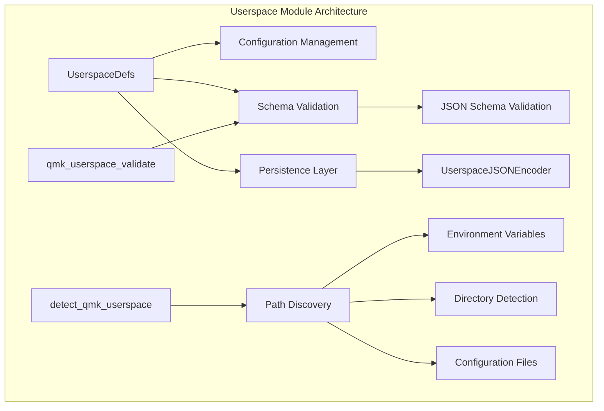
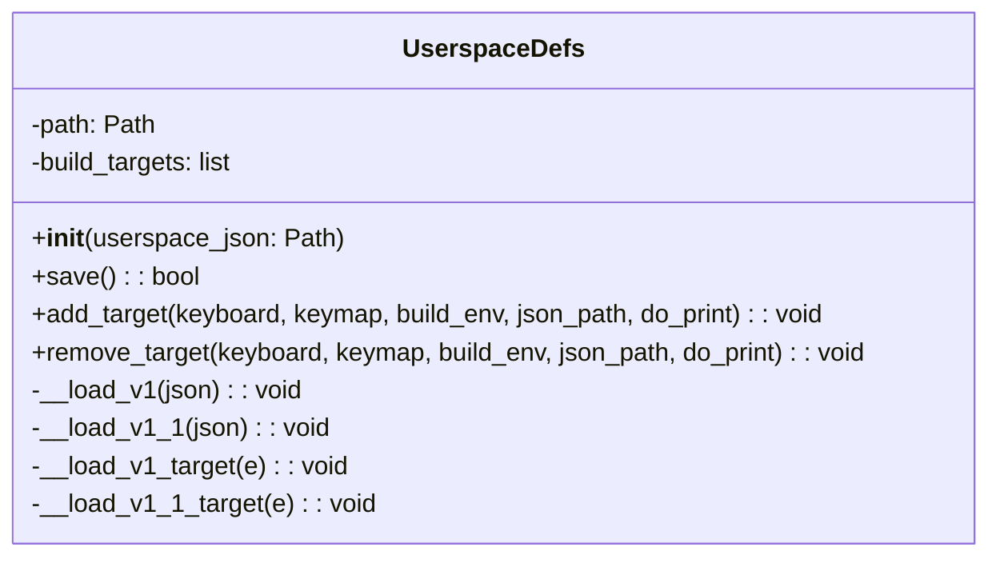
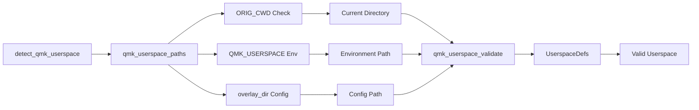
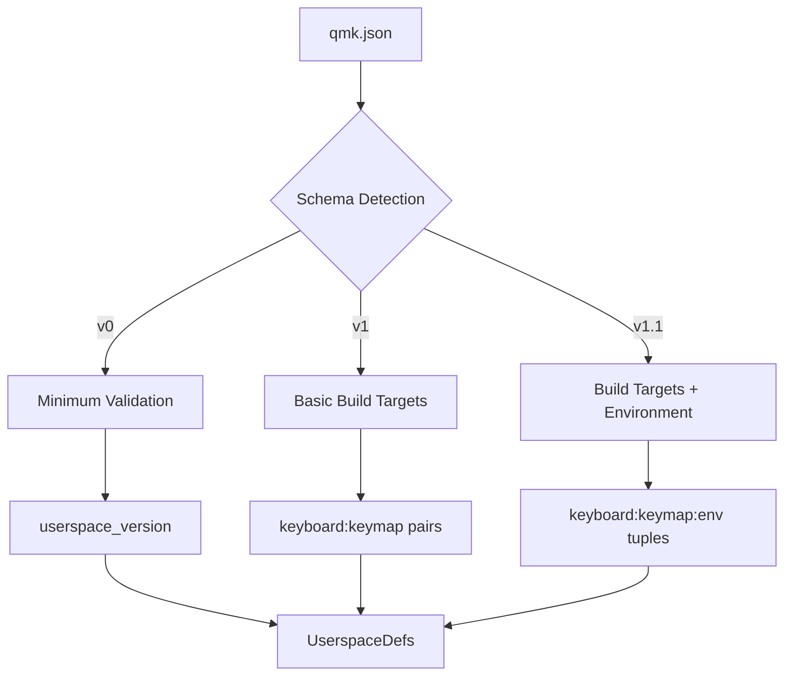
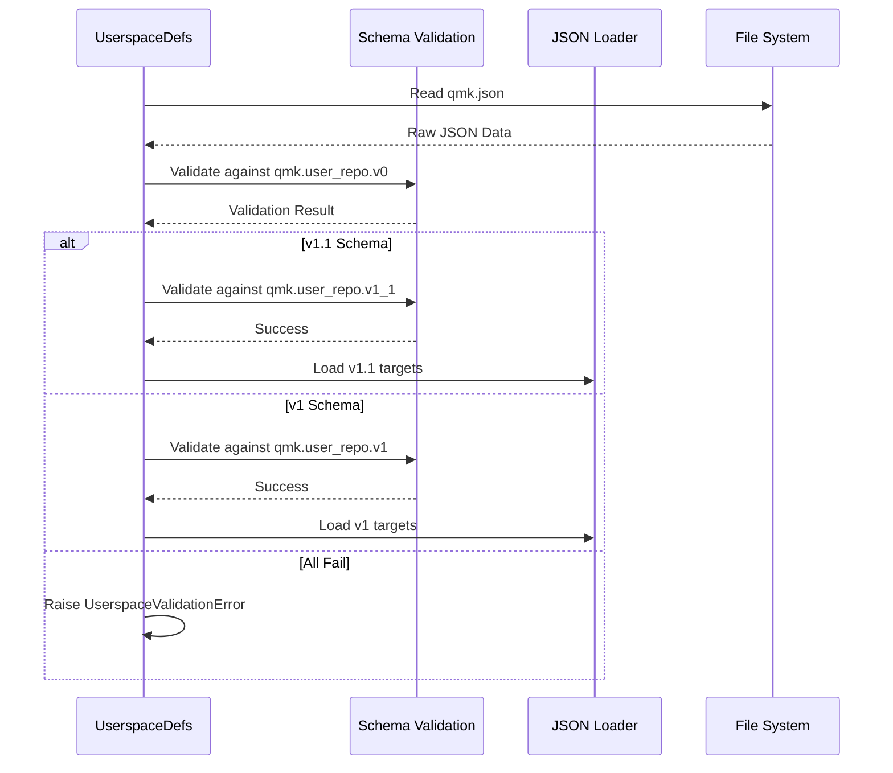
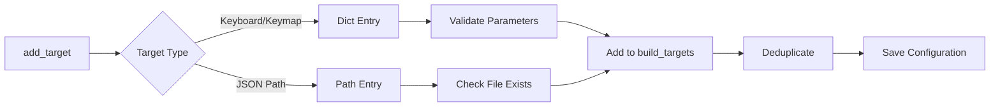
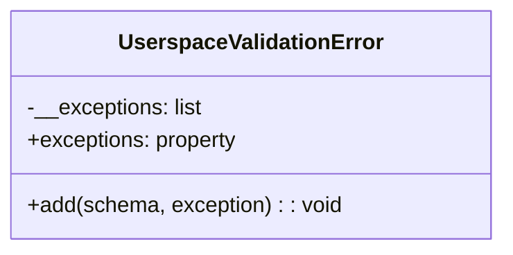
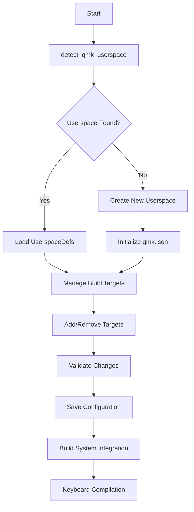

# Userspace Module Documentation

## Introduction

The userspace module is a core component of the QMK (Quantum Mechanical Keyboard) ecosystem that manages user-specific keyboard configurations, build targets, and personalization settings. It provides a standardized way for users to define their custom keyboard layouts, keymaps, and build environments outside of the main QMK firmware repository.

This module enables users to maintain their own keyboard configurations in a separate directory structure while still leveraging the full QMK build system and tooling. It acts as a bridge between the core QMK firmware and user-specific customizations, ensuring that personal configurations can be easily managed, validated, and built.

## Architecture Overview

The userspace module follows a layered architecture design that separates configuration management, validation, and persistence concerns:


```mermaid
graph TB
    subgraph "Userspace Module Architecture"
        A[UserspaceDefs] --> B[Configuration Management]
        A --> C[Schema Validation]
        A --> D[Persistence Layer]
        
        E[qmk_userspace_validate] --> C
        F[detect_qmk_userspace] --> G[Path Discovery]
        
        C --> H[JSON Schema Validation]
        D --> I[UserspaceJSONEncoder]
        
        G --> J[Environment Variables]
        G --> K[Directory Detection]
        G --> L[Configuration Files]
    end
```

## Core Components

### UserspaceDefs Class

The `UserspaceDefs` class is the central component that manages userspace configurations. It handles:

- **Configuration Loading**: Parses and validates `qmk.json` files against multiple schema versions
- **Build Target Management**: Maintains a list of keyboard/keymap combinations and JSON build targets
- **Schema Validation**: Ensures configuration files conform to QMK standards
- **Persistence**: Saves changes back to the configuration file with proper formatting


```mermaid
classDiagram
    class UserspaceDefs {
        -path: Path
        -build_targets: list
        +__init__(userspace_json: Path)
        +save(): bool
        +add_target(keyboard, keymap, build_env, json_path, do_print): void
        +remove_target(keyboard, keymap, build_env, json_path, do_print): void
        -__load_v1(json): void
        -__load_v1_1(json): void
        -__load_v1_target(e): void
        -__load_v1_1_target(e): void
    }
```

### Configuration Discovery

The module provides intelligent path discovery through several mechanisms:


```mermaid
graph LR
    A[detect_qmk_userspace] --> B[qmk_userspace_paths]
    B --> C[ORIG_CWD Check]
    B --> D[QMK_USERSPACE Env]
    B --> E[overlay_dir Config]
    
    C --> F[Current Directory]
    D --> G[Environment Path]
    E --> H[Config Path]
    
    F --> I[qmk_userspace_validate]
    G --> I
    H --> I
    
    I --> J[UserspaceDefs]
    J --> K[Valid Userspace]
```

### Schema Version Support

The module supports multiple versions of the userspace schema, ensuring backward compatibility:


```mermaid
graph TD
    A[qmk.json] --> B{Schema Detection}
    B -->|v0| C[Minimum Validation]
    B -->|v1| D[Basic Build Targets]
    B -->|v1.1| E[Build Targets + Environment]
    
    C --> F[userspace_version]
    D --> G[keyboard:keymap pairs]
    E --> H[keyboard:keymap:env tuples]
    
    F --> I[UserspaceDefs]
    G --> I
    H --> I
```

## Data Flow

### Configuration Loading Process


```mermaid
sequenceDiagram
    participant U as UserspaceDefs
    participant V as Schema Validation
    participant J as JSON Loader
    participant F as File System
    
    U->>F: Read qmk.json
    F-->>U: Raw JSON Data
    U->>V: Validate against qmk.user_repo.v0
    V-->>U: Validation Result
    
    alt v1.1 Schema
        U->>V: Validate against qmk.user_repo.v1_1
        V-->>U: Success
        U->>J: Load v1.1 targets
    else v1 Schema
        U->>V: Validate against qmk.user_repo.v1
        V-->>U: Success
        U->>J: Load v1 targets
    else All Fail
        U->>U: Raise UserspaceValidationError
    end
```

### Build Target Management


```mermaid
graph LR
    A[add_target] --> B{Target Type}
    B -->|Keyboard/Keymap| C[Dict Entry]
    B -->|JSON Path| D[Path Entry]
    
    C --> E[Validate Parameters]
    D --> F[Check File Exists]
    
    E --> G[Add to build_targets]
    F --> G
    
    G --> H[Deduplicate]
    H --> I[Save Configuration]
```

## Integration with Other Modules

### JSON Encoders Integration

The userspace module leverages the [json_encoders](json_encoders.md) module for proper JSON serialization:

- **UserspaceJSONEncoder**: Provides custom formatting for userspace configuration files
- **Schema Validation**: Uses the same validation framework as other QMK components
- **Consistent Output**: Ensures saved configurations maintain proper formatting and ordering

### Path Management

Integration with the [path](path.md) module ensures proper file system operations:

- **Path Resolution**: Uses QMK's standardized path handling
- **File Type Detection**: Leverages FileType enum for consistent file handling
- **Normalization**: Applies path normalization for cross-platform compatibility

## Configuration Schema

### Version 1.1 (Latest)

```json
{
    "userspace_version": "1.1",
    "build_targets": [
        ["keyboard_name", "keymap_name", {"env_var": "value"}],
        "path/to/build/config.json"
    ]
}
```

### Version 1.0

```json
{
    "userspace_version": "1.0",
    "build_targets": [
        ["keyboard_name", "keymap_name"],
        "path/to/build/config.json"
    ]
}
```

## Error Handling

### UserspaceValidationError

The module provides comprehensive error reporting for validation failures:


```mermaid
classDiagram
    class UserspaceValidationError {
        -__exceptions: list
        +exceptions: property
        +add(schema, exception): void
    }
```

The error class aggregates multiple validation attempts and provides detailed feedback about why each schema version failed, helping users identify and fix configuration issues.

## Usage Patterns

### Basic Userspace Detection

```python
from qmk.userspace import detect_qmk_userspace

# Find the active userspace directory
userspace_path = detect_qmk_userspace()
if userspace_path:
    print(f"Active userspace: {userspace_path}")
```

### Managing Build Targets

```python
from qmk.userspace import UserspaceDefs
from pathlib import Path

# Load existing userspace
userspace = UserspaceDefs(Path("qmk.json"))

# Add keyboard/keymap target
userspace.add_target(keyboard="planck", keymap="my_keymap")

# Add JSON build target
userspace.add_target(json_path="builds/custom.json")

# Save changes
userspace.save()
```

## Process Flow

### Complete Userspace Workflow


```mermaid
graph TD
    A[Start] --> B[detect_qmk_userspace]
    B --> C{Userspace Found?}
    C -->|Yes| D[Load UserspaceDefs]
    C -->|No| E[Create New Userspace]
    
    D --> F[Manage Build Targets]
    F --> G[Add/Remove Targets]
    G --> H[Validate Changes]
    H --> I[Save Configuration]
    
    E --> J[Initialize qmk.json]
    J --> F
    
    I --> K[Build System Integration]
    K --> L[Keyboard Compilation]
```

## Key Features

1. **Multi-Version Schema Support**: Handles different versions of the userspace configuration format
2. **Intelligent Path Discovery**: Automatically finds userspace directories through multiple mechanisms
3. **Build Target Flexibility**: Supports both keyboard/keymap pairs and JSON configuration files
4. **Environment Variable Support**: Version 1.1+ supports build environment customization
5. **Validation-First Approach**: All operations validate against appropriate schemas
6. **Change Detection**: Only saves files when actual changes occur
7. **Comprehensive Error Reporting**: Detailed validation error messages for troubleshooting

## Best Practices

1. **Use Version 1.1**: Always use the latest schema version for new configurations
2. **Environment Variables**: Leverage QMK_USERSPACE for consistent path resolution
3. **Validation**: Always validate configurations before saving
4. **Backup**: Maintain backups of working configurations before major changes
5. **Organization**: Group related build targets logically within the configuration
6. **Documentation**: Document custom environment variables and build configurations

This module serves as the foundation for user customization in the QMK ecosystem, providing a robust and flexible framework for managing personal keyboard configurations while maintaining compatibility with the broader QMK build system.