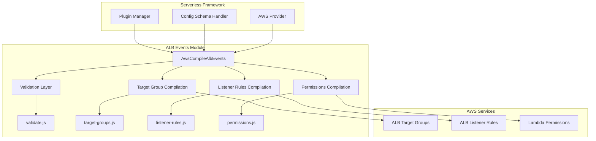
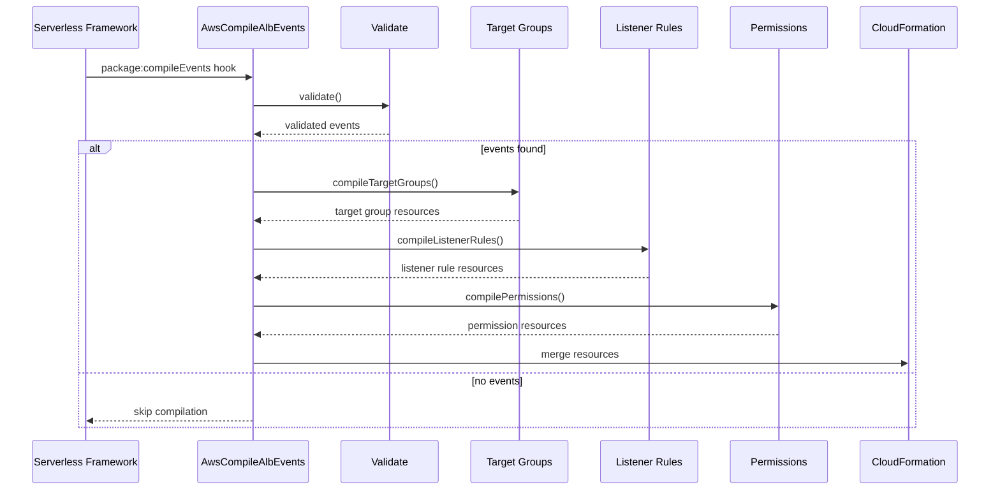

# ALB Events Module Documentation

## Introduction

The ALB (Application Load Balancer) Events module is a specialized component within the Serverless Framework's AWS provider plugin system. It handles the compilation and configuration of AWS Lambda function triggers from Application Load Balancer events, enabling serverless functions to respond to HTTP/HTTPS requests routed through ALB.

This module transforms ALB event definitions in `serverless.yml` into AWS CloudFormation resources, creating the necessary infrastructure components including target groups, listener rules, and Lambda permissions.

## Architecture Overview



## Core Components

### AwsCompileAlbEvents Class

The main orchestrator class that coordinates the compilation of ALB events into AWS CloudFormation resources.

**Location**: `lib.plugins.aws.package.compile.events.alb.index.AwsCompileAlbEvents`

**Key Responsibilities**:
- Schema definition for ALB event configuration
- Hook registration for the `package:compileEvents` lifecycle event
- Coordination of validation and compilation processes
- Integration with Serverless Framework's plugin system

**Constructor Dependencies**:
- `serverless`: Serverless Framework instance
- `options`: Command-line options
- `provider`: AWS provider instance

### Schema Definition

The module defines a comprehensive JSON schema for ALB event configuration with the following key properties:

#### Required Properties
- `listenerArn`: ALB listener ARN or CloudFormation reference
- `priority`: Rule priority (1-50000)
- `conditions`: Request matching conditions

#### Optional Properties
- `authorizer`: Array of authorizer strings
- `healthCheck`: Health check configuration
- `multiValueHeaders`: Boolean for multi-value headers support
- `targetGroupName`: Custom target group name

#### Condition Types
- **Header**: HTTP header matching with name and values
- **Host**: Host header matching with pattern support
- **IP**: Source IP address matching
- **Method**: HTTP method matching (GET, POST, etc.)
- **Path**: URL path matching with pattern support
- **Query**: Query string parameter matching

## Data Flow



## Compilation Process

### 1. Validation Phase
The validation process ensures that ALB event configurations are syntactically correct and contain all required properties. It validates:
- Listener ARN format
- Priority range (1-50000)
- Condition structure and values
- Health check configuration
- Target group naming conventions

### 2. Target Group Compilation
Creates AWS::ElasticLoadBalancingV2::TargetGroup resources that:
- Define Lambda function targets
- Configure health checks
- Set target group attributes
- Establish target group names

### 3. Listener Rule Compilation
Generates AWS::ElasticLoadBalancingV2::ListenerRule resources that:
- Define request routing conditions
- Associate rules with target groups
- Set rule priorities
- Configure actions

### 4. Permission Compilation
Creates AWS::Lambda::Permission resources that:
- Allow ALB to invoke Lambda functions
- Define source ARNs for security
- Establish permission policies

## Dependencies

### Internal Dependencies
- **Core Framework**: Integrates with Serverless Framework's plugin system
- **AWS Provider**: Leverages AWS-specific configurations and utilities
- **Package Compilation**: Part of the broader AWS package compilation pipeline

### External Dependencies
- **p-try**: Promise utility for consistent error handling
- **Validation Libraries**: Schema validation for ALB configurations

### Related Modules
- [aws-events](aws-events.md): Parent module containing all AWS event types
- [aws-package-compile](aws-package-compile.md): Compilation infrastructure
- [aws-provider](aws-provider.md): AWS provider integration

## Configuration Examples

### Basic ALB Event
```yaml
functions:
  myFunction:
    handler: index.handler
    events:
      - alb:
          listenerArn: arn:aws:elasticloadbalancing:us-east-1:123456789012:listener/app/my-load-balancer/50dc6c495eb0a918/50dc6c495eb0a918
          priority: 1
          conditions:
            path: /api/*
            method: GET
```

### Advanced Configuration
```yaml
functions:
  myFunction:
    handler: index.handler
    events:
      - alb:
          listenerArn: ${cf:my-stack.listenerArn}
          priority: 100
          conditions:
            host: api.example.com
            path: /users/*
            method: [GET, POST]
            header:
              name: X-API-Version
              values: ["v1", "v2"]
            query:
              version: "1.0"
          healthCheck:
            enabled: true
            path: /health
            intervalSeconds: 30
            timeoutSeconds: 5
            healthyThresholdCount: 2
            unhealthyThresholdCount: 3
          multiValueHeaders: true
          targetGroupName: my-custom-tg
```

## Integration Points

### Serverless Framework Lifecycle
The module integrates with the Serverless Framework through the `package:compileEvents` hook, which is triggered during the packaging phase of deployment.

### CloudFormation Template Generation
All compiled resources are merged into the main CloudFormation template, which is then used for AWS resource provisioning.

### AWS Resource Relationships
- **Target Groups**: Reference Lambda functions as targets
- **Listener Rules**: Reference target groups for request routing
- **Lambda Permissions**: Reference ALB resources as invocation sources

## Error Handling

The module implements comprehensive error handling through:
- Schema validation with detailed error messages
- Promise-based error propagation using `p-try`
- Validation of AWS resource existence and permissions
- Graceful handling of missing or invalid configurations

## Best Practices

1. **Priority Management**: Use consistent priority ranges across functions
2. **Condition Specificity**: Create specific conditions to avoid rule conflicts
3. **Health Checks**: Implement health checks for production environments
4. **Naming Conventions**: Use descriptive target group names
5. **Security**: Implement appropriate authorizers and conditions

## Limitations

- Maximum 50000 rules per ALB listener
- Target group names limited to 32 characters
- Header values limited to 128 characters
- Path patterns have specific regex requirements
- Priority must be unique within a listener

## Future Considerations

- Support for additional ALB features (WAF integration, etc.)
- Enhanced monitoring and logging capabilities
- Integration with AWS Certificate Manager for SSL/TLS
- Support for ALB advanced routing features