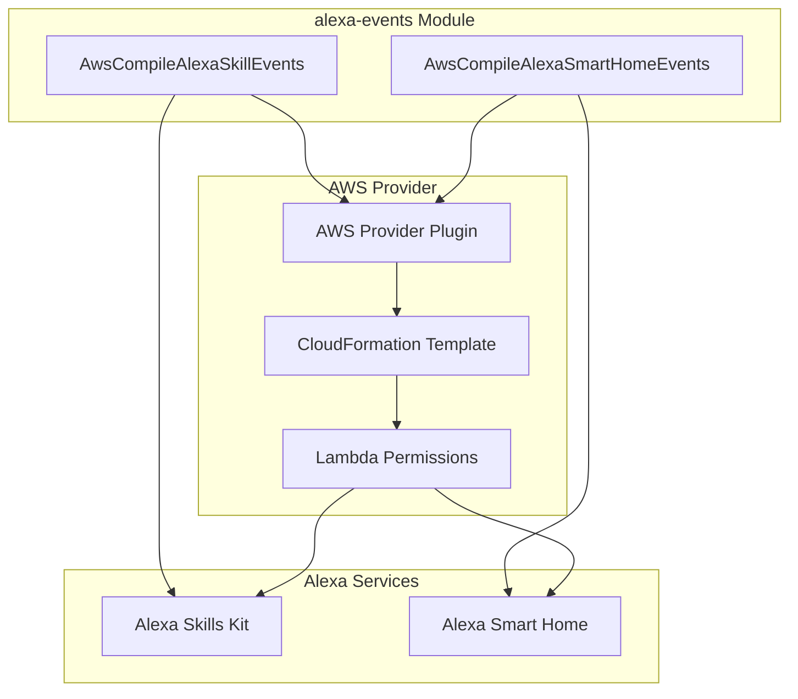
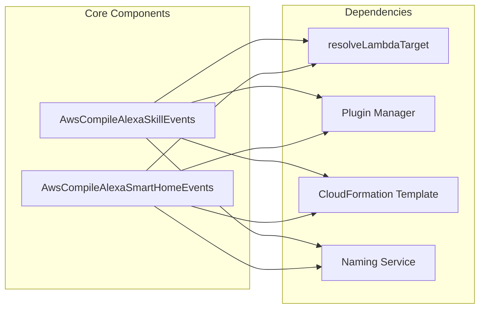
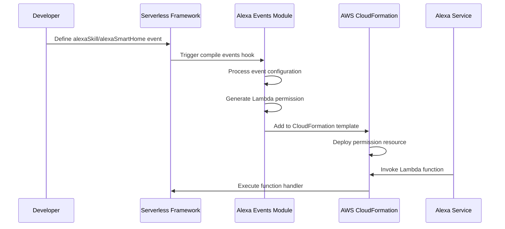

# Alexa Events Module Documentation

## Overview

The alexa-events module is a specialized component within the Serverless Framework's AWS provider plugin system, responsible for handling Alexa-specific event integrations. This module enables Serverless applications to respond to events from Amazon Alexa services, including both Alexa Skills and Alexa Smart Home devices.

## Purpose

The primary purpose of the alexa-events module is to:
- Compile and configure AWS Lambda permissions for Alexa event sources
- Enable Serverless functions to be triggered by Alexa Skills Kit and Alexa Smart Home events
- Generate appropriate CloudFormation resources for Alexa event integrations
- Provide a seamless developer experience for building Alexa-enabled serverless applications

## Architecture

### Module Structure



### Component Relationships



## Core Components

### 1. AwsCompileAlexaSkillEvents

The `AwsCompileAlexaSkillEvents` class handles the compilation of Alexa Skills Kit events. For detailed documentation, see [Alexa Skill Events](alexa-skill-events.md).

**Overview:**
- Processes `alexaSkill` function events in the Serverless configuration
- Generates AWS Lambda permissions for Alexa Skills Kit
- Configures event source tokens and invocation permissions
- Manages deprecation warnings for legacy configurations

**Key Features:**
- Supports both string-based and object-based event configurations
- Handles appId validation and token management
- Provides enable/disable functionality for event sources
- Integrates with CloudFormation template generation

### 2. AwsCompileAlexaSmartHomeEvents

The `AwsCompileAlexaSmartHomeEvents` class manages Alexa Smart Home event integrations. For detailed documentation, see [Alexa Smart Home Events](alexa-smart-home-events.md).

**Overview:**
- Compilation of `alexaSmartHome` function events
- Generation of Lambda permissions for Alexa Connected Home
- Support for Smart Home skill configurations
- Event source token management for device interactions

**Key Features:**
- Object and string-based configuration support
- Automatic principal assignment for Smart Home events
- Token sanitization and validation
- CloudFormation resource generation

## Event Configuration

### Alexa Skill Events

```yaml
functions:
  myAlexaSkill:
    handler: handler.alexaSkill
    events:
      - alexaSkill: amzn1.ask.skill.12345678-1234-1234-1234-123456789012
      - alexaSkill:
          appId: amzn1.ask.skill.12345678-1234-1234-1234-123456789012
          enabled: true
```

### Alexa Smart Home Events

```yaml
functions:
  mySmartHomeSkill:
    handler: handler.smartHome
    events:
      - alexaSmartHome: amzn1.ask.skill.12345678-1234-1234-1234-123456789012
      - alexaSmartHome:
          appId: amzn1.ask.skill.12345678-1234-1234-1234-123456789012
          enabled: true
```

## Integration Flow



## Dependencies

The alexa-events module relies on several core components:

- **[aws-provider](aws-provider.md)**: Provides AWS-specific functionality and naming conventions
- **[aws-package-compile](aws-package-compile.md)**: Handles the overall package compilation process
- **[core-framework](core-framework.md)**: Supplies the base Serverless Framework functionality

## Configuration Schema

Both event types support flexible configuration schemas:

### String Configuration
Simple string-based configuration using the appId directly:
```yaml
- alexaSkill: "amzn1.ask.skill.12345678-1234-1234-1234-123456789012"
```

### Object Configuration
Advanced configuration with additional properties:
```yaml
- alexaSkill:
    appId: "amzn1.ask.skill.12345678-1234-1234-1234-123456789012"
    enabled: true
```

## Security Considerations

- Event source tokens are sanitized to remove newline characters
- Lambda permissions are scoped to specific Alexa principals
- Function aliases are properly referenced in permission dependencies
- Enable/disable functionality provides runtime control over event processing

## Error Handling

The module includes built-in error handling for:
- Invalid appId formats
- Missing required properties
- CloudFormation template conflicts
- Deprecation warnings for legacy configurations

## Best Practices

1. **Use Object Configuration**: Prefer object-based configuration for better control
2. **Specify App IDs**: Always provide appId to avoid deprecation warnings
3. **Enable/Disable Appropriately**: Use the enabled flag for environment-specific configurations
4. **Validate Tokens**: Ensure appId tokens are valid and properly formatted
5. **Monitor Permissions**: Regularly review Lambda permissions for security

## Related Documentation

- [AWS Events Module](aws-events.md) - Parent module containing all AWS event types
- [API Gateway Events](api-gateway-events.md) - HTTP-based event integrations
- [Core Framework](core-framework.md) - Base Serverless Framework functionality