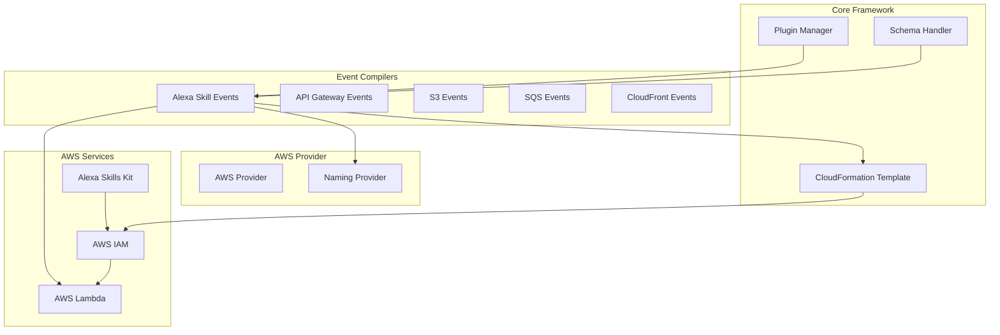
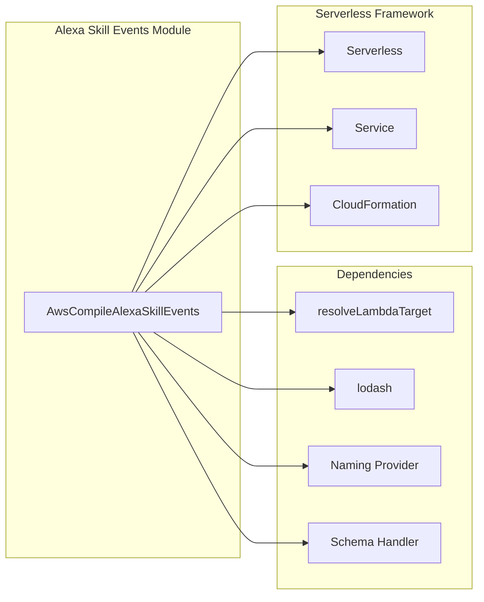
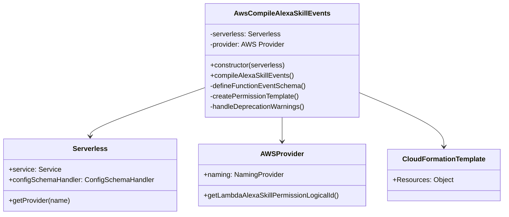
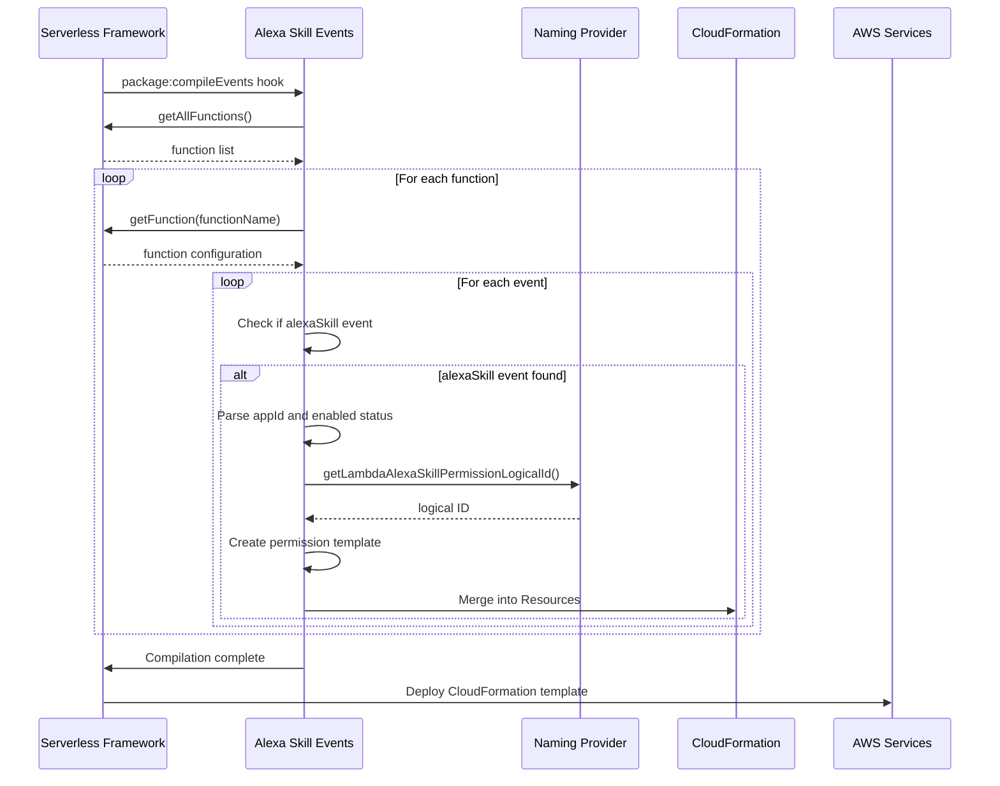
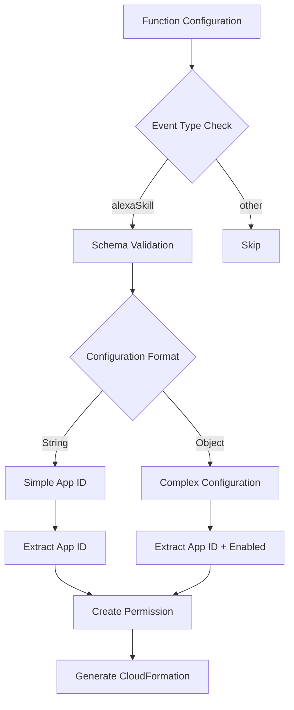

# Alexa Skill Events Module Documentation

## Introduction

The Alexa Skill Events module is a specialized component within the Serverless Framework's AWS plugin ecosystem that handles the compilation and configuration of Alexa Skill events for AWS Lambda functions. This module enables developers to seamlessly integrate their serverless functions with Amazon Alexa Skills Kit, allowing Lambda functions to be invoked by Alexa skill interactions.

The module is part of the broader AWS events compilation system and provides the necessary infrastructure to create AWS Lambda permissions and CloudFormation resources that enable Alexa skills to trigger Lambda functions securely.

## Architecture Overview

### Module Position in System Architecture

The Alexa Skill Events module operates as a specialized event compiler within the AWS provider plugin architecture. It integrates with the core Serverless Framework through the plugin system and works in conjunction with other AWS compilation modules.



### Component Dependencies



## Core Components

### AwsCompileAlexaSkillEvents Class

The primary component of this module is the `AwsCompileAlexaSkillEvents` class, which extends the Serverless Framework's event compilation capabilities to support Alexa Skill events.

#### Class Structure



#### Key Methods and Functionality

1. **Constructor**: Initializes the plugin, sets up schema validation, and registers hooks
2. **compileAlexaSkillEvents()**: Main compilation method that processes all functions with Alexa Skill events
3. **Schema Definition**: Defines the valid configuration schema for Alexa Skill events
4. **Permission Creation**: Generates AWS Lambda permissions for Alexa Skills Kit

## Data Flow and Process Flow

### Event Compilation Process



### Configuration Schema Validation



## Configuration and Usage

### Supported Configuration Formats

The module supports two configuration formats for Alexa Skill events:

1. **Simple String Format** (Deprecated):
```yaml
functions:
  myFunction:
    events:
      - alexaSkill: amzn1.ask.skill.12345678-1234-1234-1234-123456789012
```

2. **Object Format** (Recommended):
```yaml
functions:
  myFunction:
    events:
      - alexaSkill:
          appId: amzn1.ask.skill.12345678-1234-1234-1234-123456789012
          enabled: true
```

### Schema Definition

The module defines a comprehensive schema that validates Alexa Skill event configurations:

```javascript
{
  anyOf: [
    { $ref: '#/definitions/awsAlexaEventToken' },
    {
      type: 'object',
      properties: {
        appId: { $ref: '#/definitions/awsAlexaEventToken' },
        enabled: { type: 'boolean' },
      },
      required: ['appId'],
      additionalProperties: false,
    },
  ],
}
```

## CloudFormation Resource Generation

### Lambda Permission Resource Structure

The module generates AWS::Lambda::Permission resources with the following structure:

```yaml
Type: AWS::Lambda::Permission
DependsOn: FunctionAlias
Properties:
  FunctionName: !Ref FunctionName
  Action: lambda:InvokeFunction
  Principal: alexa-appkit.amazon.com
  EventSourceToken: amzn1.ask.skill.12345678-1234-1234-1234-123456789012
```

### Resource Naming Convention

Resources are named using the pattern: `{FunctionName}AlexaSkillPermission{Number}`, ensuring unique identification when multiple Alexa Skill events are defined for the same function.

## Integration Points

### Dependency on Core Framework

The module integrates with several core Serverless Framework components:

- **[Plugin Manager](plugin-management.md)**: Registers hooks and manages plugin lifecycle
- **[Configuration Schema Handler](configuration-management.md)**: Defines and validates event schemas
- **[AWS Provider](aws-provider.md)**: Accesses AWS-specific functionality and naming conventions
- **[CloudFormation Template](core-framework.md)**: Merges generated resources into the deployment template

### Related AWS Event Modules

The Alexa Skill Events module works alongside other AWS event compilation modules:

- **[API Gateway Events](api-gateway-events.md)**: HTTP/REST API triggers
- **[S3 Events](s3-events.md)**: Object storage event triggers
- **[SQS Events](sqs-events.md)**: Message queue event triggers
- **[CloudWatch Events](cloud-watch-events.md)**: Scheduled and event-based triggers

## Security and Permissions

### IAM Considerations

The module creates Lambda permissions that allow the Alexa Skills Kit principal (`alexa-appkit.amazon.com`) to invoke the function. The permission includes:

- **Principal**: The Alexa Skills Kit service
- **Action**: `lambda:InvokeFunction` or `lambda:DisableInvokeFunction`
- **Event Source Token**: The specific Alexa Skill ID for security isolation

### Security Best Practices

1. **Skill ID Validation**: The module validates Alexa Skill IDs to ensure proper formatting
2. **Enabled/Disabled States**: Supports enabling/disabling specific skill integrations
3. **Resource Isolation**: Each skill event creates a separate permission resource

## Error Handling and Validation

### Deprecation Warnings

The module includes deprecation handling for the legacy string-based configuration format, warning users about upcoming breaking changes.

### Schema Validation

Configuration is validated against the defined schema, ensuring:
- Valid Alexa Skill ID format
- Proper object structure when using complex configuration
- No additional properties beyond those defined

## Testing and Development

### Mock Integration

The module can be tested using the Serverless Framework's local invocation capabilities, though actual Alexa Skill integration requires deployment to AWS.

### Local Development

Developers can use tools like the Alexa Skills Kit Command Line Interface (ASK CLI) to test skill interactions locally before deployment.

## Deployment Considerations

### CloudFormation Stack Updates

When updating Alexa Skill event configurations, the module ensures proper CloudFormation resource updates without disrupting existing skill functionality.

### Multi-Region Deployment

The module supports multi-region deployments, with each region maintaining its own set of Lambda permissions for Alexa Skills Kit.

## Troubleshooting

### Common Issues

1. **Permission Conflicts**: Ensure no conflicting Lambda permissions exist
2. **Skill ID Format**: Verify Alexa Skill ID format matches Amazon's requirements
3. **Enabled State**: Check that the skill event is not disabled in configuration

### Debugging

Enable Serverless Framework verbose logging to see detailed compilation information and CloudFormation resource generation.

## Future Enhancements

### Planned Improvements

- Enhanced validation for Alexa Skill IDs
- Support for additional Alexa Skills Kit features
- Improved error messages and troubleshooting guidance

### Breaking Changes

Future major versions will remove support for the string-based configuration format, requiring object-based configuration with explicit `appId` properties.

## References

- [AWS Lambda Permissions Documentation](https://docs.aws.amazon.com/lambda/latest/dg/lambda-permissions.html)
- [Alexa Skills Kit Documentation](https://developer.amazon.com/en-US/docs/alexa/ask-overviews/build-skills-with-the-alexa-skills-kit.html)
- [Serverless Framework AWS Events Guide](https://www.serverless.com/framework/docs/providers/aws/events/)
- [Core Framework Documentation](core-framework.md)
- [AWS Provider Documentation](aws-provider.md)
- [Plugin Management System](plugin-management.md)
- [Configuration Management](configuration-management.md)