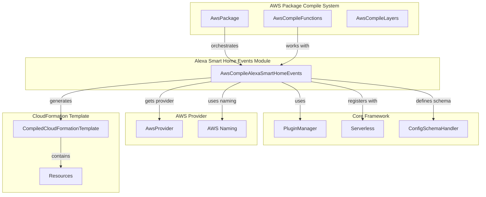
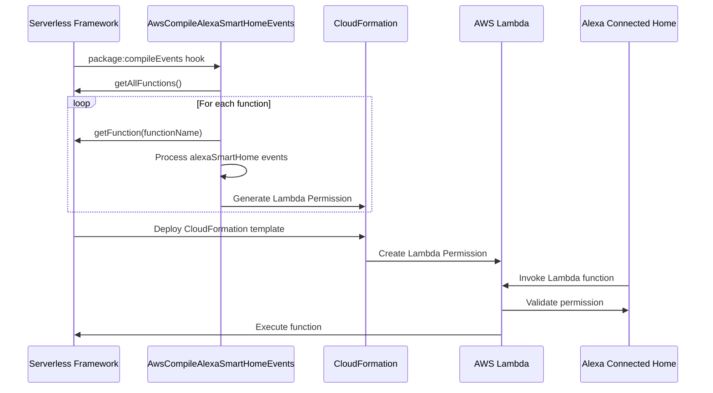
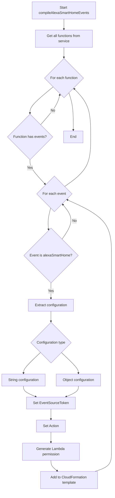

# Alexa Smart Home Events Module

## Introduction

The Alexa Smart Home Events module provides Serverless Framework support for configuring AWS Lambda functions to handle Alexa Smart Home skill events. This module enables developers to create Lambda functions that can respond to smart home device events from Alexa, such as device discovery, state changes, and control requests.

## Overview

The module is responsible for compiling Alexa Smart Home event configurations into AWS CloudFormation resources, specifically creating Lambda permissions that allow Alexa Connected Home to invoke the function. It integrates with the broader AWS events compilation system within the Serverless Framework.

## Architecture

### Component Structure



### Event Processing Flow



## Core Components

### AwsCompileAlexaSmartHomeEvents

The main class responsible for compiling Alexa Smart Home events into CloudFormation resources.

**Location**: `lib.plugins.aws.package.compile.events.alexa-smart-home.AwsCompileAlexaSmartHomeEvents`

**Key Responsibilities**:
- Registers the `alexaSmartHome` event type in the configuration schema
- Processes function events during the `package:compileEvents` hook
- Generates AWS Lambda permissions for Alexa Connected Home
- Handles both simple string and complex object configurations

**Constructor Dependencies**:
- `serverless`: The Serverless Framework instance
- `provider`: AWS provider instance
- `configSchemaHandler`: For defining event schema validation

## Configuration Schema

The module defines a flexible schema for Alexa Smart Home events that supports two configuration formats:

### Simple String Format
```yaml
functions:
  myFunction:
    events:
      - alexaSmartHome: amzn1.ask.skill.12345678-1234-1234-1234-123456789012
```

### Object Format
```yaml
functions:
  myFunction:
    events:
      - alexaSmartHome:
          appId: amzn1.ask.skill.12345678-1234-1234-1234-123456789012
          enabled: true
```

**Schema Definition**:
- `appId`: The Alexa skill application ID (required)
- `enabled`: Boolean flag to enable/disable the event (optional, defaults to true)

## Compilation Process

### Event Processing Algorithm



### CloudFormation Resource Generation

For each Alexa Smart Home event, the module generates an `AWS::Lambda::Permission` resource with the following properties:

```yaml
Type: AWS::Lambda::Permission
Properties:
  FunctionName: !GetAtt FunctionName.Arn
  Action: lambda:InvokeFunction
  Principal: alexa-connectedhome.amazon.com
  EventSourceToken: amzn1.ask.skill.12345678-1234-1234-1234-123456789012
```

**Resource Naming Convention**:
- Logical ID: `{FunctionName}LambdaPermissionAlexaSmartHome{EventNumber}`
- Example: `MyFunctionLambdaPermissionAlexaSmartHome1`

## Dependencies

### Internal Dependencies

The module relies on several core Serverless Framework components:

1. **[Plugin Manager](plugin-management.md)**: For hook registration and lifecycle management
2. **[Configuration Schema Handler](configuration-management.md)**: For event schema definition and validation
3. **[AWS Provider](aws-provider.md)**: For AWS-specific functionality and naming conventions
4. **[AWS Package System](aws-package-compile.md)**: For integration with the compilation pipeline

### External Dependencies

- **lodash**: Utility library for object manipulation and merging
- **resolve-lambda-target**: Utility for resolving Lambda function targets

## Integration Points

### Hook Registration

The module registers for the `package:compileEvents` hook, which is triggered during the package compilation phase:

```javascript
this.hooks = {
  'package:compileEvents': async () => this.compileAlexaSmartHomeEvents(),
}
```

### Schema Registration

Event schema is registered with the configuration schema handler:

```javascript
this.serverless.configSchemaHandler.defineFunctionEvent('aws', 'alexaSmartHome', schema)
```

### CloudFormation Template Integration

Generated permissions are merged into the compiled CloudFormation template:

```javascript
_.merge(
  this.serverless.service.provider.compiledCloudFormationTemplate.Resources,
  permissionCloudFormationResource
)
```

## Error Handling

The module includes several validation and error handling mechanisms:

1. **Schema Validation**: Configuration is validated against the defined schema
2. **Type Checking**: Handles both string and object configuration types
3. **Sanitization**: Removes newline characters from EventSourceToken and Action values
4. **Dependency Management**: Ensures permissions depend on function target aliases

## Security Considerations

### Permission Scope

- **Principal**: `alexa-connectedhome.amazon.com` - Only Alexa Connected Home service can invoke
- **Action**: `lambda:InvokeFunction` or `lambda:DisableInvokeFunction` based on enabled flag
- **Event Source Token**: Validates the specific Alexa skill ID

### Best Practices

1. Use specific skill IDs rather than wildcards
2. Enable/disable events through configuration rather than manual AWS console changes
3. Regular rotation of skill IDs if security compromise is suspected

## Usage Examples

### Basic Configuration
```yaml
service: my-smart-home-service
provider: aws

functions:
  deviceHandler:
    handler: handler.deviceHandler
    events:
      - alexaSmartHome: amzn1.ask.skill.12345678-1234-1234-1234-123456789012
```

### Advanced Configuration
```yaml
service: my-smart-home-service
provider: aws

functions:
  deviceHandler:
    handler: handler.deviceHandler
    events:
      - alexaSmartHome:
          appId: amzn1.ask.skill.12345678-1234-1234-1234-123456789012
          enabled: true
      - alexaSmartHome:
          appId: amzn1.ask.skill.87654321-4321-4321-4321-210987654321
          enabled: false
```

## Testing Considerations

### Unit Testing
- Mock the Serverless Framework instance
- Test configuration parsing for both string and object formats
- Verify CloudFormation resource generation
- Test error handling for invalid configurations

### Integration Testing
- Deploy with actual Alexa skill IDs
- Verify Lambda function invocation from Alexa
- Test enable/disable functionality

## Related Modules

- [Alexa Skill Events](alexa-skill-events.md) - For regular Alexa skill events (not smart home)
- [AWS Events](aws-events.md) - Parent module for all AWS event types
- [AWS Package Compile](aws-package-compile.md) - Compilation system integration
- [Core Framework](core-framework.md) - Core Serverless Framework functionality

## Future Enhancements

Potential areas for improvement:

1. **Multi-Region Support**: Handle Alexa skills across different AWS regions
2. **Event Filtering**: Support for filtering specific smart home event types
3. **Rate Limiting**: Built-in rate limiting for Alexa events
4. **Monitoring Integration**: CloudWatch metrics for Alexa event processing
5. **Validation Enhancement**: More sophisticated skill ID validation

## Conclusion

The Alexa Smart Home Events module provides a streamlined way to integrate AWS Lambda functions with Alexa Smart Home skills. By handling the complexity of CloudFormation resource generation and permission management, it enables developers to focus on implementing smart home device logic rather than infrastructure configuration.