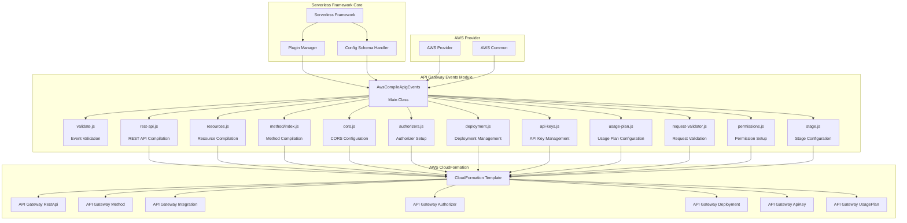
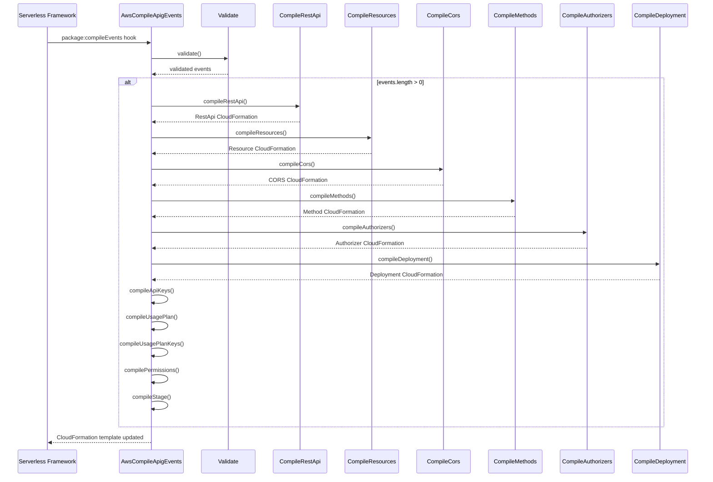
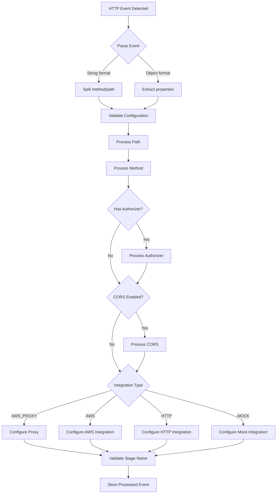

# API Gateway Events Module

## Overview

The API Gateway Events module is a core component of the Serverless Framework's AWS provider plugin system, responsible for compiling HTTP events from serverless functions into AWS API Gateway CloudFormation resources. This module transforms function-level HTTP event definitions into comprehensive AWS API Gateway REST API configurations, including resources, methods, authorizers, CORS settings, and deployment configurations.

## Purpose and Core Functionality

The primary purpose of this module is to bridge the gap between serverless function HTTP event definitions and AWS API Gateway CloudFormation resources. It handles the complete lifecycle of API Gateway resource compilation, from validation and configuration parsing to the generation of CloudFormation templates that can be deployed to AWS.

### Key Responsibilities

- **Event Validation**: Validates HTTP event configurations against comprehensive JSON schemas
- **Resource Compilation**: Generates CloudFormation resources for API Gateway REST APIs
- **Method Configuration**: Creates API Gateway methods with proper integrations and authorizations
- **CORS Support**: Handles Cross-Origin Resource Sharing configuration
- **Authorizer Management**: Supports multiple authorization types including Lambda, Cognito, and AWS IAM
- **Request/Response Processing**: Configures request validation, transformation, and response handling
- **Deployment Management**: Creates deployment resources and manages API stages
- **Security Configuration**: Handles API keys, usage plans, and resource policies

## Architecture and Component Relationships

### High-Level Architecture



### Component Dependencies

```mermaid
graph LR
    subgraph "Core Dependencies"
        ACI[AwsCompileApigEvents]
        MEM[memoizee]
        VAL[validate]
        REST[rest-api]
        RVAL[request-validator]
        KEYS[api-keys]
        UP[usage-plan]
        UPK[usage-plan-keys]
        RES[resources]
        CORS[cors]
        METH[method/index]
        AUTH[authorizers]
        DEP[deployment]
        PERM[permissions]
        STAGE[stage]
        MAUTH[method/authorization]
        MINT[method/integration]
        MRES[method/responses]
    end
    
    ACI --> MEM
    ACI --> VAL
    ACI --> REST
    ACI --> RVAL
    ACI --> KEYS
    ACI --> UP
    ACI --> UPK
    ACI --> RES
    ACI --> CORS
    ACI --> METH
    ACI --> AUTH
    ACI --> DEP
    ACI --> PERM
    ACI --> STAGE
    ACI --> MAUTH
    ACI --> MINT
    ACI --> MRES
```



## Data Flow and Processing Pipeline

### Event Processing Flow



### Validation and Configuration Processing



## Integration with Serverless Framework

### Plugin System Integration

The API Gateway Events module integrates with the Serverless Framework through the plugin system, specifically as part of the AWS provider's compilation phase. It hooks into the `package:compileEvents` lifecycle event to process HTTP events defined in the `serverless.yml` configuration.

### Configuration Schema Definition

The module defines comprehensive JSON schemas for HTTP event validation, supporting both simple string format (`"GET /users"`) and complex object configurations with detailed authorization, CORS, request/response transformation, and integration settings.

### Supported HTTP Event Configurations

```yaml
functions:
  myFunction:
    handler: handler.myFunction
    events:
      # Simple format
      - http: GET /users
      
      # Object format with basic configuration
      - http:
          path: /users
          method: GET
          
      # Advanced configuration
      - http:
          path: /users
          method: POST
          authorizer:
            type: COGNITO_USER_POOLS
            arn: arn:aws:cognito-idp:region:account:userpool/pool-id
          cors:
            origin: '*'
            headers:
              - Content-Type
              - Authorization
          integration: AWS_PROXY
          request:
            parameters:
              querystrings:
                id: true
          response:
            statusCodes:
              200:
                pattern: ''
              400:
                pattern: '.*"error".*'
```

## CloudFormation Resource Generation

### Generated Resources

The module generates a comprehensive set of CloudFormation resources:

1. **AWS::ApiGateway::RestApi** - The main REST API resource
2. **AWS::ApiGateway::Resource** - API resources (paths)
3. **AWS::ApiGateway::Method** - HTTP methods for each resource
4. **AWS::ApiGateway::Integration** - Integration configurations
5. **AWS::ApiGateway::Authorizer** - Lambda and Cognito authorizers
6. **AWS::ApiGateway::Deployment** - API deployment resource
7. **AWS::ApiGateway::ApiKey** - API keys for usage plans
8. **AWS::ApiGateway::UsagePlan** - Usage plan configurations
9. **AWS::ApiGateway::UsagePlanKey** - Usage plan key associations
10. **AWS::Lambda::Permission** - Lambda function permissions

### Integration Types

The module supports multiple API Gateway integration types:

- **AWS_PROXY** (default) - Lambda proxy integration
- **AWS** - Lambda custom integration
- **HTTP** - HTTP backend integration
- **HTTP_PROXY** - HTTP proxy integration
- **MOCK** - Mock integration for testing

### Authorization Types

Comprehensive authorization support includes:

- **AWS_IAM** - AWS IAM authorization
- **CUSTOM** - Custom Lambda authorizers
- **COGNITO_USER_POOLS** - Cognito User Pool authorization
- **TOKEN** - Token-based authorizers
- **REQUEST** - Request-based authorizers

## Error Handling and Validation

### Validation Schema

The module implements extensive JSON schema validation for all HTTP event properties, ensuring configuration correctness before CloudFormation template generation. Validation covers:

- Path and method formats
- Authorizer configurations
- CORS settings
- Request/response transformations
- Integration-specific requirements

### Error Types

Custom error types are defined for specific validation failures:

- `API_GATEWAY_MISSING_REST_API_ROOT_RESOURCE_ID` - Missing root resource ID for external APIs
- `API_GATEWAY_EXTERNAL_API_TRACING` - Tracing configuration conflict with external APIs
- `API_GATEWAY_INVALID_STAGE_NAME` - Invalid stage name format
- `API_GATEWAY_MISSING_REQUEST_URI` - Missing URI for HTTP integrations
- `API_GATEWAY_MISSING_CONNECTION_ID` - Missing connection ID for VPC links
- `API_GATEWAY_INVALID_COGNITO_CLAIMS` - Invalid Cognito claims configuration

## Performance Optimizations

### Memoization

The module uses memoization for request validator creation to optimize performance when multiple functions use similar validation configurations.

### Lazy Loading

Dynamic imports are used for optional components like stage update hacks and usage plan disassociation, reducing initial load time and memory usage.

## Lifecycle Hooks

### Primary Hook

- **`package:compileEvents`** - Main compilation hook that processes all HTTP events

### Secondary Hooks

- **`after:deploy:deploy`** - Handles stage updates for CloudFormation workarounds
- **`before:remove:remove`** - Disassociates usage plans before stack removal

## Dependencies on Other Modules

### Core Framework Dependencies

- **[core-framework](core-framework.md)** - Provides the base Serverless Framework functionality, plugin management, and configuration handling
- **[aws-provider](aws-provider.md)** - Supplies AWS-specific provider functionality and common utilities

### Related AWS Event Modules

- **[http-api-events](http-api-events.md)** - Handles HTTP API events (API Gateway v2)
- **[websocket-events](websocket-events.md)** - Manages WebSocket API events
- **[alb-events](alb-events.md)** - Processes Application Load Balancer events

### Utility Dependencies

- **[aws-package-compile](aws-package-compile.md)** - Provides base compilation functionality for AWS package phase
- **ARN Regular Expressions** - AWS ARN pattern matching utilities
- **Lambda Target Resolution** - Function ARN resolution for integrations and authorizers

## Configuration Reference

### Provider-Level Configuration

```yaml
provider:
  apiGateway:
    restApiId: xxxxxxxxxx  # External REST API ID
    restApiRootResourceId: xxxxxxxxxx  # Root resource ID for external APIs
    binaryMediaTypes:
      - '*/*'
    minimumCompressionSize: 1024
    description: My API Gateway
    apiKeySourceType: HEADER
    disableDefaultEndpoint: true
    resourcePolicy:
      - Effect: Allow
        Principal: '*'
        Action: 'execute-api:Invoke'
        Resource: '*'
    vpcEndpointIds:
      - vpce-xxxxxxxx
```

### Function-Level Configuration

```yaml
functions:
  myFunction:
    handler: handler.myFunction
    events:
      - http:
          path: /users/{id}
          method: GET
          async: false
          authorizer:
            name: authorizerFunction
            resultTtlInSeconds: 300
            identitySource: method.request.header.Authorization
            identityValidationExpression: .*\\S.*
          cors:
            origin: '*'
            headers:
              - Content-Type
              - X-Amz-Date
            allowCredentials: false
            maxAge: 86400
          integration: AWS_PROXY
          request:
            parameters:
              paths:
                id: true
              querystrings:
                filter: false
              headers:
                Authorization: true
            schema:
              application/json: ${file(models/user.json)}
          response:
            statusCodes:
              200:
                pattern: ''
                template: $input.path('$')
              404:
                pattern: '.*"error":"Not Found".*'
                template: $input.path('$.error')
```

This comprehensive module serves as the backbone for HTTP event processing in the Serverless Framework, providing robust validation, flexible configuration options, and complete CloudFormation resource generation for AWS API Gateway REST APIs.