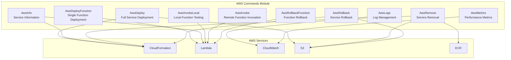
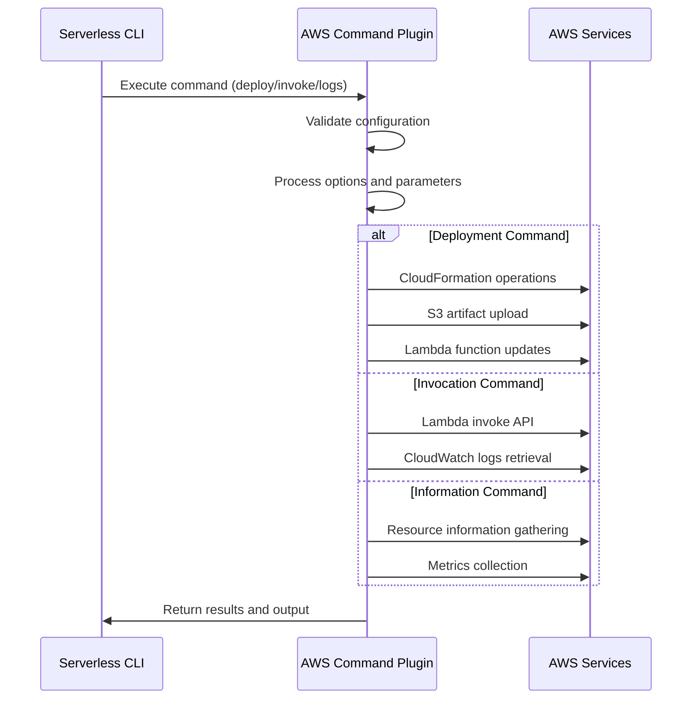

# AWS Commands Module Documentation

## Overview

The AWS Commands module is a comprehensive collection of Serverless Framework plugins that provide essential AWS deployment and management capabilities. This module implements the core operational commands for AWS Lambda-based serverless applications, including deployment, function management, monitoring, and rollback operations.

## Architecture

The AWS Commands module is structured as a collection of specialized plugins, each responsible for specific AWS service operations. These plugins integrate with the Serverless Framework's plugin system and AWS CloudFormation to provide seamless serverless application lifecycle management.

## Core Functionality

### Deployment Operations

#### AwsDeploy - Full Service Deployment
The primary deployment plugin that orchestrates complete serverless service deployments to AWS. It manages the entire CloudFormation stack lifecycle including:

- **Stack Creation**: Creates new CloudFormation stacks for new services
- **Change Detection**: Analyzes service changes to optimize deployment
- **Artifact Upload**: Manages code artifacts and dependencies in S3
- **Template Validation**: Validates CloudFormation templates before deployment
- **Stack Updates**: Handles incremental updates to existing stacks
- **Observability Integration**: Configures monitoring and logging integrations

Key features:
- Intelligent change detection to skip unnecessary deployments
- Support for both code and configuration updates
- Integration with Serverless Dashboard observability
- Comprehensive error handling and rollback capabilities

#### AwsDeployFunction - Single Function Deployment
Provides targeted deployment capabilities for individual Lambda functions without affecting the entire service. This plugin is optimized for rapid development cycles:

- **Function Existence Validation**: Ensures target function exists before deployment
- **Code Change Detection**: Compares local and remote function hashes
- **Configuration Updates**: Handles runtime, memory, timeout, and environment changes
- **Image vs Handler Validation**: Prevents deployment conflicts between container and zip-based functions

### Information and Monitoring

#### AwsInfo - Service Information Retrieval
Comprehensive service information plugin that gathers and displays deployment details:

- **Stack Information**: Retrieves CloudFormation stack status and outputs
- **Resource Counting**: Monitors resource usage against AWS limits
- **API Key Management**: Displays configured API keys and endpoints
- **Function Details**: Lists all deployed functions with their configurations
- **Layer Information**: Shows deployed Lambda layers

#### AwsLogs - Log Management
Advanced log streaming and analysis plugin for CloudWatch Logs:

- **Real-time Log Streaming**: Live tailing of function logs
- **Time-based Filtering**: Flexible time range queries (relative and absolute)
- **Log Stream Discovery**: Automatic discovery of relevant log streams
- **Pattern Filtering**: Support for CloudWatch Logs filter patterns
- **Formatted Output**: Human-readable log formatting with timestamps

#### AwsMetrics - Performance Analytics
CloudWatch metrics aggregation and analysis plugin:

- **Invocation Metrics**: Total function invocations and throttles
- **Error Tracking**: Error rates and failure analysis
- **Duration Analytics**: Average execution time tracking
- **Multi-function Support**: Aggregate metrics across all functions or specific functions
- **Time Range Analysis**: Flexible time period analysis

### Function Invocation and Testing

#### AwsInvokeLocal - Local Development
Comprehensive local function testing environment supporting multiple runtimes:

- **Multi-runtime Support**: Node.js, Python, Java, Ruby, .NET, and custom runtimes
- **Docker Integration**: Container-based local execution environment
- **Layer Support**: Local Lambda layer simulation
- **Environment Simulation**: Accurate AWS Lambda environment variable setup
- **Event Handling**: Support for various event sources and contexts
- **Debugging Support**: Enhanced error reporting and stack traces

#### AwsInvoke - Remote Function Testing
Production function invocation plugin for testing deployed functions:

- **Synchronous/Asynchronous Invocation**: Support for different invocation types
- **Event Payload Management**: JSON and raw payload support
- **Context Handling**: Client context and qualifier support
- **Log Retrieval**: Automatic log fetching for invocations
- **Error Handling**: Comprehensive error reporting and formatting

### Rollback and Removal Operations

#### AwsRollback - Service Rollback
Complete service rollback to previous deployment states:

- **Deployment History**: Discovery of previous deployment timestamps
- **State Restoration**: Complete service state restoration
- **Artifact Management**: Retrieval of historical deployment artifacts
- **Validation**: Pre-rollback validation of target deployment

#### AwsRollbackFunction - Function Rollback
Targeted function rollback to specific versions:

- **Version Management**: Rollback to specific Lambda function versions
- **Code Restoration**: Complete function code restoration
- **Configuration Preservation**: Maintains current configuration during rollback

#### AwsRemove - Service Removal
Complete service teardown and resource cleanup:

- **Stack Deletion**: Complete CloudFormation stack removal
- **S3 Cleanup**: Artifact bucket cleanup and deletion
- **ECR Repository Management**: Container registry cleanup
- **Resource Verification**: Pre-removal resource existence checks

## Integration Points

The AWS Commands module integrates with several other Serverless Framework modules:

- **[aws-provider](aws-provider.md)**: Core AWS provider functionality and credentials
- **[aws-package-compile](aws-package-compile.md)**: Artifact packaging and compilation
- **[core-framework](core-framework.md)**: Core Serverless Framework services

## Data Flow Architecture

## Error Handling

The AWS Commands module implements comprehensive error handling strategies:

- **Validation Errors**: Pre-execution validation of inputs and configurations
- **AWS API Errors**: Graceful handling of AWS service errors with meaningful messages
- **Network Resilience**: Retry mechanisms for transient network failures
- **Resource Conflicts**: Handling of resource conflicts and race conditions
- **Permission Issues**: Clear error messages for AWS permission problems

## Performance Optimizations

Several performance optimizations are implemented across the module:

- **Change Detection**: Intelligent comparison to avoid unnecessary operations
- **Parallel Processing**: Concurrent operations where possible
- **Caching**: Strategic caching of AWS responses and metadata
- **Progressive Disclosure**: Incremental information display for long-running operations
- **Resource Pooling**: Efficient reuse of AWS service clients

## Security Considerations

The module implements several security best practices:

- **Credential Management**: Secure handling of AWS credentials
- **Least Privilege**: Minimal required permissions for operations
- **Data Sanitization**: Safe handling of sensitive configuration data
- **Audit Logging**: Comprehensive operation logging for security monitoring

## Sub-modules

The AWS Commands module contains several specialized sub-modules, each providing detailed documentation of specific functionality, configuration options, and usage patterns:

### Deployment Operations
- **[aws-deploy](aws-deploy.md)**: Full service deployment operations - Comprehensive CloudFormation stack management and service deployment
- **[aws-deploy-function](aws-deploy-function.md)**: Single function deployment - Targeted Lambda function updates without full service deployment

### Information and Monitoring
- **[aws-info](aws-info.md)**: Service information and status - Complete service state retrieval and resource information
- **[aws-logs](aws-logs.md)**: Log management and streaming - CloudWatch Logs integration with real-time streaming
- **[aws-metrics](aws-metrics.md)**: Performance metrics and analytics - CloudWatch metrics aggregation and analysis

### Function Testing and Invocation
- **[aws-invoke-local](aws-invoke-local.md)**: Local function testing - Multi-runtime local development environment

### Rollback and Removal Operations
- **[aws-remove](aws-remove.md)**: Service removal and cleanup - Complete service teardown and resource cleanup
- **[aws-rollback](aws-rollback.md)**: Service rollback operations - Deployment history management and state restoration

Each sub-module documentation includes detailed architecture diagrams, configuration options, API references, and usage examples specific to that component's functionality.