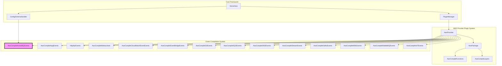
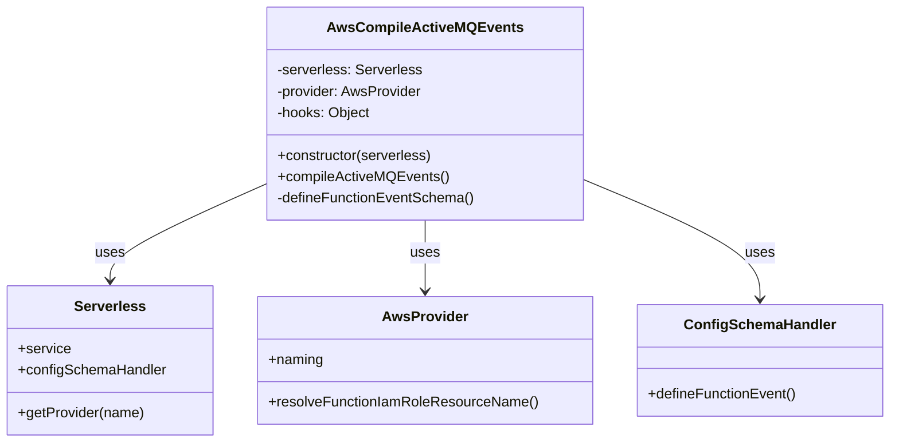
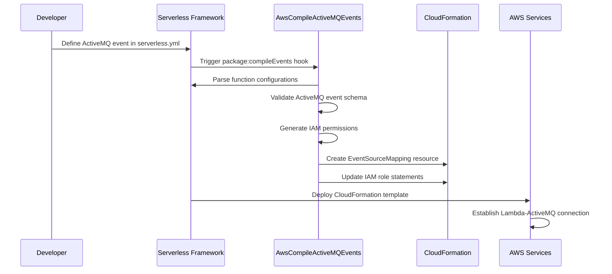
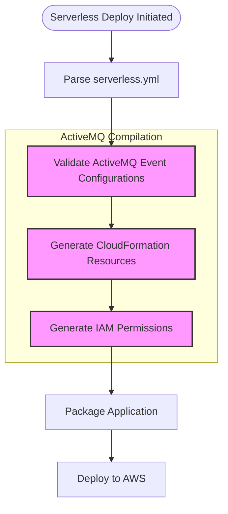

# AWS Compile ActiveMQ Events Module

## Introduction

The `aws-compile-activemq-events` module is a specialized event compilation component within the Serverless Framework's AWS provider plugin ecosystem. It handles the configuration and CloudFormation template generation for AWS Lambda functions triggered by Amazon MQ (ActiveMQ) message broker events. This module transforms ActiveMQ event definitions in serverless.yml into AWS CloudFormation resources that establish event source mappings between ActiveMQ brokers and Lambda functions.

## Architecture Overview

The module operates as part of the AWS events compilation pipeline, specifically handling ActiveMQ message broker integrations. It follows the standard event compilation pattern established by other AWS event types while implementing ActiveMQ-specific configuration requirements and IAM permissions.



## Core Component: AwsCompileActiveMQEvents

### Class Structure



### Component Responsibilities

The `AwsCompileActiveMQEvents` class serves as the primary compilation engine for ActiveMQ event configurations. It transforms high-level serverless function event definitions into AWS CloudFormation resources, specifically `AWS::Lambda::EventSourceMapping` resources that establish the connection between ActiveMQ brokers and Lambda functions.

### Event Schema Definition

The module defines a comprehensive schema for ActiveMQ function events that includes:

- **Broker ARN**: The Amazon MQ broker identifier following AWS ARN format
- **Basic Auth ARN**: Secrets Manager ARN containing authentication credentials
- **Queue Name**: The specific ActiveMQ queue to monitor
- **Batch Size**: Configurable batch processing size (1-10,000 messages)
- **Maximum Batching Window**: Time window for message batching (0-300 seconds)
- **Enabled State**: Toggle for event source mapping activation
- **Filter Patterns**: Optional message filtering criteria

### IAM Permissions Management

The module automatically generates required IAM permissions for Lambda functions to interact with ActiveMQ brokers:

1. **EC2 Permissions**: Network interface management for VPC connectivity
2. **Secrets Manager Permissions**: Secure credential access
3. **MQ Broker Permissions**: Broker description and interaction capabilities

## Data Flow Architecture



## Integration with Serverless Framework

### Plugin Registration

The module integrates with the Serverless Framework through the plugin system, registering itself as an event compilation handler. It hooks into the `package:compileEvents` lifecycle event, which is triggered during the packaging phase of serverless deployments.

### Configuration Schema Integration

The module extends the Serverless Framework's configuration schema system by defining the `activemq` function event type. This integration enables validation of ActiveMQ event configurations during the serverless.yml parsing phase, providing early error detection and improved developer experience.

### Dependency Resolution

The module utilizes the `resolveLambdaTarget` utility function to handle various Lambda function targeting scenarios, including:
- Direct function references
- Function aliases
- Version-specific targeting

## CloudFormation Resource Generation

### Event Source Mapping Resource

The primary output of the compilation process is an `AWS::Lambda::EventSourceMapping` CloudFormation resource with the following structure:

```yaml
Type: AWS::Lambda::EventSourceMapping
Properties:
  FunctionName: !Ref FunctionName
  EventSourceArn: !Ref ActiveMQBrokerArn
  Queues: [queueName]
  SourceAccessConfigurations:
    - Type: BASIC_AUTH
      URI: !Ref BasicAuthSecretArn
  BatchSize: 100  # Optional
  MaximumBatchingWindowInSeconds: 5  # Optional
  Enabled: true  # Optional
  FilterCriteria:  # Optional
    Filters:
      - Pattern: '{"key": "value"}'
```

### IAM Role Enhancements

The module enhances the Lambda execution role with specific permissions required for ActiveMQ integration:

```yaml
Policies:
  - PolicyDocument:
      Statement:
        - Effect: Allow
          Action:
            - ec2:CreateNetworkInterface
            - ec2:DescribeNetworkInterfaces
            - ec2:DescribeVpcs
            - ec2:DeleteNetworkInterface
            - ec2:DescribeSubnets
            - ec2:DescribeSecurityGroups
          Resource: "*"
        - Effect: Allow
          Action: secretsmanager:GetSecretValue
          Resource: !Ref BasicAuthSecretArn
        - Effect: Allow
          Action: mq:DescribeBroker
          Resource: !Ref ActiveMQBrokerArn
```

## Relationship with Other Modules

### Streaming Events Module Group

The ActiveMQ events module is part of the streaming events module group, which includes:

- **[aws-compile-stream-events](aws-compile-stream-events.md)**: Handles Kinesis and DynamoDB stream events
- **[aws-compile-kafka-events](aws-compile-kafka-events.md)**: Manages Amazon MSK Kafka events
- **[aws-compile-msk-events](aws-compile-msk-events.md)**: Specialized MSK event handling
- **[aws-compile-rabbitmq-events](aws-compile-rabbitmq-events.md)**: RabbitMQ message broker events

### AWS Provider Dependencies

The module depends on core AWS provider components:

- **[aws-provider](aws-provider.md)**: Base AWS provider functionality and naming conventions
- **[aws-package-compile](aws-package-compile.md)**: Package compilation infrastructure
- **[configuration-management](configuration-management.md)**: Configuration schema handling

### Core Framework Integration

The module integrates with framework-level components:

- **[core-orchestrator](core-orchestrator.md)**: Serverless Framework lifecycle management
- **[plugin-management](plugin-management.md)**: Plugin registration and hook system
- **[service-model](service-model.md)**: Service configuration parsing and validation

## Process Flow



## Configuration Examples

### Basic ActiveMQ Event Configuration

```yaml
functions:
  processActiveMQMessages:
    handler: handler.processMessages
    events:
      - activemq:
          arn: arn:aws:mq:us-east-1:123456789012:broker:MyBroker:b-a1b2c3d4e5f6
          basicAuthArn: arn:aws:secretsmanager:us-east-1:123456789012:secret:activemq-credentials
          queue: MyQueue
```

### Advanced Configuration with Optional Parameters

```yaml
functions:
  processActiveMQMessages:
    handler: handler.processMessages
    events:
      - activemq:
          arn: arn:aws:mq:us-east-1:123456789012:broker:MyBroker:b-a1b2c3d4e5f6
          basicAuthArn: arn:aws:secretsmanager:us-east-1:123456789012:secret:activemq-credentials
          queue: MyQueue
          batchSize: 500
          maximumBatchingWindow: 30
          enabled: true
          filterPatterns:
            - {"messageType": ["order", "payment"]}
```

## Error Handling and Validation

The module implements comprehensive validation through the Serverless Framework's schema system, ensuring that:

- Broker ARNs follow the correct format
- Basic authentication ARNs reference valid Secrets Manager resources
- Batch sizes remain within AWS limits (1-10,000)
- Batching windows are within acceptable ranges (0-300 seconds)
- Required properties are present in the configuration

## Security Considerations

### Credential Management

The module enforces the use of AWS Secrets Manager for storing ActiveMQ authentication credentials, preventing hardcoded credentials in serverless configuration files.

### IAM Principle of Least Privilege

Generated IAM permissions follow the principle of least privilege, granting only the necessary permissions for ActiveMQ integration:

- EC2 permissions are scoped to network interface operations required for VPC connectivity
- Secrets Manager permissions are limited to specific secret ARNs
- MQ permissions are restricted to the specified broker ARNs

### Network Security

The module supports VPC-enabled Lambda functions, ensuring that ActiveMQ connections can be established within private network configurations without exposing brokers to public internet access.

## Performance Optimization

### Batch Processing

The module supports configurable batch sizes and batching windows, allowing developers to optimize Lambda invocation frequency and message processing efficiency based on their specific use cases.

### Filter Patterns

Message filtering capabilities reduce unnecessary Lambda invocations by processing only messages that match specified criteria, improving overall system efficiency and reducing costs.

## Monitoring and Observability

The generated CloudFormation resources integrate with AWS CloudWatch, providing:

- Event source mapping metrics
- Lambda invocation metrics
- Error rate monitoring
- Message processing latency tracking

## Best Practices

1. **Use appropriate batch sizes** based on message processing requirements and Lambda timeout settings
2. **Implement proper error handling** in Lambda functions to manage message processing failures
3. **Configure dead letter queues** for failed message processing scenarios
4. **Use filter patterns** to reduce unnecessary Lambda invocations
5. **Monitor CloudWatch metrics** to optimize batch size and window settings
6. **Secure credential storage** using AWS Secrets Manager with appropriate rotation policies
7. **Implement VPC configurations** for enhanced network security when applicable