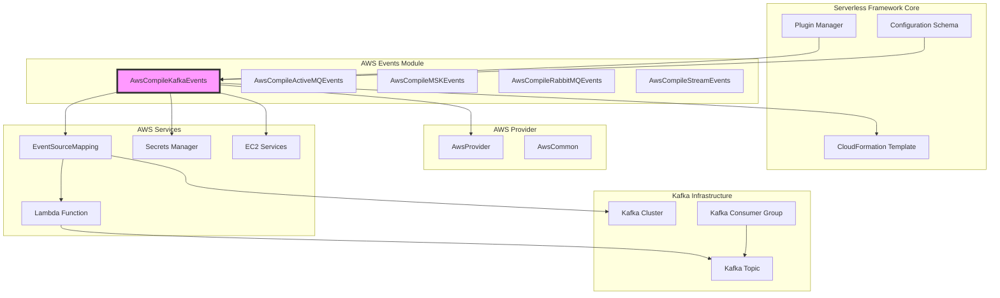
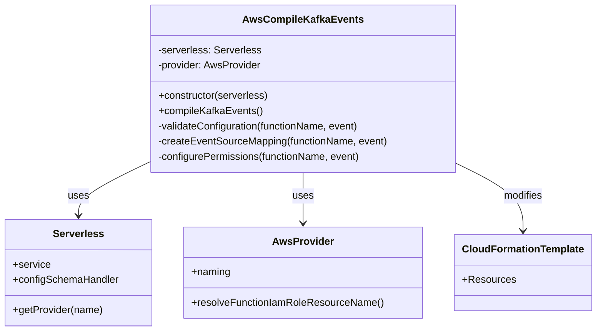
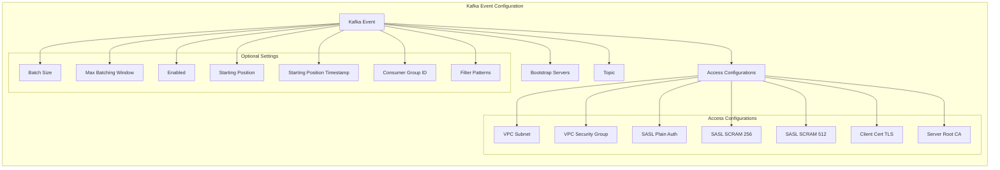
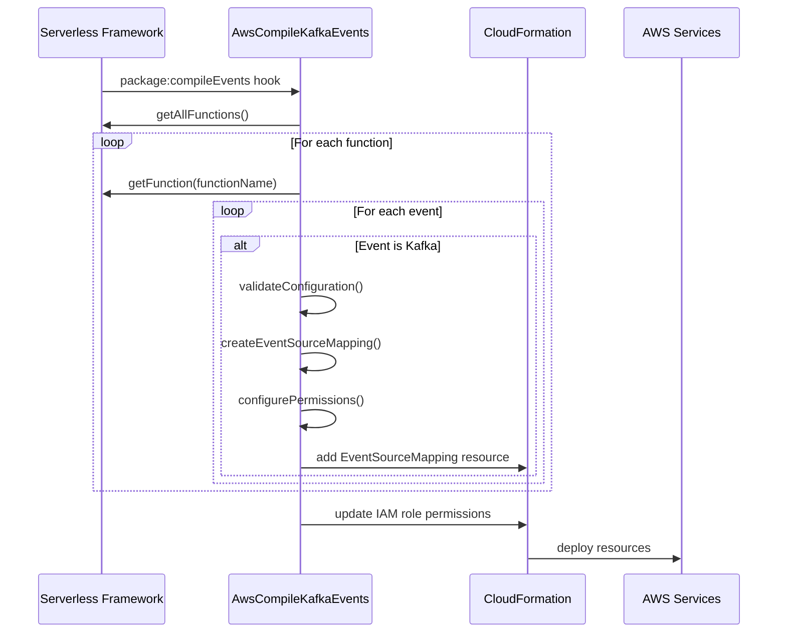
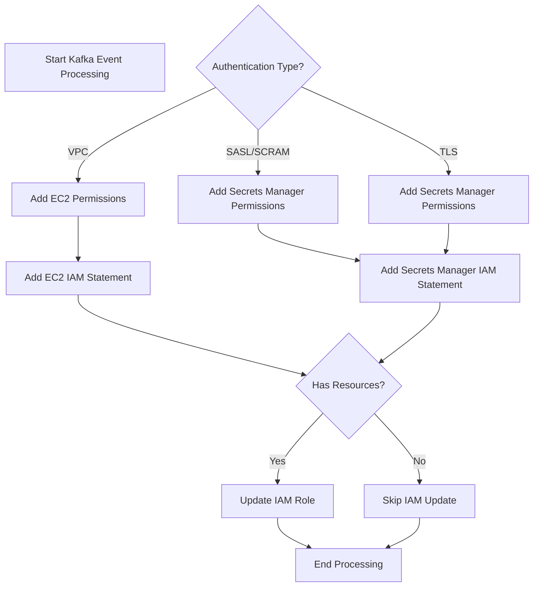
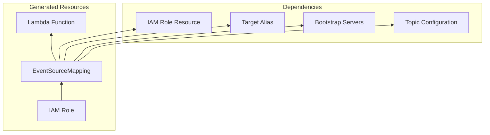
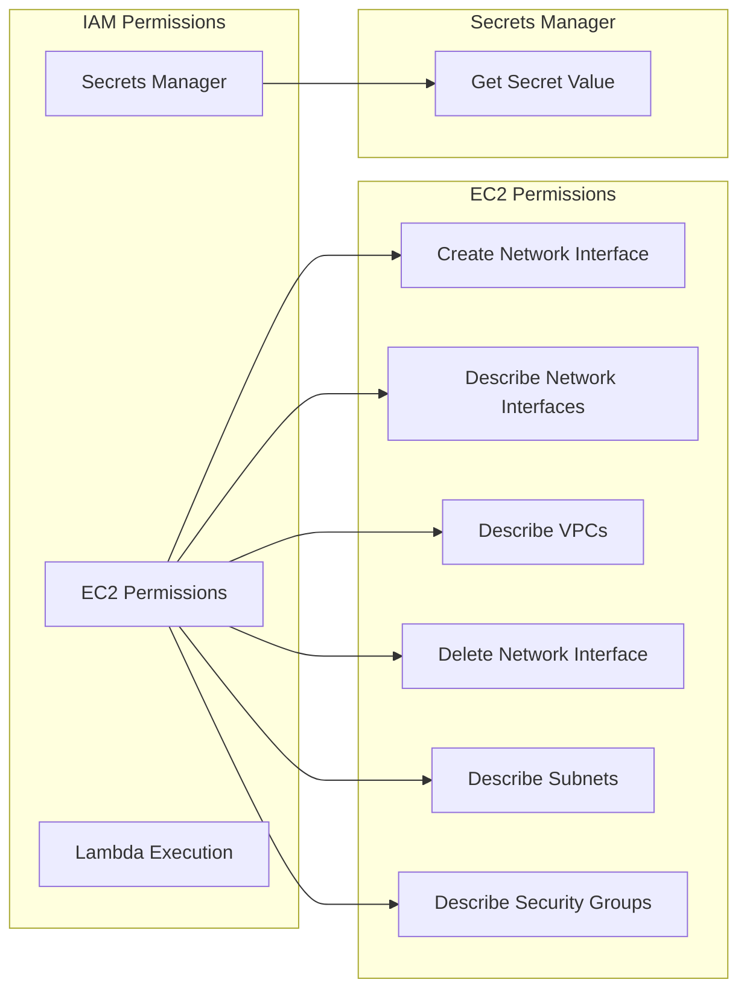

# AWS Compile Kafka Events Module

## Introduction

The `aws-compile-kafka-events` module is responsible for compiling and configuring AWS Lambda event source mappings for Apache Kafka events within the Serverless Framework. This module enables serverless functions to consume messages from self-managed Apache Kafka clusters as event sources, providing seamless integration between Kafka messaging systems and AWS Lambda functions.

## Architecture Overview

The module operates as part of the AWS event compilation pipeline, specifically handling Kafka event sources during the CloudFormation template generation process. It transforms Kafka event configurations defined in `serverless.yml` into AWS Lambda EventSourceMapping resources that establish the connection between Lambda functions and Kafka topics.



## Component Structure

### Core Component: AwsCompileKafkaEvents

The `AwsCompileKafkaEvents` class is the primary component responsible for processing Kafka event configurations and generating the appropriate AWS resources.



## Configuration Schema

The module defines a comprehensive schema for Kafka event configuration that supports various authentication methods and networking options:



## Data Flow and Processing

### Event Compilation Process



### Permission Configuration Flow



## Integration Points

### Dependencies

The module integrates with several other components within the Serverless Framework ecosystem:

1. **[aws-provider](aws-provider.md)**: Provides AWS-specific functionality and naming conventions
2. **[aws-package-compile](aws-package-compile.md)**: Parent module for AWS resource compilation
3. **[core-framework](core-framework.md)**: Core Serverless Framework services and configuration
4. **[aws-common](aws-common.md)**: Shared AWS utilities and helpers

### Resource Dependencies



## Security and Authentication

### Authentication Methods

The module supports multiple authentication mechanisms for connecting to Kafka clusters:

1. **VPC-based Access**: Uses VPC subnets and security groups for network-level security
2. **SASL Authentication**: Supports PLAIN, SCRAM-256, and SCRAM-512 mechanisms
3. **TLS Authentication**: Client certificate and server root CA certificate validation
4. **Secrets Manager Integration**: Secure storage and retrieval of authentication credentials

### Permission Management



## Configuration Examples

### Basic Kafka Event Configuration

```yaml
functions:
  processKafkaMessages:
    handler: handler.processKafka
    events:
      - kafka:
          accessConfigurations:
            vpcSubnet:
              - subnet-12345678
            vpcSecurityGroup:
              - sg-12345678
          bootstrapServers:
            - "broker1.kafka.example.com:9092"
            - "broker2.kafka.example.com:9092"
          topic: "my-topic"
          batchSize: 100
          startingPosition: LATEST
```

### SASL Authentication Configuration

```yaml
functions:
  processKafkaMessages:
    handler: handler.processKafka
    events:
      - kafka:
          accessConfigurations:
            saslScram512Auth:
              - "arn:aws:secretsmanager:region:account:secret:kafka-credentials"
          bootstrapServers:
            - "broker1.kafka.example.com:9092"
          topic: "secure-topic"
          consumerGroupId: "my-consumer-group"
```

## Error Handling

The module implements comprehensive validation and error handling for configuration issues:

- **VPC Configuration Validation**: Ensures both subnet and security group are specified
- **Starting Position Validation**: Validates timestamp requirements for AT_TIMESTAMP mode
- **Schema Validation**: Enforces configuration schema requirements
- **Resource Validation**: Validates AWS resource ARNs and formats

## Performance Considerations

### Batch Processing
- Supports batch sizes from 1 to 10,000 messages
- Configurable maximum batching window (0-300 seconds)
- Filter patterns for message preprocessing

### Scaling
- Consumer group ID configuration for parallel processing
- Starting position options for different consumption patterns
- Enable/disable functionality for event source management

## Related Documentation

- [AWS Provider Module](aws-provider.md) - Core AWS provider functionality
- [AWS Package Compile Module](aws-package-compile.md) - Parent compilation module
- [AWS Streaming Events Module](aws-streaming-events.md) - Related streaming event handlers
- [Core Framework Module](core-framework.md) - Serverless Framework core services