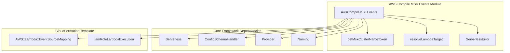
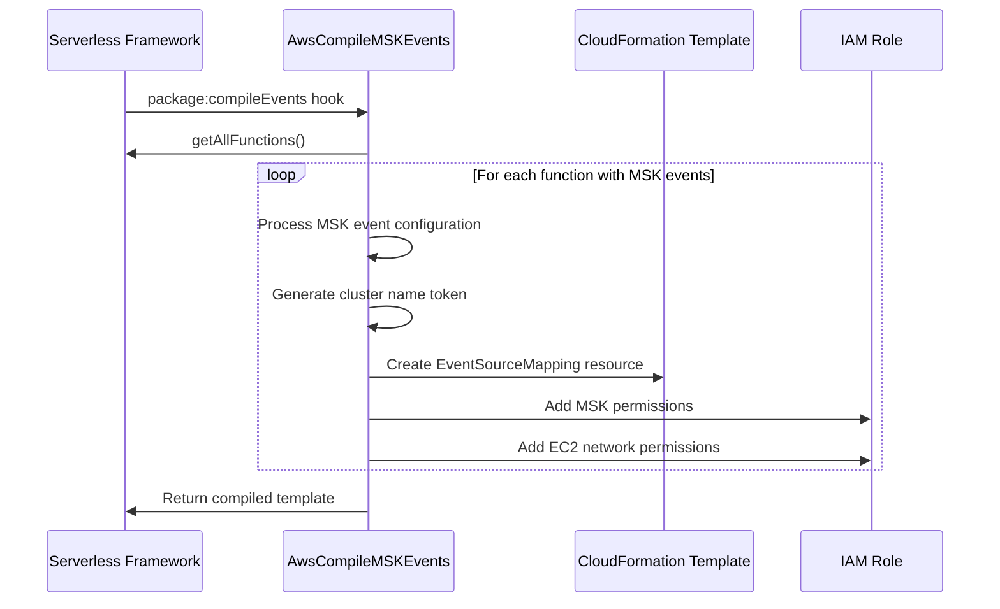
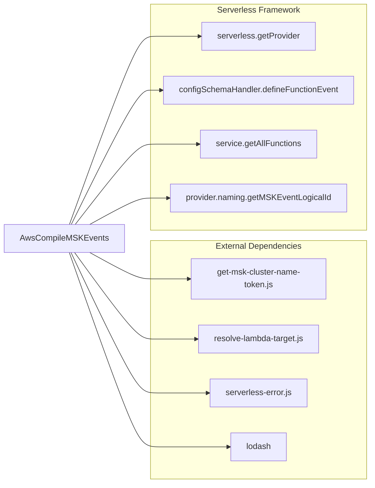
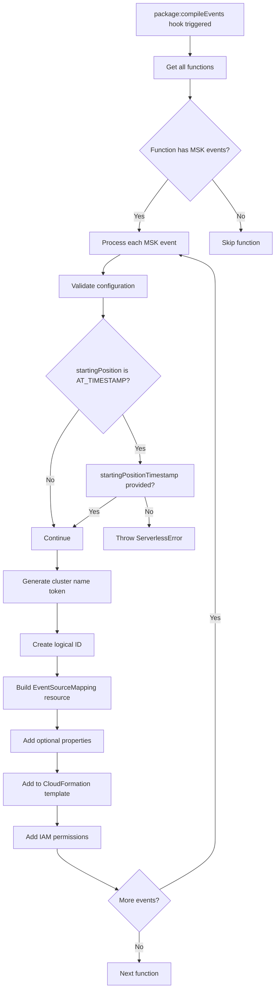

# AWS Compile MSK Events Module

## Introduction

The `aws-compile-msk-events` module is responsible for compiling Amazon Managed Streaming for Apache Kafka (MSK) event source mappings for AWS Lambda functions in the Serverless Framework. This module transforms MSK event configurations defined in `serverless.yml` into AWS CloudFormation resources that establish event source mappings between MSK clusters and Lambda functions.

## Architecture Overview



## Core Components

### AwsCompileMSKEvents Class

The main class responsible for compiling MSK events into CloudFormation resources. It extends the Serverless Framework's event compilation system by providing MSK-specific functionality.

**Key Responsibilities:**
- Schema definition for MSK event configuration
- CloudFormation resource generation for MSK event source mappings
- IAM role statement management for MSK access
- Event source mapping configuration with various options

## Data Flow



## Configuration Schema

The module defines a comprehensive schema for MSK event configuration:

```yaml
functions:
  myFunction:
    handler: index.handler
    events:
      - msk:
          arn: arn:aws:kafka:region:account:cluster/cluster-name/cluster-uuid
          topic: my-topic
          batchSize: 100
          maximumBatchingWindow: 5
          enabled: true
          startingPosition: LATEST
          startingPositionTimestamp: 1640995200
          saslScram512: arn:aws:secretsmanager:region:account:secret:secret-name
          consumerGroupId: my-consumer-group
          filterPatterns:
            - key: value
```

### Schema Properties

| Property | Type | Required | Description |
|----------|------|----------|-------------|
| `arn` | string/CF reference | Yes | MSK cluster ARN |
| `topic` | string | Yes | Kafka topic name |
| `batchSize` | number | No | Batch size (1-10000) |
| `maximumBatchingWindow` | number | No | Batching window in seconds (0-300) |
| `enabled` | boolean | No | Enable/disable event source |
| `startingPosition` | string | No | Starting position: LATEST, TRIM_HORIZON, AT_TIMESTAMP |
| `startingPositionTimestamp` | number | No | Required when startingPosition is AT_TIMESTAMP |
| `saslScram512` | string | No | ARN for SASL/SCRAM512 authentication |
| `consumerGroupId` | string | No | Consumer group ID (max 200 chars) |
| `filterPatterns` | array | No | Event filtering patterns |

## CloudFormation Resource Generation

### Event Source Mapping Resource

The module generates `AWS::Lambda::EventSourceMapping` resources with the following structure:

```json
{
  "Type": "AWS::Lambda::EventSourceMapping",
  "DependsOn": ["IamRoleLambdaExecution", "FunctionAlias"],
  "Properties": {
    "EventSourceArn": "arn:aws:kafka:region:account:cluster/cluster-name/cluster-uuid",
    "FunctionName": "function-arn-or-alias",
    "StartingPosition": "TRIM_HORIZON",
    "Topics": ["topic-name"],
    "BatchSize": 100,
    "MaximumBatchingWindowInSeconds": 5,
    "Enabled": true,
    "AmazonManagedKafkaEventSourceConfig": {
      "ConsumerGroupId": "consumer-group-id"
    },
    "SourceAccessConfigurations": [
      {
        "Type": "SASL_SCRAM_512_AUTH",
        "URI": "arn:aws:secretsmanager:region:account:secret:secret-name"
      }
    ],
    "FilterCriteria": {
      "Filters": [
        {
          "Pattern": "{\"key\":\"value\"}"
        }
      ]
    }
  }
}
```

### IAM Role Statements

The module automatically adds required IAM permissions to the Lambda execution role:

#### MSK Permissions
```json
{
  "Effect": "Allow",
  "Action": [
    "kafka:DescribeCluster",
    "kafka:GetBootstrapBrokers"
  ],
  "Resource": ["arn:aws:kafka:region:account:cluster/cluster-name/cluster-uuid"]
}
```

#### EC2 Network Permissions
```json
{
  "Effect": "Allow",
  "Action": [
    "ec2:CreateNetworkInterface",
    "ec2:DescribeNetworkInterfaces",
    "ec2:DescribeVpcs",
    "ec2:DeleteNetworkInterface",
    "ec2:DescribeSubnets",
    "ec2:DescribeSecurityGroups"
  ],
  "Resource": "*"
}
```

## Component Dependencies



## Process Flow



## Error Handling

The module implements specific error handling for MSK event configuration:

### Invalid Starting Position Timestamp
- **Error Code**: `FUNCTION_MSK_STARTING_POSITION_TIMESTAMP_INVALID`
- **Condition**: When `startingPosition` is `AT_TIMESTAMP` but `startingPositionTimestamp` is not provided
- **Message**: "You must specify startingPositionTimestamp for function: {functionName} when startingPosition is AT_TIMESTAMP."

## Integration with Serverless Framework

### Hook Registration
The module registers with the Serverless Framework's plugin system through the `package:compileEvents` hook, ensuring MSK events are compiled during the packaging phase.

### Schema Registration
Uses the `configSchemaHandler.defineFunctionEvent` method to register the MSK event schema, providing validation and IntelliSense support in IDEs.

### Resource Naming
Leverages the provider's naming conventions through `provider.naming.getMSKEventLogicalId` to generate consistent and unique logical IDs for CloudFormation resources.

## Related Modules

- [aws-compile-stream-events](aws-compile-stream-events.md) - Handles Kinesis and DynamoDB stream events
- [aws-compile-kafka-events](aws-compile-kafka-events.md) - Handles self-managed Kafka events
- [aws-package-compile](aws-package-compile.md) - Parent module for AWS packaging and compilation
- [aws-events](aws-events.md) - Overview of all AWS event types

## Best Practices

1. **Security**: Use SASL/SCRAM512 authentication for production MSK clusters
2. **Performance**: Configure appropriate batch sizes based on your processing capacity
3. **Monitoring**: Set up CloudWatch alarms for event source mapping metrics
4. **Error Handling**: Implement proper error handling in Lambda functions for processing failures
5. **Consumer Groups**: Use meaningful consumer group IDs for better monitoring and debugging

## Limitations

- Maximum batch size: 10,000 records
- Maximum batching window: 300 seconds
- Consumer group ID maximum length: 200 characters
- Only supports MSK clusters, not self-managed Kafka clusters (see [aws-compile-kafka-events](aws-compile-kafka-events.md))