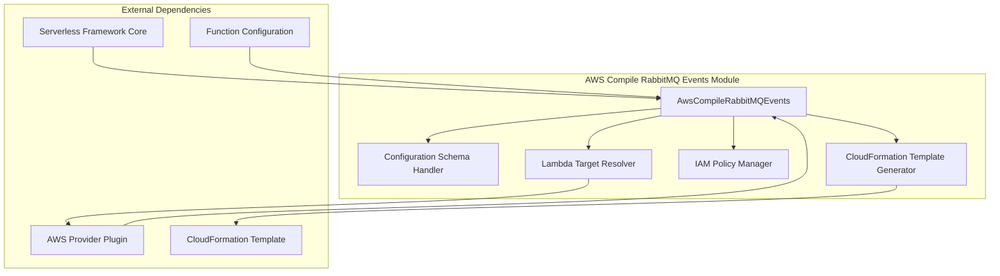
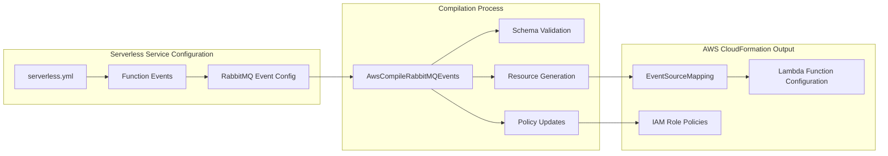
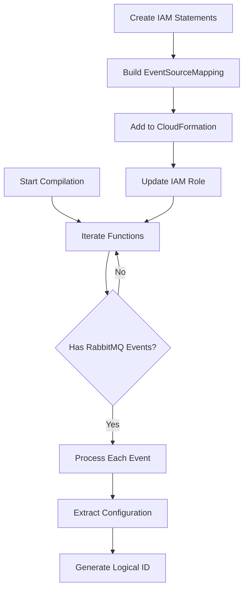
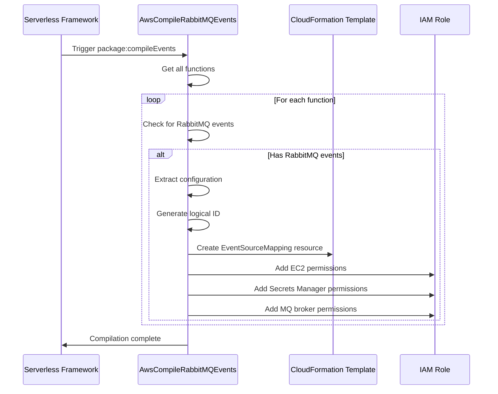

# AWS Compile RabbitMQ Events Module

## Overview

The AWS Compile RabbitMQ Events module is responsible for configuring and compiling RabbitMQ event source mappings for AWS Lambda functions within the Serverless Framework. This module enables serverless applications to consume messages from RabbitMQ message brokers as event triggers, facilitating asynchronous message processing patterns in cloud-native architectures.

## Purpose and Core Functionality

The module's primary purpose is to transform RabbitMQ event configurations defined in `serverless.yml` into AWS CloudFormation resources that establish event source mappings between RabbitMQ brokers and Lambda functions. It handles the complex AWS permissions, networking requirements, and configuration parameters needed to securely connect Lambda functions to RabbitMQ message queues.

### Key Capabilities

- **Event Source Mapping Creation**: Generates AWS::Lambda::EventSourceMapping resources for RabbitMQ integration
- **Security Configuration**: Manages IAM permissions for Secrets Manager, EC2 networking, and MQ broker access
- **Batch Processing**: Configures batch sizes and batching windows for message processing optimization
- **Authentication Management**: Handles basic authentication through AWS Secrets Manager integration
- **Virtual Host Support**: Supports RabbitMQ virtual host configurations
- **Message Filtering**: Implements filter patterns for selective message processing

## Architecture

### Component Structure



### Integration with Serverless Framework



## Core Component Details

### AwsCompileRabbitMQEvents Class

The main component of this module, responsible for orchestrating the compilation of RabbitMQ events into CloudFormation resources.

#### Constructor
- **Parameters**: `serverless` - The Serverless Framework instance
- **Initialization**: Sets up provider reference, hooks, and configuration schema
- **Hook Registration**: Registers for the `package:compileEvents` lifecycle event

#### Key Methods

##### `compileRabbitMQEvents()`
The primary method that processes all functions and their RabbitMQ event configurations.

**Process Flow:**


##### Configuration Schema Definition
Defines the valid structure for RabbitMQ event configurations:

```javascript
{
  arn: string | CloudFormation Import/Ref,           // Required: RabbitMQ broker ARN
  basicAuthArn: string | CloudFormation Import/Ref,  // Required: Secrets Manager ARN
  queue: string,                                     // Required: Queue name
  batchSize: number,                                 // Optional: 1-10000
  maximumBatchingWindow: number,                     // Optional: 0-300 seconds
  enabled: boolean,                                  // Optional: Enable/disable
  virtualHost: string,                               // Optional: Virtual host
  filterPatterns: array                              // Optional: Message filters
}
```

## Data Flow

### Event Processing Pipeline



### Permission Management

The module automatically configures three categories of IAM permissions:

1. **EC2 Permissions**: Required for Lambda to create network interfaces to access RabbitMQ
   - `ec2:CreateNetworkInterface`
   - `ec2:DescribeNetworkInterfaces`
   - `ec2:DescribeVpcs`
   - `ec2:DeleteNetworkInterface`
   - `ec2:DescribeSubnets`
   - `ec2:DescribeSecurityGroups`

2. **Secrets Manager Permissions**: For accessing RabbitMQ authentication credentials
   - `secretsmanager:GetSecretValue`

3. **MQ Broker Permissions**: For describing RabbitMQ broker details
   - `mq:DescribeBroker`

## Configuration Examples

### Basic RabbitMQ Event Configuration

```yaml
functions:
  processMessages:
    handler: handler.processMessages
    events:
      - rabbitmq:
          arn: arn:aws:mq:us-east-1:123456789012:broker:MyBroker:b-12345678-1234-1234-1234-123456789012
          basicAuthArn: arn:aws:secretsmanager:us-east-1:123456789012:secret:MyBrokerCredentials
          queue: my-queue
```

### Advanced Configuration with All Options

```yaml
functions:
  processMessages:
    handler: handler.processMessages
    events:
      - rabbitmq:
          arn: 
            Fn::ImportValue: MyRabbitMQBrokerArn
          basicAuthArn: 
            Ref: RabbitMQCredentialsSecret
          queue: orders-queue
          virtualHost: /production
          batchSize: 100
          maximumBatchingWindow: 30
          enabled: true
          filterPatterns:
            - eventType: ["order.created"]
            - priority: ["high", "urgent"]
```

## Dependencies and Integration

### Internal Dependencies

- **[aws-provider](aws-provider.md)**: Provides AWS-specific utilities and naming conventions
- **[aws-package-compile](aws-package-compile.md)**: Parent compilation module for AWS resources
- **[core-framework](core-framework.md)**: Core Serverless Framework functionality

### External Dependencies

- **AWS Lambda Event Source Mapping**: The underlying AWS service for RabbitMQ integration
- **Amazon MQ**: Managed message broker service hosting RabbitMQ
- **AWS Secrets Manager**: Secure credential storage for RabbitMQ authentication

## Error Handling and Validation

### Schema Validation
The module uses JSON Schema validation to ensure RabbitMQ event configurations meet AWS requirements:

- **ARN Format**: Validates RabbitMQ broker ARN format
- **Required Fields**: Ensures `arn`, `basicAuthArn`, and `queue` are provided
- **Value Ranges**: Validates batch size (1-10000) and batching window (0-300 seconds)
- **Property Restrictions**: Prevents additional unknown properties

### Runtime Considerations

- **Network Configuration**: Automatically handles VPC and security group requirements
- **Authentication**: Manages secure credential access through Secrets Manager
- **Resource Dependencies**: Ensures proper CloudFormation resource dependencies

## Best Practices

### Security
- Use AWS Secrets Manager for credential management instead of hardcoding
- Implement least-privilege IAM policies
- Enable encryption in transit for RabbitMQ brokers

### Performance
- Configure appropriate batch sizes based on message processing time
- Use batching windows to optimize message aggregation
- Implement proper error handling and dead letter queues

### Monitoring
- Enable CloudWatch logging for Lambda functions
- Set up alarms for failed message processing
- Monitor RabbitMQ broker metrics

## Related Documentation

- [AWS Provider Module](aws-provider.md) - Core AWS integration functionality
- [AWS Events Module](aws-events.md) - General event handling patterns
- [AWS Package Compile Module](aws-package-compile.md) - Resource compilation framework
- [Streaming Events Module](aws-compile-stream-events.md) - Related streaming event patterns