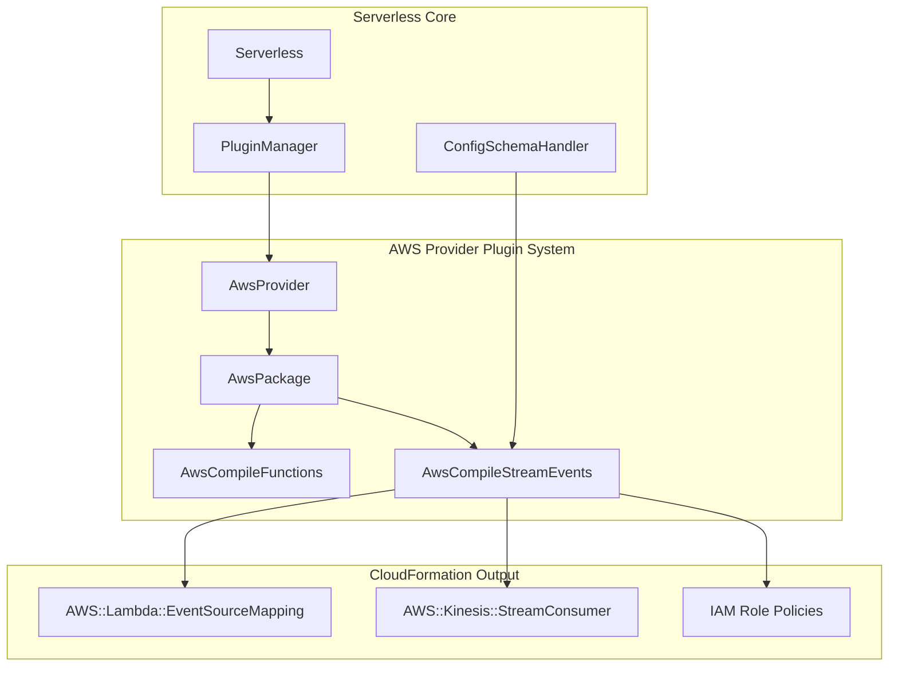
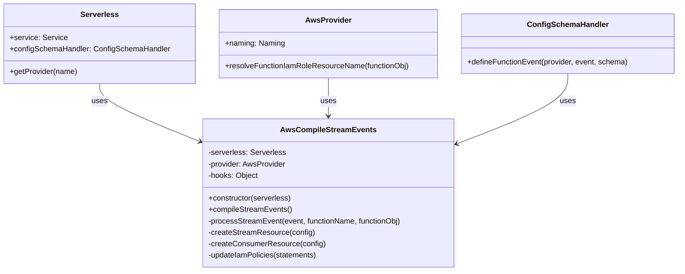
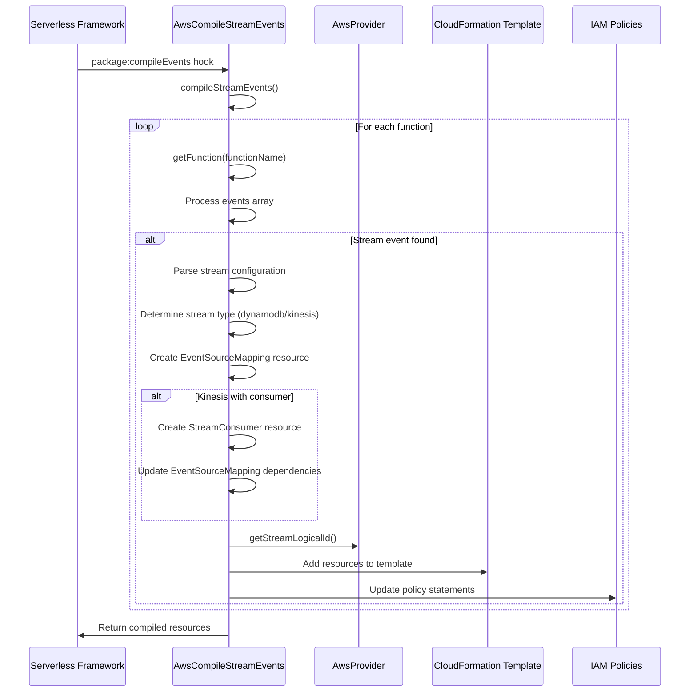
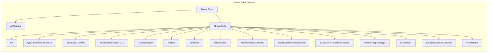
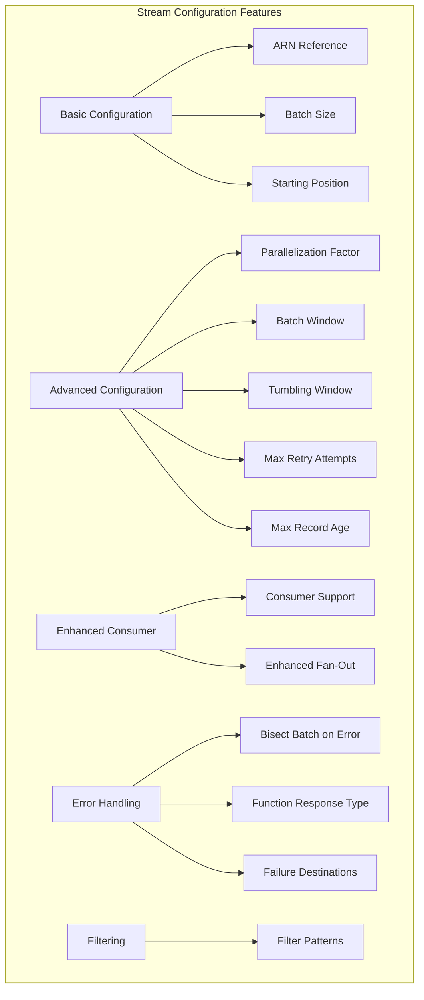
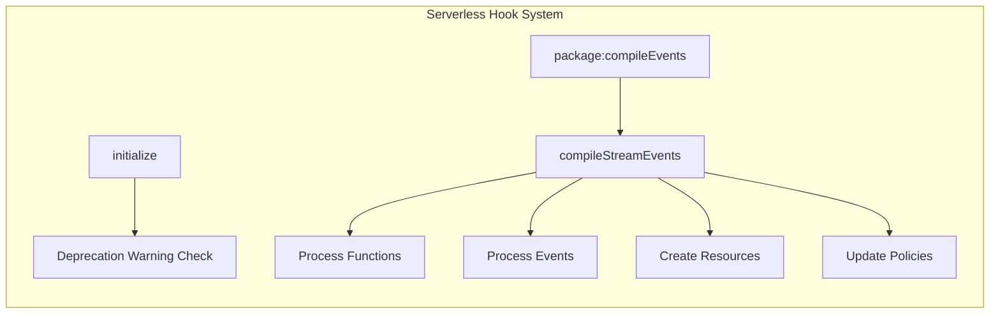

# AWS Compile Stream Events Module

## Introduction

The `aws-compile-stream-events` module is responsible for compiling AWS Lambda stream event source mappings into CloudFormation resources. It handles the configuration and deployment of Lambda functions that are triggered by DynamoDB and Kinesis streams, including support for enhanced fan-out consumers and advanced stream processing features.

This module is part of the AWS provider plugin ecosystem and integrates with the Serverless Framework's event-driven architecture to enable real-time data processing capabilities.

## Architecture Overview



## Component Structure

### Core Component: AwsCompileStreamEvents

The `AwsCompileStreamEvents` class is the main component that handles stream event compilation. It integrates with the Serverless Framework through a hook-based architecture and schema validation system.



## Event Processing Flow



## Stream Event Configuration Schema

The module defines a comprehensive schema for stream events that supports both simple ARN-based configuration and advanced object-based configuration:



## Stream Processing Features

### 1. Stream Type Support

- **DynamoDB Streams**: Change data capture from DynamoDB tables
- **Kinesis Streams**: Real-time data streaming with enhanced fan-out support

### 2. Advanced Configuration Options



### 3. IAM Policy Management

The module automatically generates appropriate IAM policy statements based on the stream configuration:

- **DynamoDB Streams**: `dynamodb:GetRecords`, `dynamodb:GetShardIterator`, `dynamodb:DescribeStream`, `dynamodb:ListStreams`
- **Kinesis Streams**: `kinesis:GetRecords`, `kinesis:GetShardIterator`, `kinesis:DescribeStream`, `kinesis:ListStreams`
- **Kinesis Enhanced Consumer**: `kinesis:GetRecords`, `kinesis:GetShardIterator`, `kinesis:DescribeStreamSummary`, `kinesis:ListShards`, `kinesis:SubscribeToShard`
- **Failure Destinations**: `sns:Publish`, `sqs:ListQueues`, `sqs:SendMessage`

## Integration with Serverless Framework

### Hook System Integration



### Schema Registration

The module registers its event schema with the Serverless Framework's configuration schema handler, enabling validation and auto-completion for stream events in `serverless.yml` files.

## Dependencies and Relationships

### Direct Dependencies

- **[aws-provider](aws-provider.md)**: Provides AWS-specific functionality and naming conventions
- **[aws-package-compile](aws-package-compile.md)**: Parent compilation module for AWS packaging
- **[core-framework](core-framework.md)**: Core Serverless Framework services and utilities

### Related Modules

- **[aws-compile-kafka-events](aws-compile-kafka-events.md)**: Handles Kafka stream events
- **[aws-compile-msk-events](aws-compile-msk-events.md)**: Handles MSK stream events
- **[aws-compile-activemq-events](aws-compile-activemq-events.md)**: Handles ActiveMQ events
- **[aws-compile-rabbitmq-events](aws-compile-rabbitmq-events.md)**: Handles RabbitMQ events

## Error Handling and Validation

The module includes comprehensive validation for stream configurations:

- **Schema Validation**: Ensures all required fields are present and valid
- **Timestamp Validation**: Validates `startingPositionTimestamp` when `startingPosition` is `AT_TIMESTAMP`
- **Resource Validation**: Ensures ARNs are properly formatted and accessible
- **Dependency Validation**: Validates that consumer resources are properly linked

## CloudFormation Resource Generation

### Event Source Mapping Resource

```yaml
Type: AWS::Lambda::EventSourceMapping
Properties:
  BatchSize: integer
  Enabled: boolean
  EventSourceArn: string
  FunctionName: string
  ParallelizationFactor: integer
  StartingPosition: string
  # Optional properties based on configuration
```

### Kinesis Stream Consumer Resource

```yaml
Type: AWS::Kinesis::StreamConsumer
Properties:
  StreamARN: string
  ConsumerName: string
```

## Usage Examples

### Basic DynamoDB Stream

```yaml
functions:
  processDynamoDBStream:
    handler: handler.processStream
    events:
      - stream: arn:aws:dynamodb:region:account:table/table-name/stream/timestamp
```

### Advanced Kinesis Stream with Consumer

```yaml
functions:
  processKinesisStream:
    handler: handler.processStream
    events:
      - stream:
          arn: arn:aws:kinesis:region:account:stream/stream-name
          type: kinesis
          batchSize: 100
          startingPosition: LATEST
          consumer: true
          destinations:
            onFailure:
              arn: arn:aws:sns:region:account:topic/failure-topic
              type: sns
```

## Best Practices

1. **Batch Size Optimization**: Choose appropriate batch sizes based on processing requirements and Lambda timeout settings
2. **Error Handling**: Configure failure destinations for reliable error handling
3. **Consumer Usage**: Use enhanced consumers for improved performance with Kinesis streams
4. **Filtering**: Implement filter patterns to reduce unnecessary Lambda invocations
5. **Monitoring**: Configure appropriate retry attempts and record age limits for your use case

## Migration and Deprecation

The module includes deprecation warnings for legacy naming schemes, particularly for Kinesis consumer naming. Users should migrate to the new `serviceSpecific` naming mode by setting `provider.kinesis.consumerNamingMode` to `serviceSpecific`.