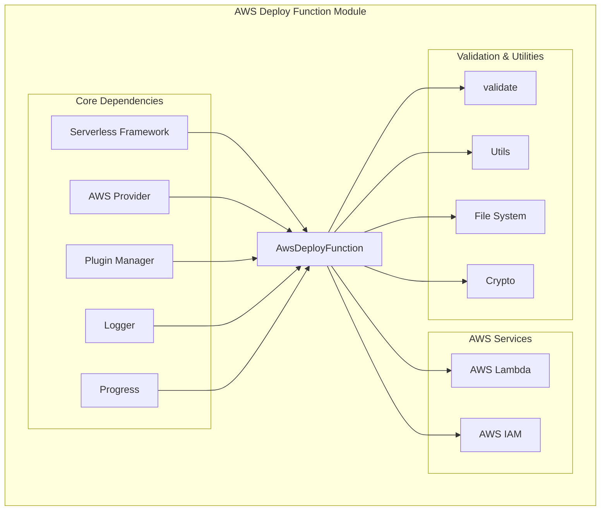
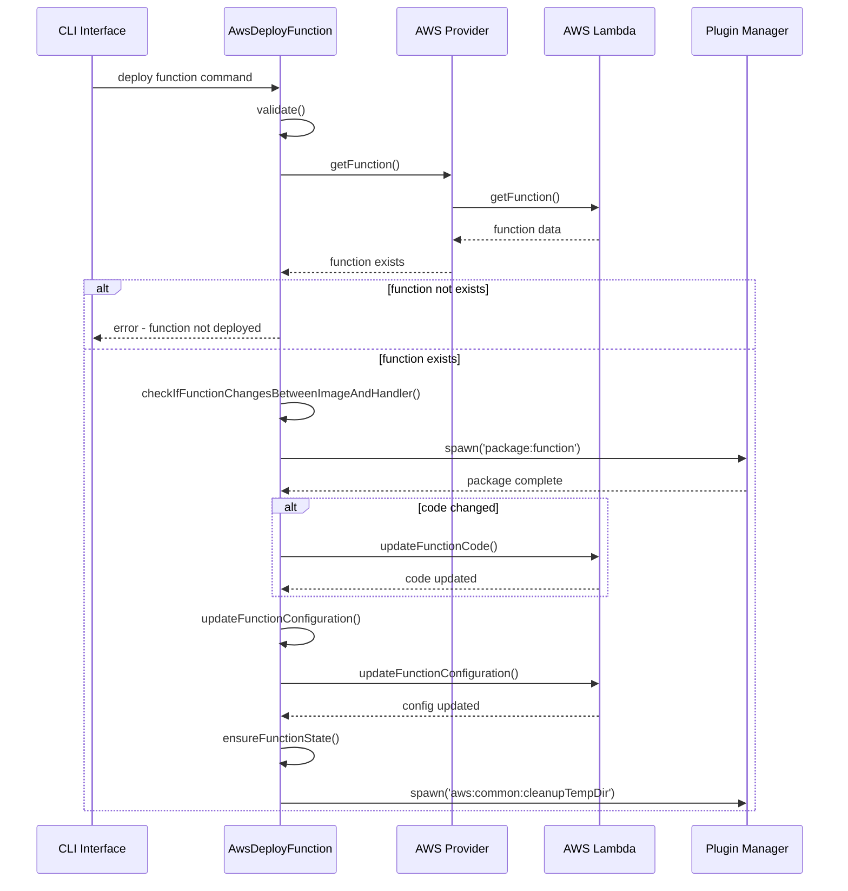
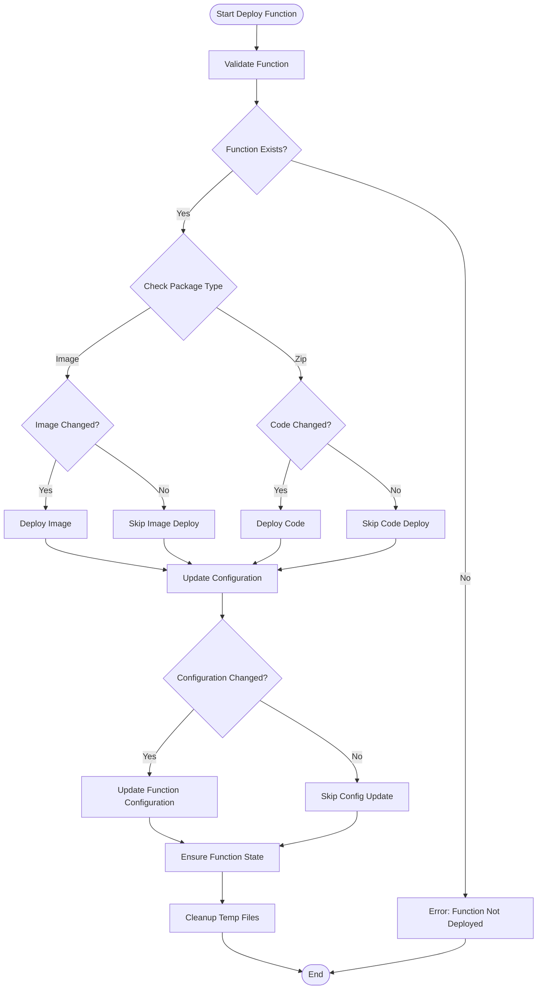
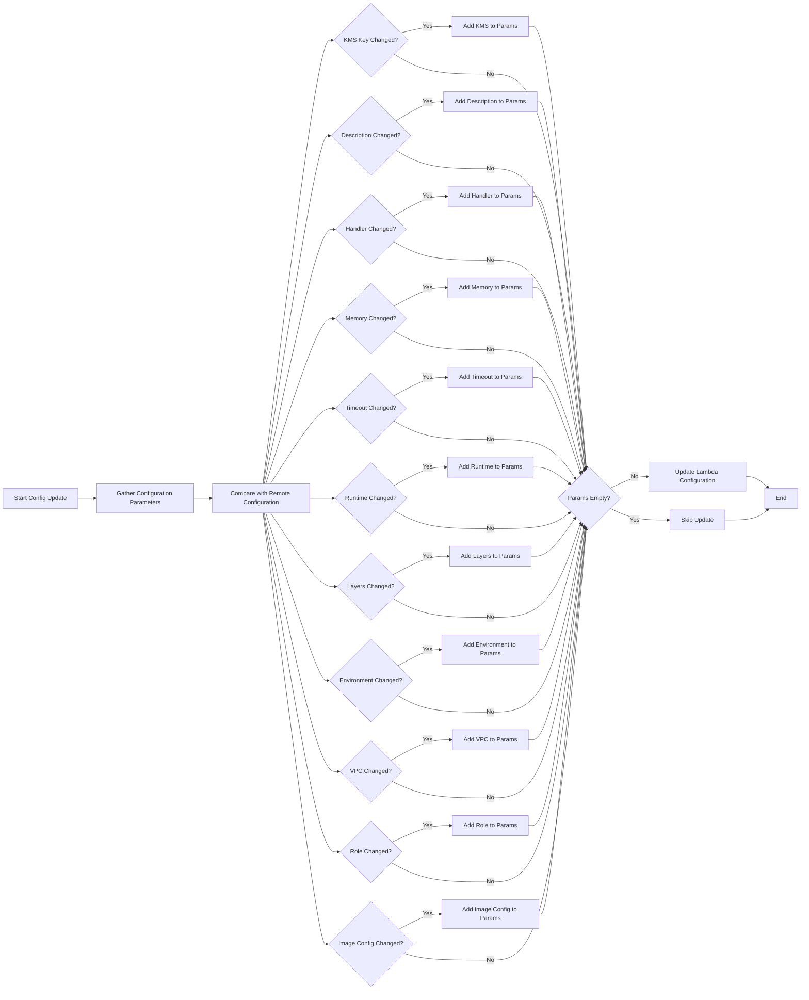

# AWS Deploy Function Module

## Introduction

The `aws-deploy-function` module provides specialized functionality for deploying individual AWS Lambda functions within the Serverless Framework. Unlike full service deployments, this module enables targeted updates to specific functions, offering faster deployment cycles and more granular control over function updates.

## Purpose and Core Functionality

The module's primary purpose is to handle the deployment of individual Lambda functions with the following key capabilities:

- **Selective Function Deployment**: Deploy only specific functions without affecting the entire service
- **Configuration Updates**: Update function configuration parameters (memory, timeout, environment variables, etc.)
- **Code Deployment**: Deploy function code changes with SHA256-based change detection
- **Image-based Functions**: Support for container image-based Lambda functions
- **State Management**: Ensure function reaches active state after deployment
- **Conflict Resolution**: Handle AWS resource conflicts during updates

## Architecture and Component Relationships

### Module Architecture



### Component Interaction Flow



## Core Components

### AwsDeployFunction Class

The main class that orchestrates function deployment operations. It implements a comprehensive deployment workflow with validation, packaging, code deployment, configuration updates, and state management.

#### Key Properties

- `serverless`: Reference to the Serverless Framework instance
- `provider`: AWS provider instance for AWS service interactions
- `options`: Command-line options and configuration
- `packagePath`: Path to deployment artifacts
- `shouldEnsureFunctionState`: Flag for state management

#### Hook System

The class registers several hooks that execute during the deployment lifecycle:

```javascript
hooks = {
  initialize: () => { /* Display deployment notice */ },
  'before:deploy:function:initialize': () => { /* Start validation progress */ },
  'deploy:function:initialize': async () => { /* Validate and check function */ },
  'before:deploy:function:packageFunction': () => { /* Progress update */ },
  'deploy:function:packageFunction': async () => { /* Package function */ },
  'before:deploy:function:deploy': () => { /* Start deployment progress */ },
  'deploy:function:deploy': async () => { /* Deploy function */ }
}
```

## Deployment Process Flow

### Function Deployment Workflow



### Configuration Update Process



## Key Features and Capabilities

### 1. Change Detection

The module implements sophisticated change detection mechanisms:

- **Code Change Detection**: Uses SHA256 hash comparison between local and remote function code
- **Image Change Detection**: Compares image SHA256 values for container-based functions
- **Configuration Change Detection**: Compares individual configuration parameters with remote settings

### 2. Configuration Management

Supports updating various function configuration parameters:

- **Basic Settings**: Handler, runtime, memory, timeout, description
- **Security**: KMS key, execution role, VPC configuration
- **Environment**: Environment variables with validation
- **Layers**: Lambda layers with Serverless Console integration
- **Dead Letter Queues**: Error handling configuration
- **Image Configuration**: Command, entry point, working directory for container functions

### 3. Error Handling and Retry Logic

Implements robust error handling with retry mechanisms:

- **Resource Conflict Resolution**: Retries configuration updates during conflicts
- **State Management**: Ensures function reaches active state after deployment
- **Timeout Protection**: Prevents infinite retry loops with time-based limits
- **Validation Errors**: Comprehensive validation with descriptive error messages

### 4. Serverless Console Integration

Automatically handles Serverless Console managed resources:

- **Layer Management**: Preserves Serverless Console layers during updates
- **Environment Variables**: Maintains Console-specific environment variables
- **Remote Detection**: Identifies remotely managed Console resources

## Dependencies and Integration

### Core Framework Dependencies

- **[Serverless Framework](core-framework.md)**: Core orchestration and plugin management
- **[AWS Provider](aws-provider.md)**: AWS service interactions and authentication
- **[Plugin Manager](plugin-management.md)**: Hook registration and lifecycle management

### Related AWS Modules

- **[AWS Deploy](aws-deploy.md)**: Full service deployment functionality
- **[AWS Package Compile](aws-package-compile.md)**: Function packaging and compilation
- **[AWS Common](aws-provider.md)**: Shared AWS utilities and configurations

### Utility Dependencies

- **Validation Module**: Function and configuration validation
- **File System**: Artifact reading and processing
- **Crypto**: SHA256 hash generation for change detection

## Usage Patterns

### Command Line Interface

```bash
# Deploy a specific function
serverless deploy function -f myFunction

# Deploy function with configuration update only
serverless deploy function -f myFunction --update-config

# Force deployment even if no changes detected
serverless deploy function -f myFunction --force
```

### Programmatic Usage

The module integrates with the Serverless Framework's plugin system and is automatically invoked when the `deploy function` command is executed.

## Best Practices

1. **Use for Development**: Ideal for rapid development cycles when working on individual functions
2. **Configuration Updates**: Use `--update-config` flag when only configuration changes are needed
3. **Force Deployment**: Use `--force` flag when deployment state is inconsistent
4. **Error Handling**: Monitor deployment logs for configuration conflicts and state issues
5. **State Verification**: Allow sufficient time for function state verification after deployment

## Error Handling

The module provides comprehensive error handling for various scenarios:

- **Function Not Found**: Clear error message when function is not yet deployed
- **Package Type Mismatch**: Prevents switching between handler and image-based functions
- **Configuration Conflicts**: Handles AWS resource conflicts with retry logic
- **Validation Errors**: Detailed validation messages for configuration issues
- **Timeout Errors**: Graceful handling of deployment timeouts

## Performance Considerations

- **Change Detection**: Minimizes unnecessary deployments through SHA256 comparison
- **Parallel Processing**: Leverages plugin manager for concurrent operations
- **Retry Logic**: Implements exponential backoff for conflict resolution
- **State Polling**: Efficient polling for function state verification

This module provides a robust and efficient solution for deploying individual Lambda functions, making it an essential tool for serverless development workflows that require frequent function updates and rapid iteration cycles.