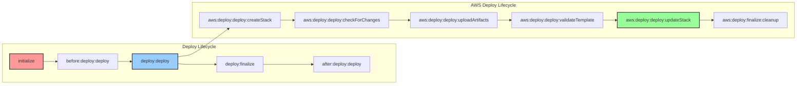
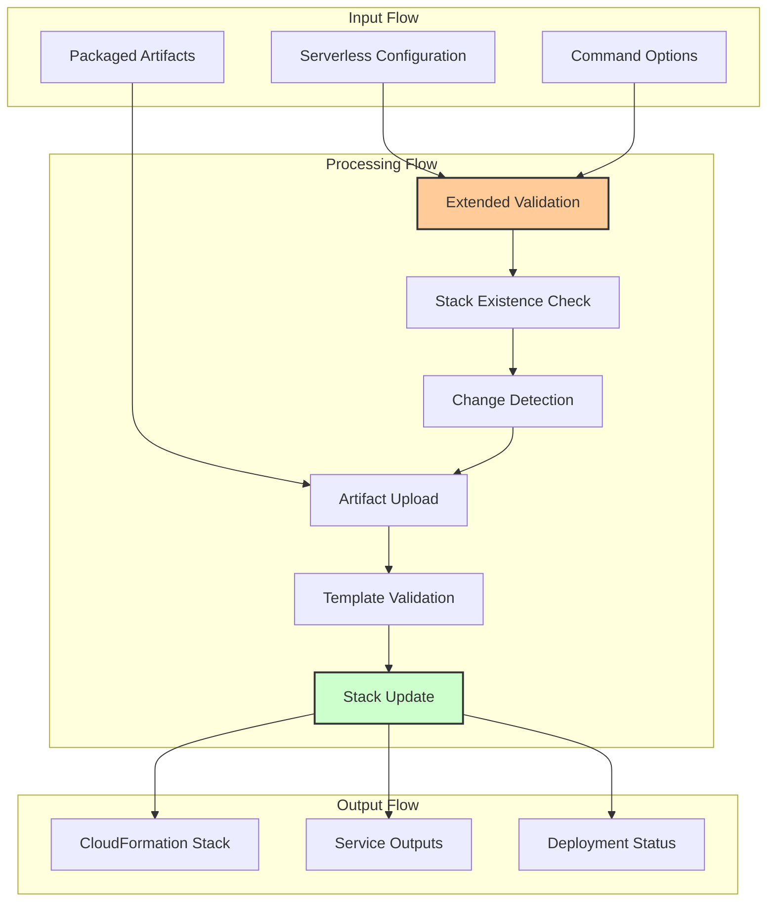
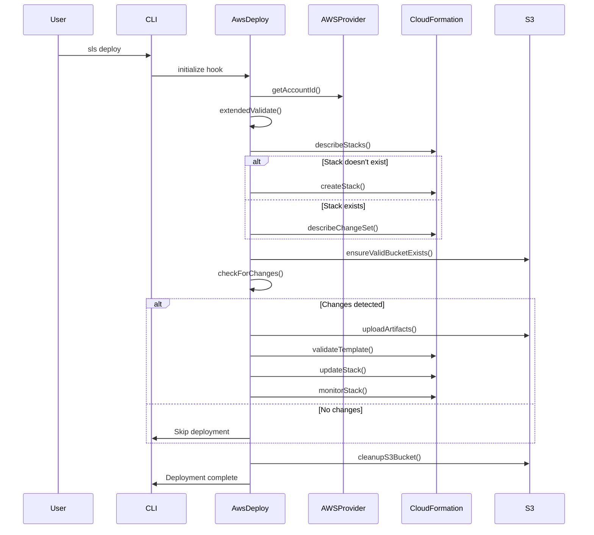

# AWS Deploy Module Documentation

## Introduction

The AWS Deploy module is a critical component of the Serverless Framework's AWS provider plugin system, responsible for orchestrating the deployment of serverless applications to AWS infrastructure. This module handles the complete deployment lifecycle, from initial stack creation through artifact upload to final CloudFormation stack updates, ensuring reliable and efficient deployment of serverless services.

## Architecture Overview

The AWS Deploy module serves as the central deployment orchestrator within the AWS provider ecosystem, integrating with multiple supporting modules to provide a comprehensive deployment solution.

```mermaid
graph TB
    subgraph "AWS Deploy Module"
        AD[AwsDeploy<br/>lib.plugins.aws.deploy.index.AwsDeploy]
        EV[extendedValidate]
        CS[createStack]
        SBN[setBucketName]
        CFC[checkForChanges]
        CSB[cleanupS3Bucket]
        EVE[ensureValidBucketExists]
        UA[uploadArtifacts]
        VT[validateTemplate]
        US[updateStack]
        MS[monitorStack]
        CIBE[checkIfBucketExists]
        WFCSC[waitForChangeSetCreation]
        UZF[uploadZipFile]
        GCCSP[getCreateChangeSetParams]
        GCSP[getCreateStackParams]
        GECSP[getExecuteChangeSetParams]
        GUSP[getUpdateStackParams]
        GSSP[getSharedStackActionParams]
    end

    subgraph "Core Framework"
        CF[lib.serverless.Serverless]
        PM[lib.classes.plugin-manager.PluginManager]
        CLI[lib.classes.cli.CLI]
    end

    subgraph "AWS Provider"
        AP[lib.plugins.aws.provider.AwsProvider]
        AC[lib.plugins.aws.common.index.AwsCommon]
    end

    subgraph "AWS Package"
        AWP[lib.plugins.aws.package.index.AwsPackage]
        ACF[lib.plugins.aws.package.compile.functions.AwsCompileFunctions]
        ACL[lib.plugins.aws.package.compile.layers.AwsCompileLayers]
    end

    subgraph "Observability"
        DOIS[DashboardObservabilityIntegrationService]
        OP[ObservabilityProvider]
    end

    AD --> CF
    AD --> PM
    AD --> CLI
    AD --> AP
    AD --> AC
    AD --> AWP
    AD --> DOIS
    
    AD -.-> EV
    AD -.-> CS
    AD -.-> SBN
    AD -.-> CFC
    AD -.-> CSB
    AD -.-> EVE
    AD -.-> UA
    AD -.-> VT
    AD -.-> US
    AD -.-> MS

    style AD fill:#ff6b6b,stroke:#333,stroke-width:3px
    style CF fill:#4ecdc4,stroke:#333,stroke-width:2px
    style PM fill:#4ecdc4,stroke:#333,stroke-width:2px
    style AP fill:#45b7d1,stroke:#333,stroke-width:2px
```

## Component Details

### AwsDeploy Class

The `AwsDeploy` class is the main orchestrator that manages the entire deployment process. It implements a comprehensive lifecycle management system with multiple phases and hooks.

**Key Responsibilities:**
- Deployment lifecycle orchestration
- CloudFormation stack management
- Artifact upload coordination
- Change detection and validation
- Observability integration
- Error handling and progress reporting

**Constructor Dependencies:**
- `serverless`: Core Serverless Framework instance
- `options`: Command-line options and configuration
- `provider`: AWS provider instance for AWS service interactions

### Lifecycle Management

The module implements a sophisticated lifecycle system with multiple phases:

## Data Flow Architecture

The deployment process follows a well-defined data flow pattern:

## Integration Points

### Core Framework Integration

The module integrates with the core framework through several key interfaces:

- **[Serverless Core](core-framework.md)**: Inherits from the main Serverless class for service lifecycle management
- **[Plugin Manager](plugin-management.md)**: Uses the plugin manager for lifecycle event spawning and coordination
- **[CLI Interface](cli-interface.md)**: Provides user feedback and progress reporting through the CLI system

### AWS Provider Integration

Deep integration with AWS provider components:

- **[AWS Provider](aws-provider.md)**: Core AWS service interactions and credential management
- **[AWS Package](aws-package-compile.md)**: Artifact packaging and compilation services
- **[AWS Common](aws-provider.md)**: Shared AWS utilities and validation functions

### Observability Integration

Advanced observability features through:

- **DashboardObservabilityIntegrationService**: Integration with Serverless Dashboard for monitoring
- **ObservabilityProvider**: Configuration-based observability provider selection

## Deployment Process Flow

The deployment process follows a sophisticated multi-step workflow:

## Error Handling and Validation

The module implements comprehensive error handling and validation:

### Validation Layers
1. **Extended Validation**: Comprehensive service configuration validation
2. **Template Validation**: CloudFormation template syntax and resource validation
3. **Change Set Validation**: Pre-deployment change validation
4. **Stack Monitoring**: Real-time deployment status monitoring

### Error Scenarios
- **Stack Creation Failures**: Automatic rollback and cleanup
- **Artifact Upload Failures**: Retry mechanisms and cleanup
- **Template Validation Errors**: Detailed error reporting
- **Change Set Conflicts**: Conflict resolution and user feedback

## Configuration and Options

### Command Options
- `--package`: Specify custom package directory
- `--function`: Deploy specific function only
- `--enforce-hash-update`: Force hash algorithm update
- `--verbose`: Enable detailed logging

### Service Configuration
The module respects various service configuration options:
- `provider.deploymentBucket`: Custom S3 bucket for deployments
- `provider.stackName`: Custom CloudFormation stack name
- `provider.region`: AWS region for deployment
- `provider.stage`: Deployment stage

## Performance Optimizations

### Caching Mechanisms
- **Memoized File Stats**: Cached file system operations
- **Provider Credential Caching**: Reused AWS credential sessions
- **Change Detection**: Intelligent change tracking to avoid unnecessary deployments

### Parallel Operations
- **Artifact Upload**: Parallel S3 upload operations
- **Stack Monitoring**: Asynchronous stack status polling
- **Resource Validation**: Concurrent validation processes

## Security Considerations

### Access Control
- **IAM Role Validation**: Ensures proper IAM permissions
- **Bucket Policy Validation**: Validates S3 bucket access policies
- **Stack Policy Enforcement**: Applies CloudFormation stack policies

### Data Protection
- **Artifact Encryption**: Supports S3 server-side encryption
- **Credential Management**: Secure AWS credential handling
- **Audit Trail**: Comprehensive deployment logging

## Monitoring and Observability

### Progress Reporting
- **Real-time Status**: Live deployment progress updates
- **Stack Events**: CloudFormation event streaming
- **Resource Status**: Individual resource deployment status

### Integration Points
- **Serverless Dashboard**: Integration with Serverless Dashboard for enhanced monitoring
- **Custom Metrics**: Deployment timing and success metrics
- **Error Reporting**: Detailed error information and troubleshooting guidance

## Dependencies

### Runtime Dependencies
- **lodash**: Utility functions for data manipulation
- **memoizee**: Function memoization for performance
- **@serverlessinc/sf-core**: Core Serverless Framework functionality

### AWS Service Dependencies
- **CloudFormation**: Infrastructure deployment and management
- **S3**: Artifact storage and retrieval
- **IAM**: Access control and permission management
- **Lambda**: Function deployment and configuration

## Best Practices

### Deployment Strategies
1. **Incremental Deployments**: Use change detection for faster deployments
2. **Rollback Planning**: Maintain previous versions for quick rollback
3. **Environment Separation**: Use stages for environment isolation
4. **Monitoring Integration**: Enable observability for production deployments

### Performance Optimization
1. **Package Optimization**: Minimize deployment package size
2. **Parallel Operations**: Leverage parallel upload capabilities
3. **Caching**: Utilize memoization for repeated operations
4. **Change Detection**: Avoid unnecessary deployments

## Troubleshooting

### Common Issues
- **Stack Creation Failures**: Check IAM permissions and resource limits
- **Artifact Upload Errors**: Verify S3 bucket permissions and network connectivity
- **Template Validation Errors**: Review CloudFormation template syntax
- **Change Set Conflicts**: Resolve conflicting resource changes

### Debug Information
- **Verbose Logging**: Enable verbose mode for detailed information
- **Stack Events**: Monitor CloudFormation events for deployment issues
- **Resource Status**: Check individual resource deployment status
- **Error Messages**: Review detailed error messages and recommendations

## Related Documentation

- [AWS Provider Module](aws-provider.md) - Core AWS provider functionality
- [AWS Package Module](aws-package-compile.md) - Artifact packaging and compilation
- [Core Framework](core-framework.md) - Main Serverless Framework architecture
- [Plugin Management](plugin-management.md) - Plugin system and lifecycle management
- [CLI Interface](cli-interface.md) - Command-line interface and user interaction