# AWS Events Module

## Purpose

The `aws-events` module is the central event compilation system within the Serverless Framework's AWS provider plugin. It transforms high-level event definitions from `serverless.yml` into AWS CloudFormation resources, enabling Lambda functions to respond to virtually any AWS service event. The module serves as the bridge between serverless function declarations and AWS event-driven infrastructure, handling validation, resource generation, and permission management across all supported AWS event sources.

## Architecture

```mermaid
graph TB
    subgraph "AWS Events Module"
        direction TB
        AE[aws-events<br/>lib/plugins/aws/package/compile/events]
        
        subgraph "HTTP Events"
            AGE[api-gateway-events]
            HAE[http-api-events]
            WSE[websocket-events]
            ALB[alb-events]
        end
        
        subgraph "Timer Events"
            CWE[cloud-watch-events]
            EBE[event-bridge-events]
            SE[scheduled-events]
        end
        
        subgraph "Storage Events"
            S3E[s3-events]
            SNSE[sns-events]
            SQSE[sqs-events]
        end
        
        subgraph "Streaming Events"
            STRE[stream-events]
            KAFKE[kafka-events]
            MSKE[msk-events]
            ACTIVEMQE[activemq-events]
            RABBITMQE[rabbitmq-events]
        end
        
        subgraph "Specialized Events"
            IOTE[iot-events]
            COGNE[cognito-events]
            ALEXAE[alexa-events]
            CFE[cloud-front-events]
        end
    end
    
    subgraph "AWS Provider"
        AP[aws-provider]
        ACP[aws-package-compile]
    end
    
    subgraph "Core Framework"
        PM[plugin-manager]
        CS[config-schema-handler]
        CF[cloudformation-template]
    end
    
    AE --> AP
    AE --> ACP
    AE --> PM
    AE --> CS
    AE --> CF
    
    AGE --> AE
    HAE --> AE
    WSE --> AE
    ALB --> AE
    CWE --> AE
    EBE --> AE
    SE --> AE
    S3E --> AE
    SNSE --> AE
    SQSE --> AE
    STRE --> AE
    KAFKE --> AE
    MSKE --> AE
    ACTIVEMQE --> AE
    RABBITMQE --> AE
    IOTE --> AE
    COGNE --> AE
    ALEXAE --> AE
    CFE --> AE
```



## Core Components

### HTTP Events
- **[API Gateway Events](api-gateway-events.md)**: REST API v1 integration with comprehensive authorizer, CORS, and deployment management
- **[HTTP API Events](http-api-events.md)**: Lightweight HTTP API v2 support with JWT authentication and managed caching
- **[WebSocket Events](websocket-events.md)**: Real-time bidirectional communication with route-based event handling
- **[ALB Events](alb-events.md)**: Application Load Balancer integration for HTTP/HTTPS traffic routing

### Timer Events
- **[CloudWatch Events](cloud-watch-events.md)**: EventBridge rule compilation for system and custom events
- **[EventBridge Events](event-bridge-events.md)**: Advanced event routing with custom buses and input transformations
- **[Scheduled Events](scheduled-events.md)**: Cron and rate-based function scheduling with EventBridge Scheduler support

### Storage Events
- **[S3 Events](s3-events.md)**: Object storage event triggers with prefix/suffix filtering
- **[SNS Events](sns-events.md)**: Pub/sub messaging with filter policies and dead letter queues
- **[SQS Events](sqs-events.md)**: Queue-based event processing with batch configuration and filtering

### Streaming Events
- **[Stream Events](streaming-events.md)**: Kinesis and DynamoDB Streams with enhanced fan-out consumers
- **[Kafka Events](streaming-events.md)**: Self-managed Apache Kafka with SASL/TLS authentication
- **[MSK Events](streaming-events.md)**: Amazon Managed Streaming for Kafka cluster integration
- **[ActiveMQ Events](streaming-events.md)**: Message broker events with Secrets Manager authentication
- **[RabbitMQ Events](streaming-events.md)**: Virtual host and queue-based event processing

### Specialized Events
- **[IoT Events](iot-events.md)**: Device message processing via IoT Topic Rules and fleet provisioning
- **[Cognito Events](cognito-events.md)**: User authentication lifecycle triggers with KMS integration
- **[Alexa Events](alexa-events.md)**: Voice skill and smart home device event handling
- **[CloudFront Events](cloud-front-events.md)**: Lambda@Edge functions for CDN request/response processing

## Integration Flow

```mermaid
sequenceDiagram
    participant Dev as Developer
    participant SF as Serverless Framework
    PM as PluginManager
    AE as aws-events Module
    CS as ConfigSchemaHandler
    CF as CloudFormation
    AWS as AWS Services
    
    Dev->>SF: Define events in serverless.yml
    SF->>PM: Load AWS provider plugins
    PM->>AE: Register event compilers
    AE->>CS: Define validation schemas
    SF->>PM: Trigger package:compileEvents
    PM->>AE: Process each event type
    AE->>AE: Validate configurations
    AE->>CF: Generate CloudFormation resources
    AE->>CF: Add IAM permissions
    CF->>AWS: Deploy infrastructure
    AWS->>SF: Confirm event sources configured
```

## Key Features

### Unified Event Processing
- Single compilation pipeline for all AWS event sources
- Consistent validation and error handling across event types
- Standardized CloudFormation resource generation patterns

### Advanced Configuration Support
- Complex event filtering with JSON patterns
- Input transformation and path mapping
- Batch processing with configurable windows and sizes
- Dead letter queue and retry policy configuration
- Cross-service authentication via Secrets Manager

### Security & Permissions
- Automatic IAM role and permission generation
- Least-privilege access principles
- Resource-based policy creation for Lambda invocation
- KMS integration for encryption requirements

### Performance Optimization
- Memoization for repeated configuration processing
- Parallel resource compilation where possible
- Efficient CloudFormation template generation
- Dependency management for proper deployment ordering

## Dependencies

### Core Framework
- **[core-framework](core-framework.md)**: Base plugin system and service model
- **[configuration-management](configuration-management.md)**: Schema validation and config handling
- **[plugin-management](plugin-management.md)**: Hook registration and lifecycle management

### AWS Provider
- **[aws-provider](aws-provider.md)**: AWS-specific utilities and naming conventions
- **[aws-package-compile](aws-package-compile.md)**: Integration with packaging pipeline

## Usage Patterns

The module supports both simple string-based and complex object-based event configurations:

```yaml
# Simple configuration
functions:
  processUpload:
    handler: handler.s3
    events:
      - s3: my-bucket
      - schedule: rate(5 minutes)

# Advanced configuration
functions:
  processStream:
    handler: handler.stream
    events:
      - stream:
          arn: arn:aws:dynamodb:region:account:table/TableName/stream/*
          batchSize: 100
          startingPosition: LATEST
          filterPatterns:
            - eventName: [INSERT, MODIFY]
```

This comprehensive event system enables developers to build sophisticated event-driven architectures while maintaining the simplicity and consistency that characterizes the Serverless Framework experience.