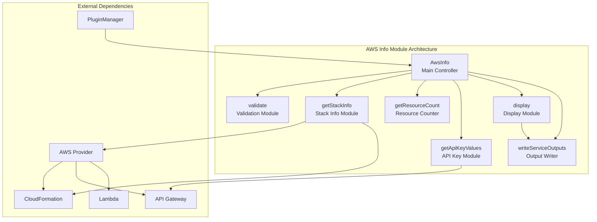
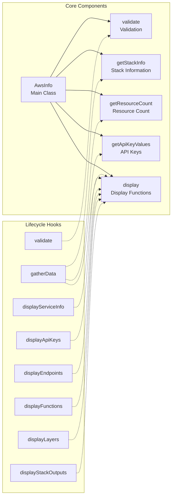
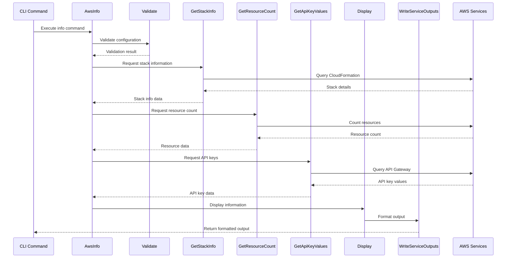
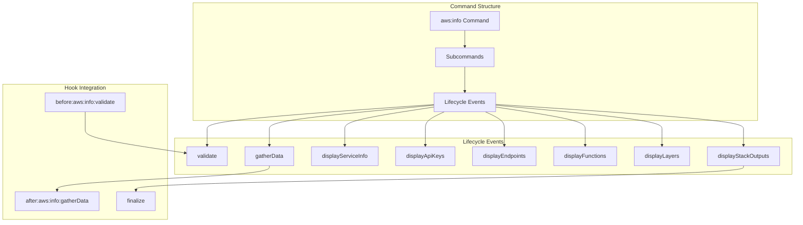
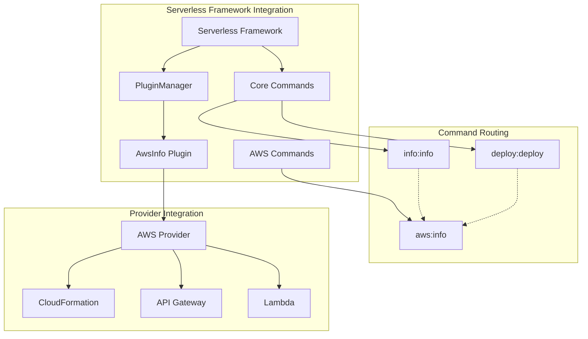
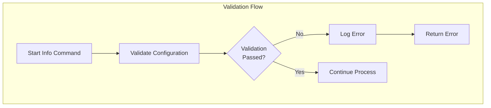

# AWS Info Module Documentation

## Introduction

The AWS Info module is a critical component of the Serverless Framework's AWS provider plugin system, responsible for retrieving and displaying comprehensive information about deployed AWS services. This module provides developers with detailed insights into their serverless applications' current state, including service configuration, API endpoints, functions, layers, and CloudFormation stack outputs.

The module serves as the primary information retrieval mechanism, offering both programmatic access and human-readable output formats. It integrates seamlessly with the deployment process, automatically displaying service information after successful deployments, while also supporting standalone information queries through the `sls info` command.

## Architecture Overview

The AWS Info module follows a modular architecture pattern with clear separation of concerns across data gathering, validation, and display responsibilities. The architecture is designed to be extensible and maintainable, with each component handling specific aspects of the information retrieval process.



## Component Architecture

The module consists of several specialized components that work together to provide comprehensive service information:



## Data Flow Architecture

The information retrieval process follows a structured data flow pattern, ensuring efficient and reliable data gathering from AWS services:



## Command Structure and Lifecycle

The AWS Info module implements a comprehensive lifecycle system that orchestrates the information retrieval process through well-defined stages:



## Integration with Serverless Framework

The AWS Info module integrates deeply with the Serverless Framework's plugin system and command structure:



## Key Features and Capabilities

### Information Categories

The AWS Info module retrieves and displays information across multiple categories:

1. **Service Information**: Basic service metadata, region, stage, and configuration details
2. **API Endpoints**: All deployed API Gateway endpoints with their methods and paths
3. **Functions**: Lambda function configurations, including runtime, memory, and timeout settings
4. **Layers**: Lambda layer information and associations
5. **API Keys**: API Gateway API keys and their associated usage plans
6. **Stack Outputs**: CloudFormation stack outputs and exported values
7. **Resource Count**: Total number of resources in the CloudFormation stack

### Output Formats

The module supports multiple output formats to accommodate different use cases:

- **Human-readable format**: Formatted text output for terminal display
- **JSON format**: Structured JSON output for programmatic consumption
- **Service outputs**: Integration with Serverless Framework's output system

### Integration Points

The AWS Info module integrates with several other modules and systems:

- **[aws-deploy](aws-deploy.md)**: Automatically displays information after successful deployments
- **[aws-provider](aws-provider.md)**: Leverages AWS provider for service interactions
- **[core-framework](core-framework.md)**: Integrates with the core Serverless Framework plugin system
- **[configuration-management](configuration-management.md)**: Uses configuration validation and parsing

## Error Handling and Validation

The module implements comprehensive error handling and validation mechanisms:



## Performance Considerations

The AWS Info module is designed with performance in mind:

- **Parallel Data Gathering**: Multiple AWS service calls are executed in parallel where possible
- **Caching**: Leverages AWS SDK caching mechanisms for repeated calls
- **Progress Indicators**: Provides user feedback during long-running operations
- **Resource Limits**: Warns users when approaching CloudFormation resource limits

## Security and Access Control

The module respects AWS IAM permissions and security best practices:

- **Least Privilege**: Only requests necessary permissions for information retrieval
- **Credential Validation**: Validates AWS credentials before making service calls
- **Sensitive Data Handling**: Properly handles sensitive information like API keys

## Dependencies

The AWS Info module has several key dependencies:

### Internal Dependencies
- **validate**: Configuration validation utilities
- **getStackInfo**: CloudFormation stack information retrieval
- **getResourceCount**: Resource counting functionality
- **getApiKeyValues**: API Gateway API key retrieval
- **display**: Information display formatting
- **writeServiceOutputs**: Output writing utilities

### External Dependencies
- **@serverlessinc/sf-core**: Core Serverless Framework utilities
- **AWS SDK**: For AWS service interactions
- **CLI utilities**: For output formatting and display

## Usage Patterns

The AWS Info module supports several usage patterns:

### Standalone Information Retrieval
```bash
sls info
```

### Post-Deployment Information Display
```bash
sls deploy
# Information automatically displayed after deployment
```

### Programmatic Access
```javascript
// JSON output for programmatic consumption
sls info --json
```

## Extension Points

The module provides several extension points for customization:

- **Custom Display Formats**: Extend display functions for custom output formats
- **Additional Data Sources**: Add new data gathering modules
- **Custom Validation**: Extend validation logic for specific use cases
- **Output Writers**: Custom output writers for different formats or destinations

## Monitoring and Observability

The AWS Info module includes built-in monitoring and observability features:

- **Progress Tracking**: Visual progress indicators during data gathering
- **Resource Usage Warnings**: Alerts for approaching service limits
- **Error Reporting**: Comprehensive error messages and debugging information
- **Performance Metrics**: Timing information for optimization purposes

This comprehensive documentation provides a complete understanding of the AWS Info module's architecture, functionality, and integration within the Serverless Framework ecosystem. The module serves as a critical tool for developers to understand and monitor their deployed serverless applications on AWS.