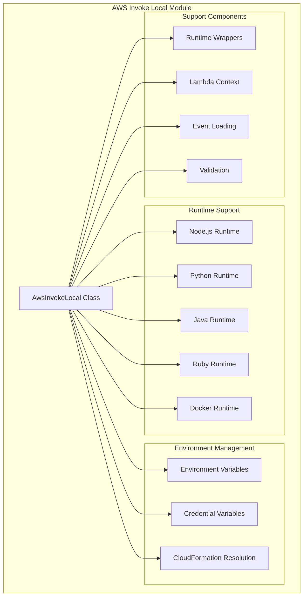
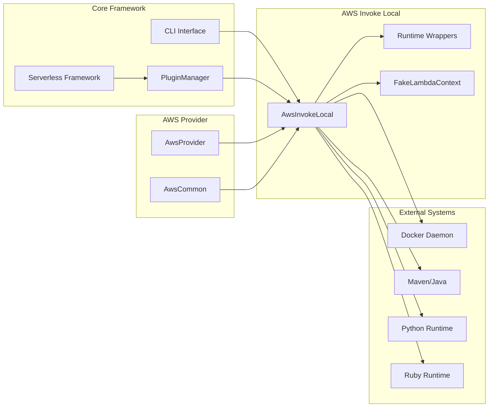
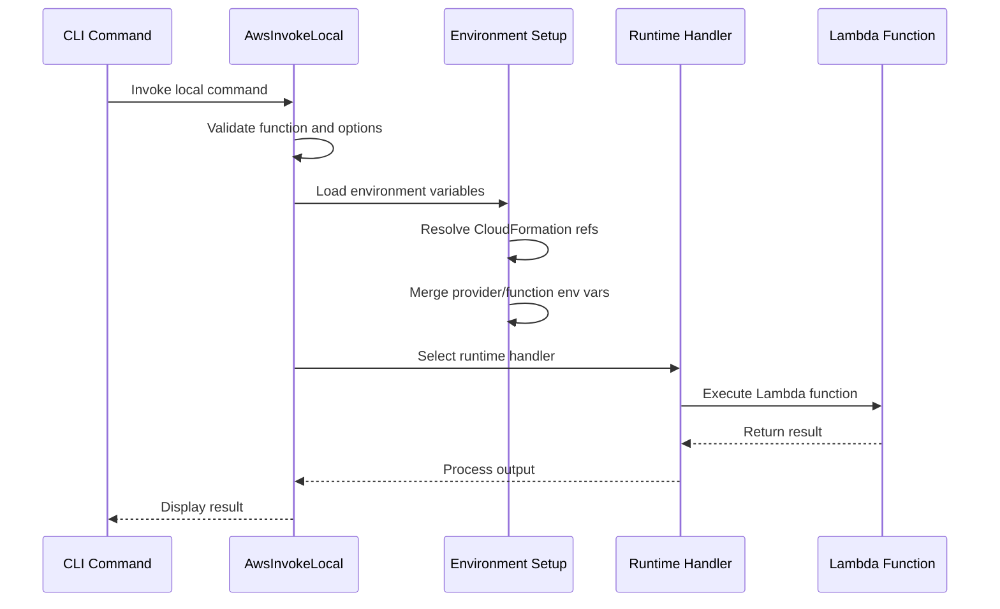
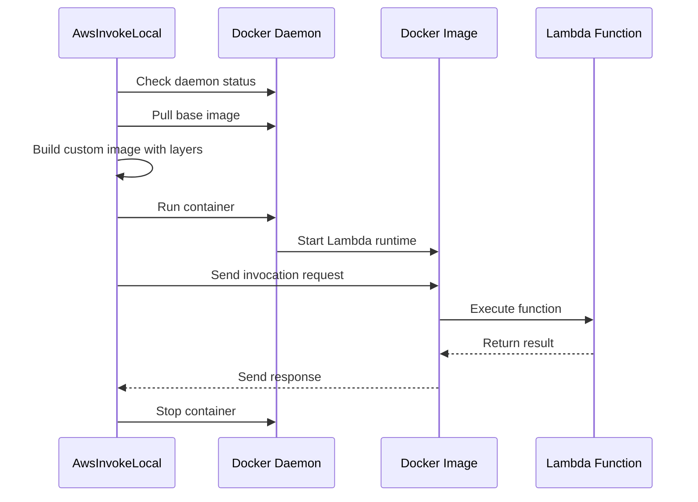

# AWS Invoke Local Module

## Overview

The AWS Invoke Local module provides local testing capabilities for AWS Lambda functions within the Serverless Framework. It enables developers to test their Lambda functions locally without deploying to AWS, supporting multiple runtime environments including Node.js, Python, Java, Ruby, and Docker containers.

## Purpose and Core Functionality

The primary purpose of this module is to:
- Enable local execution of Lambda functions for development and testing
- Support multiple AWS Lambda runtime environments
- Provide accurate Lambda environment simulation including environment variables, context, and event handling
- Offer both native runtime and Docker-based execution options
- Handle Lambda layers and dependencies locally

## Architecture

### Component Structure



### System Integration



## Core Components

### AwsInvokeLocal Class

The main class that orchestrates local Lambda function execution. It handles:
- Runtime detection and selection
- Environment variable configuration
- Event and context preparation
- Execution method routing (native vs Docker)
- Result processing and output formatting

### Runtime Support

#### Node.js Runtime
- Direct module loading and execution
- ESM and CommonJS support
- Callback and Promise-based handlers
- Context object simulation

#### Python Runtime
- Python interpreter integration
- Virtual environment support
- Runtime wrapper for Lambda context
- Event and context serialization

#### Java Runtime
- Maven-based Java bridge compilation
- JAR artifact handling
- Class and method resolution
- Lambda context simulation

#### Ruby Runtime
- Ruby interpreter integration
- Handler method resolution
- Context object creation
- Event processing

#### Docker Runtime
- AWS Lambda container image support
- Layer integration
- Environment variable injection
- Port mapping and HTTP invocation

## Data Flow

### Local Invocation Process



### Docker-based Execution



## Environment Variable Management

### Lambda Environment Variables

The module sets up a comprehensive Lambda environment including:

- **AWS Runtime Variables**: `AWS_REGION`, `AWS_DEFAULT_REGION`, `AWS_LAMBDA_*`
- **Function Context**: Function name, memory size, version, log group
- **System Paths**: `LD_LIBRARY_PATH`, `NODE_PATH`, `LAMBDA_TASK_ROOT`
- **User Configuration**: Provider and function-level environment variables
- **Credentials**: AWS access keys and session tokens (when available)

### CloudFormation Resolution

Supports resolution of CloudFormation intrinsic functions:
- `Fn::ImportValue`: Import values from other stacks
- `Ref`: Reference AWS resources and parameters

## Event and Context Handling

### Event Loading
Events can be provided through multiple channels:
- Command line data parameter
- File path (JSON, JavaScript modules)
- Standard input (stdin)
- Raw string data (with `--raw` flag)

### Context Object
Provides Lambda-compatible context objects with:
- Function metadata (name, version, memory)
- Request identifiers
- Logging configuration
- Timeout handling
- Callback methods (succeed, fail, done)
- Remaining time calculation

## Layer Support

### Local Layer Processing
- Layer path resolution from service configuration
- Artifact extraction and caching
- AWS Lambda layer download and caching
- Layer content merging in Docker containers

### Layer Caching
- Cache directory management
- Version-based cache invalidation
- Download optimization
- Cross-invocation layer reuse

## Error Handling

### Validation Errors
- Function existence validation
- File path validation
- JSON parsing errors
- Handler function validation

### Runtime Errors
- Docker daemon availability
- Runtime executable availability
- Artifact compilation failures
- Network connectivity issues

### User-Friendly Messages
- Clear error categorization
- Actionable error messages
- Debug information logging
- Graceful degradation

## Dependencies

### Core Framework Dependencies
- [Serverless Framework Core](core-framework.md)
- [AWS Provider](aws-provider.md)
- [Plugin Management System](plugin-management.md)
- [Configuration Management](configuration-management.md)

### Runtime Dependencies
- Docker daemon (for containerized execution)
- Runtime-specific tools (Node.js, Python, Java, Ruby)
- Maven (for Java bridge compilation)
- AWS CLI credentials (optional)

### External Libraries
- `fs-extra`: File system operations
- `decompress`: Archive extraction
- `uuid`: Request ID generation
- `child-process-ext`: Process spawning
- `cachedir`: Cache directory management

## Usage Patterns

### Basic Local Invocation
```bash
serverless invoke local --function myFunction --data '{"key": "value"}'
```

### With Environment Variables
```bash
serverless invoke local --function myFunction --env KEY1=value1 --env KEY2=value2
```

### Docker-based Execution
```bash
serverless invoke local --function myFunction --docker --data file://event.json
```

### With Context Data
```bash
serverless invoke local --function myFunction --context '{"custom": "context"}'
```

## Performance Considerations

### Cold Start Optimization
- Runtime wrapper caching
- Layer content caching
- Docker image reuse
- Artifact extraction optimization

### Memory Management
- Stream-based file processing
- Temporary directory cleanup
- Process lifecycle management
- Resource usage monitoring

## Security Considerations

### Credential Handling
- Optional AWS credential loading
- Environment variable isolation
- No credential persistence
- Secure credential transmission

### Code Execution
- Local code execution only
- No AWS service interaction during local invocation
- Isolated runtime environments
- User permission requirements

## Extension Points

### Custom Runtime Support
- Runtime wrapper extensibility
- Custom Docker image support
- Environment variable customization
- Handler pattern flexibility

### Plugin Integration
- Hook-based lifecycle extension
- Custom validation rules
- Additional runtime support
- Result processing customization

## Related Documentation

- [AWS Provider Module](aws-provider.md) - AWS service integration
- [AWS Runtime Support](aws-runtime-support.md) - Runtime wrapper details
- [Core Framework](core-framework.md) - Framework architecture
- [Plugin Management](plugin-management.md) - Plugin system overview
- [Configuration Management](configuration-management.md) - Configuration handling