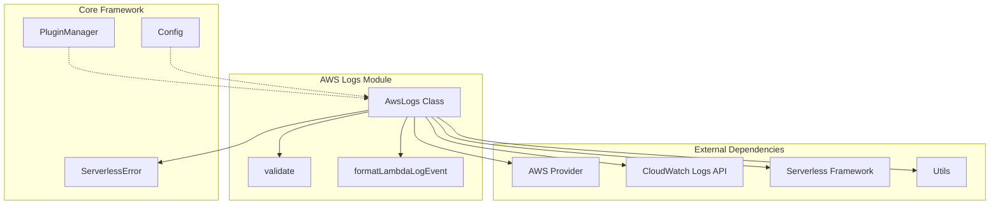
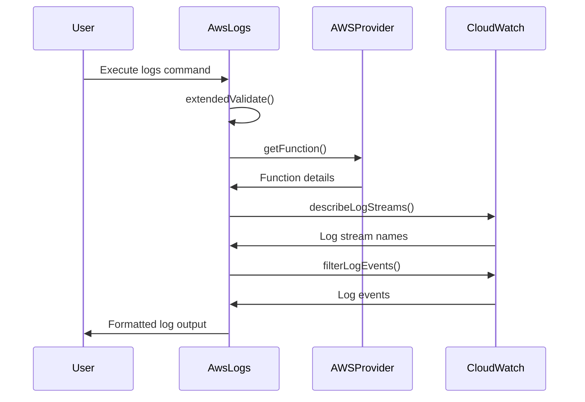
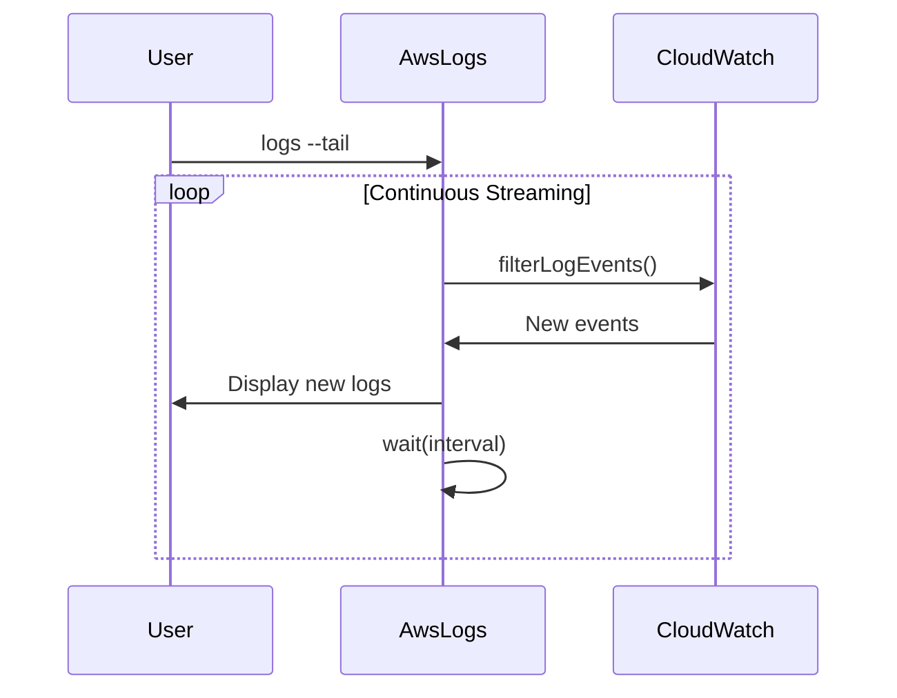
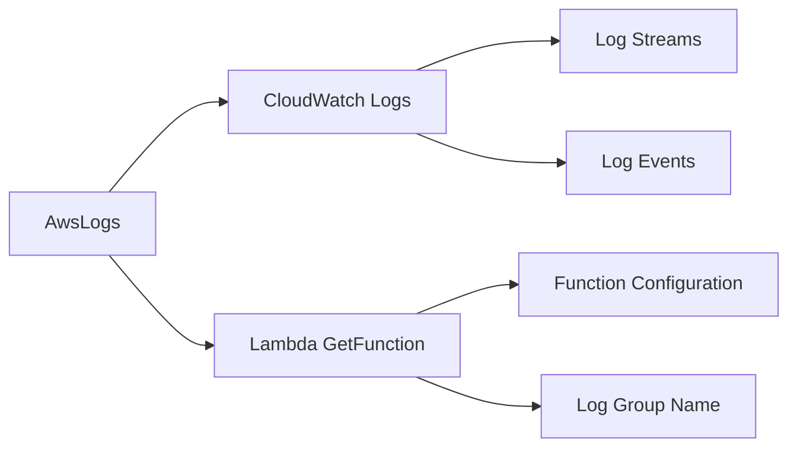

# AWS Logs Module Documentation

## Overview

The AWS Logs module provides comprehensive log retrieval and streaming capabilities for AWS Lambda functions within the Serverless Framework. It enables developers to access, filter, and monitor CloudWatch Logs for their serverless applications through both one-time queries and real-time log streaming.

## Purpose and Core Functionality

The primary purpose of the aws-logs module is to:
- Retrieve CloudWatch Logs for specific Lambda functions
- Support real-time log streaming (tail mode) for continuous monitoring
- Provide flexible time-based filtering options
- Apply pattern-based filtering to log events
- Format log output for improved readability

## Architecture

### Component Structure



### Module Dependencies

The aws-logs module integrates with several key components:

- **[aws-provider](aws-provider.md)**: Provides AWS service integration and authentication
- **[core-framework](core-framework.md)**: Leverages the base Serverless Framework architecture
- **[configuration-management](configuration-management.md)**: Uses configuration validation and schema handling

## Core Components

### AwsLogs Class

The main class that orchestrates log retrieval and streaming functionality.

**Key Properties:**
- `serverless`: Reference to the Serverless Framework instance
- `options`: Command-line options and configuration
- `provider`: AWS provider instance for API calls
- `logger`: Logging utility for output formatting
- `progress`: Progress indicator for user feedback

**Key Methods:**
- `extendedValidate()`: Validates function existence and sets up log group configuration
- `getLogStreams()`: Retrieves available log streams from CloudWatch
- `showLogs()`: Main method for displaying logs with filtering and pagination

## Data Flow

### Log Retrieval Process



### Streaming Mode Flow



## Configuration and Options

### Command Options

| Option | Description | Default |
|--------|-------------|---------|
| `function` | Target Lambda function name | Required |
| `tail` | Enable real-time streaming | false |
| `startTime` | Log start time (relative or absolute) | 10 minutes ago |
| `filter` | CloudWatch filter pattern | none |
| `interval` | Polling interval for tail mode | 1000ms |

### Time Format Support

The module supports multiple time formats:
- **Relative**: `5m`, `2h`, `1d` (minutes, hours, days)
- **Absolute**: ISO 8601 format (e.g., `2023-01-01T00:00:00Z`)
- **Default**: Last 10 minutes (or 15 seconds for tail mode)

## Integration Points

### AWS Services Integration



### Plugin System Integration

The module integrates with the Serverless Framework plugin system through:
- **Hook Registration**: Registers the `logs:logs` hook
- **Validation**: Uses shared validation utilities
- **Error Handling**: Leverages framework error types

## Error Handling

### Specific Error Types

- **NO_EXISTING_LOG_STREAMS**: Thrown when no log streams exist for the function
- **ServerlessError**: Used for general error conditions with proper error codes

### Error Recovery

The module implements graceful error handling:
- Validates function existence before log retrieval
- Handles empty log streams appropriately
- Provides meaningful error messages to users

## Performance Considerations

### Optimization Strategies

1. **Log Stream Limiting**: Retrieves only the 50 most recent log streams
2. **Time-based Filtering**: Uses startTime to limit data transfer
3. **Pagination Support**: Handles nextToken for large result sets
4. **Efficient Polling**: Configurable intervals for tail mode

### Resource Usage

- **API Calls**: CloudWatch Logs API (describeLogStreams, filterLogEvents)
- **Memory**: Minimal memory footprint for log processing
- **Network**: Efficient data transfer with filtering

## Usage Examples

### Basic Log Retrieval
```bash
serverless logs --function myFunction
```

### Real-time Streaming
```bash
serverless logs --function myFunction --tail
```

### Time-based Filtering
```bash
serverless logs --function myFunction --startTime 2h
```

### Pattern Filtering
```bash
serverless logs --function myFunction --filter "ERROR"
```

## Related Modules

- **[aws-commands](aws-commands.md)**: Parent module containing AWS-specific commands
- **[aws-provider](aws-provider.md)**: Provides AWS service integration
- **[core-framework](core-framework.md)**: Base Serverless Framework functionality
- **[cli-interface](cli-interface.md)**: Command-line interface components

## Future Enhancements

Potential improvements for the aws-logs module:
- Multi-function log aggregation
- Advanced filtering and search capabilities
- Log export functionality
- Integration with third-party logging services
- Performance metrics and analytics