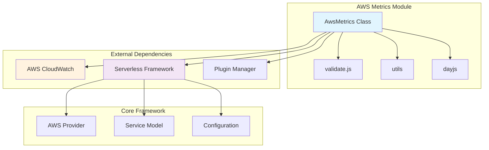
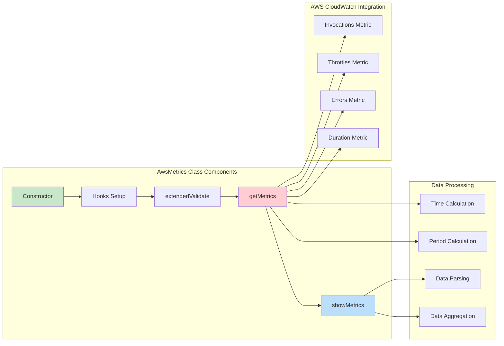
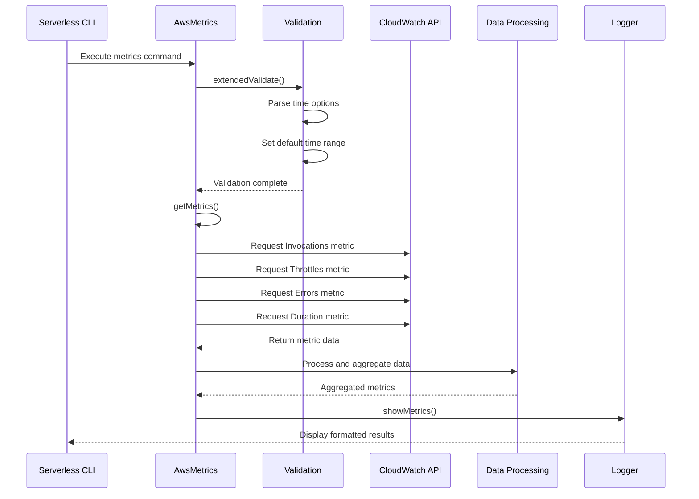
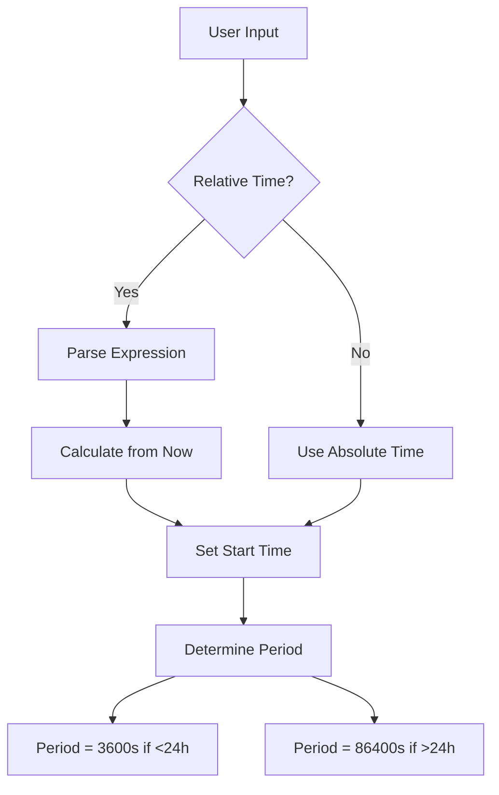
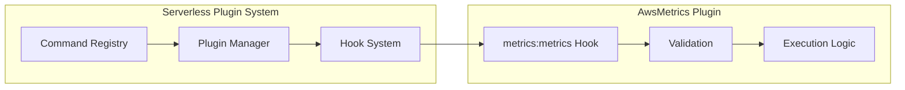

# AWS Metrics Module

## Introduction

The AWS Metrics module provides comprehensive monitoring and observability capabilities for AWS Lambda functions within the Serverless Framework. It enables developers to retrieve, analyze, and display key performance metrics from AWS CloudWatch, offering insights into function invocations, errors, throttles, and execution duration. This module is essential for monitoring application health, troubleshooting performance issues, and optimizing serverless applications.

## Architecture Overview



## Component Architecture



## Data Flow



## Core Components

### AwsMetrics Class

The `AwsMetrics` class is the main component that orchestrates the metrics retrieval and display process. It integrates with the Serverless Framework plugin system and AWS CloudWatch to provide comprehensive metrics functionality.

#### Key Properties:
- `serverless`: Reference to the Serverless Framework instance
- `options`: Command-line options and configuration
- `provider`: AWS provider instance for API calls
- `logger`: Logging utility for output
- `progress`: Progress indicator for user feedback

#### Core Methods:

**Constructor**
```javascript
constructor(serverless, options, pluginUtils)
```
Initializes the metrics plugin with necessary dependencies and sets up command hooks.

**extendedValidate()**
```javascript
extendedValidate()
```
Validates input parameters and processes time range options. Supports relative time expressions (e.g., "1d", "2h", "30m") and sets appropriate default values.

**getMetrics()**
```javascript
async getMetrics()
```
Retrieves metrics from AWS CloudWatch for specified Lambda functions. Fetches four key metrics:
- **Invocations**: Total number of function invocations
- **Throttles**: Number of throttled requests
- **Errors**: Number of failed executions
- **Duration**: Average execution time in milliseconds

**showMetrics()**
```javascript
showMetrics(metrics)
```
Processes and displays the retrieved metrics in a user-friendly format, including aggregation and formatting.

## Dependencies

### Internal Dependencies
- **[core-framework](core-framework.md)**: Provides the base Serverless Framework functionality
  - Service model for function management
  - Configuration handling
  - Plugin system integration

### External Dependencies
- **dayjs**: Date manipulation and formatting library
- **lodash**: Utility library for data manipulation
- **@serverlessinc/sf-core**: Core Serverless Framework utilities

### AWS Services
- **CloudWatch**: Primary service for metrics retrieval
- **Lambda**: Target service for which metrics are collected

## Configuration and Usage

### Command Line Options

The module supports various command-line options for customizing metrics retrieval:

- `--function`: Specify a specific function (retrieves metrics for all functions if omitted)
- `--startTime`: Start time for metrics (supports relative expressions like "1d", "2h")
- `--endTime`: End time for metrics (defaults to current time)

### Time Range Calculation



### Metrics Period Calculation

The module automatically determines the appropriate CloudWatch metrics period based on the time range:
- **Less than 24 hours**: 1-hour periods (3600 seconds)
- **More than 24 hours**: 1-day periods (86400 seconds)

## Integration Points

### Plugin System Integration



### AWS Provider Integration

The module integrates with the [aws-provider](aws-provider.md) to:
- Access AWS credentials and configuration
- Make authenticated CloudWatch API calls
- Retrieve function configuration and names

## Error Handling

The module implements robust error handling for:
- **Invalid time ranges**: Graceful fallback to default values
- **API failures**: Proper error propagation and user feedback
- **Missing metrics**: Handles cases where no metrics are available
- **Function not found**: Validates function existence before metrics retrieval

## Performance Considerations

### Batch Processing
- Retrieves metrics for multiple functions in parallel using `Promise.all()`
- Efficiently aggregates data across function boundaries

### Time Range Optimization
- Automatically selects optimal CloudWatch periods to minimize API calls
- Caches time calculations to avoid redundant processing

### Data Aggregation
- Uses lodash utilities for efficient data processing
- Minimizes memory footprint during large dataset processing

## Extension Points

The module can be extended to:
- Support additional CloudWatch metrics
- Implement custom aggregation functions
- Add new output formats (JSON, CSV, etc.)
- Integrate with third-party monitoring systems

## Related Modules

- **[aws-logs](aws-logs.md)**: Complementary logging functionality
- **[aws-invoke](aws-invoke.md)**: Function invocation capabilities
- **[aws-info](aws-info.md)**: Service information retrieval
- **[core-framework](core-framework.md)**: Base framework functionality

## Best Practices

1. **Time Range Selection**: Use appropriate time ranges for meaningful metrics
2. **Function-Specific Metrics**: Target specific functions for detailed analysis
3. **Regular Monitoring**: Implement automated metrics collection for proactive monitoring
4. **Performance Analysis**: Use duration metrics to identify performance bottlenecks
5. **Error Tracking**: Monitor error rates to ensure application reliability

## Troubleshooting

### Common Issues
- **No metrics found**: Ensure functions have been invoked within the specified time range
- **Permission errors**: Verify AWS credentials have CloudWatch read permissions
- **Time zone issues**: All times are handled in UTC by default
- **Large time ranges**: Consider using longer periods for better performance

### Debug Information
The module provides detailed logging when verbose mode is enabled, including:
- API request parameters
- Response data structure
- Processing time information
- Error details and stack traces