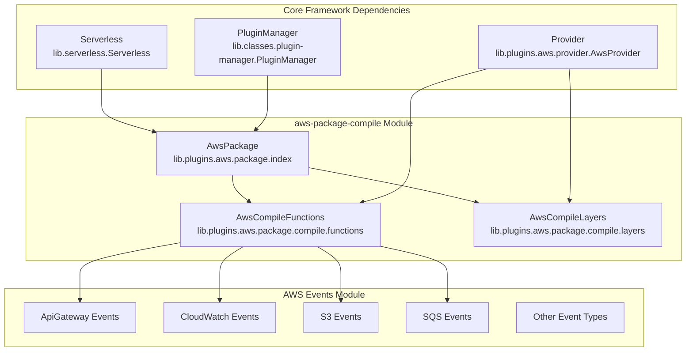
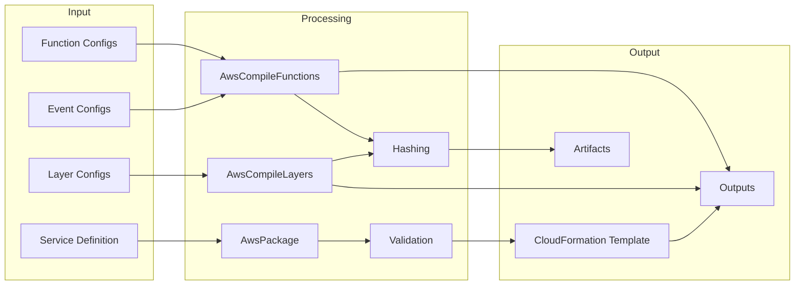
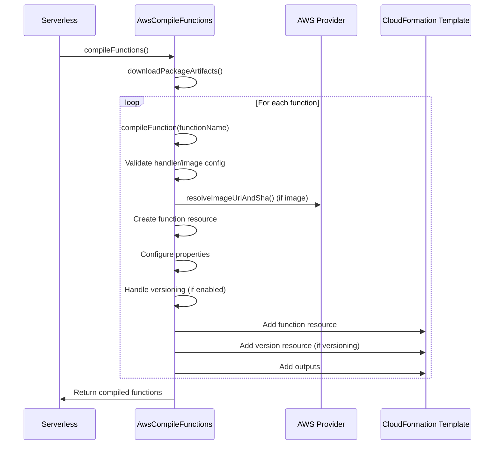
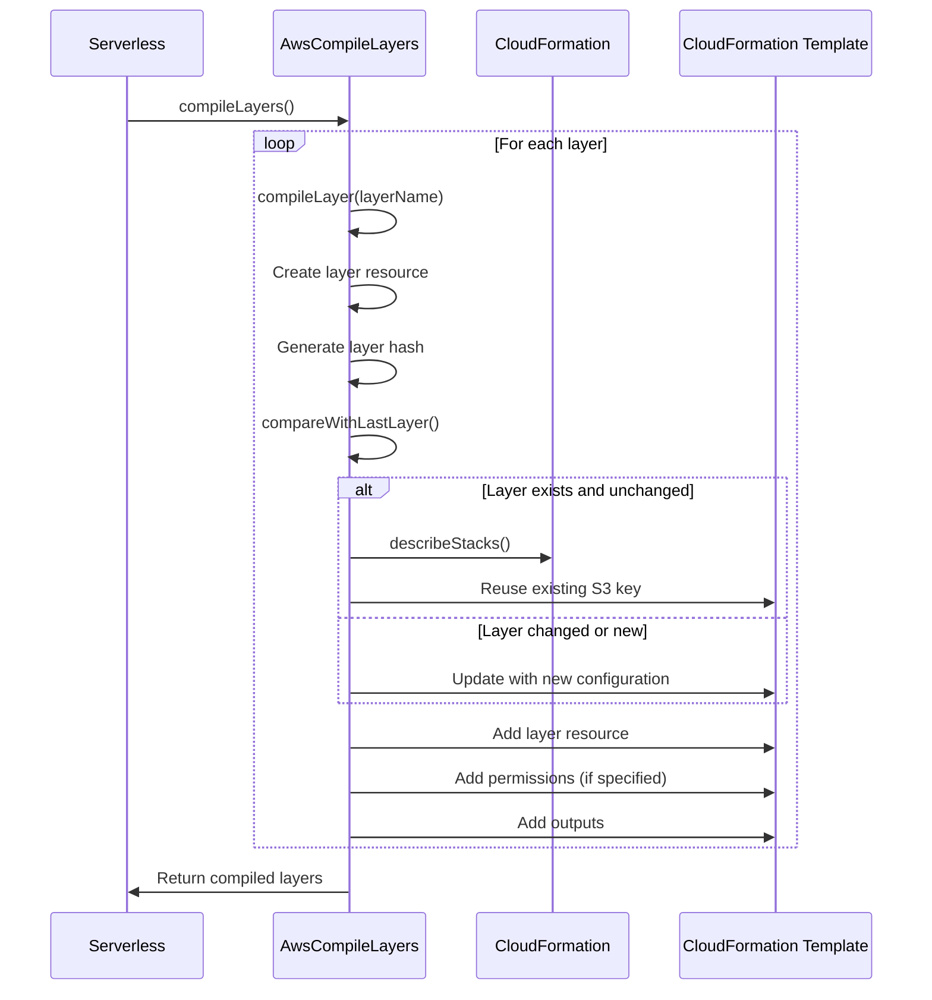

# AWS Package Compile Module

## Overview

The **aws-package-compile** module is a critical component of the Serverless Framework's AWS provider plugin system, responsible for transforming serverless service definitions into AWS CloudFormation templates that can be deployed to AWS infrastructure. This module handles the compilation of Lambda functions, layers, and their associated configurations into deployable AWS resources.

## Purpose and Core Functionality

The primary purpose of the aws-package-compile module is to:

1. **Transform service definitions** into AWS CloudFormation template resources
2. **Compile Lambda functions** with their configurations, environment variables, and permissions
3. **Compile Lambda layers** with versioning and permission management
4. **Generate deployment artifacts** and manage their lifecycle
5. **Integrate with the broader packaging system** to create deployable service packages

## Architecture

### Component Structure



### Data Flow Architecture



## Core Components

### AwsPackage Class

The `AwsPackage` class serves as the main orchestrator for the packaging process. It coordinates the compilation of functions and layers, manages the CloudFormation template generation, and handles the final packaging steps.

**Key Responsibilities:**
- Initialize packaging process and set up deployment bucket configuration
- Generate core CloudFormation templates
- Merge IAM templates and custom provider resources
- Validate and save compiled templates
- Coordinate the packaging lifecycle hooks

**Lifecycle Integration:**
```javascript
// Key lifecycle hooks
'package:cleanup' -> Validate and cleanup
'package:initialize' -> Generate core template
'package:setupProviderConfiguration' -> Merge IAM templates
'package:compileFunctions' -> Compile Lambda functions
'package:compileLayers' -> Compile Lambda layers
'package:finalize' -> Finalize packaging
```

### AwsCompileFunctions Class

The `AwsCompileFunctions` class handles the compilation of individual Lambda functions into CloudFormation resources. It processes function configurations, creates appropriate AWS::Lambda::Function resources, and manages function versioning and aliases.

**Key Features:**
- **Function Compilation**: Transforms function definitions into CloudFormation resources
- **Artifact Management**: Handles function code artifacts and S3 deployment
- **Version Management**: Creates function versions with proper hashing
- **Configuration Processing**: Handles environment variables, VPC settings, layers, etc.
- **Event Integration**: Prepares functions for event source integrations
- **URL Support**: Configures Lambda function URLs with CORS settings
- **Destination Configuration**: Sets up async invocation destinations

**Function Resource Properties:**
```yaml
Type: AWS::Lambda::Function
Properties:
  FunctionName: string
  Handler: string
  Runtime: string
  Code:
    S3Bucket: string
    S3Key: string
  MemorySize: number
  Timeout: number
  Environment:
    Variables: object
  Role: string | object
  VpcConfig:
    SecurityGroupIds: array
    SubnetIds: array
  Layers: array
  TracingConfig:
    Mode: string
```

### AwsCompileLayers Class

The `AwsCompileLayers` class manages the compilation of Lambda layers, which are distribution mechanisms for libraries, custom runtimes, and other function dependencies.

**Key Features:**
- **Layer Compilation**: Creates AWS::Lambda::LayerVersion resources
- **Permission Management**: Configures layer access permissions
- **Versioning**: Implements layer versioning with retention policies
- **Cross-Stack Optimization**: Compares with existing layers to avoid redundant uploads

**Layer Resource Properties:**
```yaml
Type: AWS::Lambda::LayerVersion
Properties:
  LayerName: string
  Description: string
  Content:
    S3Bucket: string
    S3Key: string
  CompatibleRuntimes: array
  CompatibleArchitectures: array
  LicenseInfo: string
```

## Process Flow

### Function Compilation Process



### Layer Compilation Process



## Integration with AWS Events Module

The aws-package-compile module works closely with the [aws-events](aws-events.md) module to configure function event sources. Functions compiled by this module are prepared to receive events from various AWS services.

**Event Integration Points:**
- **API Gateway**: HTTP/REST API endpoints
- **S3**: Object creation, deletion, and modification events
- **SQS**: Message queue processing
- **SNS**: Topic notifications
- **CloudWatch Events**: Scheduled and pattern-based events
- **EventBridge**: Custom and AWS service events

## Configuration Management

### Function Configuration

Functions support extensive configuration options:

```yaml
functions:
  myFunction:
    handler: index.handler
    runtime: nodejs18.x
    memorySize: 512
    timeout: 30
    environment:
      TABLE_NAME: my-table
    vpc:
      securityGroupIds:
        - sg-12345678
      subnetIds:
        - subnet-12345678
    layers:
      - arn:aws:lambda:region:account-id:layer:layer-name:1
    events:
      - http:
          path: /users
          method: get
```

### Layer Configuration

Layers are configured with metadata and compatibility information:

```yaml
layers:
  myLayer:
    path: layer-code
    name: my-layer
    description: My custom layer
    compatibleRuntimes:
      - nodejs18.x
      - python3.9
    compatibleArchitectures:
      - x86_64
    licenseInfo: MIT
    allowedAccounts:
      - "123456789012"
```

## Artifact Management

### Deployment Artifacts

The module manages several types of artifacts:

1. **Function Code Artifacts**: ZIP files containing function code
2. **Layer Artifacts**: ZIP files containing layer content
3. **CloudFormation Templates**: Compiled infrastructure definitions
4. **Service State**: Metadata about the packaged service

### S3 Integration

Artifacts are uploaded to S3 with organized key structures:
```
{deployment-prefix}/{service-name}/{stage}/code-artifacts/{artifact-name}
```

### Hashing and Versioning

The module implements sophisticated hashing mechanisms:
- **Function Versioning**: Creates new versions based on code and configuration changes
- **Layer Versioning**: Manages layer versions with content-based hashing
- **Cross-Stack Optimization**: Reuses unchanged artifacts across deployments

## Error Handling and Validation

### Validation Points

1. **Function Configuration**: Validates handler/image configuration
2. **Resource Limits**: Checks against AWS service limits
3. **Permission Requirements**: Ensures proper IAM configurations
4. **Dependency Validation**: Verifies layer and event configurations

### Error Types

- `FUNCTION_NEITHER_HANDLER_NOR_IMAGE_DEFINED_ERROR`: Missing function handler or image
- `FUNCTION_BOTH_HANDLER_AND_IMAGE_DEFINED_ERROR`: Conflicting handler and image configuration
- `LAMBDA_FILE_SYSTEM_CONFIG_MISSING_VPC`: Missing VPC configuration for file system access
- `UNSUPPORTED_DESTINATION_TARGET`: Invalid destination configuration

## Performance Considerations

### Optimization Strategies

1. **Parallel Processing**: Compiles functions and layers concurrently
2. **Artifact Caching**: Reuses unchanged artifacts from previous deployments
3. **Selective Compilation**: Only compiles changed components
4. **Memory Management**: Efficiently handles large artifacts

### Resource Management

- **Memory Allocation**: Configurable function memory sizes
- **Timeout Configuration**: Appropriate timeout settings
- **Concurrency Controls**: Reserved concurrency and provisioned concurrency support
- **Cold Start Optimization**: SnapStart support for Java functions

## Security Features

### IAM Integration

The module automatically generates IAM roles and policies:
- **Execution Roles**: Lambda execution permissions
- **Resource Permissions**: Access to S3, CloudWatch, and other services
- **Cross-Service Permissions**: Permissions for event source integrations

### Encryption Support

- **KMS Key Integration**: Support for customer-managed encryption keys
- **Environment Variable Encryption**: Secure handling of sensitive configuration
- **Artifact Security**: Secure S3 storage with appropriate access controls

## Monitoring and Observability

### Logging Configuration

Functions support advanced logging configurations:
- **Log Formats**: Text and JSON log formats
- **Log Levels**: Application and system log level controls
- **Custom Log Groups**: Integration with CloudWatch Log Groups

### Tracing Support

- **X-Ray Integration**: Distributed tracing configuration
- **Performance Monitoring**: Built-in performance metrics
- **Custom Metrics**: Support for custom CloudWatch metrics

## Dependencies

### Core Framework Dependencies

- [core-framework](core-framework.md): Provides base Serverless Framework functionality
- [configuration-management](configuration-management.md): Handles service configuration parsing
- [plugin-management](plugin-management.md): Manages plugin lifecycle and hooks

### AWS Provider Dependencies

- [aws-provider](aws-provider.md): Provides AWS-specific functionality and naming conventions
- [aws-common](aws-common.md): Shared AWS utilities and helpers

### Related Modules

- [aws-events](aws-events.md): Configures function event sources
- [aws-commands](aws-commands.md): Executes deployment and management commands
- [aws-deploy](aws-deploy.md): Handles actual deployment of compiled resources

## Best Practices

### Function Design

1. **Single Responsibility**: Keep functions focused on specific tasks
2. **Stateless Design**: Design functions to be stateless where possible
3. **Error Handling**: Implement proper error handling and logging
4. **Performance**: Optimize cold start times and execution duration

### Layer Usage

1. **Shared Dependencies**: Use layers for shared libraries and dependencies
2. **Runtime Extensions**: Leverage layers for custom runtime configurations
3. **Version Management**: Carefully manage layer versions and compatibility
4. **Access Control**: Properly configure layer permissions

### Configuration Management

1. **Environment Separation**: Use different configurations for different stages
2. **Secret Management**: Use appropriate secret management solutions
3. **Resource Limits**: Set appropriate memory and timeout configurations
4. **Monitoring**: Configure proper logging and tracing settings

## Conclusion

The aws-package-compile module is a foundational component of the Serverless Framework's AWS integration, providing the essential functionality to transform service definitions into deployable AWS resources. Its comprehensive feature set, robust error handling, and integration with the broader Serverless Framework ecosystem make it a critical piece of the serverless application deployment pipeline.

The module's architecture supports extensibility through its plugin system, allowing for custom compilation logic and integration with additional AWS services. Its focus on performance, security, and reliability ensures that serverless applications can be deployed efficiently and securely at scale.