# AWS Provider Module

## Overview

The AWS Provider module is the core AWS integration layer for the Serverless Framework. It provides comprehensive AWS cloud platform support, handling everything from infrastructure provisioning and deployment to runtime management and monitoring. This module serves as the primary bridge between the Serverless Framework and AWS services, enabling developers to deploy and manage serverless applications on AWS infrastructure.

## Purpose and Scope

The AWS Provider module is responsible for:

- **Infrastructure Management**: Provisioning and managing AWS resources through CloudFormation
- **Deployment Operations**: Handling application deployment, updates, and rollbacks
- **Runtime Support**: Managing Lambda functions, API Gateway, and other AWS services
- **Event Integration**: Configuring various AWS event sources and triggers
- **Security and IAM**: Managing roles, policies, and security configurations
- **Monitoring and Logging**: Integrating with CloudWatch and other AWS monitoring services
- **Package Management**: Building and packaging applications for AWS deployment
- **Local Development**: Providing local development and testing capabilities

## Architecture

```mermaid
graph TB
    subgraph "AWS Provider Module"
        AP[AwsProvider<br/>lib.plugins.aws.provider.AwsProvider]
        AC[AwsCommon<br/>lib.plugins.aws.common.index.AwsCommon]
        
        subgraph "Package & Compile"
            APC[AwsPackage<br/>lib.plugins.aws.package.index.AwsPackage]
            ACF[AwsCompileFunctions<br/>lib.plugins.aws.package.compile.functions.AwsCompileFunctions]
            ACL[AwsCompileLayers<br/>lib.plugins.aws.package.compile.layers.AwsCompileLayers]
        end
        
        subgraph "Event Sources"
            AGE[ApiGateway Events<br/>lib.plugins.aws.package.compile.events.api-gateway.index.AwsCompileApigEvents]
            HAE[HTTP API Events<br/>lib.plugins.aws.package.compile.events.http-api.HttpApiEvents]
            WSE[Websocket Events<br/>lib.plugins.aws.package.compile.events.websockets.index.AwsCompileWebsockets]
            CWE[CloudWatch Events<br/>lib.plugins.aws.package.compile.events.cloud-watch-event.AwsCompileCloudWatchEventEvents]
            EBE[EventBridge Events<br/>lib.plugins.aws.package.compile.events.event-bridge.index.AwsCompileEventBridgeEvents]
            SE[Storage Events<br/>lib.plugins.aws.package.compile.events.s3.index.AwsCompileS3Events]
            STE[Streaming Events<br/>lib.plugins.aws.package.compile.events.stream.AwsCompileStreamEvents]
            ITE[IoT Events<br/>lib.plugins.aws.package.compile.events.iot.AwsCompileIoTEvents]
        end
        
        subgraph "Runtime Support"
            FLC[FakeLambdaContext<br/>lib.plugins.aws.invoke-local.runtime-wrappers.invoke.FakeLambdaContext]
            IB[InvokeBridge<br/>lib.plugins.aws.invoke-local.runtime-wrappers.java.src.main.java.com.serverless.InvokeBridge.InvokeBridge]
            LL[LocalLambda<br/>lib.plugins.aws.dev.local-lambda.index.LocalLambda]
        end
        
        subgraph "Commands"
            AD[AwsDeploy<br/>lib.plugins.aws.deploy.index.AwsDeploy]
            ADF[AwsDeployFunction<br/>lib.plugins.aws.deploy-function.AwsDeployFunction]
            AI[AwsInfo<br/>lib.plugins.aws.info.index.AwsInfo]
            AIL[AwsInvokeLocal<br/>lib.plugins.aws.invoke-local.index.AwsInvokeLocal]
            AI2[AwsInvoke<br/>lib.plugins.aws.invoke.AwsInvoke]
            AL[AwsLogs<br/>lib.plugins.aws.logs.AwsLogs]
            AM[AwsMetrics<br/>lib.plugins.aws.metrics.AwsMetrics]
            AR[AwsRemove<br/>lib.plugins.aws.remove.index.AwsRemove]
            ARF[AwsRollbackFunction<br/>lib.plugins.aws.rollback-function.AwsRollbackFunction]
            AR2[AwsRollback<br/>lib.plugins.aws.rollback.AwsRollback]
        end
    end
    
    CF[Core Framework<br/>lib.serverless.Serverless] --> AP
    AP --> AC
    AP --> APC
    APC --> ACF
    APC --> ACL
    
    AP --> AGE
    AP --> HAE
    AP --> WSE
    AP --> CWE
    AP --> EBE
    AP --> SE
    AP --> STE
    AP --> ITE
    
    AP --> FLC
    AP --> IB
    AP --> LL
    
    AP --> AD
    AP --> ADF
    AP --> AI
    AP --> AIL
    AP --> AI2
    AP --> AL
    AP --> AM
    AP --> AR
    AP --> ARF
    AP --> AR2
    
    style AP fill:#f9f,stroke:#333,stroke-width:4px
    style CF fill:#bbf,stroke:#333,stroke-width:2px
```



## Core Components

### AwsProvider (lib.plugins.aws.provider.AwsProvider)

The main provider class that serves as the primary interface between the Serverless Framework and AWS services. It handles:

- **AWS SDK Integration**: Manages AWS SDK configuration and authentication
- **Resource Management**: Provides methods for creating, updating, and deleting AWS resources
- **Configuration Validation**: Validates AWS-specific configuration options
- **Region and Credential Management**: Handles AWS region selection and credential resolution
- **Deployment Bucket Management**: Manages S3 deployment buckets for CloudFormation templates
- **ECR Integration**: Handles Docker image management for containerized Lambda functions

Key responsibilities:
- AWS credentials management and validation
- CloudFormation stack operations
- Lambda function deployment and configuration
- API Gateway setup and management
- IAM role and policy management
- CloudWatch integration
- S3 bucket operations
- ECR repository management

### AwsCommon (lib.plugins.aws.common.index.AwsCommon)

Provides common lifecycle events and utilities for AWS operations:

- **Validation**: AWS-specific configuration validation
- **Artifact Management**: Handles deployment artifacts and temporary directories
- **Lifecycle Hooks**: Provides standardized hooks for AWS operations

## Sub-modules

### Package and Compile Module

Handles the packaging and compilation of serverless applications for AWS deployment. This module is responsible for:

- **Function Compilation**: Converting serverless functions to AWS Lambda configurations
- **Layer Compilation**: Managing AWS Lambda layers
- **Resource Generation**: Creating CloudFormation templates
- **Dependency Management**: Handling function dependencies and packaging

For detailed documentation, see [aws-package-compile.md](aws-package-compile.md)

### Events Module

Manages various AWS event sources that can trigger Lambda functions. The events module includes:

- **API Gateway Events**: REST API and HTTP API integration
- **Websocket Events**: Real-time websocket connections
- **CloudWatch Events**: Scheduled and event-based triggers
- **EventBridge Events**: Event bus integration
- **Storage Events**: S3, SNS, and SQS event handling
- **Streaming Events**: Kinesis, Kafka, and MSK stream processing
- **IoT Events**: Internet of Things integration
- **Cognito Events**: User pool triggers
- **Alexa Events**: Voice skill integration

For detailed documentation, see [aws-events.md](aws-events.md)

### Runtime Support Module

Provides local development and testing capabilities:

- **Local Lambda Execution**: Running Lambda functions locally
- **Runtime Wrappers**: Language-specific runtime environments
- **Context Simulation**: Mocking AWS Lambda context objects
- **Local Development Server**: Development server for testing

For detailed documentation, see [aws-runtime-support.md](aws-runtime-support.md)

### Commands Module

Implements AWS-specific CLI commands:

- **Deploy Commands**: Application deployment and updates
- **Invoke Commands**: Function invocation (local and remote)
- **Information Commands**: Service information and status
- **Log Commands**: CloudWatch logs retrieval
- **Metric Commands**: Performance metrics and monitoring
- **Rollback Commands**: Deployment rollback functionality
- **Remove Commands**: Resource cleanup and deletion

For detailed documentation, see [aws-commands.md](aws-commands.md)

## Integration with Core Framework

The AWS Provider module integrates with the core Serverless Framework through:

1. **Provider Registration**: Registers itself as the 'aws' provider with the framework
2. **Hook System**: Participates in the framework's lifecycle hook system
3. **Configuration Schema**: Defines AWS-specific configuration options and validation rules
4. **Service Integration**: Works with the core service model to represent AWS resources
5. **Plugin System**: Extends framework functionality through the plugin architecture

## Configuration

The AWS Provider module supports extensive configuration options including:

- **Provider Settings**: Region, stage, runtime, memory, timeout configurations
- **IAM Configuration**: Roles, policies, and permissions
- **API Gateway Settings**: REST API, HTTP API, and WebSocket configurations
- **Lambda Settings**: Function-specific configurations
- **Deployment Settings**: S3 bucket, CloudFormation parameters
- **Monitoring Settings**: CloudWatch, logging, and tracing configurations
- **Security Settings**: VPC, encryption, and access control

## Dependencies

The AWS Provider module depends on:

- **Core Framework**: For base functionality and plugin integration
- **AWS SDK**: For AWS service interactions
- **Plugin Management**: For lifecycle hook coordination
- **Configuration Management**: For service configuration handling
- **Utility Functions**: For common operations and helpers

## Usage Examples

The AWS Provider module is typically used as the provider in serverless.yml:

```yaml
service: my-service
provider:
  name: aws
  runtime: nodejs20.x
  region: us-east-1
  stage: dev
  
functions:
  hello:
    handler: handler.hello
    events:
      - http:
          path: hello
          method: get
```

This configuration enables the AWS Provider module to handle all AWS-specific operations for the service.