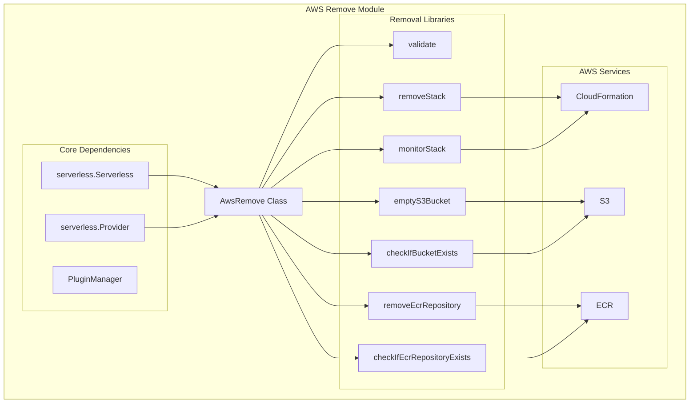
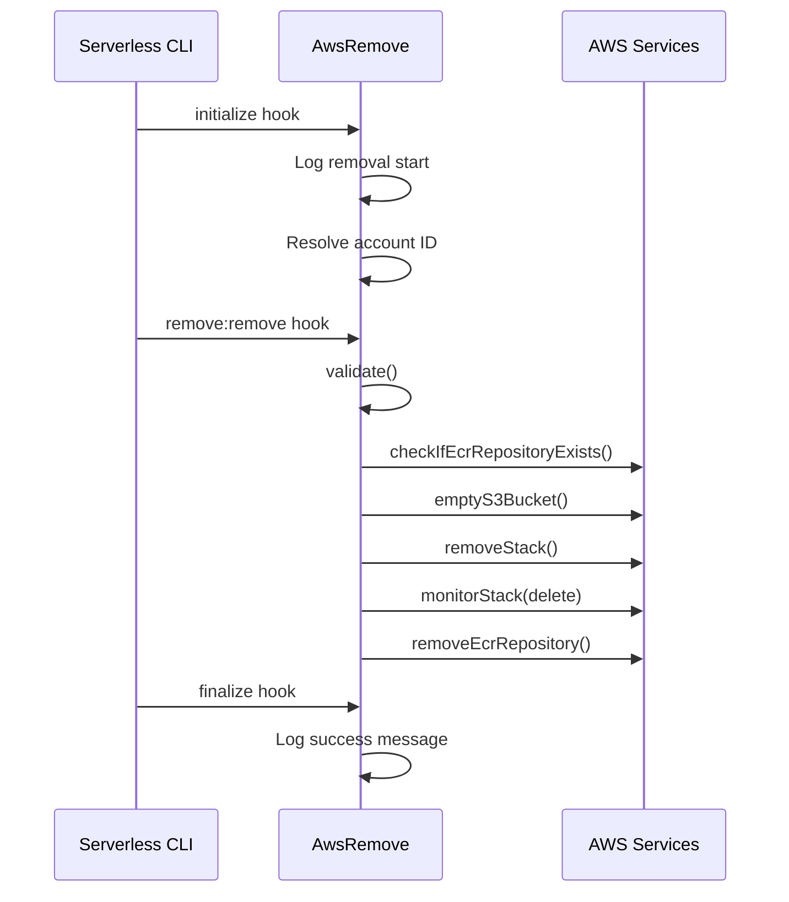
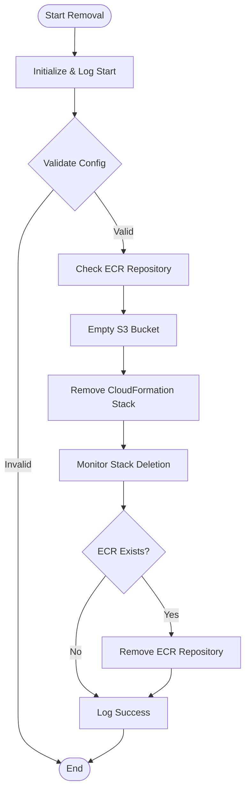
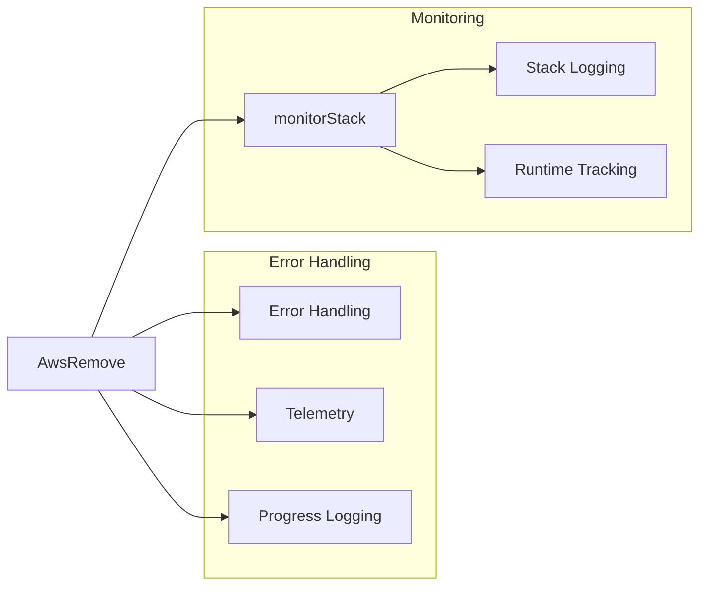

# AWS Remove Module Documentation

## Introduction

The AWS Remove module is a critical component of the Serverless Framework's AWS provider plugin system, responsible for completely removing deployed serverless applications and their associated AWS resources. This module ensures clean teardown of serverless infrastructure by systematically removing CloudFormation stacks, emptying S3 deployment buckets, and cleaning up ECR repositories.

## Architecture Overview

The AwsRemove class serves as the main orchestrator for the removal process, integrating with various AWS services and the core Serverless Framework to provide a comprehensive cleanup mechanism.

## Component Details

### AwsRemove Class

The `AwsRemove` class is the primary component that orchestrates the removal process. It extends the Serverless Framework's plugin architecture and implements specific hooks for the removal lifecycle.

**Key Responsibilities:**
- Initialize removal process with proper logging and telemetry
- Validate AWS configuration and permissions
- Orchestrate the sequential removal of AWS resources
- Monitor CloudFormation stack deletion
- Clean up associated S3 buckets and ECR repositories
- Provide progress updates and final success notifications

### Hook System Integration

The module integrates with the Serverless Framework's hook system through three main lifecycle points:

## Removal Process Flow

The removal process follows a carefully orchestrated sequence to ensure clean resource deletion:

## Dependencies and Integration

### Core Framework Dependencies

The AwsRemove module depends on several core Serverless Framework components:

- **[core-framework](core-framework.md)**: Provides the base Serverless class, configuration management, and plugin system
- **[aws-provider](aws-provider.md)**: Supplies AWS-specific provider functionality and common utilities
- **[aws-commands](aws-commands.md)**: Sibling modules for other AWS operations (deploy, info, logs, etc.)

### AWS Service Integration

The module interacts with multiple AWS services:

1. **CloudFormation**: Primary service for infrastructure management
   - Stack deletion and monitoring
   - Resource cleanup coordination

2. **S3**: Deployment artifact storage
   - Bucket existence validation
   - Complete bucket emptying before stack removal

3. **ECR**: Container registry management
   - Repository existence checking
   - Repository deletion for containerized functions

### Utility Libraries

The module incorporates several utility functions:

- **validate**: Ensures proper AWS configuration and permissions
- **checkIfBucketExists**: Validates S3 bucket presence
- **emptyS3Bucket**: Removes all objects from deployment bucket
- **removeStack**: Initiates CloudFormation stack deletion
- **removeEcrRepository**: Deletes ECR repositories
- **monitorStack**: Tracks stack deletion progress
- **checkIfEcrRepositoryExists**: Validates ECR repository presence

## Error Handling and Monitoring

The module implements comprehensive error handling and monitoring:

## Configuration and Usage

The AwsRemove module is automatically activated when users execute the `serverless remove` command. It requires:

- Valid AWS credentials with appropriate deletion permissions
- Proper Serverless Framework configuration
- Existing deployed stack (for successful removal)

## Progress Tracking

The module provides real-time progress updates through the main progress system:

1. **"Removing objects from S3 bucket"** - During S3 cleanup
2. **"Removing AWS CloudFormation stack"** - During stack deletion
3. **"Removing ECR repository"** - During ECR cleanup (if applicable)

## Success Indicators

Upon successful completion, the module provides:

- Success message with service name and removal time
- Total execution time in seconds
- Confirmation of complete resource removal

## Related Documentation

- [AWS Provider](aws-provider.md) - Core AWS provider functionality
- [AWS Deploy](aws-deploy.md) - Deployment operations (reverse process)
- [Core Framework](core-framework.md) - Base Serverless Framework architecture
- [AWS Commands](aws-commands.md) - Overview of all AWS command modules