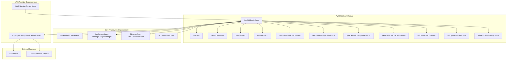
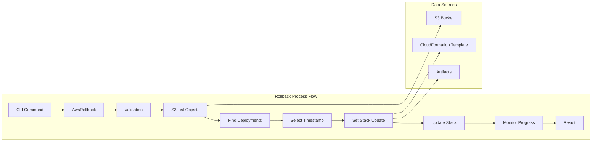
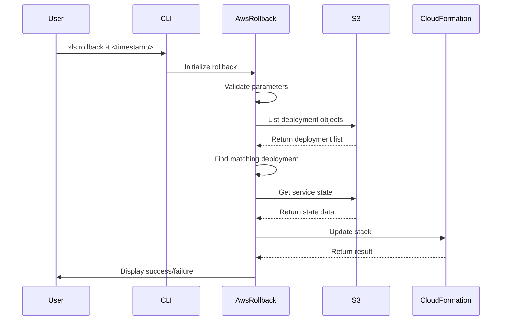
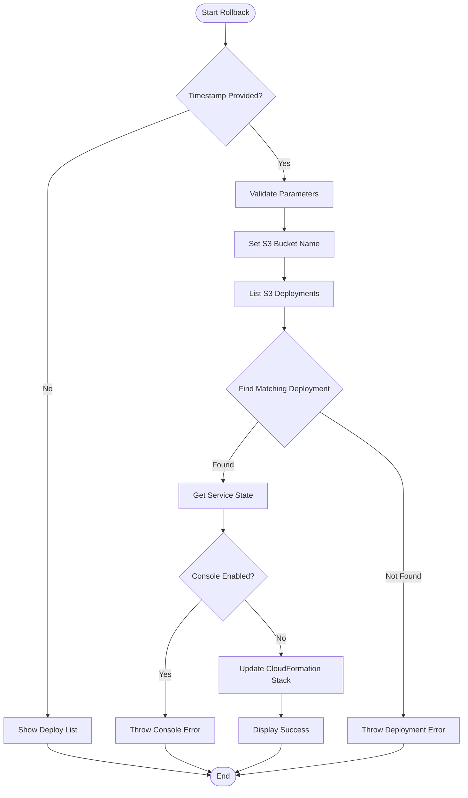

# AWS Rollback Module Documentation

## Introduction

The AWS Rollback module provides functionality to rollback AWS Lambda deployments to previous versions based on deployment timestamps. This module is a critical component of the Serverless Framework's AWS provider plugin ecosystem, enabling developers to quickly revert to stable deployments when issues are discovered in production.

The rollback functionality works by accessing previously deployed CloudFormation templates and artifacts stored in S3, allowing users to restore their serverless applications to any previous state with a simple timestamp-based selection mechanism.

## Architecture Overview



## Component Relationships



## Core Components

### AwsRollback Class

The `AwsRollback` class is the main component that orchestrates the rollback process. It integrates various utility functions and AWS service interactions to provide a seamless rollback experience.

**Key Responsibilities:**
- Validate rollback parameters and prerequisites
- Discover available deployments from S3
- Select target deployment based on timestamp
- Execute CloudFormation stack updates
- Monitor rollback progress and report results

**Constructor Parameters:**
- `serverless`: Serverless framework instance
- `options`: Command-line options including timestamp

**Key Methods:**
- `validate()`: Validates rollback prerequisites
- `setStackToUpdate()`: Identifies and prepares the target deployment
- `updateStack()`: Executes the CloudFormation stack update

## Data Flow



## Process Flow



## Integration Points

### Core Framework Integration

The AwsRollback module integrates with several core framework components:

- **[lib.serverless.Serverless](core-framework.md)**: Main framework instance that provides access to service configuration and plugin management
- **[lib.classes.plugin-manager.PluginManager](plugin-management.md)**: Manages plugin lifecycle and command execution
- **[lib.serverless-error.ServerlessError](core-framework.md)**: Custom error handling for framework-specific errors
- **[lib.classes.utils.Utils](utility-functions.md)**: Utility functions for logging and progress indication

### AWS Provider Integration

The module relies on the AWS provider for:

- **[lib.plugins.aws.provider.AwsProvider](aws-provider.md)**: AWS service interactions and configuration
- **AWS Naming Conventions**: Consistent resource naming across deployments
- **S3 Integration**: Deployment artifact storage and retrieval
- **CloudFormation Integration**: Stack management and updates

## Error Handling

The module implements comprehensive error handling for various scenarios:

### S3 Access Errors
```javascript
if (err.code === 'AWS_S3_LIST_OBJECTS_V2_ACCESS_DENIED') {
  throw new ServerlessError(
    'Could not list objects in the deployment bucket. Make sure you have sufficient permissions to access it.',
    err.code,
  )
}
```

### Deployment Not Found
```javascript
if (deployments.length === 0) {
  const msg = "Couldn't find any existing deployments."
  const hint = 'Please verify that stage and region are correct.'
  throw new ServerlessError(
    `${msg} ${hint}`,
    'ROLLBACK_DEPLOYMENTS_NOT_FOUND',
  )
}
```

### Console Integration Errors
```javascript
if (state.console) {
  throw new ServerlessError(
    'Cannot rollback deployment: Target deployment was packaged with old ' +
      'Serverless Console integration, which is no longer supported',
    'CONSOLE_ACTIVATION_MISMATCH_ROLLBACK',
  )
}
```

## Configuration

The rollback module uses several configuration parameters:

- **timestamp**: Target deployment timestamp (required)
- **stage**: Deployment stage (inherited from provider)
- **region**: AWS region (inherited from provider)
- **deploymentPrefix**: S3 key prefix for deployments
- **serviceName**: Name of the serverless service

## Security Considerations

### IAM Permissions Required

The rollback operation requires the following AWS permissions:

- `s3:ListBucket` - List deployment objects
- `s3:GetObject` - Retrieve deployment artifacts and state
- `cloudformation:UpdateStack` - Update the CloudFormation stack
- `cloudformation:DescribeStacks` - Monitor stack status

### Best Practices

1. **Least Privilege**: Grant only necessary permissions for rollback operations
2. **Audit Logging**: Enable CloudTrail for rollback operation auditing
3. **Backup Strategy**: Maintain backups of critical deployments
4. **Testing**: Test rollback procedures in non-production environments

## Performance Considerations

### S3 Operations
- List operations are paginated for large deployment histories
- Consider S3 bucket lifecycle policies for deployment retention
- Use appropriate S3 storage classes for cost optimization

### CloudFormation Updates
- Rollback operations reuse existing CloudFormation templates
- No new resource creation, only configuration updates
- Stack update time depends on the complexity of the deployment

## Dependencies

### Runtime Dependencies
- `@serverlessinc/sf-core`: Core framework utilities
- AWS SDK: For S3 and CloudFormation operations

### Module Dependencies
- [aws-provider](aws-provider.md): AWS provider configuration and services
- [aws-deploy](aws-deploy.md): Deployment functionality and artifact management
- [core-framework](core-framework.md): Base framework functionality

## Usage Examples

### Basic Rollback
```bash
# Rollback to a specific timestamp
sls rollback -t 1234567890
```

### Interactive Rollback
```bash
# Show available deployments and select timestamp
sls rollback
# Then use the displayed timestamp
sls rollback -t <selected-timestamp>
```

## Monitoring and Observability

### Progress Indication
The module provides real-time progress updates during rollback operations:
- Validation phase
- S3 operations
- CloudFormation stack updates
- Final result reporting

### Logging
Comprehensive logging is available at different levels:
- **Error**: Critical failures and exceptions
- **Warning**: Non-critical issues
- **Info**: High-level operation status
- **Debug**: Detailed operation information

## Limitations

1. **Timestamp Format**: Must be a valid timestamp from deployment history
2. **Console Compatibility**: Cannot rollback deployments with old Console integration
3. **S3 Dependency**: Requires access to original deployment bucket
4. **Region Binding**: Rollback is region-specific
5. **Stage Binding**: Rollback is stage-specific

## Future Enhancements

Potential improvements for the rollback module:

1. **Rollback Windows**: Implement time-based rollback restrictions
2. **Batch Rollback**: Support for multi-service rollbacks
3. **Rollback Hooks**: Pre/post rollback hook support
4. **Deployment Comparison**: Show differences between current and target deployments
5. **Automated Rollback**: Integration with monitoring for automatic rollbacks