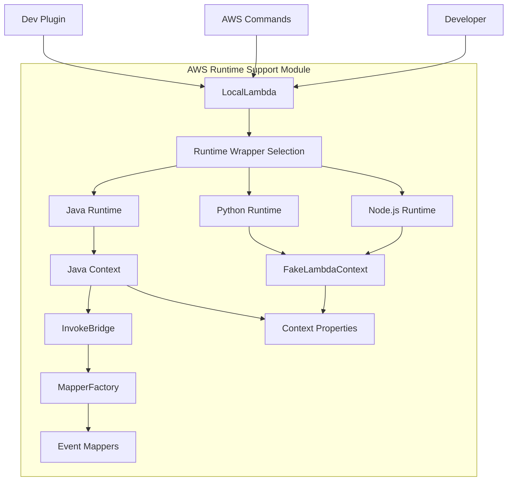
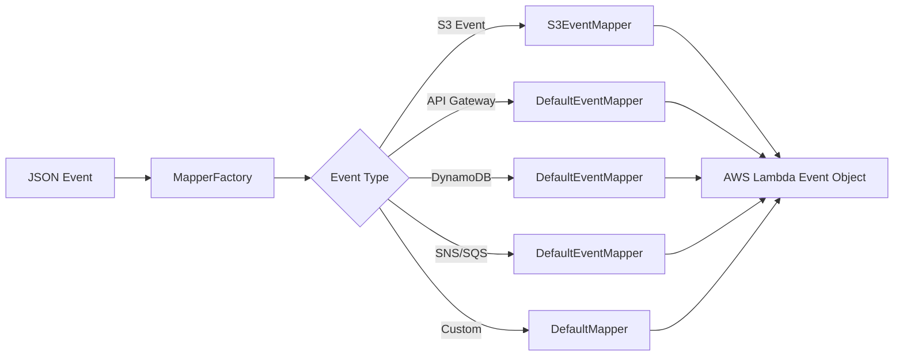
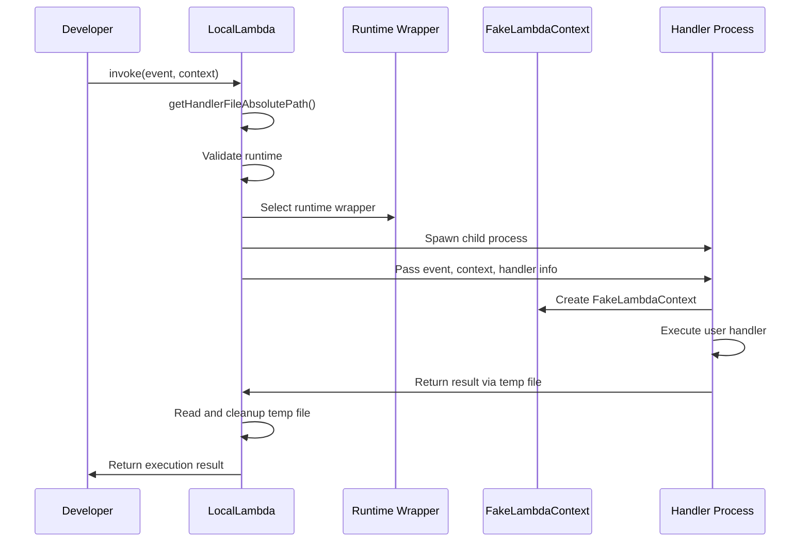
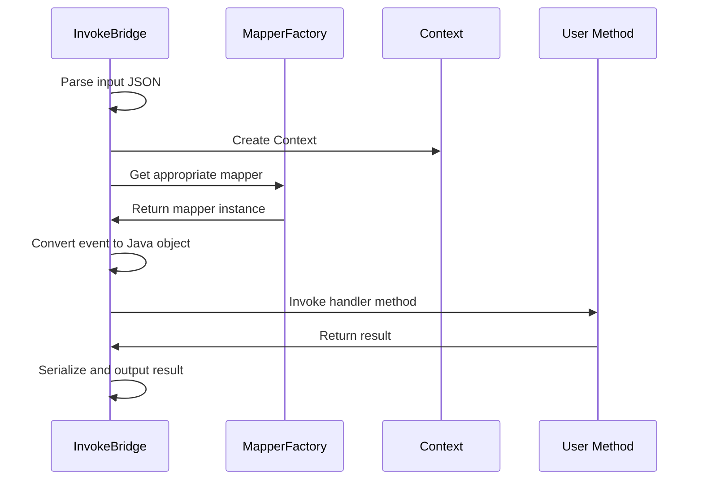

# AWS Runtime Support Module

## Introduction

The AWS Runtime Support module is a critical component of the Serverless Framework that enables local development and testing of AWS Lambda functions across multiple programming languages and runtime environments. This module provides the infrastructure necessary to simulate AWS Lambda execution contexts locally, allowing developers to test their serverless applications without deploying to AWS.

The module bridges the gap between local development environments and AWS Lambda's production runtime, providing consistent behavior and context simulation across different programming languages including Python, Java, and Node.js.

## Architecture Overview

The AWS Runtime Support module consists of three main architectural layers:

1. **Local Lambda Execution Layer** - Manages the lifecycle of local Lambda function execution
2. **Runtime Wrapper Layer** - Provides language-specific execution environments
3. **Context Simulation Layer** - Simulates AWS Lambda runtime context and services



## Core Components

### LocalLambda Class

The `LocalLambda` class serves as the primary orchestrator for local Lambda function execution. It manages the entire lifecycle from handler discovery to execution and result retrieval.

**Key Responsibilities:**
- Runtime validation and selection
- Handler file discovery with extension resolution
- Environment variable management
- Child process orchestration
- Result extraction and cleanup

**Supported Runtimes:**
- Node.js (14.x, 16.x, 18.x, 20.x, 22.x)
- Python (via FakeLambdaContext)
- Java (via InvokeBridge)

### Runtime Context Simulation

#### FakeLambdaContext (Python)

The `FakeLambdaContext` class provides a Python implementation of the AWS Lambda context object, simulating essential Lambda runtime properties:

```python
class FakeLambdaContext:
    - function_name: str
    - function_version: str
    - invoked_function_arn: str
    - memory_limit_in_mb: str
    - aws_request_id: str
    - log_group_name: str
    - log_stream_name: str
    - get_remaining_time_in_millis(): int
```

#### Java Context Implementation

The Java implementation provides a more comprehensive context simulation that implements the official AWS Lambda `com.amazonaws.services.lambda.runtime.Context` interface:

```java
class Context implements com.amazonaws.services.lambda.runtime.Context {
    - getAwsRequestId(): String
    - getLogGroupName(): String
    - getLogStreamName(): String
    - getFunctionName(): String
    - getFunctionVersion(): String
    - getInvokedFunctionArn(): String
    - getRemainingTimeInMillis(): int
    - getMemoryLimitInMB(): int
    - getLogger(): LambdaLogger
}
```

### InvokeBridge (Java)

The `InvokeBridge` class serves as the entry point for Java Lambda function execution. It handles:

- **Dynamic Class Loading**: Loads user Lambda handlers via URLClassLoader
- **Method Resolution**: Intelligently selects the appropriate handler method based on parameter count and types
- **Event Mapping**: Converts input events to appropriate Java objects using the MapperFactory
- **Context Injection**: Provides Lambda context to handler methods

**Handler Method Selection Logic:**
1. Methods with more parameters take precedence
2. If parameter counts are equal, methods with Context as the last parameter are preferred
3. Supports 1, 2, or 3 parameter handlers (including RequestStreamHandler compatibility)

### Event Mapping System

The Java runtime includes a sophisticated event mapping system that automatically converts JSON events to appropriate AWS Lambda event objects:



**Supported Event Types:**
- APIGatewayProxyRequestEvent
- APIGatewayV2HTTPEvent
- APIGatewayV2WebSocketEvent
- ApplicationLoadBalancerRequestEvent
- CloudFrontEvent
- CloudWatchLogsEvent
- CodeCommitEvent
- DynamodbEvent
- KinesisEvent
- LexEvent
- S3Event (custom mapper)
- SNSEvent
- SQSEvent
- ScheduledEvent

## Data Flow

### Local Lambda Invocation Flow



### Java Runtime Execution Flow



## Integration Points

### AWS Commands Integration

The AWS Runtime Support module integrates with various AWS commands through the [aws-commands](aws-commands.md) module:

- **AwsInvokeLocal**: Primary consumer of LocalLambda functionality
- **AwsDev**: Uses LocalLambda for development mode
- **AwsDeploy/AwsDeployFunction**: Validates handlers before deployment

### Plugin System Integration

The module leverages the [plugin-management](plugin-management.md) system for:
- Runtime wrapper registration
- Handler discovery
- Environment variable propagation

### Configuration Management

Integration with [configuration-management](configuration-management.md) provides:
- Runtime configuration validation
- Environment variable management
- Handler path resolution

## Error Handling

The module implements comprehensive error handling across all components:

### LocalLambda Error Handling
- **Runtime Validation**: Throws `ServerlessError` for unsupported runtimes
- **Handler Discovery**: Throws `ServerlessError` when handler files are not found
- **Process Management**: Handles child process errors and timeouts
- **File Operations**: Manages temporary file creation and cleanup

### Java Runtime Error Handling
- **Class Loading**: Handles ClassNotFoundException and InstantiationException
- **Method Resolution**: Throws NoSuchMethodException for invalid handlers
- **Event Mapping**: Handles JSON parsing and conversion errors
- **Invocation**: Catches and logs all exceptions during handler execution

## Security Considerations

### Process Isolation
- Each Lambda invocation runs in a separate child process
- Environment variables are isolated per invocation
- Temporary files use unique names based on process ID

### Class Loading Security (Java)
- Uses URLClassLoader with isolated class paths
- Prevents class conflicts between user code and framework
- Context class loader isolation for thread safety

## Performance Optimizations

### Handler Caching
- Handler file paths are resolved once and cached
- Runtime wrapper selection is optimized for repeated invocations

### Process Management
- Efficient child process spawning with proper resource cleanup
- Stream-based result extraction to handle large payloads
- Temporary file management with automatic cleanup

### Event Mapping
- MapperFactory uses static initialization for performance
- Event type detection is optimized for common event types
- Custom mappers for complex event types (S3)

## Extension Points

### Adding New Runtime Support

To add support for a new runtime, extend the `runtimeWrappers` configuration in LocalLambda:

```javascript
{
  command: 'python3',
  arguments: [],
  path: 'path/to/python-wrapper.py',
  versions: ['python3.9', 'python3.10'],
  extensions: ['.py'],
}
```

### Custom Event Mappers (Java)

Implement the `Mapper` interface and register with MapperFactory:

```java
public class CustomEventMapper implements Mapper {
    public Object read(HashMap<String, Object> event) {
        // Custom mapping logic
    }
}
```

## Dependencies

### Core Dependencies
- [core-framework](core-framework.md): Base framework functionality
- [aws-provider](aws-provider.md): AWS-specific configurations and utilities
- [aws-commands](aws-commands.md): Command integration

### Runtime Dependencies
- Java: Jackson for JSON processing, AWS Lambda Java Core library
- Node.js: Built-in modules (child_process, fs, path)
- Python: Standard library modules (json, subprocess, importlib)

## Future Enhancements

### Planned Features
- Support for additional programming languages (Go, .NET, Ruby)
- Enhanced debugging capabilities with breakpoint support
- Performance profiling integration
- Memory and CPU usage simulation
- Cold start simulation
- VPC environment simulation

### Architecture Improvements
- Runtime containerization for better isolation
- Hot reloading for development mode
- Distributed tracing support
- Enhanced error reporting with stack traces
- Performance metrics collection

## Conclusion

The AWS Runtime Support module is a foundational component that enables the Serverless Framework to provide a comprehensive local development experience. By simulating AWS Lambda's runtime environment across multiple programming languages, it allows developers to build, test, and debug serverless applications locally before deployment. The modular architecture, comprehensive error handling, and extensible design make it a robust platform for serverless development workflows.