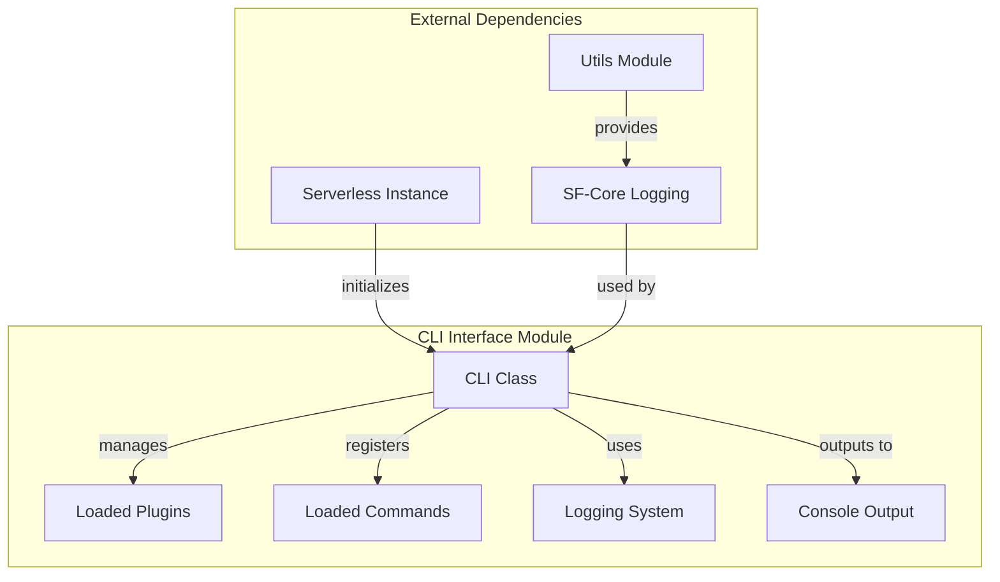
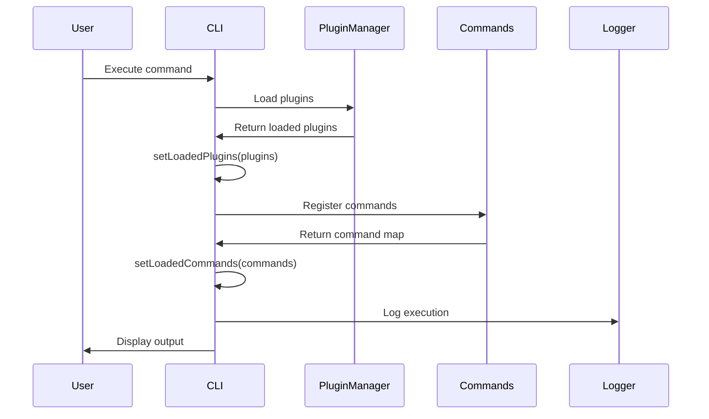
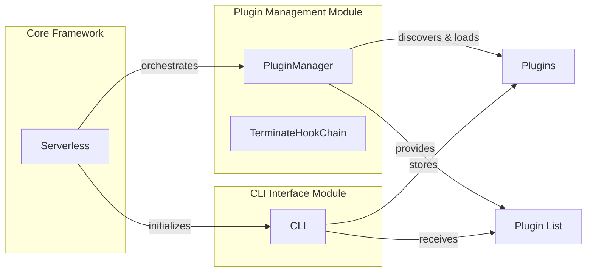
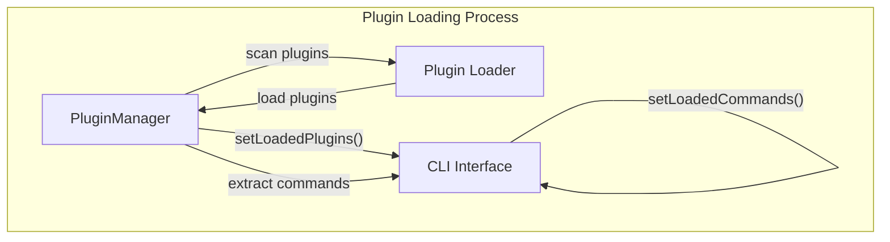
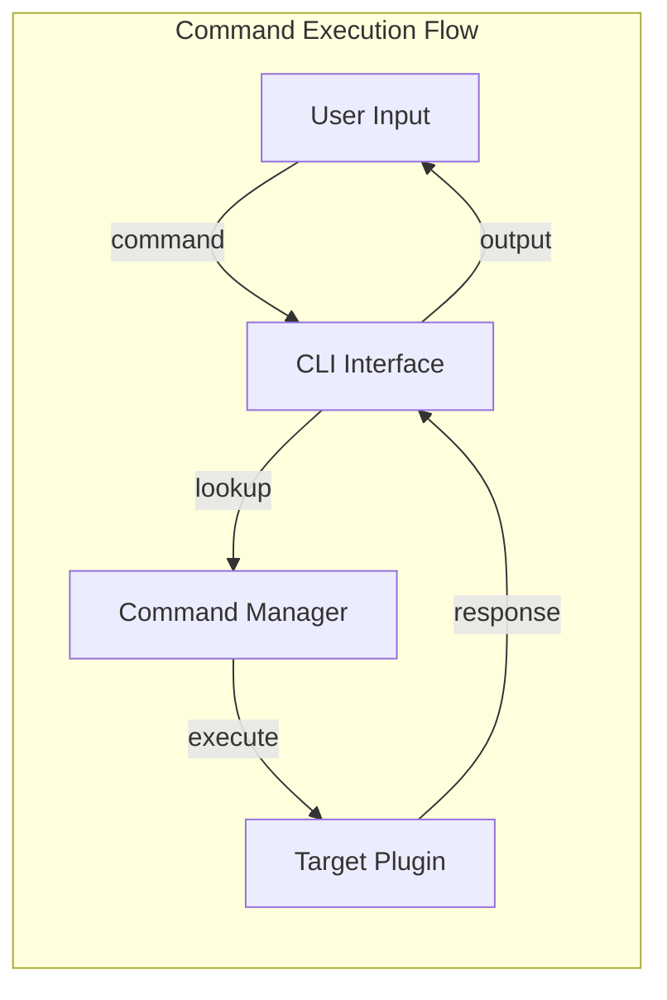

# CLI Interface Module Documentation

## Introduction

The CLI Interface module serves as the primary command-line interaction layer for the Serverless Framework. It provides the essential bridge between user commands and the underlying framework operations, handling plugin management, command execution, and user feedback through the console interface.

## Overview

The CLI Interface module is responsible for:
- Managing the command-line interface lifecycle
- Coordinating plugin loading and command registration
- Providing logging and console output capabilities
- Serving as the main entry point for user interactions with the Serverless Framework

## Architecture

### Component Structure



### Core Components

#### CLI Class (`lib.classes.cli.CLI`)

The main CLI class that orchestrates the command-line interface functionality:

```javascript
class CLI {
  constructor(serverless) {
    this.serverless = serverless
    this.loadedPlugins = []
    this.loadedCommands = {}
  }
}
```

**Key Properties:**
- `serverless`: Reference to the Serverless Framework instance
- `loadedPlugins`: Array of currently loaded plugins
- `loadedCommands`: Object containing registered commands

**Key Methods:**
- `setLoadedPlugins(plugins)`: Updates the list of loaded plugins
- `setLoadedCommands(commands)`: Updates the registered commands dictionary
- `printDot()`: Outputs a progress indicator to stderr
- `log(message, entity, opts)`: Logs messages with optional entity context
- `consoleLog(message)`: Outputs messages to the console

## Data Flow

### Command Processing Flow



### Plugin Integration Flow



## Dependencies

### Internal Dependencies

The CLI Interface module depends on several core framework components:

1. **Utils Module** ([utility-functions.md](utility-functions.md))
   - Provides the logging system through `@serverlessinc/sf-core/src/utils.js`
   - Supplies the `log` utility for structured logging

2. **Plugin Management Module** ([plugin-management.md](plugin-management.md))
   - PluginManager discovers and loads plugins
   - CLI receives and stores the loaded plugins list
   - Commands are registered through the plugin system

3. **Core Framework** ([core-orchestrator.md](core-orchestrator.md))
   - Serverless instance initializes the CLI
   - Coordinates the overall framework operation

### External Dependencies

- **@serverlessinc/sf-core**: Provides the core logging infrastructure
- **process.stderr**: Used for progress indicators
- **process.stdout**: Used for console output

## Integration Points

### Plugin System Integration

The CLI module integrates with the plugin system through:



### Command Execution Integration



## Usage Patterns

### Basic CLI Operations

1. **Plugin Registration**: The CLI receives loaded plugins from the PluginManager and stores them for command execution
2. **Command Registration**: Commands extracted from plugins are registered in the CLI for user access
3. **Progress Indication**: The `printDot()` method provides visual feedback during long-running operations
4. **Logging**: Structured logging through the sf-core logging system ensures consistent output

### Error Handling

The CLI module acts as a central point for:
- Command validation
- Plugin loading status reporting
- User feedback through console output
- Progress indication during operations

## Extension Points

The CLI module is designed to be extended through:

1. **Plugin Commands**: New commands are automatically registered when plugins are loaded
2. **Logging Levels**: Integration with the sf-core logging system allows for configurable verbosity
3. **Output Formatting**: Console output can be customized through the logging system

## Best Practices

### For Plugin Developers

- Use the CLI logging methods for consistent output formatting
- Register commands through the plugin system rather than directly accessing the CLI
- Provide meaningful entity names when logging for better traceability

### For Core Development

- Maintain the separation between CLI interface and business logic
- Use the structured logging system for all user-facing messages
- Keep the CLI interface lightweight and focused on user interaction

## Related Documentation

- [Plugin Management Module](plugin-management.md) - For plugin loading and command registration details
- [Utility Functions Module](utility-functions.md) - For logging system details
- [Core Orchestrator Module](core-orchestrator.md) - For overall framework coordination
- [Configuration Management Module](configuration-management.md) - For configuration handling in CLI commands

## Summary

The CLI Interface module serves as the crucial bridge between users and the Serverless Framework. It provides a clean, consistent interface for command execution while delegating the actual business logic to appropriate plugins and core components. Its lightweight design ensures that it remains focused on user interaction while leveraging the robust plugin system and logging infrastructure provided by the framework.