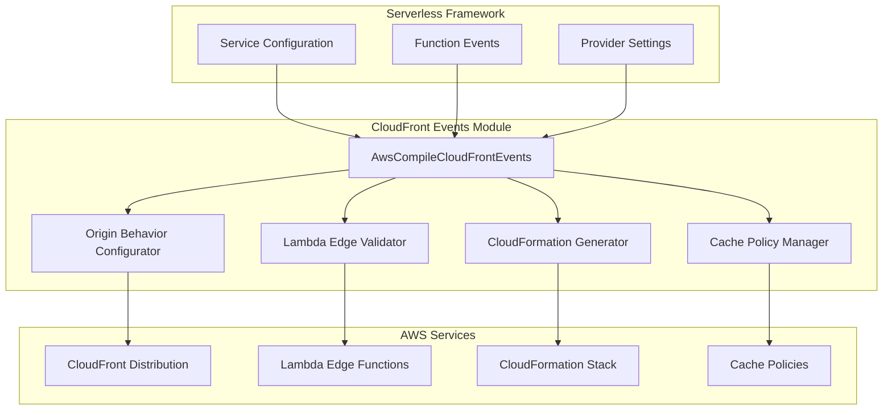
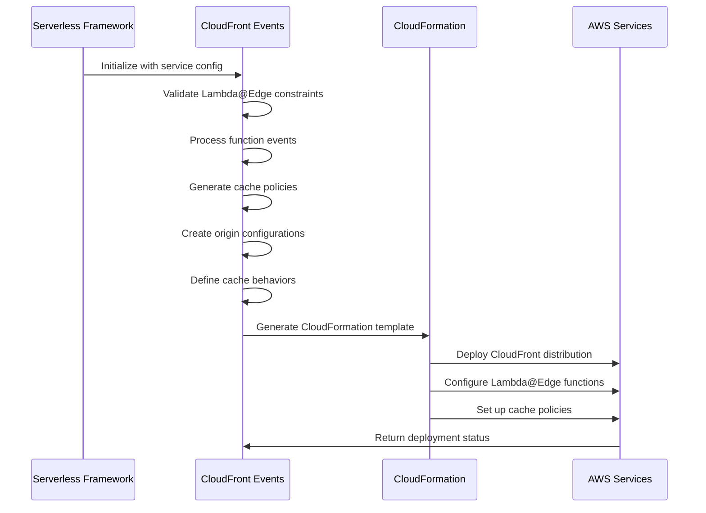
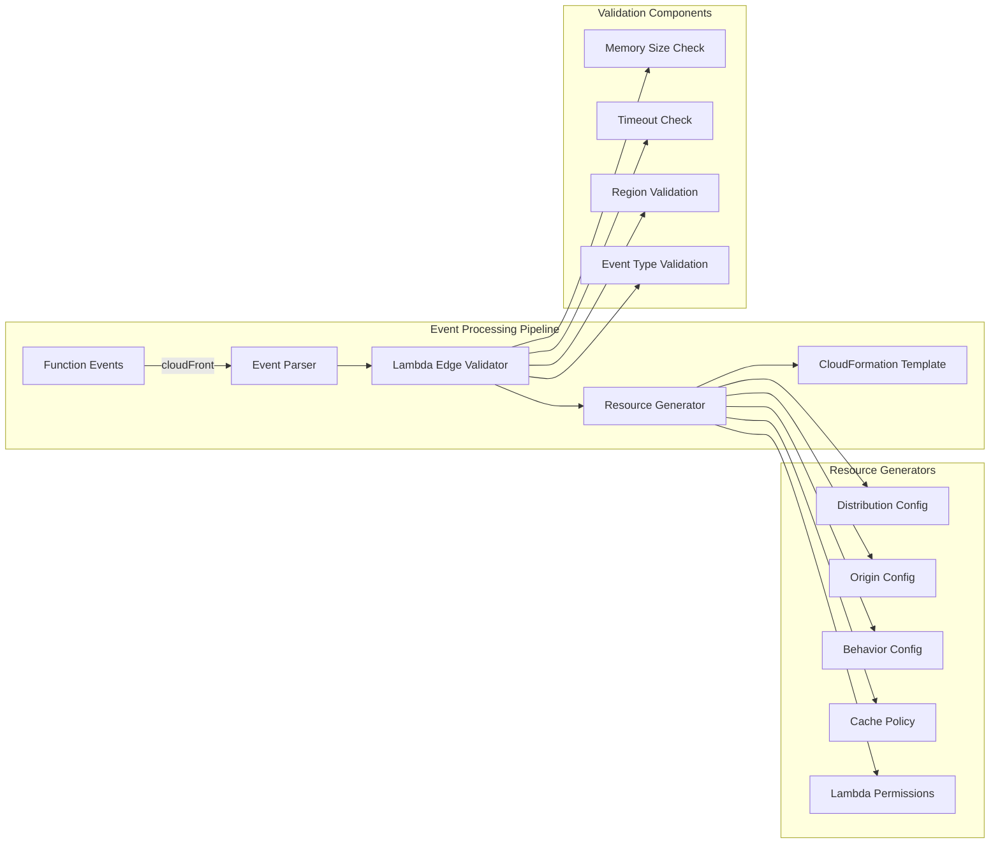
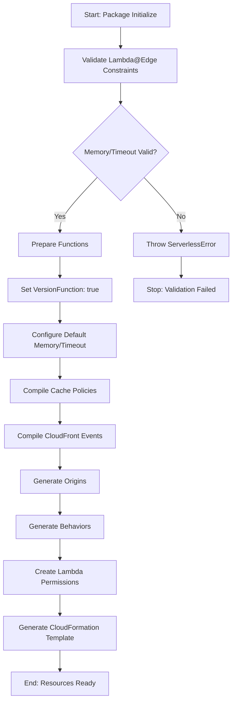

# CloudFront Events Module

## Introduction

The CloudFront Events module provides comprehensive support for AWS CloudFront distribution events within the Serverless Framework. It enables developers to configure Lambda@Edge functions that execute at various points in the CloudFront request/response lifecycle, allowing for dynamic content manipulation, authentication, caching optimization, and request/response processing at AWS edge locations globally.

This module handles the complex orchestration required to deploy Lambda@Edge functions, including region restrictions, memory and timeout limitations, IAM permissions, and CloudFormation resource generation for both the CloudFront distribution and associated cache policies.

## Architecture Overview



## Core Components

### AwsCompileCloudFrontEvents

The main class responsible for compiling CloudFront events into CloudFormation resources. It orchestrates the entire process from validation to resource generation.

**Key Responsibilities:**
- Schema definition and validation for CloudFront event configurations
- Lambda@Edge function validation (memory, timeout, region constraints)
- CloudFormation resource generation for distributions, origins, and behaviors
- Cache policy management and association
- IAM role and permission configuration
- Deployment orchestration with proper hook integration

## Data Flow Architecture



## Component Interactions



## Configuration Schema

### CloudFront Event Properties

```yaml
functions:
  myEdgeFunction:
    handler: index.handler
    events:
      - cloudFront:
          eventType: viewer-request|origin-request|origin-response|viewer-response
          pathPattern: "/*"
          isDefaultOrigin: false
          includeBody: true
          origin: "https://example.com"
          behavior:
            ViewerProtocolPolicy: redirect-to-https
            AllowedMethods: [GET, HEAD, OPTIONS]
            CachedMethods: [GET, HEAD]
          cachePolicy:
            name: myCachePolicy
            # or
            id: 658327ea-f89d-4fab-a63d-7e88639e58f6
```

### Lambda@Edge Constraints

The module enforces AWS Lambda@Edge limitations:

**Viewer Request/Response Functions:**
- Maximum memory: 128 MB
- Maximum timeout: 5 seconds
- Must be deployed in us-east-1 region

**Origin Request/Response Functions:**
- Maximum memory: 10,240 MB
- Maximum timeout: 30 seconds
- Must be deployed in us-east-1 region

## Process Flow



## Integration Points

### Dependencies

- **[aws-provider](../aws-provider.md)**: Provides AWS-specific configurations and naming conventions
- **[aws-package-compile](../aws-package-compile.md)**: Integrates with the packaging and compilation pipeline
- **[configuration-management](../configuration-management.md)**: Utilizes schema validation and configuration handling
- **[core-orchestrator](../core-orchestrator.md)**: Hooks into the main Serverless Framework lifecycle

### Hook Integration

The module integrates with the Serverless Framework through specific lifecycle hooks:

```javascript
{
  'package:initialize': async () => this.validate(),
  'before:package:compileFunctions': async () => this.prepareFunctions(),
  'package:compileEvents': () => {
    this.compileCloudFrontCachePolicies()
    this.compileCloudFrontEvents()
  },
  'before:remove:remove': async () => this.logRemoveReminder()
}
```

## CloudFormation Resource Generation

### Generated Resources

1. **AWS::CloudFront::Distribution**: Main distribution configuration
2. **AWS::CloudFront::CachePolicy**: Custom cache policies (when configured)
3. **AWS::Lambda::Permission**: Invoke permissions for Lambda@Edge functions
4. **AWS::Lambda::Version**: Versioned Lambda functions for edge deployment

### IAM Role Modifications

The module automatically updates the Lambda execution role to include:
- `edgelambda.amazonaws.com` as a trusted service
- CloudWatch Logs permissions for all regions
- Lambda invocation permissions for CloudFront

## Error Handling

The module implements comprehensive error handling for common scenarios:

```javascript
// Region validation
if (this.provider.getRegion() !== 'us-east-1') {
  throw new ServerlessError(
    'CloudFront associated functions have to be deployed to the us-east-1 region.',
    'CLOUDFRONT_INVALID_REGION'
  )
}

// Memory size validation
if (functionObj.memorySize && functionObj.memorySize > maxMemorySize) {
  throw new ServerlessError(
    `"${functionName}" memorySize is greater than ${maxMemorySize} which is not supported by Lambda@Edge functions of type "${eventType}"`,
    'LAMBDA_EDGE_UNSUPPORTED_MEMORY_SIZE'
  )
}
```

## Best Practices

### 1. Function Configuration
- Always specify appropriate memory and timeout values within Lambda@Edge limits
- Use the `isDefaultOrigin` property carefully to avoid conflicts
- Configure proper cache policies for optimal performance

### 2. Origin Configuration
- Define origins clearly using either string URLs or detailed origin objects
- Configure appropriate origin protocols and custom headers
- Use S3 origins for static content and custom origins for dynamic content

### 3. Behavior Configuration
- Set appropriate ViewerProtocolPolicy for security
- Configure AllowedMethods and CachedMethods based on use case
- Use managed cache policies when possible for better performance

### 4. Deployment Considerations
- Always deploy to us-east-1 region for Lambda@Edge functions
- Remember that Lambda@Edge functions are retained after stack removal
- Monitor CloudWatch logs in multiple regions for debugging

## Monitoring and Debugging

### CloudWatch Logs
Lambda@Edge functions create log streams in regions closest to execution locations. The module configures permissions for logs in all regions.

### Removal Reminders
The module provides warnings during removal operations since Lambda@Edge functions must be manually removed after CloudFront distribution deletion.

### Validation Feedback
Comprehensive validation provides clear error messages for configuration issues, helping developers identify and fix problems before deployment.

## Related Documentation

- [AWS Provider Module](../aws-provider.md) - Core AWS integration and configuration
- [AWS Package Compile Module](../aws-package-compile.md) - Function packaging and compilation
- [API Gateway Events Module](../api-gateway-events.md) - Alternative HTTP event configuration
- [Configuration Management Module](../configuration-management.md) - Schema validation and configuration handling