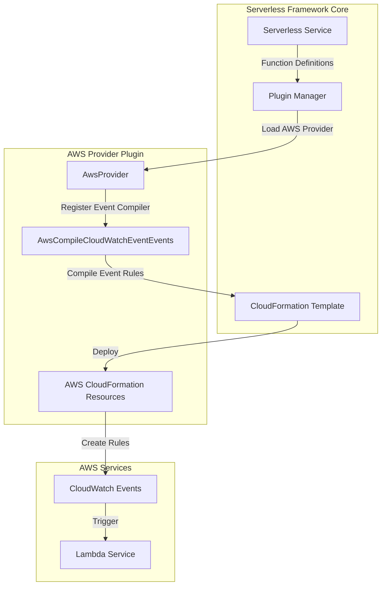
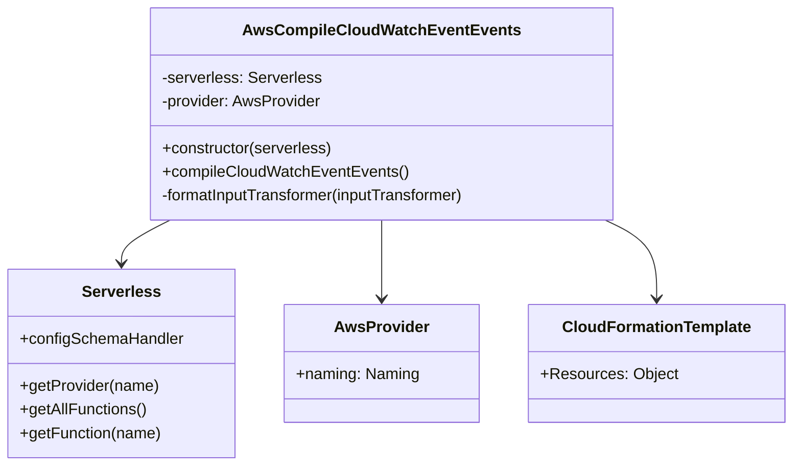
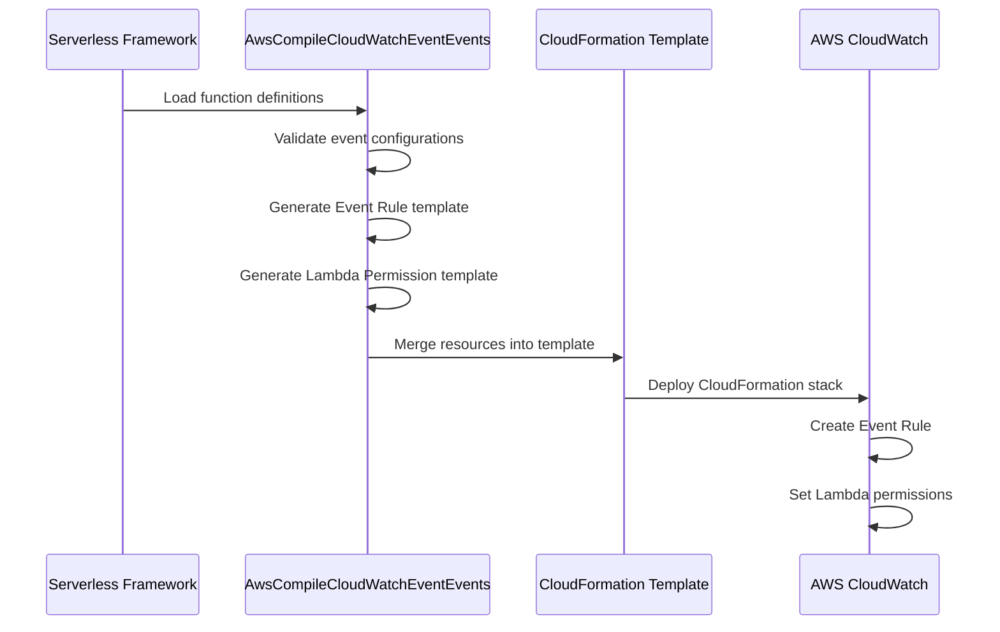
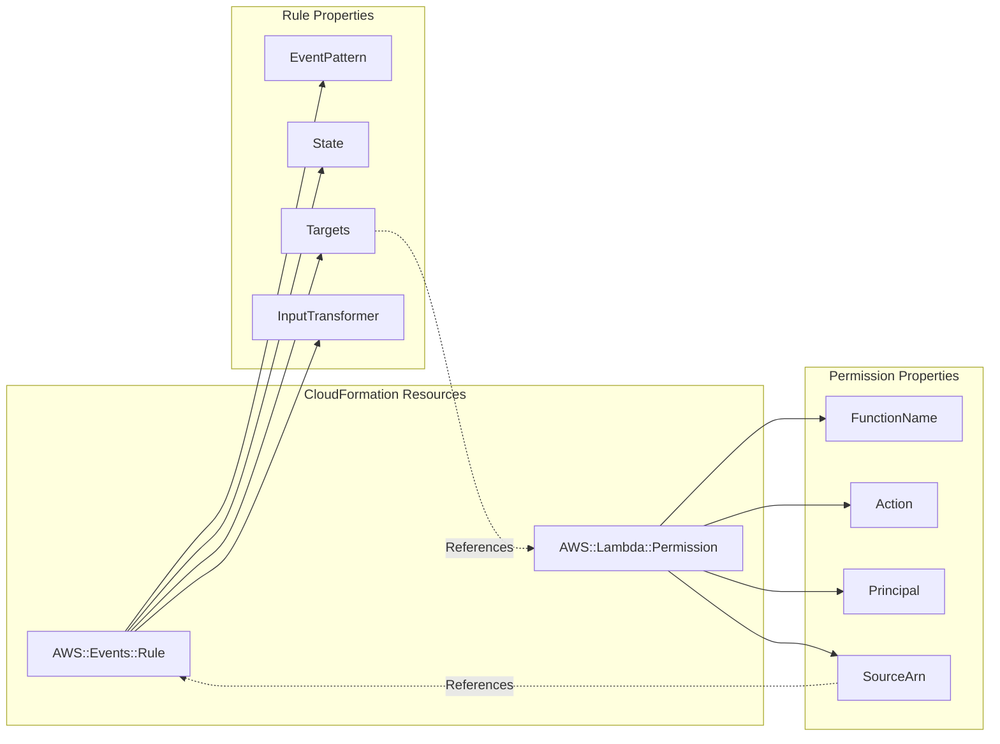
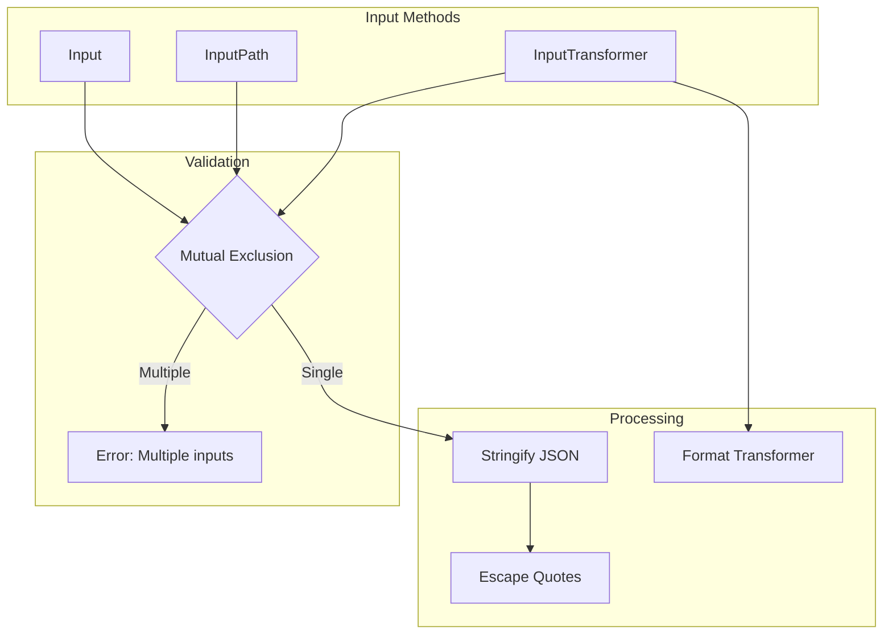
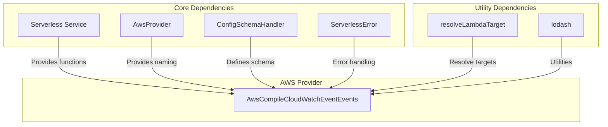

# CloudWatch Event Events Module

## Introduction

The CloudWatch Event Events module is a specialized component within the Serverless Framework's AWS provider plugin system. It handles the compilation and configuration of AWS CloudWatch Events rules that trigger Lambda functions based on event patterns. This module enables serverless applications to respond to AWS service events, custom events, and scheduled events through the CloudWatch Events service.

## Architecture Overview

The CloudWatch Event Events module operates as part of the AWS events compilation pipeline, transforming serverless function event definitions into AWS CloudFormation resources.



## Core Components

### AwsCompileCloudWatchEventEvents

The primary class responsible for compiling CloudWatch Event configurations into CloudFormation resources.

**Location**: `lib/plugins/aws/package/compile/events/cloud-watch-event.js`

**Key Responsibilities**:
- Schema definition for CloudWatch Event configurations
- Validation of event properties and mutual exclusivity rules
- Generation of CloudFormation templates for Event Rules and Lambda permissions
- Input transformation and formatting



## Configuration Schema

The module defines a comprehensive schema for CloudWatch Event configurations with the following properties:

```javascript
{
  type: 'object',
  properties: {
    event: { type: 'object' },                    // Event pattern definition
    input: {                                       // Static input data
      anyOf: [
        { type: 'string', maxLength: 8192 },
        { type: 'object' }
      ]
    },
    inputPath: { type: 'string', minLength: 1, maxLength: 256 },
    inputTransformer: {                            // Input transformation rules
      type: 'object',
      properties: {
        inputPathsMap: { type: 'object' },
        inputTemplate: { type: 'string', minLength: 1, maxLength: 8192 }
      },
      required: ['inputTemplate']
    },
    description: { type: 'string', maxLength: 512 },
    name: {                                        // Rule name
      type: 'string',
      pattern: '[a-zA-Z0-9-_.]+',
      minLength: 1,
      maxLength: 64
    },
    enabled: { type: 'boolean' }                   // Rule state
  }
}
```

## Compilation Process

### Event Processing Flow



### Resource Generation

The module generates two primary CloudFormation resources for each CloudWatch Event:

1. **AWS::Events::Rule**: Defines the event pattern and target configuration
2. **AWS::Lambda::Permission**: Grants CloudWatch Events permission to invoke the Lambda function



## Input Handling

The module supports three mutually exclusive input methods:

### 1. Static Input (`input`)
- Direct JSON or string input passed to the Lambda function
- Maximum length: 8192 characters
- Objects are automatically stringified

### 2. Input Path (`inputPath`)
- JSONPath expression to extract data from the event
- Maximum length: 256 characters
- Used for selective data extraction

### 3. Input Transformer (`inputTransformer`)
- Advanced transformation using InputTemplate and optional InputPathsMap
- Maximum template length: 8192 characters
- Supports variable substitution and formatting



## Dependencies and Integration

### Module Dependencies

The CloudWatch Event Events module integrates with several core components:



### Related Modules

- **[aws-provider](aws-provider.md)**: Parent AWS provider module
- **[aws-events](aws-events.md)**: Sibling event compilation modules
- **[aws-package-compile](aws-package-compile.md)**: Package compilation framework
- **[configuration-management](configuration-management.md)**: Configuration schema handling

## Error Handling

The module implements specific error handling for configuration validation:

### CloudWatch Multiple Input Properties Error
- **Code**: `CLOUDWATCH_MULTIPLE_INPUT_PROPERTIES`
- **Trigger**: When multiple input methods are specified simultaneously
- **Message**: "You can only set one of input, inputPath, or inputTransformer properties at the same time for cloudwatch events."

## Usage Examples

### Basic Event Pattern
```yaml
functions:
  myFunction:
    handler: index.handler
    events:
      - cloudwatchEvent:
          event:
            source:
              - aws.ec2
            detail-type:
              - EC2 Instance State-change Notification
            detail:
              state:
                - running
```

### Input Transformer Configuration
```yaml
functions:
  myFunction:
    handler: index.handler
    events:
      - cloudwatchEvent:
          event:
            source:
              - aws.ec2
          inputTransformer:
            inputPathsMap:
              instanceId: '$.detail.instance-id'
              state: '$.detail.state'
            inputTemplate: '{"instance": "<instanceId>", "status": "<state>"}'
```

## Best Practices

1. **Event Pattern Design**: Use specific event patterns to minimize unnecessary Lambda invocations
2. **Input Validation**: Validate input data in your Lambda function for security
3. **Error Handling**: Implement proper error handling in Lambda functions for failed event processing
4. **Resource Naming**: Use descriptive names for CloudWatch Event rules for better management
5. **State Management**: Consider rule state (enabled/disabled) for deployment scenarios

## CloudFormation Template Structure

The module generates CloudFormation resources with the following structure:

```json
{
  "Resources": {
    "FunctionNameCloudWatchEvent1": {
      "Type": "AWS::Events::Rule",
      "Properties": {
        "EventPattern": {...},
        "State": "ENABLED",
        "Targets": [{
          "Arn": {"Fn::GetAtt": ["FunctionNameLambdaFunction", "Arn"]},
          "Id": "function-name-target"
        }]
      }
    },
    "FunctionNameCloudWatchEventPermission1": {
      "Type": "AWS::Lambda::Permission",
      "Properties": {
        "FunctionName": {"Fn::GetAtt": ["FunctionNameLambdaFunction", "Arn"]},
        "Action": "lambda:InvokeFunction",
        "Principal": "events.amazonaws.com",
        "SourceArn": {"Fn::GetAtt": ["FunctionNameCloudWatchEvent1", "Arn"]}
      }
    }
  }
}
```

This comprehensive structure ensures proper integration between CloudWatch Events and Lambda functions while maintaining security through appropriate IAM permissions.