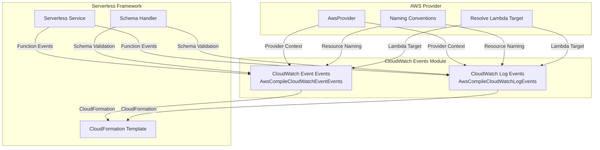
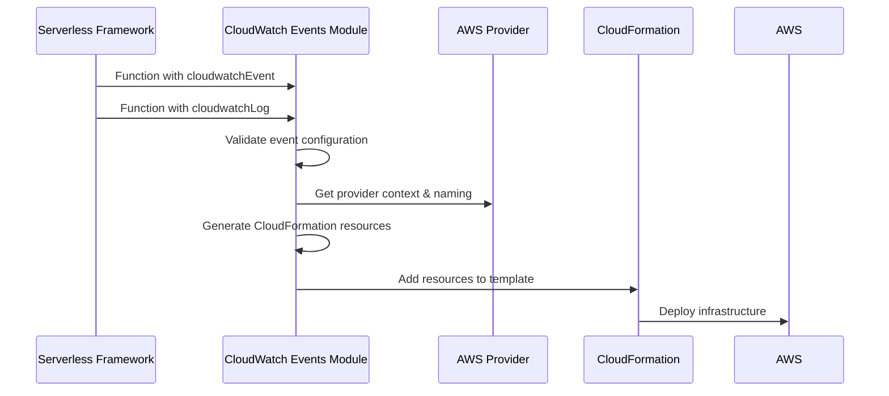

# CloudWatch Events Module Documentation

## Overview

The CloudWatch Events module is a critical component of the AWS provider plugin system that handles the compilation and configuration of AWS CloudWatch Events for serverless functions. This module enables serverless applications to respond to CloudWatch Events and CloudWatch Log events, providing event-driven capabilities for AWS Lambda functions.

## Purpose

The CloudWatch Events module serves as the bridge between serverless function definitions and AWS CloudWatch Events infrastructure. It translates high-level event configurations in serverless.yml files into AWS CloudFormation resources, enabling functions to be triggered by:

- CloudWatch Event Rules (EventBridge events)
- CloudWatch Log Group subscription filters

## Architecture



## Module Components

### 1. CloudWatch Event Events ([cloud-watch-event-events.md](cloud-watch-event-events.md))

The `AwsCompileCloudWatchEventEvents` class handles the compilation of CloudWatch Event Rules (EventBridge events). It processes function event configurations and generates the necessary CloudFormation resources for EventBridge rule creation and Lambda function permissions.

**Key Responsibilities:**
- Event pattern validation and processing
- CloudWatch Event Rule CloudFormation template generation
- Lambda permission configuration for EventBridge invocation
- Input transformation handling (input, inputPath, inputTransformer)

For detailed implementation details, see [cloud-watch-event-events.md](cloud-watch-event-events.md).

### 2. CloudWatch Log Events ([cloud-watch-log-events.md](cloud-watch-log-events.md))

The `AwsCompileCloudWatchLogEvents` class manages CloudWatch Log Group subscription filters. It enables Lambda functions to process log events from specified CloudWatch Log Groups in real-time.

**Key Responsibilities:**
- Log group subscription filter configuration
- Filter pattern processing and validation
- Lambda permission setup for log event processing
- Multi-log-group event handling with common suffix optimization

For detailed implementation details, see [cloud-watch-log-events.md](cloud-watch-log-events.md).

## Integration with Serverless Framework

The CloudWatch Events module integrates deeply with the Serverless Framework's event system:



## Event Configuration Schema

### CloudWatch Event Configuration

```yaml
functions:
  myFunction:
    handler: index.handler
    events:
      - cloudwatchEvent:
          event:
            source:
              - "aws.ec2"
            detail-type:
              - "EC2 Instance State-change Notification"
            detail:
              state:
                - "running"
          input:
            key: value
          enabled: true
          name: my-event-rule
          description: "My CloudWatch Event Rule"
```

### CloudWatch Log Configuration

```yaml
functions:
  myFunction:
    handler: index.handler
    events:
      - cloudwatchLog:
          logGroup: "/aws/lambda/my-log-group"
          filter: "[timestamp, request_id, message]"
```

## Dependencies

The CloudWatch Events module depends on several core components:

- **[aws-provider](aws-provider.md)**: Provides AWS-specific context and naming conventions
- **[aws-package-compile](aws-package-compile.md)**: Integrates with the package compilation pipeline
- **[core-framework](core-framework.md)**: Utilizes core serverless functionality

## Error Handling

The module implements comprehensive error handling for common configuration issues:

- **Multiple Input Properties**: Prevents conflicting input configurations (input, inputPath, inputTransformer)
- **Log Group Limits**: Enforces AWS limits on subscription filters per log group
- **Schema Validation**: Validates event configurations against defined schemas
- **Resource Naming**: Ensures unique and valid CloudFormation resource names

## Best Practices

1. **Event Pattern Design**: Use specific event patterns to minimize unnecessary Lambda invocations
2. **Input Transformation**: Leverage input transformers to reduce payload size and processing overhead
3. **Log Group Organization**: Structure log groups logically to optimize filter patterns
4. **Permission Management**: The module automatically handles Lambda permissions, but review IAM policies for least privilege
5. **Error Handling**: Implement proper error handling in Lambda functions for robust event processing

## Limitations

- Maximum 2 subscription filters per CloudWatch Log Group per function
- Input template size limited to 8192 characters
- Event rule name limited to 64 characters
- Description limited to 512 characters

## Related Documentation

- [AWS Events Module](aws-events.md) - Parent module containing all AWS event types
- [AWS Provider](aws-provider.md) - AWS provider configuration and context
- [Core Framework](core-framework.md) - Core serverless framework functionality