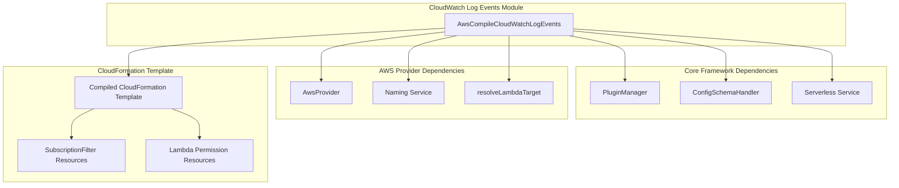
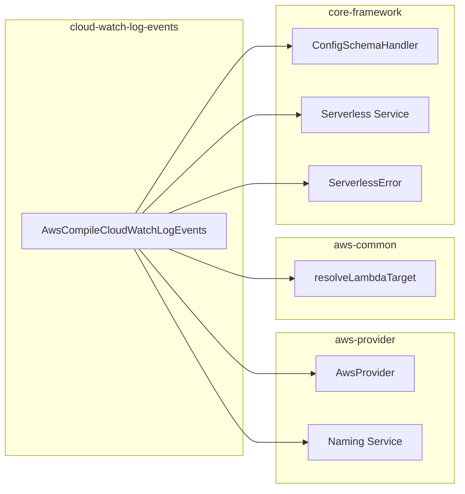
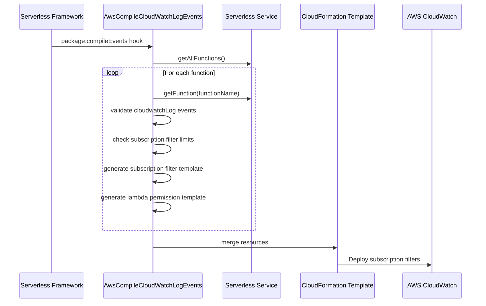
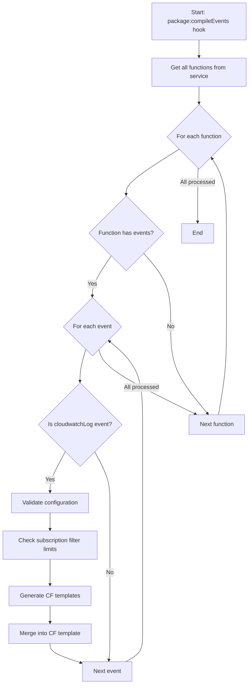

# CloudWatch Log Events Module

## Introduction

The CloudWatch Log Events module is responsible for configuring AWS CloudWatch Logs subscription filters that trigger Lambda functions when specific log patterns are detected. This module enables serverless applications to react to log events in real-time, allowing for automated log analysis, alerting, and processing workflows.

## Architecture

### Component Overview



### Module Dependencies



## Core Components

### AwsCompileCloudWatchLogEvents

The main class responsible for compiling CloudWatch Log events into CloudFormation resources.

**Location**: `lib/plugins/aws/package/compile/events/cloud-watch-log.js`

**Key Responsibilities**:
- Validates CloudWatch Log event configurations
- Generates CloudFormation subscription filter resources
- Creates Lambda permissions for CloudWatch Logs service
- Enforces AWS limits (2 subscription filters per log group)
- Handles log group name patterns and filter patterns

## Data Flow



## Configuration Schema

The module defines the following schema for CloudWatch Log events:

```yaml
# Simple string format
cloudwatchLog: "/aws/lambda/my-log-group"

# Object format with filter
cloudwatchLog:
  logGroup: "/aws/lambda/my-log-group"
  filter: "[timestamp, request_id, message]"
```

### Schema Validation Rules

- **logGroup**: Must be a valid AWS CloudWatch Log Group name
- **filter**: Optional filter pattern for log events
- **Limit**: Maximum 2 subscription filters per log group per function

## CloudFormation Resource Generation

### Subscription Filter Resource

```json
{
  "Type": "AWS::Logs::SubscriptionFilter",
  "Properties": {
    "LogGroupName": "log-group-name",
    "FilterPattern": "filter-pattern",
    "DestinationArn": "lambda-function-arn"
  }
}
```

### Lambda Permission Resource

```json
{
  "Type": "AWS::Lambda::Permission",
  "Properties": {
    "FunctionName": "lambda-function-arn",
    "Action": "lambda:InvokeFunction",
    "Principal": "logs.region.amazonaws.com",
    "SourceArn": {
      "Fn::Join": ["", [
        "arn:aws:logs:",
        {"Ref": "AWS::Region"},
        ":",
        {"Ref": "AWS::AccountId"},
        ":log-group:log-group-name:*"
      ]]
    }
  }
}
```

## Process Flow



## Key Features

### 1. Flexible Configuration
- Supports both string and object formats for log group configuration
- Optional filter patterns for selective log processing
- Automatic quote unescaping in filter patterns

### 2. AWS Limit Enforcement
- Enforces AWS limit of 2 subscription filters per log group
- Provides clear error messages when limits are exceeded
- Tracks subscription filter usage across functions

### 3. Resource Dependencies
- Properly manages CloudFormation resource dependencies
- Creates Lambda permissions for CloudWatch Logs service
- Handles function alias dependencies when present

### 4. Log Group Pattern Support
- Supports wildcard patterns in log group names
- Automatically detects common suffixes for permission scoping
- Optimizes permission resources using pattern matching

## Error Handling

The module throws `ServerlessError` with specific error codes:

- **CLOUDWATCHLOG_LOG_GROUP_EVENT_PER_FUNCTION_LIMIT_EXCEEDED**: When attempting to configure more than 2 subscription filters per log group

## Integration Points

### Dependencies
- **[aws-provider](aws-provider.md)**: Provides AWS-specific functionality and naming conventions
- **[aws-common](aws-common.md)**: Uses `resolveLambdaTarget` utility for Lambda ARN resolution
- **[core-framework](core-framework.md)**: Integrates with Serverless Framework core services

### Related Modules
- **[cloud-watch-event-events](cloud-watch-event-events.md)**: Handles CloudWatch Events (different from CloudWatch Logs)
- **[aws-package-compile](aws-package-compile.md)**: Parent module for AWS compilation processes

## Usage Examples

### Basic Configuration
```yaml
functions:
  logProcessor:
    handler: handler.processLogs
    events:
      - cloudwatchLog: "/aws/lambda/my-app-logs"
```

### Advanced Configuration with Filter
```yaml
functions:
  errorProcessor:
    handler: handler.processErrors
    events:
      - cloudwatchLog:
          logGroup: "/aws/lambda/my-app-logs"
          filter: "[timestamp, request_id, level=ERROR, message]"
```

### Multiple Log Groups
```yaml
functions:
  universalProcessor:
    handler: handler.processLogs
    events:
      - cloudwatchLog: "/aws/lambda/app1-logs"
      - cloudwatchLog: "/aws/lambda/app2-logs"
```

## Best Practices

1. **Log Group Naming**: Use consistent naming conventions for log groups
2. **Filter Patterns**: Design efficient filter patterns to minimize Lambda invocations
3. **Error Handling**: Implement proper error handling in Lambda functions processing logs
4. **Monitoring**: Monitor subscription filter metrics to ensure proper functioning
5. **Limits**: Be aware of AWS limits and plan accordingly

## Limitations

- Maximum 2 subscription filters per log group per function
- Filter pattern length limitations (AWS CloudWatch Logs limits)
- Regional availability of CloudWatch Logs subscription filters
- Lambda function timeout considerations for log processing