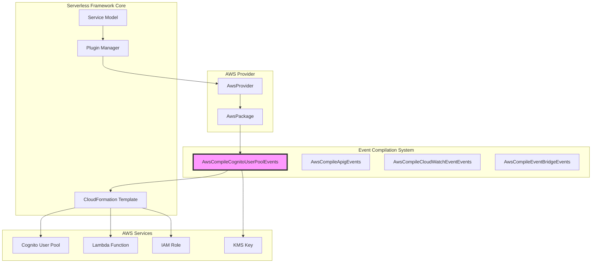
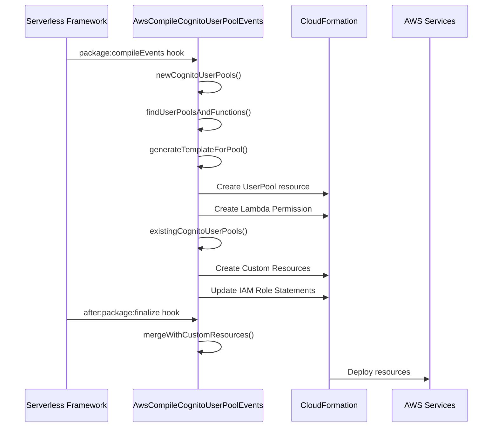
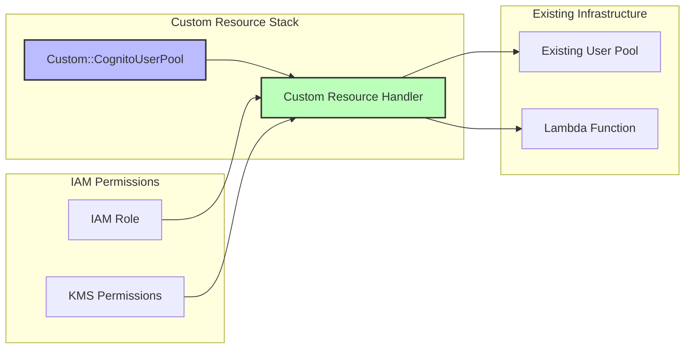
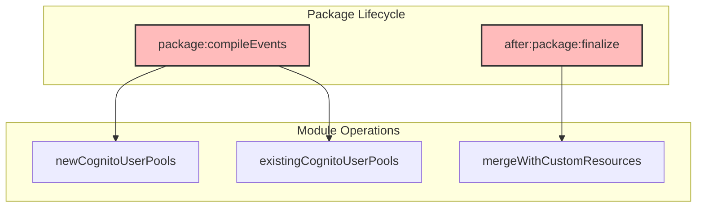

# Cognito Events Module Documentation

## Introduction

The cognito-events module is a specialized AWS event compilation component within the Serverless Framework ecosystem. It handles the configuration and deployment of AWS Cognito User Pool triggers, enabling Lambda functions to respond to various authentication and user management events in Cognito User Pools. This module bridges the gap between serverless function definitions and AWS Cognito's event-driven architecture, providing seamless integration for user authentication workflows.

## Architecture Overview

The cognito-events module operates as part of the AWS provider plugin system, specifically within the event compilation pipeline. It processes function event definitions and transforms them into AWS CloudFormation resources that establish the relationship between Cognito User Pools and Lambda functions.



## Core Components

### AwsCompileCognitoUserPoolEvents

The primary component of the cognito-events module, responsible for compiling Cognito User Pool event configurations into deployable CloudFormation resources.

**Key Responsibilities:**
- Process function event definitions with `cognitoUserPool` configuration
- Generate CloudFormation templates for new and existing user pools
- Manage IAM permissions for Lambda function invocation
- Handle KMS key configurations for custom sender triggers
- Validate event configurations against AWS Cognito requirements

**Constructor Dependencies:**
- `serverless`: Core serverless framework instance
- `options`: Command-line options and configuration
- `provider`: AWS provider instance for resource naming and configuration

## Event Configuration Schema

The module defines a strict schema for Cognito User Pool events through the Serverless Framework's configuration validation system.

```yaml
functions:
  myFunction:
    handler: handler.cognitoTrigger
    events:
      - cognitoUserPool:
          pool: my-user-pool
          trigger: PreSignUp
          existing: false
          forceDeploy: false
          kmsKeyId: arn:aws:kms:region:account:key/key-id
```

### Valid Trigger Sources

The module supports all official Cognito User Pool trigger sources:

**Authentication Triggers:**
- `PreSignUp`: Before user registration
- `PostConfirmation`: After user confirmation
- `PreAuthentication`: Before user authentication
- `PostAuthentication`: After user authentication
- `PreTokenGeneration`: Before token generation
- `UserMigration`: During user migration

**Challenge Triggers:**
- `DefineAuthChallenge`: Define authentication challenge
- `CreateAuthChallenge`: Create authentication challenge
- `VerifyAuthChallengeResponse`: Verify challenge response

**Message Triggers:**
- `CustomMessage`: Custom message sending
- `CustomSMSSender`: Custom SMS sender (requires KMS key)
- `CustomEmailSender`: Custom email sender (requires KMS key)

## Compilation Process Flow



## New User Pool Processing

When creating new Cognito User Pools with Lambda triggers, the module performs the following operations:

1. **Discovery Phase**: Scans all functions for `cognitoUserPool` events without the `existing` flag
2. **Resource Generation**: Creates CloudFormation templates for each unique user pool
3. **Permission Setup**: Generates Lambda permissions allowing Cognito to invoke functions
4. **Dependency Management**: Establishes proper CloudFormation dependencies

### CloudFormation Resource Structure

```yaml
Resources:
  CognitoUserPoolMyUserPool:
    Type: AWS::Cognito::UserPool
    Properties:
      UserPoolName: my-user-pool
      LambdaConfig:
        PreSignUp: !GetAtt MyFunctionLambdaFunction.Arn
        PostConfirmation: !GetAtt MyOtherFunctionLambdaFunction.Arn
    DependsOn:
      - MyFunctionLambdaFunction
      - MyOtherFunctionLambdaFunction
  
  MyFunctionLambdaPermissionCognitoUserPoolMyUserPoolPreSignUp:
    Type: AWS::Lambda::Permission
    Properties:
      FunctionName: !Ref MyFunctionLambdaFunction
      Action: lambda:InvokeFunction
      Principal: cognito-idp.amazonaws.com
      SourceArn: !GetAtt CognitoUserPoolMyUserPool.Arn
```

## Existing User Pool Processing

For existing Cognito User Pools, the module uses a custom resource approach to avoid conflicts and manage updates safely.

### Custom Resource Implementation



### Key Features for Existing Pools

- **Non-destructive Updates**: Only modifies Lambda configurations without affecting existing user pool settings
- **Force Deploy**: Optional timestamp-based forcing of updates when configuration changes are subtle
- **KMS Key Management**: Handles encryption key requirements for custom sender functions
- **Multi-trigger Support**: Allows multiple Lambda functions to handle different triggers for the same pool

## Security and Permissions

The module automatically generates necessary IAM permissions based on the event configuration:

### Required IAM Permissions

**For Custom Resource Operations:**
```json
{
  "Effect": "Allow",
  "Action": [
    "cognito-idp:ListUserPools",
    "cognito-idp:DescribeUserPool",
    "cognito-idp:UpdateUserPool"
  ],
  "Resource": "*"
}
```

**For Lambda Permission Management:**
```json
{
  "Effect": "Allow",
  "Action": [
    "lambda:AddPermission",
    "lambda:RemovePermission"
  ],
  "Resource": "arn:aws:lambda:*:*:function:function-name"
}
```

**For KMS Operations (Custom Senders):**
```json
{
  "Effect": "Allow",
  "Action": ["kms:CreateGrant"],
  "Resource": "arn:aws:kms:region:account:key/key-id"
}
```

## Integration with Core Framework

The cognito-events module integrates with several core framework components:

### Dependencies
- **[aws-provider](aws-provider.md)**: Provides AWS-specific naming conventions and resource management
- **[aws-package-compile](aws-package-compile.md)**: Participates in the package compilation pipeline
- **[core-framework](core-framework.md)**: Utilizes configuration schema validation and service model

### Hook Integration



## Error Handling and Validation

The module implements comprehensive validation and error handling:

### Configuration Validation
- **Pool Name Validation**: Ensures pool names meet AWS naming requirements (max 128 characters, valid characters)
- **Trigger Source Validation**: Validates against official Cognito trigger sources
- **KMS Key Requirements**: Enforces KMS key configuration for custom sender triggers
- **Multi-pool Restrictions**: Prevents multiple user pools per function for existing pool configurations

### Error Scenarios

**COGNITO_MULTIPLE_USER_POOLS_PER_FUNCTION**: Raised when attempting to configure multiple existing user pools for a single function

**COGNITO_KMS_KEY_NOT_SET**: Raised when custom sender triggers lack required KMS key configuration

**COGNITO_KMS_KEY_ID_NOT_SAME_FOR_SINGLE_USER_POOL**: Raised when different KMS keys are specified for the same user pool

## Best Practices and Usage Guidelines

### New User Pools
- Define all triggers in the same serverless.yml for consistent deployment
- Use meaningful pool names that align with your application architecture
- Leverage CloudFormation resource merging for additional pool configurations

### Existing User Pools
- Always test in non-production environments first
- Use `forceDeploy` when making subtle configuration changes
- Ensure proper KMS key permissions for custom sender functions
- Monitor CloudFormation stack updates for any unexpected changes

### Security Considerations
- Use least-privilege IAM roles for custom resource operations
- Secure KMS keys with appropriate key policies
- Regular audit of Lambda permissions granted to Cognito
- Monitor CloudTrail logs for user pool modifications

## Related Documentation

- [aws-provider](aws-provider.md) - AWS provider configuration and resource management
- [aws-package-compile](aws-package-compile.md) - Package compilation system overview
- [aws-events](aws-events.md) - General AWS events documentation
- [core-framework](core-framework.md) - Core framework architecture and plugin system