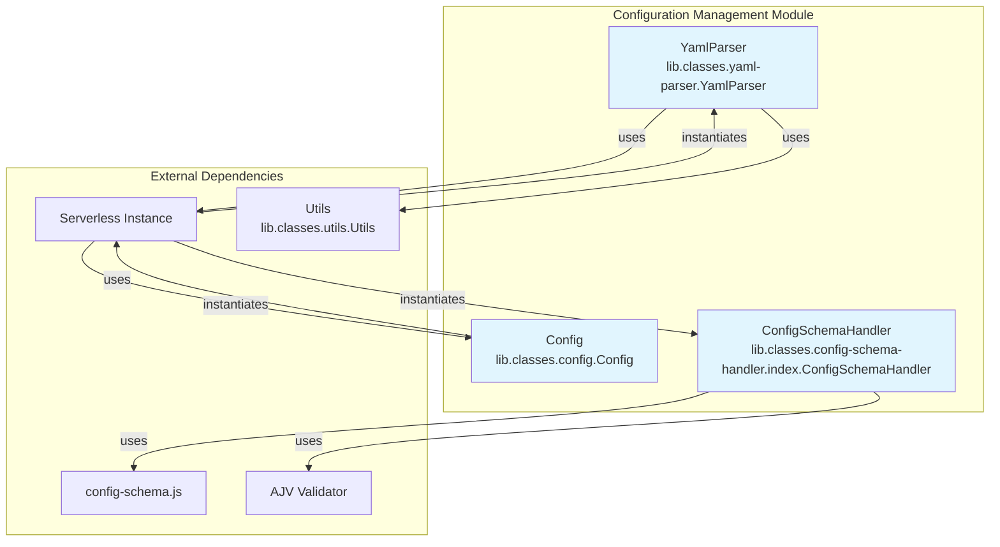
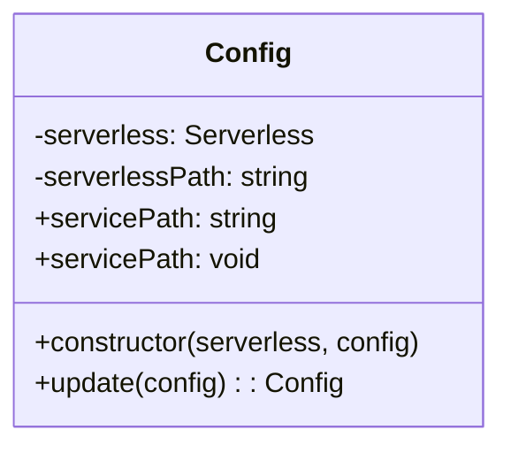
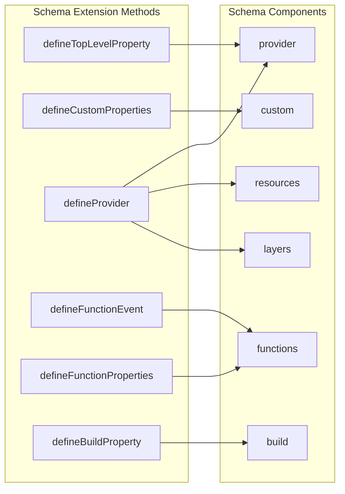
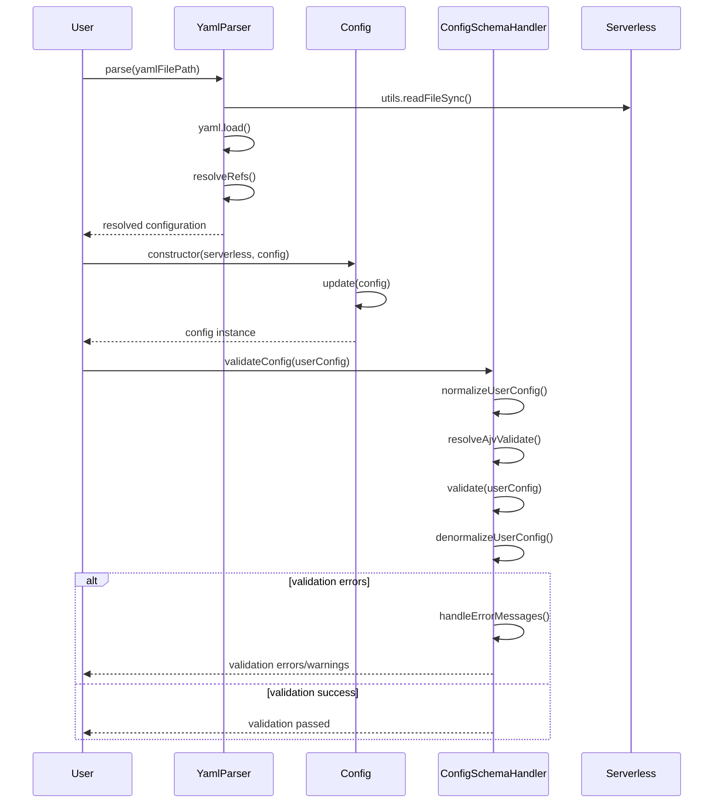
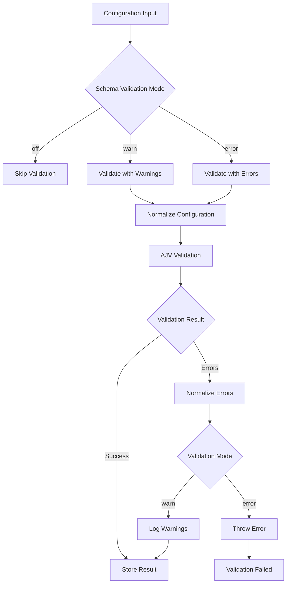
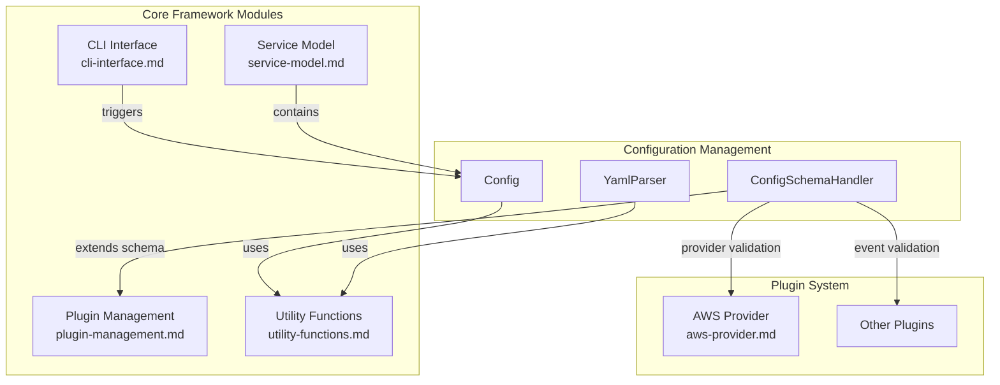
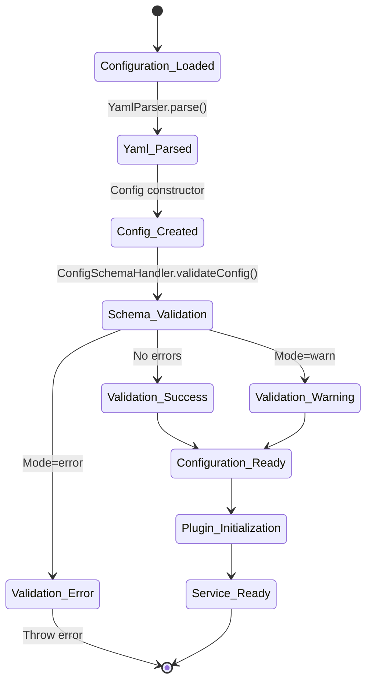

# Configuration Management Module

## Introduction

The Configuration Management module is a core component of the Serverless Framework that handles the parsing, validation, and management of serverless service configurations. It provides the foundation for defining, validating, and processing serverless application configurations through YAML files with JSON Schema validation.

## Architecture Overview

The module consists of three primary components that work together to provide comprehensive configuration management capabilities:



## Core Components

### 1. Config Class (lib.classes.config.Config)

The Config class serves as a configuration container and manager, providing a centralized interface for accessing and updating serverless configuration data.

**Key Responsibilities:**
- Configuration storage and management
- Service path handling
- Configuration merging and updates

**Key Features:**
- Dynamic configuration updates through `update()` method
- Service path abstraction via getter/setter
- Deep merging of configuration objects using Lodash

**Code Architecture:**


### 2. ConfigSchemaHandler Class (lib.classes.config-schema-handler.index.ConfigSchemaHandler)

The ConfigSchemaHandler provides comprehensive JSON Schema-based validation for serverless configurations, ensuring configuration compliance and providing detailed error reporting.

**Key Responsibilities:**
- Configuration validation against JSON Schema
- Schema extension and customization
- Provider-specific schema definitions
- Error handling and reporting

**Key Features:**
- Dynamic schema composition
- Provider-specific validation rules
- Function event schema management
- Custom property definitions
- Comprehensive error normalization

**Schema Extension Capabilities:**


### 3. YamlParser Class (lib.classes.yaml-parser.YamlParser)

The YamlParser handles the parsing of YAML configuration files with support for JSON reference resolution, enabling modular and reusable configuration structures.

**Key Responsibilities:**
- YAML file parsing
- JSON reference resolution
- Configuration file loading

**Key Features:**
- JSON reference resolution via json-refs
- Relative and remote reference support
- Asynchronous parsing
- Integration with serverless utilities

## Data Flow

### Configuration Processing Pipeline



### Schema Validation Flow



## Integration with Serverless Framework

### Module Dependencies

The configuration management module integrates with other core modules:



### Configuration Lifecycle



## Error Handling

### Validation Error Processing

The ConfigSchemaHandler implements comprehensive error handling with multiple validation modes:

- **Off Mode**: Skips validation entirely
- **Warn Mode**: Logs warnings for invalid configurations
- **Error Mode**: Throws errors for invalid configurations

Error messages are normalized and formatted for clarity, with links to documentation for resolution guidance.

### Schema Collision Detection

The system prevents schema conflicts through collision detection:

- Property collision detection for provider schemas
- Function property collision detection
- Event definition collision detection
- Custom property collision detection

## Extension Points

### Provider Schema Extension

Providers can extend the base schema through the `defineProvider()` method:

```javascript
// Example provider schema extension
configSchemaHandler.defineProvider('aws', {
  provider: {
    properties: {
      region: { type: 'string' },
      stage: { type: 'string' }
    }
  },
  function: {
    properties: {
      handler: { type: 'string' },
      runtime: { type: 'string' }
    }
  },
  functionEvents: {
    http: {
      properties: {
        path: { type: 'string' },
        method: { type: 'string' }
      }
    }
  }
})
```

### Custom Property Definitions

Plugins and providers can define custom properties:

- Top-level properties via `defineTopLevelProperty()`
- Custom section properties via `defineCustomProperties()`
- Build properties via `defineBuildProperty()`

## Performance Considerations

### Caching Mechanisms

- Configuration validation results are cached using WeakMap
- Schema objects are deep-frozen to prevent modification
- Normalized objects are tracked to handle circular references

### Memory Management

- WeakMap usage prevents memory leaks
- Object normalization reduces memory footprint
- Reference resolution is handled efficiently

## Security Considerations

### Schema Validation Security

- All user input is validated against strict schemas
- Remote reference resolution is controlled and filtered
- Schema injection is prevented through collision detection

### Configuration Sanitization

- Null values are handled safely during normalization
- Circular references are properly managed
- Schema extensions are validated for conflicts

## Best Practices

### Configuration Organization

1. **Modular Configuration**: Use JSON references to split large configurations
2. **Schema Validation**: Always enable configuration validation in production
3. **Provider Extensions**: Leverage provider-specific schema extensions
4. **Error Handling**: Implement proper error handling for configuration issues

### Performance Optimization

1. **Validation Caching**: Rely on built-in validation result caching
2. **Schema Reusability**: Define reusable schema components
3. **Reference Resolution**: Use local references when possible
4. **Configuration Size**: Keep configurations concise and well-organized

## Related Documentation

- [Plugin Management](plugin-management.md) - For plugin schema extensions
- [Service Model](service-model.md) - For service configuration structure
- [CLI Interface](cli-interface.md) - For configuration loading triggers
- [Utility Functions](utility-functions.md) - For file system operations
- [Core Orchestrator](core-orchestrator.md) - For overall system integration