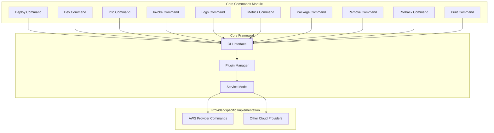

# Core Commands Module Documentation

## Overview

The core-commands module provides the fundamental command-line interface (CLI) commands for the Serverless Framework. These commands form the backbone of the framework's primary functionality, enabling developers to deploy, manage, and monitor their serverless applications across different cloud providers.

## Purpose

The core-commands module serves as the primary interface between developers and the Serverless Framework, offering essential commands for:
- Application lifecycle management (deploy, remove, rollback)
- Development workflow (dev, invoke, package)
- Monitoring and debugging (logs, metrics, info)
- Configuration inspection (print)

## Architecture



## Command Structure

Each command in the core-commands module follows a consistent pattern:

1. **Command Definition**: Uses `cliCommandsSchema` to define command structure and options
2. **Lifecycle Hooks**: Implements hooks for pre/post command execution
3. **Provider Abstraction**: Delegates provider-specific logic to the appropriate provider plugins
4. **Error Handling**: Uses `ServerlessError` for consistent error reporting

## Core Commands

### Deploy Command (`lib/plugins/deploy.js`)
Manages application deployment with sub-commands for function deployment and deployment listing.

**Key Features:**
- Validates provider existence before deployment
- Automatically triggers packaging if no package path is specified
- Supports function-specific deployment
- Provides deployment history tracking

**Lifecycle Events:**
- `before:deploy:deploy`: Provider validation and packaging
- `after:deploy:deploy`: Post-deployment processing

For detailed deployment command documentation, see [deploy-commands.md](deploy-commands.md)

### Dev Command (`lib/plugins/dev.js`)
Enables development mode for local development and testing.

**Key Features:**
- Provides development server functionality
- Supports hot-reloading and local testing
- Integrates with provider-specific development tools

### Info Command (`lib/plugins/info.js`)
Displays comprehensive information about deployed services.

**Key Features:**
- Shows service configuration and status
- Displays resource information
- Provides endpoint URLs and ARNs
- Shows function and event configurations

### Invoke Command (`lib/plugins/invoke.js`)
Manages function invocation with support for both local and remote execution.

**Key Features:**
- Local function invocation with environment variable support
- Remote function invocation in the cloud
- Environment variable propagation for local testing
- Support for custom environment variables via `--env` flag

**Special Functions:**
- `loadEnvVarsForLocal()`: Sets provider-independent environment variables
- `trackInvoke()` / `trackInvokeLocal()`: Analytics tracking for invocations

For detailed invoke command documentation, see [invoke-commands.md](invoke-commands.md)

### Logs Command (`lib/plugins/logs.js`)
Retrieves and displays function logs from cloud providers.

**Key Features:**
- Real-time log streaming
- Historical log retrieval
- Log filtering and formatting
- Multi-function log aggregation

### Metrics Command (`lib/plugins/metrics.js`)
Displays performance metrics and monitoring data for functions.

**Key Features:**
- Function execution metrics
- Error rate tracking
- Performance analytics
- Custom metric support

### Package Command (`lib/plugins/package/package.js`)
Creates deployment packages for serverless applications.

**Key Features:**
- Service-wide packaging
- Function-specific packaging
- Artifact compression and optimization
- Dependency management
- Pattern-based inclusion/exclusion rules

**Lifecycle Events:**
- `initialize`: Deprecation warnings for legacy packaging options
- `package:createDeploymentArtifacts`: Main packaging process
- `package:function:package`: Function-specific packaging

For detailed package command documentation, see [package-commands.md](package-commands.md)

### Remove Command (`lib/plugins/remove.js`)
Removes deployed services and associated resources from cloud providers.

**Key Features:**
- Complete service removal
- Resource cleanup
- Dependency-aware removal
- Safety confirmations

### Rollback Command (`lib/plugins/rollback.js`)
Manages deployment rollbacks with support for function-specific rollbacks.

**Key Features:**
- Service-wide rollback
- Function-specific rollback
- Version history management
- Rollback validation

### Print Command (`lib/plugins/print.js`)
Displays processed configuration with support for various output formats.

**Key Features:**
- Configuration inspection
- Multiple output formats (YAML, JSON, text)
- Path-based filtering
- Transform operations (keys extraction)
- Circular reference handling

**Special Functions:**
- Configuration path navigation
- Format-specific output generation
- Error handling for invalid paths/formats

For detailed print command documentation, see [print-commands.md](print-commands.md)

## Integration with Core Framework

The core-commands module integrates with the core framework through:

1. **CLI Schema Integration**: All commands use `cliCommandsSchema` for consistent command definition
2. **Plugin Manager**: Commands are registered as plugins and managed by the PluginManager
3. **Service Model**: Commands interact with the service configuration through the Service class
4. **Provider Abstraction**: Commands delegate provider-specific operations to provider plugins

## Provider-Specific Implementation

While core-commands provides the command interface, actual implementation is delegated to provider-specific plugins:

- **AWS Provider**: Implements all commands for AWS services
- **Other Providers**: Each cloud provider implements the command interface according to their services

This abstraction allows the core-commands to remain provider-agnostic while ensuring consistent functionality across different cloud platforms.

## Error Handling

The module uses a consistent error handling approach:

- **ServerlessError**: Custom error class for framework-specific errors
- **Validation Errors**: Input validation with descriptive error messages
- **Provider Errors**: Graceful handling of provider-specific errors
- **User-Friendly Messages**: Clear error messages with actionable guidance

## Dependencies

The core-commands module depends on:

- **Core Framework**: CLI, PluginManager, Service model
- **Provider Plugins**: For actual implementation
- **Utility Libraries**: lodash, js-yaml, json-cycle for data processing
- **File System**: For package creation and management

## Usage Examples

```bash
# Deploy entire service
serverless deploy

# Deploy specific function
serverless deploy function -f myFunction

# Invoke function locally
serverless invoke local -f myFunction

# View logs
serverless logs -f myFunction -t

# Get service information
serverless info

# Remove service
serverless remove

# Print configuration
serverless print --format json
```

## Extension Points

The core-commands module provides several extension points:

1. **Command Hooks**: Lifecycle hooks for custom plugin integration
2. **Command Schema**: Extensible command definition system
3. **Provider Plugins**: New providers can implement the command interface
4. **Custom Commands**: Plugins can add new commands or extend existing ones

This modular design ensures that the core-commands can be extended and customized while maintaining backward compatibility and consistency across the framework.