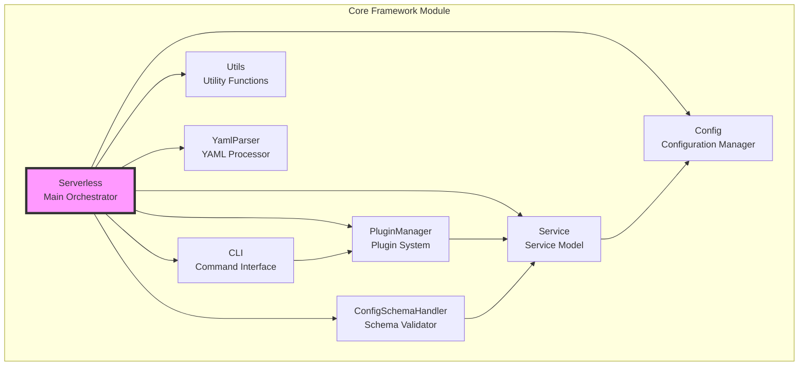
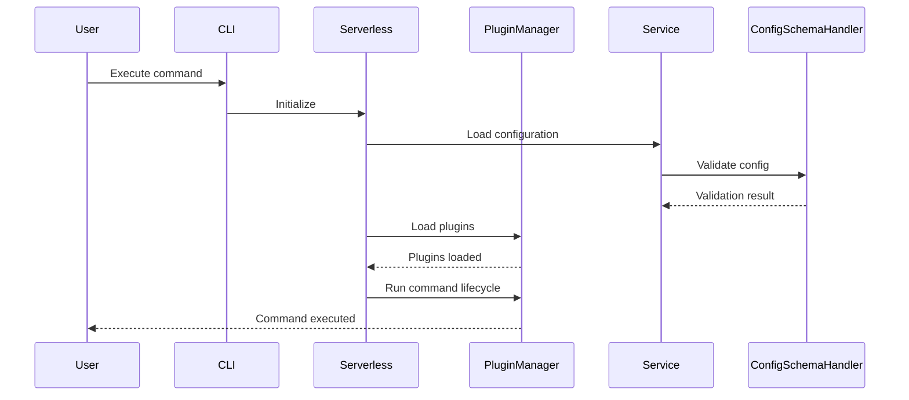

# Core Framework Module

## Overview

The core-framework module serves as the foundation of the Serverless Framework, providing essential classes and functionality that orchestrate the entire system. This module contains the core architectural components that manage configuration, plugin loading, service lifecycle, CLI interaction, and utility operations.

## Architecture



## Core Components

### 1. Serverless Class (`lib.serverless.Serverless`)
The main orchestrator class that coordinates all framework operations. It initializes and manages all other core components, handles the service lifecycle, and provides the primary API for the framework.

**Key Responsibilities:**
- Initialize framework components
- Manage service configuration and validation
- Coordinate plugin lifecycle
- Handle command execution
- Provide deprecation logging

**Detailed Documentation**: [Core Orchestrator](core-orchestrator.md)

### 2. CLI Class (`lib.classes.cli.CLI`)
Handles command-line interface interactions and logging functionality.

**Key Responsibilities:**
- Manage plugin and command registration
- Handle console output and logging
- Provide CLI feedback mechanisms

**Detailed Documentation**: [CLI Interface](cli-interface.md)

### 3. Config Class (`lib.classes.config.Config`)
Manages framework configuration and serverless path resolution.

**Key Responsibilities:**
- Store and update configuration data
- Manage serverless installation path
- Handle service directory paths

**Detailed Documentation**: [Configuration Management](configuration-management.md)

### 4. ConfigSchemaHandler Class (`lib.classes.config-schema-handler.index.ConfigSchemaHandler`)
Provides comprehensive configuration validation using JSON Schema.

**Key Responsibilities:**
- Validate service configuration against schemas
- Define provider-specific schemas
- Handle configuration errors and warnings
- Support custom property definitions

**Detailed Documentation**: [Configuration Management](configuration-management.md)

### 5. PluginManager Class (`lib.classes.plugin-manager.PluginManager`)
Manages the plugin system including loading, registration, and lifecycle execution.

**Key Responsibilities:**
- Load internal and external plugins
- Manage plugin dependencies and conflicts
- Handle command and hook registration
- Execute plugin lifecycles
- Support plugin aliases

**Detailed Documentation**: [Plugin Management](plugin-management.md)

### 6. Service Class (`lib.classes.service.Service`)
Represents the service model and handles service-specific operations.

**Key Responsibilities:**
- Load and validate service configuration
- Manage functions, layers, and resources
- Handle service lifecycle operations
- Provide service metadata access

**Detailed Documentation**: [Service Model](service-model.md)

### 7. Utils Class (`lib.classes.utils.Utils`)
Provides utility functions for file operations, ID generation, and common tasks.

**Key Responsibilities:**
- File system operations
- Temporary directory management
- ID generation
- Event usage detection

**Detailed Documentation**: [Utility Functions](utility-functions.md)

### 8. YamlParser Class (`lib.classes.yaml-parser.YamlParser`)
Handles YAML configuration file parsing with reference resolution.

**Key Responsibilities:**
- Parse YAML configuration files
- Resolve JSON references
- Handle configuration file loading

**Detailed Documentation**: [Configuration Management](configuration-management.md)

## Data Flow



## Integration with Other Modules

The core-framework module serves as the foundation for all other modules in the Serverless Framework:

- **[aws-provider](aws-provider.md)**: Extends core functionality with AWS-specific implementations
- **[aws-package-compile](aws-package-compile.md)**: Builds on core service model for AWS deployment packaging
- **[aws-events](aws-events.md)**: Extends service events with AWS-specific event sources
- **[core-commands](core-commands.md)**: Implements core commands using the plugin system
- **[plugin-system](plugin-system.md)**: Provides plugin management capabilities

## Key Features

### Plugin Architecture
The framework uses a sophisticated plugin system that allows extending functionality through:
- Hook-based lifecycle management
- Command registration and execution
- Provider-specific implementations
- External plugin support

### Configuration Management
Comprehensive configuration handling including:
- YAML configuration parsing
- JSON Schema validation
- Provider-specific schema extensions
- Configuration deprecation handling

### Service Lifecycle
Complete service lifecycle management:
- Initialization and setup
- Configuration loading and validation
- Plugin initialization
- Command execution
- Cleanup and finalization

## Usage Patterns

### Basic Service Initialization
```javascript
const serverless = new Serverless({
  servicePath: './my-service',
  configurationFilename: 'serverless.yml'
});

await serverless.init();
await serverless.run();
```

### Plugin Development
```javascript
class MyPlugin {
  constructor(serverless, options) {
    this.serverless = serverless;
    this.options = options;
    
    this.commands = {
      mycommand: {
        lifecycleEvents: ['run']
      }
    };
    
    this.hooks = {
      'mycommand:run': this.run.bind(this)
    };
  }
  
  async run() {
    // Plugin logic here
  }
}
```

## Error Handling

The core framework implements comprehensive error handling through:
- Custom `ServerlessError` class for framework-specific errors
- Validation errors with detailed messages
- Plugin conflict detection
- Configuration error reporting
- Deprecation warnings

## Performance Considerations

- Lazy loading of plugins and components
- Efficient plugin sorting and prioritization
- Minimal memory footprint for core operations
- Optimized configuration validation
- Streamlined command execution pipeline